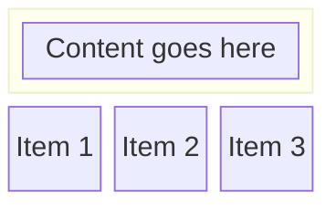
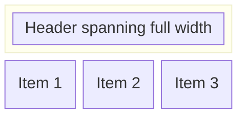

# Mermaid Diagram Conventions

This document captures best practices and lessons learned for creating effective Mermaid diagrams in XMLUI documentation.

## Block Diagrams vs Flowcharts

### When to Use Block Diagrams
- **Container representations**: Block diagrams excel at showing rectangular containers with structured content
- **Clean layouts**: Better for side-by-side arrangements without connecting lines
- **Text-heavy content**: Superior handling of multi-line text and tree structures
- **Consistent styling**: More predictable alignment and spacing

### When to Use Flowcharts
- **Process flows**: When you need arrows and connections between elements
- **Decision trees**: For branching logic and conditional paths
- **Simple node relationships**: Basic parent-child relationships with connections

## Block Diagram Best Practices

### Basic Structure


### Configuration
- Always include `%%{init: {"block": {"padding": 8}}}%%` for consistent padding
- Use `columns N` to control horizontal layout (1 for single column, 3 for three-column grid)
- Use `block:Name:N` syntax to span multiple columns

### Content Formatting

#### Left-Aligned Text
```mermaid
CONTAINER["<div style='text-align: left; width: 100%'>Title<br/>Content line 1<br/>Content line 2</div>"]
```

#### Tree Structures
Use `&nbsp;` entities for precise indentation:
```mermaid
ITEM["<div style='text-align: left; width: 100%'>🏠 Container<br/>💡 State:<br/>&nbsp;&nbsp;&nbsp;&nbsp;&nbsp;├─ item1: value<br/>&nbsp;&nbsp;&nbsp;&nbsp;&nbsp;└─ item2: value<br/>🌳 Tree:<br/>&nbsp;&nbsp;&nbsp;&nbsp;&nbsp;Root:<br/>&nbsp;&nbsp;&nbsp;&nbsp;&nbsp;&nbsp;&nbsp;├─ Child 1<br/>&nbsp;&nbsp;&nbsp;&nbsp;&nbsp;&nbsp;&nbsp;└─ Child 2</div>"]
```

#### Spacing Guidelines
- **Root level items**: 5 `&nbsp;` entities to align with section headers
- **Tree children**: 7-8 `&nbsp;` entities for proper indentation under parents
- **Section headers**: Align with icon text, not the icon itself

## Styling

### CSS Classes
```mermaid
classDef rootContainer fill:#f0f0f0,stroke:#888,stroke-width:2px,color:#333
classDef innerContainer fill:#f8f8f8,stroke:#aaa,stroke-width:1px,color:#333

class ITEM1,ITEM2 rootContainer
class ITEM3 innerContainer
```

### Background Colors
- **Light containers**: `fill:#f0f0f0` with `stroke:#888`
- **Inner elements**: `fill:#f8f8f8` with `stroke:#aaa`
- **Text color**: Always use `color:#333` for readability

### Padding
- Apply padding directly in HTML: `<div style='padding: 0 15px;'>` for horizontal-only padding
- Avoid CSS class padding - it may not work consistently in all Mermaid versions

## Layout Patterns

### Single Container

```mermaid
%%{init: {"block": {"padding": 8}}}%%
block-beta
    columns 1
    
    CONTAINER["<div style='text-align: left; width: 100%'>Content</div>"]
    
    classDef rootContainer fill:#f0f0f0,stroke:#888,stroke-width:2px,color:#333
    class CONTAINER rootContainer
```


### Multi-Container Grid


## Common Pitfalls

### Text Alignment Issues
- **Problem**: Content appears centered even with left-align styling
- **Solution**: Always use `<div style='text-align: left; width: 100%'>` wrapper

### Inconsistent Spacing
- **Problem**: Tree items don't align properly
- **Solution**: Count `&nbsp;` entities carefully - use consistent patterns (5 for root, 7-8 for children)

### Styling Not Applied
- **Problem**: CSS classes don't affect appearance
- **Solution**: Apply styles directly in HTML divs rather than relying solely on CSS classes

### Layout Breaks
- **Problem**: Items don't arrange as expected
- **Solution**: Use `columns N` consistently and test with different content lengths

## Icons and Emojis

### Standard Icons
- 🏠 - Containers
- 💡 - State/Data
- 🌳 - Trees/Hierarchies
- 📦 - Components
- ⚙️ - Configuration

### Tree Symbols
- `├─` - Branch item
- `└─` - Final branch item
- Use these consistently for hierarchical structures

## Testing Tips

1. **Always preview**: Mermaid rendering can vary between environments
2. **Check alignment**: Verify tree structures align properly at different zoom levels  
3. **Test content length**: Ensure layout works with both short and long text
4. **Validate styling**: Confirm background colors and padding appear correctly
5. **Cross-platform**: Test on different operating systems if possible

## Migration from Flowcharts

When converting existing flowcharts to block diagrams:

1. Replace `graph TB/LR` with `block-beta`
2. Remove connection arrows (`---`, `-->`)
3. Convert subgraphs to block groups
4. Add HTML div wrappers for text alignment
5. Apply consistent CSS styling
6. Test tree structure indentation

This approach provides cleaner, more maintainable diagrams with better text formatting capabilities.