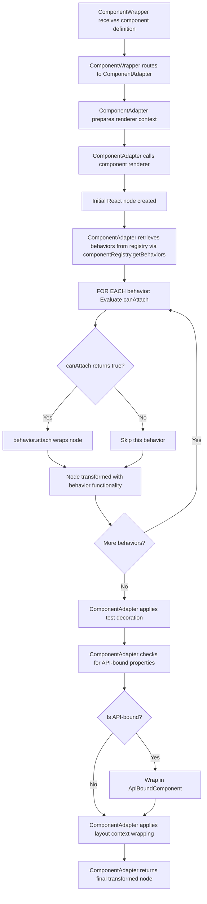
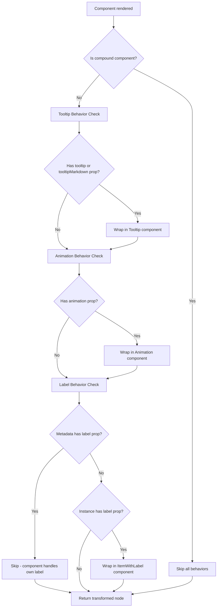

# Component Behaviors

This document explains XMLUI's component behavior system - a cross-cutting concern mechanism that enables attaching reusable functionality to components declaratively. It covers the behavior architecture, the three core behaviors (tooltip, animation, label), the attachment mechanism, and implementation details for framework developers working on the XMLUI core.

## What Are Component Behaviors?

**Component behaviors** are decorator-like objects that wrap rendered React components with additional functionality based on component properties. They implement cross-cutting concerns that apply to multiple components without requiring changes to component implementations.

A behavior examines a component's definition and metadata to determine eligibility, then wraps the rendered React node with enhanced functionality. This approach enables features like tooltips, animations, and form labels to work consistently across all visual components without coupling the feature implementation to specific component renderers.

**Key Characteristics:**

- **Declarative Attachment** - Behaviors attach automatically when specific properties are present
- **Zero Component Coupling** - Components need no knowledge of behaviors; they simply render
- **Composable** - Multiple behaviors can wrap the same component in sequence
- **Renderer Context Access** - Behaviors access the full renderer context for value extraction and state management
- **Metadata-Aware** - Behaviors inspect component metadata to determine applicability

## Architectural Overview

### The Behavior Interface

All behaviors implement a simple contract with three members:

```typescript
export interface Behavior {
  name: string;
  canAttach: (node: ComponentDef, metadata: ComponentMetadata) => boolean;
  attach: (context: RendererContext<any>, node: ReactNode) => ReactNode;
}
```

- **name** - Unique identifier for the behavior (e.g., "tooltip", "animation", "label")
- **canAttach** - Predicate determining if the behavior applies to a specific component instance based on its definition and metadata
- **attach** - Transformation function that wraps the rendered React node with enhanced functionality

**Important Note on Transformation Flexibility:**

The `attach` function can transform the rendered component in any valid way - wrapping it in other React components is just one approach. Behaviors can also clone the rendered node using `React.cloneElement()` to add or modify properties (such as CSS classes, event handlers, or attributes), compose multiple transformations, or apply any other valid React node manipulation. The only requirement is that `attach` must return a valid React node.

### Application in ComponentAdapter

Behaviors apply in `ComponentAdapter` immediately after the component renderer produces the initial React node:

```typescript
// 1. Component renderer executes
renderedNode = renderer(rendererContext);

// 2. Retrieve registered behaviors from component registry
const behaviors = componentRegistry.getBehaviors();

// 3. Apply behaviors sequentially (skip compound components)
if (!isCompoundComponent) {
  for (const behavior of behaviors) {
    if (behavior.canAttach(rendererContext.node, descriptor)) {
      renderedNode = behavior.attach(rendererContext, renderedNode);
    }
  }
}

// 4. Continue with decoration, API binding, layout wrapping...
```

**Application Logic:**

1. **Renderer Execution** - Component's renderer function produces the initial React node from the component definition
2. **Behavior Retrieval** - `componentRegistry.getBehaviors()` returns all registered behaviors from the central registry (framework behaviors plus any contributed by external packages)
3. **Compound Check** - If the component is a compound (XMLUI-defined) component, skip all behaviors to avoid wrapping internal structure
4. **Sequential Evaluation** - For each behavior in order:
   - Call `canAttach(node, metadata)` with the component definition and its metadata descriptor
   - If true, call `attach(context, renderedNode)` to wrap the node
   - The wrapped node becomes the input for the next behavior
5. **Result** - Multiple behaviors create nested wrappers in application order (tooltip innermost, label outermost)

This placement ensures behaviors wrap the core component but remain inside decorations (test IDs), API bindings, and layout wrappers.

### Behavior Registration Architecture

Behaviors are registered centrally in the `ComponentRegistry` class within `ComponentProvider`, following the same pattern used for components, actions, and loaders. This centralized registry enables both framework behaviors and external package behaviors to coexist.

**Registration in ComponentRegistry:**

```typescript
class ComponentRegistry {
  private behaviors: Behavior[] = [];

  constructor(contributes: ContributesDefinition = {}, ...) {
    // ... component and action registration ...

    // Register framework-implemented behaviors
    this.registerBehavior(tooltipBehavior);
    this.registerBehavior(animationBehavior);
    this.registerBehavior(labelBehavior);

    // Register external behaviors from contributes
    contributes.behaviors?.forEach((behavior) => {
      this.registerBehavior(behavior);
    });
  }

  private registerBehavior(
    behavior: Behavior,
    location: "before" | "after" = "after",
    position?: string
  ) {
    if (position) {
      const targetIndex = this.behaviors.findIndex(b => b.name === position);
      if (targetIndex !== -1) {
        const insertIndex = location === "before" ? targetIndex : targetIndex + 1;
        this.behaviors.splice(insertIndex, 0, behavior);
        return;
      }
    }
    this.behaviors.push(behavior);
  }

  getBehaviors(): Behavior[] {
    return this.behaviors;
  }
}
```

**ComponentAdapter Retrieval:**

The `ComponentAdapter` retrieves registered behaviors from the component registry:

```typescript
// In ComponentAdapter.tsx
const componentRegistry = useComponentRegistry();
const behaviors = componentRegistry.getBehaviors();

// Apply behaviors to rendered node
for (const behavior of behaviors) {
  if (behavior.canAttach(rendererContext.node, descriptor)) {
    renderedNode = behavior.attach(rendererContext, renderedNode);
  }
}
```

**External Package Registration:**

External component packages can contribute custom behaviors through the `ContributesDefinition`:

```typescript
// In an external package (e.g., packages/my-package/src/index.tsx)
import { myCustomBehavior } from "./behaviors/MyCustomBehavior";

export default {
  namespace: "MyPackage",
  components: [myComponentRenderer],
  behaviors: [myCustomBehavior],  // Custom behaviors register here
};
```

**Positioned Registration:**

The `registerBehavior` method supports precise control over behavior execution order through optional `location` and `position` parameters:

- **location**: `"before" | "after"` - Specifies placement relative to the target behavior
- **position**: `string` - The name of the target behavior for positioning

This allows external packages to insert behaviors at specific points in the execution sequence:

```typescript
// Insert a custom behavior before the animation behavior
registerBehavior(myBehavior, "before", "animation");

// Insert a custom behavior after the tooltip behavior
registerBehavior(myBehavior, "after", "tooltip");
```

**Benefits of Registry Architecture:**

- **Extensibility** - Third-party packages can register custom behaviors without modifying framework code
- **Consistency** - Follows the same pattern as components, actions, and loaders
- **Order Control** - Positioned registration enables fine-grained control over behavior application sequence
- **Centralized Management** - All behaviors accessible through single `getBehaviors()` method
- **Type Safety** - Full TypeScript type checking for behavior implementations

## Framework-Implemented Behaviors

XMLUI currently implements three behaviors that handle common cross-cutting concerns. These serve as examples of the behavior pattern and provide essential functionality across all visual components:

### Tooltip Behavior

Displays informational text or markdown content when hovering over visual components. The tooltip behavior activates when a component has either the `tooltip` or `tooltipMarkdown` property defined.

**Attachment Criteria:**
```typescript
canAttach: (node) => {
  const tooltipText = node.props?.tooltip;
  const tooltipMarkdown = node.props?.tooltipMarkdown;
  return !!tooltipText || !!tooltipMarkdown;
}
```

**Usage Example:**
```xmlui
<Button 
  label="Click me" 
  tooltip="This button saves your changes"
  tooltipOptions="right; delayDuration: 800" />
```

**Wrapping Process:**
1. Extracts `tooltip`, `tooltipMarkdown`, and `tooltipOptions` properties using the renderer context's value extractor
2. Parses tooltip options (side, alignment, delay, etc.) via `parseTooltipOptions()`
3. Wraps the rendered component in a `<Tooltip>` component with extracted configuration
4. The wrapped component becomes the tooltip trigger; the Tooltip component handles display logic

### Animation Behavior

Applies entry/exit animations to components using CSS animations or transitions. The animation behavior activates when a component has the `animation` property defined.

**Attachment Criteria:**
```typescript
canAttach: (node) => {
  return !!node.props?.animation;
}
```

**Usage Example:**
```xmlui
<Card 
  title="Welcome" 
  animation="fadeIn"
  animationOptions="duration: 500; delay: 200" />
```

**Wrapping Process:**
1. Extracts `animation` and `animationOptions` properties from the component definition
2. Parses animation configuration via `parseAnimation()` and `parseAnimationOptions()`
3. Wraps the component in an `<Animation>` component that manages the animation lifecycle
4. Special handling for ModalDialog components - passes `externalAnimation={true}` to prevent animation conflicts

**ModalDialog Special Case:**
```typescript
return (
  <Animation animation={parseAnimation(animation)} {...parsedOptions}>
    {context.node.type === "ModalDialog"
      ? cloneElement(node as ReactElement, {
          externalAnimation: true,
        })
      : node}
  </Animation>
);
```

ModalDialog components have internal animation support. When wrapped by the animation behavior, the `externalAnimation` prop signals the dialog to defer to external animation control.

### Label Behavior

Wraps form input components with labels, positioning, and visual indicators (required asterisk, validation states). The label behavior activates when a component has the `label` property and does not explicitly handle its own labeling.

**Attachment Criteria:**
```typescript
canAttach: (node, metadata) => {
  // Don't attach if component declares its own label prop handling
  if (metadata?.props?.label) {
    return false;
  }
  // Only attach if component has a label prop
  if (!node.props?.label) {
    return false;
  }
  return true;
}
```

**Usage Example:**
```xmlui
<TextBox 
  label="Email Address" 
  labelPosition="top"
  required={true}
  placeholder="your@email.com" />
```

**Wrapping Process:**
1. Extracts label-related properties: `label`, `labelPosition`, `labelWidth`, `labelBreak`, `required`, `enabled`, `style`, `readOnly`, `shrinkToLabel`
2. Uses the renderer context's `className` to maintain styling consistency
3. Wraps the component in `<ItemWithLabel>` which handles label rendering, positioning, and required indicators
4. Special handling for `inputTemplate` - the `isInputTemplateUsed` flag adjusts label layout when custom input templates are present

**Metadata Check Explanation:**

The label behavior checks `metadata?.props?.label` to determine if a component has explicit label property metadata defined. Components like Checkbox or Radio that include label rendering as part of their core functionality define `label` in their metadata. For these components, the label behavior does not attach - they handle their own labels.

Components like TextBox or Select do not define `label` in their metadata because they expect the label behavior to handle labeling. The presence of a `label` prop in the component instance (but absence in metadata) signals that the behavior should attach.

### Behavior Execution Order

Behaviors are registered in the `ComponentRegistry` during construction. The framework registers its three core behaviors first, followed by any behaviors contributed by external packages:

```typescript
// Framework behaviors registered in ComponentRegistry constructor
this.registerBehavior(tooltipBehavior);
this.registerBehavior(animationBehavior);
this.registerBehavior(labelBehavior);

// External behaviors registered after
contributes.behaviors?.forEach((behavior) => {
  this.registerBehavior(behavior);
});
```

**Order Significance:**

The registration order matters because behaviors wrap sequentially. The current order (tooltip, animation, label) produces this nesting:

```
<ItemWithLabel>          ← Label behavior (outermost)
  <Animation>            ← Animation behavior (middle)
    <Tooltip>            ← Tooltip behavior (innermost)
      <Button />         ← Original component
    </Tooltip>
  </Animation>
</ItemWithLabel>
```

This order ensures:
- Tooltips appear on the actual interactive component
- Animations affect the component and its tooltip together
- Labels encompass the entire animated, tooltip-enabled component

Changing the order would alter this nesting and could break visual consistency or interaction behavior.

## Renderer Context in Behaviors

Behaviors receive the full `RendererContext` when attaching, providing access to all rendering capabilities:

```typescript
export interface RendererContext<TMd extends ComponentMetadata = ComponentMetadata>
  extends ComponentRendererContextBase<TMd> {
  node: ComponentDef<TMd>;
  state: any;
  updateState: (state: any) => void;
  appContext: AppContextType;
  extractValue: ValueExtractor;
  lookupEventHandler: LookupEventHandlerFn<TMd>;
  lookupAction: LookupAsyncFn;
  lookupSyncCallback: LookupSyncFn;
  extractResourceUrl: (url?: unknown) => string | undefined;
  renderChild: RenderChildFn;
  registerComponentApi: RegisterComponentApiFn;
  className: string | undefined;
  layoutContext: LayoutContext | undefined;
  uid: symbol;
}
```

**Key Context Properties Used by Behaviors:**

- **extractValue** - Extracts property values from expressions, handles data binding, evaluates context variables
- **node** - The component definition containing props, events, children, and type information
- **className** - Computed CSS classes from layout properties, passed to wrapped components for style consistency
- **renderChild** - Function to render child components, used when behaviors need to render templates (e.g., tooltip templates)
- **appContext** - Global application context with navigation, state buckets, media queries, and theme information

**Example - Tooltip Behavior Using Context:**

```typescript
attach: (context, node) => {
  const { extractValue } = context;
  const tooltipText = extractValue(context.node.props?.tooltip, true);
  const tooltipMarkdown = extractValue(context.node.props?.tooltipMarkdown, true);
  const tooltipOptions = extractValue(context.node.props?.tooltipOptions, true);
  const parsedOptions = parseTooltipOptions(tooltipOptions);

  return (
    <Tooltip text={tooltipText} markdown={tooltipMarkdown} {...parsedOptions}>
      {node}
    </Tooltip>
  );
}
```

The `extractValue` function handles:
- Static string values: `tooltip="Click me"` → `"Click me"`
- Expression evaluation: `tooltip={message}` → evaluates `message` variable
- Context variable resolution: `tooltip={$user.name}` → retrieves from app context
- Data binding: `tooltip={item.description}` → extracts from current data context

## Implementation Details

### ComponentAdapter Integration Point

The behavior application occurs in `ComponentAdapter` after the renderer produces the initial node but before decoration and event handler attachment:

```typescript
// From ComponentAdapter.tsx (simplified flow)
let renderedNode: ReactNode = null;

try {
  if (safeNode.type === "Slot") {
    renderedNode = slotRenderer(rendererContext, parentRenderContext);
  } else {
    if (!renderer) {
      return <UnknownComponent message={`${safeNode.type}`} />;
    }
    renderedNode = renderer(rendererContext);
  }

  /**
   * Apply behaviors to the component.
   */
  const behaviors = componentRegistry.getBehaviors();
  if (!isCompoundComponent) {
    for (const behavior of behaviors) {
      if (behavior.canAttach(rendererContext.node, descriptor)) {
        renderedNode = behavior.attach(rendererContext, renderedNode);
      }
    }
  }

  // --- Components may have a `testId` property for E2E testing purposes
  if ((appContext?.decorateComponentsWithTestId && ...) || inspectId !== undefined) {
    renderedNode = (
      <ComponentDecorator attr={{ "data-testid": resolvedUid, ... }}>
        {cloneElement(renderedNode as ReactElement, { ... })}
      </ComponentDecorator>
    );
  }

  // --- API-bound components provide helpful behavior
  if (isApiBound) {
    return <ApiBoundComponent ... />;
  }

  // --- Layout context wrapping
  if (layoutContextRef.current?.wrapChild) {
    renderedNode = layoutContextRef.current.wrapChild(...);
  }
} catch (e) {
  renderingError = (e as Error)?.message || "Internal error";
}
```

**Pipeline Position:**

1. **Renderer Execution** - Component-specific rendering logic produces initial node
2. **Behavior Application** ← **Behaviors apply here**
3. **Test Decoration** - Test IDs and inspection attributes added via ComponentDecorator
4. **API Binding** - API-bound components wrapped in ApiBoundComponent
5. **Layout Wrapping** - Layout context applies layout-specific wrappers

This position ensures behaviors wrap the core component but remain inside decorations and API bindings. The layering ensures:
- Behaviors affect only the visual component, not decoration infrastructure
- Test IDs and inspection attributes apply to behavior-wrapped components
- API binding affects the entire behavior-enhanced component
- Layout wrapping encompasses all previous layers

### Behavior Transformation Examples

The following examples demonstrate how the framework-implemented behaviors transform components. These behaviors all use the wrapping approach, where the rendered component is wrapped in additional React components to provide enhanced functionality.

**Single Behavior (Tooltip):**

```xmlui
<Button label="Save" tooltip="Save your changes" />
```

Produces:
```jsx
<Tooltip text="Save your changes">
  <button className="xmlui-button">Save</button>
</Tooltip>
```

**Multiple Behaviors (Tooltip + Animation):**

```xmlui
<Card 
  title="Welcome" 
  tooltip="Dashboard card"
  animation="fadeIn" />
```

Produces:
```jsx
<Animation animation={fadeInAnimation}>
  <Tooltip text="Dashboard card">
    <div className="xmlui-card">
      <div className="card-title">Welcome</div>
    </div>
  </Tooltip>
</Animation>
```

**All Three Behaviors:**

```xmlui
<TextBox 
  label="Email"
  tooltip="Enter your email address"
  animation="slideIn" />
```

Produces:
```jsx
<ItemWithLabel label="Email">
  <Animation animation={slideInAnimation}>
    <Tooltip text="Enter your email address">
      <input type="text" className="xmlui-textbox" />
    </Tooltip>
  </Animation>
</ItemWithLabel>
```

### Metadata-Driven Attachment

Behaviors inspect component metadata passed to `canAttach()` to make attachment decisions. The metadata contains component descriptor information from the component registry:

```typescript
export type ComponentMetadata<
  TProps extends Record<string, ComponentPropertyMetadata> = Record<string, any>,
  TEvents extends Record<string, ComponentPropertyMetadata> = Record<string, any>,
  TContextValues extends Record<string, ComponentPropertyMetadata> = Record<string, any>,
  TApis extends Record<string, ComponentApiMetadata> = Record<string, any>,
> = {
  status?: "stable" | "experimental" | "deprecated" | "in progress" | "internal";
  description?: string;
  props?: TProps;
  events?: TEvents;
  contextVars?: TContextValues;
  apis?: TApis;
  nonVisual?: boolean;
  childrenAsTemplate?: string;
  opaque?: boolean;
  // ... theme-related fields
};
```

**Label Behavior Metadata Check:**

```typescript
canAttach: (node, metadata) => {
  // Check if component defines its own label handling
  if (metadata?.props?.label) {
    return false;  // Component handles labels itself
  }
  // Check if instance has label prop
  if (!node.props?.label) {
    return false;  // No label to attach
  }
  return true;  // Attach label behavior
}
```

**Metadata Usage Patterns:**

- **nonVisual** - Behaviors can check this flag to avoid attaching to non-visual components like DataSource or Container
- **props** - Behaviors check for property metadata to determine if a component explicitly handles a feature
- **opaque** - Indicates internal component structure should not be affected by behaviors

## Behavior Execution Flow

### Complete Rendering Flow with Behaviors



### Behavior Attachment Decision Tree



## Summary

Component behaviors provide a powerful mechanism for applying cross-cutting concerns to XMLUI components declaratively. Behaviors integrate seamlessly into the rendering pipeline, transforming components after initial rendering but before decoration. They leverage the full renderer context for value extraction, event handling, and state management.

The behavior system reduces code duplication, ensures consistency, and enables framework-level enhancements without component-level changes. Behaviors are registered in the central `ComponentRegistry` and retrieved via `componentRegistry.getBehaviors()`, then applied sequentially in `ComponentAdapter`.

The registry-based architecture enables extensibility - both framework behaviors and external package behaviors coexist through the `ContributesDefinition` mechanism. External packages can register custom behaviors that execute alongside framework behaviors, with optional positioning control for precise execution order.

For framework developers working on XMLUI core, behaviors represent a critical architectural pattern for implementing features that span multiple components uniformly and maintainably.
