# XMLUI Container-Based State Management

A deep dive into XMLUI's hierarchical container system for managing component state, variables, and reactive data binding.

## Fundamentals of XMLUI Reactivity

XMLUI implements **automatic reactivity** - a programming model where UI updates happen automatically when underlying data changes, without requiring manual DOM manipulation or explicit update calls.

### The Reactive Loop

XMLUI follows a simple reactive cycle:
1. **Initial Render**: Framework renders the complete UI from declarative markup
2. **Event Occurrence**: User interactions or system events trigger changes
3. **Automatic State Detection**: Framework detects state mutations transparently
4. **Selective UI Refresh**: Only components affected by the state change re-render
5. **Loop Continuation**: Process repeats for subsequent events

From a developer perspective, reactivity means:
- **Write declarative expressions**: Use `{count}` to display values, `count++` to modify them
- **No manual updates**: Framework automatically handles UI synchronization
- **Transparent mutations**: Change variables directly without special APIs
- **Predictable behavior**: UI always reflects current state consistently

### The Role of Containers in Reactivity Implementation

Containers are the **core mechanism** that enables XMLUI's automatic reactivity. They provide the infrastructure necessary to detect state changes, coordinate updates, and maintain UI consistency.

Reactivity requires several technical capabilities:
- **State Storage**: A place to hold component variables and data
- **Change Detection**: Mechanism to detect when state mutations occur  
- **Update Coordination**: System to propagate changes to affected UI components
- **Scope Management**: Control over which components can access which state
- **Performance Optimization**: Efficient updates that don't block the UI

Containers provide all these capabilities through a hierarchical architecture that mirrors the component structure.

## Automatic Container Wrapping

XMLUI **automatically wraps components with containers** when they need reactive capabilities. You declare variables or data sources, and the framework creates the container infrastructure.

The framework creates containers for these cases:
- **App Root Container** - Wraps the entire application entry point
- **User-Defined Component Containers** - Each component instance gets isolated state
- **Variables** - Reactive state holders that trigger UI updates
- **Loaders** - Handle asynchronous data operations
- **Uses Declarations** - Control state inheritance from parents
- **Context Variables** - Framework-injected variables (routing, forms)
- **Scripts** - JavaScript blocks with variables and functions
- **Code-Behind Files** - External script files for application root or component roots

Every component receives an identifier (user-defined or framework-assigned). **User-defined IDs enable programmatic component interaction** - accessing methods, properties, and APIs. Framework IDs handle internal state. Component IDs scope to their declaring file (.xmlui). These IDs are stored in the App Root and User-Defined Component Containers.

### App Root Container
For every XMLUI application, a root container is automatically created to wrap the entire application entry point (typically Main.xmlui). This ensures there's always a top-level container to manage application-wide state.

**Example - Main.xmlui:**
```xml
<!-- File: Main.xmlui -->
<App>
  <VStack>
    <Text id="title">Welcome to My App</Text>
    <Button id="actionBtn" label="Click Me" />
    <Button label="Cancel" />
  </VStack>
</App>
```



```mermaid
%%{init: {"block": {"padding": 8}}}%%
block-beta
    columns 1
    
    AR["<div style='text-align: left; width: 100%; padding: 0 15px;'>🏠 App Root Container<br/>💡 Container State:<br/>&nbsp;&nbsp;&nbsp;&nbsp;&nbsp;├─ title → Text reference<br/>&nbsp;&nbsp;&nbsp;&nbsp;&nbsp;├─ actionBtn → Button reference<br/>&nbsp;&nbsp;&nbsp;&nbsp;&nbsp;└─ [[cancel]] → Button reference<br/>🌳 Component Tree:<br/>&nbsp;&nbsp;&nbsp;&nbsp;&nbsp;VStack:<br/>&nbsp;&nbsp;&nbsp;&nbsp;&nbsp;&nbsp;&nbsp;├─ Text (id: title)<br/>&nbsp;&nbsp;&nbsp;&nbsp;&nbsp;&nbsp;&nbsp;├─ Button (id: actionBtn)<br/>&nbsp;&nbsp;&nbsp;&nbsp;&nbsp;&nbsp;&nbsp;└─ Button (id: [[cancel]])</div>"]
    
    classDef rootContainer fill:#f0f0f0,stroke:#888,stroke-width:2px,color:#333,padding-left:15px,padding-right:15px
    class AR rootContainer
```

> **Note**: `[[cancel]]` is an framework-assigned ID for the Cancel button since it doesn't have an explicit `id` attribute.

In this example, XMLUI automatically creates a root container that stores the IDs for `title`, `actionBtn`, and `[[cancel]]`, making them accessible throughout the application.

### User-Defined Component Instance Containers  
Each time you use a user-defined component (created with `<Component name="...">`) in your markup, XMLUI automatically creates a container for that specific instance. This ensures **Instance Isolation** - each component usage gets its own state container with isolated internal state.

**Example Files:**

**File: Main.xmlui**
```xml
<!-- File: Main.xmlui -->
<App>
  <VStack>
    <!-- Each MyButton usage creates its own container -->
    <MyButton label="Save" />     <!-- Creates Container A -->
    <MyButton label="Cancel" />   <!-- Creates Container B -->  
    <MyButton label="Delete" />   <!-- Creates Container C -->
  </VStack>
</App>
```

**File: components/MyButton.xmlui**
```xml
<!-- File: components/MyButton.xmlui -->
<Component name="MyButton" var.count="{0}">
  <Button 
    label="{$props.label} ({count})"
    onClick="count++"
  />
</Component>
```



```mermaid
%%{init: {"block": {"padding": 8}}}%%
block-beta
    columns 3
    
    block:AppRoot:3
        AR["<div style='text-align: left; width: 100%'>🏠 App Root Container<br/>💡 Container State: MyButton instances<br/>🌳 Component Tree:<br/>&nbsp;&nbsp;&nbsp;&nbsp;&nbsp;VStack:<br/>&nbsp;&nbsp;&nbsp;&nbsp;&nbsp;&nbsp;&nbsp;├─ MyButton (Container A)<br/>&nbsp;&nbsp;&nbsp;&nbsp;&nbsp;&nbsp;&nbsp;├─ MyButton (Container B)<br/>&nbsp;&nbsp;&nbsp;&nbsp;&nbsp;&nbsp;&nbsp;└─ MyButton (Container C)</div>"]
    end
    
    CA["<div style='text-align: left; width: 100%'>🏠 Container A<br/>💡 State:<br/>&nbsp;&nbsp;&nbsp;&nbsp;&nbsp;├─ count: 0<br/>&nbsp;&nbsp;&nbsp;&nbsp;&nbsp;└─ $props.label: 'Save'<br/>🌳 Component: Button (Save 0)</div>"]
    
    CB["<div style='text-align: left; width: 100%'>🏠 Container B<br/>💡 State:<br/>&nbsp;&nbsp;&nbsp;&nbsp;&nbsp;├─ count: 0<br/>&nbsp;&nbsp;&nbsp;&nbsp;&nbsp;└─ $props.label: 'Cancel'<br/>🌳 Component: Button (Cancel 0)</div>"]
    
    CC["<div style='text-align: left; width: 100%'>🏠 Container C<br/>💡 State:<br/>&nbsp;&nbsp;&nbsp;&nbsp;&nbsp;├─ count: 0<br/>&nbsp;&nbsp;&nbsp;&nbsp;&nbsp;└─ $props.label: 'Delete'<br/>🌳 Component: Button (Delete 0)</div>"]
    
    classDef rootContainer fill:#f0f0f0,stroke:#888,stroke-width:2px,color:#333
    classDef innerContainer fill:#f8f8f8,stroke:#aaa,stroke-width:1px,color:#333
    
    class AR,CC,CB,CA rootContainer
    class ARS,ART,CHC,CHB,CHA,CSC,CSB,CSA innerContainer
```

Each `MyButton` instance gets its own container with isolated `count` variable - clicking one button doesn't affect the others.

### Variables
Variables in XMLUI are reactive state holders that automatically trigger UI updates when changed. They can contain any JavaScript value, including functions. Variables can declare functions, and those functions can be invoked.

**Simple Variable Example:**
```xml
<Stack var.count="{0}">
  <Button onClick="count++" label="Count: {count}" />
</Stack>
```

**Function Variable Example:**
```xml
<Stack var.count="{0}" var.increment="{() => count++}">
  <Button onClick="increment()" label="Count: {count}" />
</Stack>
```

Variables and functions can also be defined in `<script>` tags:

```xml
<Stack>
  <script>
    let count = 0;
    const increment = () => count++;
    function reset() { count = 0; }
  </script>
  <Button onClick="increment()" label="Count: {count}" />
  <Button onClick="reset()" label="Reset" />
</Stack>
```

**Role in Reactivity**: Variables provide the state storage layer for reactive data binding. When a variable changes, the container detects this through proxy-based change detection and triggers selective UI updates. Functions participate in dependency tracking - when they reference other variables, the system tracks these dependencies and re-evaluates when dependencies change.

### Loaders (`loaders`)
Loaders are XMLUI's mechanism for handling asynchronous data operations. The framework automatically creates loaders when it recognizes that components contain data-handling requirements. This happens through the **ApiBoundComponent** system.

**Automatic Loader Creation Cases:**

1. **Properties with DataSource/DataSourceRef types**: When a component property contains a `DataSource` or `DataSourceRef` object
2. **Events with API action types**: When a component event contains `APICall`, `FileDownload`, or `FileUpload` objects
3. **Components with data properties**: Any component with URL-based `data` properties

```xml
<!-- Property-based loader creation -->
<Table data="{users}" />
<!-- Framework creates internal DataLoader when 'users' references a DataSource -->

<!-- Direct URL pattern (frequently used) -->
<Table data="/api/users" />
<!-- Framework automatically creates DataLoader for URL-based data properties -->

<!-- Event-based loader creation -->  
<Button>
  Save
  <event name="click">
    <APICall url="/api/save" method="POST" />
  </event>
</Button>
<!-- Framework creates APICall handler -->

<!-- Explicit DataSource (also creates loaders) -->
<DataSource id="users" url="/api/users" />
<Table data="{users}" />
<!-- Creates DataLoader managing: loading states, error states, caching, polling -->
```

**Framework Detection Process**: The `ComponentAdapter` scans component properties and events for specific object types that require API operations. It looks for:
- **Properties**: Objects with `type: "DataSource"` or `type: "DataSourceRef"`  
- **Events**: Objects with `type: "APICall"`, `type: "FileDownload"`, or `type: "FileUpload"`

When any of these object types are found, the framework wraps the component in an `ApiBoundComponent`, which automatically generates the necessary loaders and wires them into the container system.

**Role in Reactivity**: Loaders manage asynchronous state transitions (loading → loaded/error) and integrate with the container's reducer system via actions like `LOADER_LOADED`, `LOADER_IN_PROGRESS_CHANGED`, etc. They provide reactive properties like `users.value`, `users.inProgress`, `users.loaded`.

### Uses Declarations (`uses`)
The `uses` property provides explicit control over state inheritance from parent containers:

```xml
<!-- Inherit all parent state (default) -->
<Stack>
  <!-- children -->
</Stack>

<!-- Inherit no parent state -->
<Stack uses="[]">
  <!-- children -->
</Stack>

<!-- Inherit only specific parent state -->
<Stack uses="['userInfo', 'theme']">
  <!-- children -->
</Stack>
```

**Note**: XMLUI is moving toward automating the use of `uses` declarations, with plans to eliminate this property in favor of automatic dependency detection.

**Role in Reactivity**: Controls the scope of reactive data flow between parent and child containers. This prevents unnecessary re-renders when unrelated parent state changes and provides explicit data dependencies.

### Context Variables
Context variables are automatically injected by the framework and component implementations to provide contextual information to child components. These cannot be declared through attributes but are provided by the React implementation of XMLUI components.

**Naming Convention**: Context variables start with `$` by convention to distinguish them from user-defined variables.

**Examples of Context Variables** (not exhaustive):
- **Routing**: `$pathname`, `$routeParams`, `$queryParams`, `$linkInfo`
- **Iterators**: `$item`, `$itemIndex` (in Lists, Tables, etc.)
- **Forms**: `$data`, `$validationResult`, `$value`, `$setValue` (in FormItems)
- **Events**: `$param` (in event handlers)

Different components may inject additional context variables specific to their functionality.

```xml
<!-- Context variables are automatically available -->
<Table data="/api/users">
  <Column bindTo="name">
    <Text>{$item.name}</Text>  <!-- $item provided by Table -->
  </Column>
</Table>

<Page url="/users/:id">
  <Text>User ID: {$routeParams.id}</Text>  <!-- $routeParams provided by Page -->
</Page>
```

**Role in Reactivity**: Context variables are automatically injected into the container state, making them available for reactive data binding. When these variables change (e.g., route changes, current item changes), all dependent UI elements automatically update.

### Scripts
JavaScript code blocks that declare variables and functions:

```xml
<Stack>
  <script>
    var counter = 0;
    function increment() { counter++; }
    var multiplier = (x) => x * 2;
  </script>
  <Button onClick="increment()" label="Count: {counter}" />
</Stack>
```

**Role in Reactivity**: Scripts are parsed and their declarations (variables, functions) become part of the container's reactive state. The scripting system integrates with the dependency tracking and memoization systems to ensure efficient updates.

### Code-Behind Files
Code-behind files provide a way to define scripts in separate files rather than inline within components. The framework automatically treats these external script files as if they were `<script>` declarations within the application root or user-defined component root.

**File Naming Convention:**
- **Application Root**: `Main.xmlui.xs` (for `Main.xmlui`)
- **User-Defined Component**: `ComponentName.xmlui.xs` (for `ComponentName.xmlui`)

**Role in Reactivity**: Code-behind files are processed identically to inline `<script>` blocks. Their variable and function declarations become part of the container's reactive state, with the same dependency tracking and memoization behavior. The framework automatically imports and executes code-behind files during component initialization, making their exports available in the component's reactive scope.

### Examples

**Important**: Simply having an `id` attribute does NOT automatically create a container. Component IDs are handled differently and are stored in the nearest parent container.

Components are wrapped in containers when they have any of these characteristics (determined by the `isContainerLike` function):

```tsx
// From ContainerWrapper.tsx - Container creation logic
export function isContainerLike(node: ComponentDef) {
  if (node.type === "Container") {
    return true;
  }

  // If any of the following properties have a value, we need a container
  return !!(
    node.loaders ||      // Data loading operations
    node.vars ||         // Variable declarations  
    node.uses ||         // Parent state scoping
    node.contextVars ||  // Context variable provision
    node.functions ||    // Function declarations
    node.scriptCollected // Script blocks
  );
}
```

**Container Creation Examples:**
```xml
<!-- Creates container - has variable -->
<Stack var.count="{0}" />

<!-- Creates container - has script -->
<Stack>
  <script>let x = 1;</script>
</Stack>

<!-- Creates container - has data loading -->
<Table data="/api/users" />

<!-- Does NOT create container - only has ID -->
<Stack id="myStack" />

<!-- Does NOT create container - only layout properties -->
<Stack direction="horizontal" />
```

## Container Structure, Hierarchy, and Features

This section explores the architectural design of containers, their hierarchical organization, and how they support XMLUI's special concepts like loaders, user-defined components, and reactive variables.

### Container Hierarchy

The container system consists of three main React components working together:

```
ContainerWrapper
└── ErrorBoundary
    └── StateContainer  
        └── ErrorBoundary
            └── Container
```

### Core Container Components

#### ContainerWrapper
- **Purpose**: Outer wrapper that converts components into containerized form
- **Location**: `/xmlui/src/components-core/rendering/ContainerWrapper.tsx`
- **Key Responsibility**: Determines if a component needs containerization and wraps it accordingly

Components are wrapped in containers if they have any of these characteristics:
- Loaders (data management operations)
- Variables declared (`vars`)  
- Context variables (`contextVars`)
- Scripts (`script` or `scriptCollected`)
- Explicit state usage declarations (`uses` property)

#### StateContainer
- **Purpose**: Manages the actual state storage and state composition
- **Location**: `/xmlui/src/components-core/rendering/StateContainer.tsx`
- **Key Responsibility**: Assembles state from multiple sources and manages state lifecycle

#### Container
- **Purpose**: Executes event handlers and manages state changes while maintaining UI responsiveness
- **Location**: `/xmlui/src/components-core/rendering/Container.tsx`
- **Key Responsibility**: Asynchronous event handler execution and state synchronization

## State Composition and Management

### ContainerState Type

```typescript
// From /xmlui/src/abstractions/ContainerDefs.ts
export type ContainerState = Record<string | symbol, any>;
```

### State Assembly Process

The `StateContainer` assembles the complete state from multiple layers:

1. **State from Parent**: Inherited state from parent containers (with optional scoping via `uses`)
2. **Component APIs**: Exposed component methods and properties  
3. **Local Variables**: Variables declared in the current component
4. **Context Variables**: Variables provided to child components
5. **Routing Parameters**: URL parameters, query strings, and navigation context

### State Flow Implementation

```typescript
// Simplified flow from StateContainer.tsx
const stateFromOutside = extractScopedState(parentState, node.uses);
const componentStateWithApis = mergeComponentApis(componentState, componentApis);
const localVarsStateContext = useCombinedState(stateFromOutside, componentStateWithApis, node.contextVars);
const resolvedLocalVars = useVars(varDefinitions, functionDeps, localVarsStateContext, memoedVars);
const combinedState = useCombinedState(stateFromOutside, node.contextVars, mergedWithVars, routingParams);
```

### Variable Resolution and Memoization

Variables are resolved through a sophisticated memoization system:

```typescript
// From StateContainer.tsx - useVars function
type MemoedVars = Map<any, {
  getDependencies: (value: string | CodeDeclaration, referenceTrackedApi: Record<string, ComponentApi>) => Array<string>;
  obtainValue: (expression: any, state: ContainerState, appContext: AppContextObject | undefined, strict: boolean | undefined, stateDeps: Record<string, any>, appContextDeps: Record<string, any>) => any;
}>;
```

#### Variable Dependency Tracking

1. **Function Dependencies**: Arrow expressions and their variable dependencies are collected first
2. **Variable Dependencies**: Dependencies between variables are resolved in multiple passes
3. **Memoization**: Results are memoized based on dependency changes to avoid unnecessary recalculation

## Reducer-Based State Updates

### Container Actions

State changes are managed through Redux-style actions via the `ContainerActionKind` enum:

```typescript
// From /xmlui/src/components-core/rendering/containers.ts
export const enum ContainerActionKind {
  LOADER_LOADED = "ContainerActionKind:LOADER_LOADED",
  LOADER_IN_PROGRESS_CHANGED = "ContainerActionKind:LOADER_IN_PROGRESS_CHANGED", 
  LOADER_IS_REFETCHING_CHANGED = "ContainerActionKind:LOADER_IS_REFETCHING_CHANGED",
  LOADER_ERROR = "ContainerActionKind:LOADER_ERROR",
  EVENT_HANDLER_STARTED = "ContainerActionKind:EVENT_HANDLER_STARTED",
  EVENT_HANDLER_COMPLETED = "ContainerActionKind:EVENT_HANDLER_COMPLETED",
  EVENT_HANDLER_ERROR = "ContainerActionKind:EVENT_HANDLER_ERROR", 
  COMPONENT_STATE_CHANGED = "ContainerActionKind:COMPONENT_STATE_CHANGED",
  STATE_PART_CHANGED = "ContainerActionKind:STATE_PART_CHANGED",
}
```

### Partial State Changes

The most sophisticated action is `STATE_PART_CHANGED`, which handles deep object/array mutations:

```typescript
// Example: Updating nested property some.count++
{
  "type": "ContainerActionKind:STATE_PART_CHANGED",
  "payload": {
    "actionType": "set",
    "path": ["some", "count"],
    "target": { "count": 0 },
    "value": 1,
    "localVars": resolvedLocalVars
  }
}
```

The reducer uses Lodash's `setWith` to update nested paths while preserving object vs array types based on target structure.

## Proxy-Based Change Detection

### BuildProxy Function

State changes are detected using JavaScript Proxies that intercept get/set operations:

```typescript
// From /xmlui/src/components-core/rendering/buildProxy.ts
export function buildProxy(
  proxyTarget: any,
  callback: (changeInfo: ProxyCallbackArgs) => void,
  tree: Array<string | symbol> = [],
): any {
  return new Proxy(proxyTarget, {
    get: function (target, prop, receiver) {
      const value = Reflect.get(target, prop, receiver);
      // Create nested proxies for objects and arrays
      if (value && typeof value === "object" && ["Array", "Object"].includes(value.constructor.name)) {
        if (!proxiedValues.has(value)) {
          proxiedValues.set(value, buildProxy(value, callback, tree.concat(prop)));
        }
        return proxiedValues.get(value);
      }
      return value;
    },
    set: function (target, prop, value, receiver) {
      // Notify of state changes
      callback({
        action: "set", 
        path: getPath(prop),
        pathArray: tree.concat(prop),
        target,
        newValue: value,
        previousValue: Reflect.get(target, prop, receiver),
      });
      return Reflect.set(target, prop, value, receiver);
    }
  });
}
```

### Change Propagation

When a proxied state change occurs:

1. **Detection**: Proxy intercepts the change and calls the callback
2. **Path Analysis**: Determines if the change belongs to current container or parent
3. **Dispatch**: Sends `STATE_PART_CHANGED` action to appropriate container
4. **Reduction**: Immer-based reducer applies the change immutably
5. **Re-render**: React re-renders affected components

## Component Identification and APIs

### Symbol-Based Component IDs

Components within containers are identified using JavaScript Symbols:

```typescript
// Component ID resolution
const componentUid = componentId ?? Symbol(id);
if (id) {
  componentUid.description = id; // For debugging and API access
}
```

### Component ID Storage vs Accessibility

A key insight about XMLUI's component management is understanding where component IDs are stored, how they flow through the container hierarchy, and what happens when a component has an ID but doesn't create its own container.

**Component ID Creation and Storage Flow**

1. **Universal ID Assignment**: ALL components receive a unique Symbol-based ID, regardless of whether they create containers:

```tsx
// From ComponentAdapter.tsx - every component gets a UID
const uid = useMemo(() => Symbol(safeNode.uid), [safeNode.uid]);
```

2. **Container vs Non-Container Components**:
   - **Components that create containers**: Store their child component IDs in their own `componentApis` state
   - **Components that DON'T create containers**: Their IDs are stored in the nearest parent container

3. **Registration Mechanism**: Components register their APIs (including their ID) with the nearest container:

```tsx
// From ComponentAdapter.tsx - all components register with nearest container
const memoedRegisterComponentApi: RegisterComponentApiFn = useCallback(
  (api) => {
    registerComponentApi(uid, api);  // Registers with nearest parent container
  },
  [registerComponentApi, uid],
);
```

4. **Storage in Parent Container**: The `StateContainer` maintains a `componentApis` map:

```tsx
// From StateContainer.tsx - parent container stores all child component IDs
const registerComponentApi: RegisterComponentApiFnInner = useCallback((uid, api) => {
  setComponentApis(produce((draft) => {
    if (!draft[uid]) {
      draft[uid] = {};
    }
    Object.entries(api).forEach(([key, value]) => {
      draft[uid][key] = value;
    });
  }));
}, []);
```

**Global Access Through State Composition**
Even though component IDs are stored hierarchically, they become accessible file-wide through state inheritance:

```tsx
// From StateContainer.tsx - state flows down through hierarchy
const combinedState = useCombinedState(
  stateFromOutside,      // Parent state (contains parent component IDs)
  node.contextVars,      // Framework context variables
  mergedWithVars,        // Local variables and component state  
  routingParams,         // Routing parameters
);
```

**Example Scenarios**:

1. **Component with ID but no container**:
```xml
<Stack var.count="{0}">           <!-- Creates container A -->
  <Button id="myBtn" />           <!-- ID stored in container A -->
  <Text id="myText" />            <!-- ID also stored in container A -->
</Stack>
```

2. **Nested containers with inheritance**:
```xml
<Stack var.count="{0}">           <!-- Creates container A -->
  <Button id="myBtn" />           <!-- ID stored in container A -->
  <Stack var.data="{null}">       <!-- Creates container B -->
    <Text>{myBtn.visible}</Text>  <!-- Can access myBtn via state inheritance -->
    <Button id="innerBtn" />      <!-- ID stored in container B -->
  </Stack>
</Stack>
```

**Storage and Access Pattern**:
- `myBtn` and `myText` IDs are stored in container A's `componentApis` (they don't create their own containers)
- `innerBtn` ID is stored in container B's `componentApis`
- Container B inherits parent state through `stateFromOutside`, making `myBtn` accessible
- All components can reference each other within the same .xmlui file through the state inheritance chain

**Root Component Storage**: 
If `<Stack id="myStack" />` is a root component that doesn't create its own container, its ID is stored in the automatically-created root container. XMLUI ensures there's always at least one container in the hierarchy to store component IDs.

This design ensures that:
- **Performance**: Each container only manages its direct responsibility
- **Usability**: All components within a .xmlui file can reference each other
- **Consistency**: Component IDs flow predictably through the container hierarchy
- **Reliability**: There's always a root container to store component IDs, even for simple root components

### Component API Registration

Components can expose APIs that other components can invoke:

```typescript
// From StateContainer.tsx
const registerComponentApi: RegisterComponentApiFnInner = useCallback((uid, api) => {
  setComponentApis(produce((draft) => {
    if (!draft[uid]) {
      draft[uid] = {};
    }
    Object.entries(api).forEach(([key, value]) => {
      if (draft[uid][key] !== value) {
        draft[uid][key] = value;
      }
    });
  }));
}, []);
```

APIs are merged into the component state so they're accessible via the component's ID:

```typescript
// API access pattern
componentStateWithApis[componentId] = { ...componentState, ...exposedApi };
```

## Asynchronous Event Handler Execution

### UI Responsiveness Strategy

The Container component maintains UI responsiveness during long-running operations through:

1. **Async Instruction Execution**: Each instruction in an event handler runs asynchronously
2. **State Synchronization Points**: Execution pauses after each instruction for state updates
3. **Promise-Based Coordination**: Uses promises to coordinate when state changes are committed
4. **Transition-Based Updates**: Uses React's `startTransition` for non-urgent updates

### Execution Flow

```typescript
// Simplified execution pattern from Container.tsx
const executeHandler = async (statements: Statement[], options: ExecutionOptions) => {
  for (const statement of statements) {
    // Execute statement
    await processStatement(statement, evalContext);
    
    // Collect state changes
    if (changes.length > 0) {
      // Dispatch state changes
      changes.forEach(change => {
        statePartChanged(change.pathArray, change.newValue, change.target, change.action);
      });
      
      // Create promise for this statement
      const statementPromise = new Promise(resolve => {
        statementPromiseResolvers.current.set(statementId, resolve);
      });
      
      // Increment version to trigger re-render
      startTransition(() => {
        setVersion(prev => prev + 1);
      });
      
      // Wait for state to be committed
      await statementPromise;
    }
  }
};
```

### Version-Based Synchronization

The Container uses a version counter to coordinate state updates:

```typescript
// When version changes, resolve pending promises
useEffect(() => {
  // Resolve all pending statement promises
  statementPromiseResolvers.current.forEach(resolve => resolve());
  statementPromiseResolvers.current.clear();
}, [version]);
```

## State Scoping and Inheritance

### Parent State Extraction

Child containers can limit which parent state they receive:

```typescript
// From StateContainer.tsx
function extractScopedState(parentState: ContainerState, uses?: string[]): ContainerState | undefined {
  if (!uses) {
    return parentState; // Inherit all parent state
  }
  if (uses.length === 0) {
    return EMPTY_OBJECT; // Inherit no parent state  
  }
  return pick(parentState, uses); // Inherit only specified keys
}
```

### Context Variables

Containers can provide context variables to their children:

```typescript
// contextVars flow down to child containers automatically
const localVarsStateContext = useCombinedState(
  stateFromOutside,
  componentStateWithApis, 
  node.contextVars // These become available to children
);
```

### State Merging Strategies

Different merging strategies are used for different state layers:

1. **Override**: Higher-priority state overrides lower-priority (`useCombinedState`)
2. **Merge**: Object and array values are deep-merged (`useMergedState`)
3. **Replace**: Simple values replace entirely

## Routing Integration

### Routing Parameters as State

Routing information is automatically injected into container state:

```typescript
// From StateContainer.tsx - useRoutingParams
const routingParams = useMemo(() => {
  return {
    $pathname: location.pathname,
    $routeParams: routeParams,      // URL parameters like :id
    $queryParams: queryParamsMap,   // Query string parameters
    $linkInfo: linkInfo,            // Navigation context
  };
}, [linkInfo, location.pathname, queryParamsMap, routeParams]);
```

These are automatically available in all containers as context variables.

## Error Boundaries and Resilience

### Layered Error Protection

The container system has multiple error boundaries:

1. **Container-Level**: Protects StateContainer from Container errors
2. **StateContainer-Level**: Protects parent containers from child container errors  
3. **Component-Level**: Individual component errors don't crash containers

### State Preservation

If a Container crashes during event handler execution, the StateContainer preserves its state, allowing recovery or graceful degradation.

## Performance Optimizations

### Memoization Strategies

1. **Component Memoization**: Container components are memoized to prevent unnecessary re-renders
2. **Variable Memoization**: Variable resolution results are cached based on dependencies
3. **Shallow Comparison**: State objects use shallow comparison for change detection
4. **Reference Tracking**: Proxy objects maintain stable references for nested access

### Change Detection Optimizations

1. **Path-Based Updates**: Only affected parts of state tree are updated
2. **Dependency Tracking**: Variables are only re-evaluated when their dependencies change
3. **Batch Updates**: Multiple changes in single instruction are batched together
4. **Transition Updates**: Non-urgent updates use React transitions for better performance

## Debugging Support

### State Transition Logging

The container reducer can log state transitions for debugging:

```typescript
// From reducer.ts
export function createContainerReducer(debugView: IDebugViewContext) {
  const allowLogging = debugView.collectStateTransitions;
  // ... logging implementation
}
```

### Component Keys and Resolution

Components receive resolved keys for debugging and tracking:

```typescript
// From renderChild.tsx  
const key = extractParam(state, node.uid, appContext, true);
return (
  <ComponentWrapper
    key={key}
    resolvedKey={key} // For debugging container parent chains
    // ...
  />
);
```

## Integration Points

### DataSource Integration

DataSource components integrate with the container system through loader actions:

```typescript
// Loader state management
dispatch({
  type: ContainerActionKind.LOADER_LOADED,
  payload: {
    uid: dataSourceUid,
    data: fetchedData,
    pageInfo: paginationInfo
  }
});
```

### Form Integration

Form components manage their state through the container system while maintaining their own internal state for performance.

### API Integration

Component APIs are registered with containers and become part of the state, making them accessible to other components via component IDs.

## Key Design Principles

1. **Hierarchical Encapsulation**: State is scoped to container boundaries while allowing controlled inheritance
2. **Reactive Consistency**: All state changes automatically propagate to dependent UI elements
3. **Async Coordination**: Long-running operations don't block the UI thread
4. **Immutable Updates**: All state changes produce new immutable state objects
5. **Proxy Transparency**: State mutations are detected transparently without special syntax
6. **Error Isolation**: Component errors are contained and don't propagate to affect other parts of the application

This container-based architecture provides XMLUI with a robust, scalable state management solution that maintains the declarative programming model while handling complex state interactions and ensuring optimal performance characteristics.