# XMLUI Container-Based State Management

A deep dive into XMLUI's hierarchical container system for managing component state, variables, and reactive data binding.

## Fundamentals of XMLUI Reactivity

XMLUI implements **automatic reactivity** where UI updates happen automatically when data changes, without manual DOM manipulation.

### The Reactive Loop

1. **Initial Render**: Framework renders UI from declarative markup
2. **Event Occurrence**: User interactions or system events trigger changes
3. **State Detection**: Framework detects state mutations transparently
4. **Selective Refresh**: Only affected components re-render
5. **Loop Continuation**: Process repeats for subsequent events

Developers write declarative expressions (`{count}` to display, `count++` to modify) and the framework handles UI synchronization automatically.

### The Role of Containers

Containers enable reactivity by providing:
- **State Storage**: Variables and data holders
- **Change Detection**: Proxy-based mutation tracking
- **Update Coordination**: Change propagation to affected components
- **Scope Management**: Control over state visibility
- **Performance**: Efficient updates without UI blocking

## Automatic Container Wrapping

XMLUI automatically wraps components in containers when they need reactive capabilities. Containers are created for:

- **App Root** - Wraps the entire application
- **User-Defined Components** - Each instance gets isolated state
- **Variables** (`var.*`) - Reactive state holders
- **Loaders** - Asynchronous data operations
- **Uses Declarations** - Explicit state inheritance control
- **Context Variables** - Framework-injected variables
- **Scripts** - JavaScript blocks with variables/functions
- **Code-Behind Files** - External script files

Every component receives a unique identifier (user-defined or framework-assigned). User-defined IDs enable programmatic access to component methods and properties. Component IDs are scoped to their declaring file and stored in the nearest parent container.

### App Root Container
For every XMLUI application, a root container is automatically created to wrap the entire application entry point (typically Main.xmlui). This ensures there's always a top-level container to manage application-wide state.

**Example - Main.xmlui:**
```xml
<!-- File: Main.xmlui -->
<App>
  <VStack>
    <Text id="title">Welcome to My App</Text>
    <Button id="actionBtn" label="Click Me" />
    <Button label="Cancel" />
  </VStack>
</App>
```



```mermaid
%%{init: {"block": {"padding": 8}}}%%
block-beta
    columns 1
    
    AR["<div style='text-align: left; width: 100%; padding: 0 15px;'>🏠 App Root Container<br/>💡 Container State:<br/>&nbsp;&nbsp;&nbsp;&nbsp;&nbsp;├─ title → Text reference<br/>&nbsp;&nbsp;&nbsp;&nbsp;&nbsp;├─ actionBtn → Button reference<br/>&nbsp;&nbsp;&nbsp;&nbsp;&nbsp;└─ [[cancel]] → Button reference<br/>🌳 Component Tree:<br/>&nbsp;&nbsp;&nbsp;&nbsp;&nbsp;VStack:<br/>&nbsp;&nbsp;&nbsp;&nbsp;&nbsp;&nbsp;&nbsp;├─ Text (id: title)<br/>&nbsp;&nbsp;&nbsp;&nbsp;&nbsp;&nbsp;&nbsp;├─ Button (id: actionBtn)<br/>&nbsp;&nbsp;&nbsp;&nbsp;&nbsp;&nbsp;&nbsp;└─ Button (id: [[cancel]])</div>"]
    
    classDef rootContainer fill:#f0f0f0,stroke:#888,stroke-width:2px,color:#333,padding-left:15px,padding-right:15px
    class AR rootContainer
```

> **Note**: `[[cancel]]` is an framework-assigned ID for the Cancel button since it doesn't have an explicit `id` attribute.

In this example, XMLUI automatically creates a root container that stores the IDs for `title`, `actionBtn`, and `[[cancel]]`, making them accessible throughout the application.

### User-Defined Component Instance Containers  
Each time you use a user-defined component (created with `<Component name="...">`) in your markup, XMLUI automatically creates a container for that specific instance. This ensures **Instance Isolation** - each component usage gets its own state container with isolated internal state.

**Example Files:**

**File: Main.xmlui**
```xml
<!-- File: Main.xmlui -->
<App>
  <VStack>
    <!-- Each MyButton usage creates its own container -->
    <MyButton label="Save" />     <!-- Creates Container A -->
    <MyButton label="Cancel" />   <!-- Creates Container B -->  
    <MyButton label="Delete" />   <!-- Creates Container C -->
  </VStack>
</App>
```

**File: components/MyButton.xmlui**
```xml
<!-- File: components/MyButton.xmlui -->
<Component name="MyButton" var.count="{0}">
  <Button 
    label="{$props.label} ({count})"
    onClick="count++"
  />
</Component>
```



```mermaid
%%{init: {"block": {"padding": 8}}}%%
block-beta
    columns 3
    
    block:AppRoot:3
        AR["<div style='text-align: left; width: 100%'>🏠 App Root Container<br/>💡 Container State: MyButton instances<br/>🌳 Component Tree:<br/>&nbsp;&nbsp;&nbsp;&nbsp;&nbsp;VStack:<br/>&nbsp;&nbsp;&nbsp;&nbsp;&nbsp;&nbsp;&nbsp;├─ MyButton (Container A)<br/>&nbsp;&nbsp;&nbsp;&nbsp;&nbsp;&nbsp;&nbsp;├─ MyButton (Container B)<br/>&nbsp;&nbsp;&nbsp;&nbsp;&nbsp;&nbsp;&nbsp;└─ MyButton (Container C)</div>"]
    end
    
    CA["<div style='text-align: left; width: 100%'>🏠 Container A<br/>💡 State:<br/>&nbsp;&nbsp;&nbsp;&nbsp;&nbsp;├─ count: 0<br/>&nbsp;&nbsp;&nbsp;&nbsp;&nbsp;└─ $props.label: 'Save'<br/>🌳 Component: Button (Save 0)</div>"]
    
    CB["<div style='text-align: left; width: 100%'>🏠 Container B<br/>💡 State:<br/>&nbsp;&nbsp;&nbsp;&nbsp;&nbsp;├─ count: 0<br/>&nbsp;&nbsp;&nbsp;&nbsp;&nbsp;└─ $props.label: 'Cancel'<br/>🌳 Component: Button (Cancel 0)</div>"]
    
    CC["<div style='text-align: left; width: 100%'>🏠 Container C<br/>💡 State:<br/>&nbsp;&nbsp;&nbsp;&nbsp;&nbsp;├─ count: 0<br/>&nbsp;&nbsp;&nbsp;&nbsp;&nbsp;└─ $props.label: 'Delete'<br/>🌳 Component: Button (Delete 0)</div>"]
    
    classDef rootContainer fill:#f0f0f0,stroke:#888,stroke-width:2px,color:#333
    classDef innerContainer fill:#f8f8f8,stroke:#aaa,stroke-width:1px,color:#333
    
    class AR,CC,CB,CA rootContainer
    class ARS,ART,CHC,CHB,CHA,CSC,CSB,CSA innerContainer
```

Each `MyButton` instance gets its own container with isolated `count` variable - clicking one button doesn't affect the others.

### Variables

Variables are reactive state holders that trigger UI updates when changed. They can hold any JavaScript value, including functions.

**Variable Examples:**
```xml
<!-- Simple variable -->
<Stack var.count="{0}">
  <Button onClick="count++" label="Count: {count}" />
</Stack>

<!-- Function variable -->
<Stack var.count="{0}" var.increment="{() => count++}">
  <Button onClick="increment()" label="Count: {count}" />
</Stack>

<!-- Script-defined variables -->
<Stack>
  <script>
    let count = 0;
    const increment = () => count++;
    function reset() { count = 0; }
  </script>
  <Button onClick="increment()" label="Count: {count}" />
  <Button onClick="reset()" label="Reset" />
</Stack>
```

**Role**: Variables provide reactive state storage. The container detects changes via proxy-based tracking and triggers selective UI updates.

### Loaders

Loaders handle asynchronous data operations. The framework creates them automatically when components have data requirements via the **ApiBoundComponent** system.

**Automatic Loader Creation:**

1. **Properties with DataSource/DataSourceRef types**
2. **Events with API action types** (APICall, FileDownload, FileUpload)
3. **Components with URL-based data properties**

```xml
<!-- Direct URL (most common) -->
<Table data="/api/users" />
<!-- Framework creates DataLoader automatically -->

<!-- Explicit DataSource -->
<DataSource id="users" url="/api/users" />
<Table data="{users}" />
<!-- Creates DataLoader managing loading states, errors, caching, polling -->

<!-- Event-based loader -->
<Button>
  Save
  <event name="click">
    <APICall url="/api/save" method="POST" />
  </event>
</Button>
<!-- Framework creates APICall handler -->
```

**Detection**: `ComponentAdapter` scans for specific object types requiring API operations and wraps the component in `ApiBoundComponent`.

**Role**: Loaders manage async state transitions (loading → loaded/error) and provide reactive properties like `users.value`, `users.inProgress`, `users.loaded`.

### Uses Declarations

The `uses` property controls state inheritance from parent containers:

```xml
<!-- Inherit all parent state (default) -->
<Stack><!-- children --></Stack>

<!-- Inherit no parent state -->
<Stack uses="[]"><!-- children --></Stack>

<!-- Inherit specific parent state -->
<Stack uses="['userInfo', 'theme']"><!-- children --></Stack>
```

> **Note**: XMLUI is moving toward automatic dependency detection to eliminate this property.

**Role**: Controls reactive data flow scope and prevents unnecessary re-renders from unrelated parent state changes.

### Context Variables

Context variables are framework-injected variables that provide contextual information. They start with `$` and cannot be declared via attributes.

**Examples** (not exhaustive):
- **Routing**: `$pathname`, `$routeParams`, `$queryParams`, `$linkInfo`
- **Iterators**: `$item`, `$itemIndex` (Lists, Tables)
- **Forms**: `$data`, `$validationResult`, `$value`, `$setValue` (FormItems)
- **Events**: `$param` (event handlers)

```xml
<!-- Automatically available in context -->
<Table data="/api/users">
  <Column bindTo="name">
    <Text>{$item.name}</Text>  <!-- $item from Table -->
  </Column>
</Table>

<Page url="/users/:id">
  <Text>User ID: {$routeParams.id}</Text>  <!-- $routeParams from Page -->
</Page>
```

**Role**: Injected into container state for reactive binding. When they change (route, current item), dependent UI updates automatically.

### Scripts

JavaScript blocks declaring variables and functions:

```xml
<Stack>
  <script>
    var counter = 0;
    function increment() { counter++; }
    var multiplier = (x) => x * 2;
  </script>
  <Button onClick="increment()" label="Count: {counter}" />
</Stack>
```

**Role**: Script declarations become part of the container's reactive state with automatic dependency tracking.

### Code-Behind Files

External script files for separating logic from markup.

**Naming Convention:**
- **Application Root**: `Main.xmlui.xs` (for `Main.xmlui`)
- **User-Defined Component**: `ComponentName.xmlui.xs` (for `ComponentName.xmlui`)

**Role**: Processed identically to inline `<script>` blocks. Exports become part of container's reactive state with dependency tracking.

### Container Creation Logic

**Important**: An `id` attribute alone does NOT create a container. Component IDs are stored in the nearest parent container.

Containers are created when components have these characteristics (via `isContainerLike` function):

```tsx
// From ContainerWrapper.tsx
export function isContainerLike(node: ComponentDef) {
  if (node.type === "Container") return true;
  
  return !!(
    node.loaders ||      // Data loading
    node.vars ||         // Variable declarations  
    node.uses ||         // Parent state scoping
    node.contextVars ||  // Context variables
    node.functions ||    // Function declarations
    node.scriptCollected // Script blocks
  );
}
```

**Examples:**
```xml
<!-- Creates container - has variable -->
<Stack var.count="{0}" />

<!-- Creates container - has script -->
<Stack><script>let x = 1;</script></Stack>

<!-- Creates container - has data loading -->
<Table data="/api/users" />

<!-- Does NOT create container - only has ID -->
<Stack id="myStack" />

<!-- Does NOT create container - only layout properties -->
<Stack direction="horizontal" />
```

### Global Variables

XMLUI supports application-wide global variables and functions through the **Globals.xs** file. This feature enables state sharing across all components without prop drilling.

#### File Structure

Place a `Globals.xs` file in your application root (same directory as `Main.xmlui`):

```
my-app/
  ├── Main.xmlui
  ├── Globals.xs          # Application-wide globals
  ├── components/
  └── themes/
```

**Globals.xs syntax:**
```javascript
// Variables
var count = 0;
var appTitle = "My Application";
var config = { apiUrl: "/api", timeout: 5000 };

// Functions
function incrementCount() {
  count++;
}

function getCount() {
  return count;
}

function resetConfig() {
  config = { apiUrl: "/api", timeout: 5000 };
}
```

#### Loading Mechanisms

**Built Mode (Pre-compiled):**
- The `vite-xmlui-plugin` compiles `Globals.xs` during build time
- Globals are stored in `runtime["/src/Globals.xs"]` 
- Extracted during StandaloneApp initialization via `extractGlobals()` function
- No runtime fetching required

**Buildless Mode (Runtime):**
- StandaloneApp fetches `Globals.xs` using `fetchWithoutCache(GLOBALS_FILE)`
- Parsed via `parseCodeBehindResponse()` 
- Variables and functions extracted via `extractGlobals()`
- Loaded alongside Main.xmlui during app bootstrap

**Code extraction (from StandaloneApp.tsx):**
```typescript
const extractGlobals = (prebuiltGlobals: Record<string, any>): Record<string, any> => {
  const extractedVars: Record<string, any> = {};
  for (const [key, value] of Object.entries(prebuiltGlobals)) {
    // Evaluate parsed expressions or use literal values
    if (typeof value === "object" && value !== null && 
        value.__PARSED__ && value.tree) {
      const evaluatedValue = evalBinding(value.tree, evalContext);
      extractedVars[key] = evaluatedValue;
    } else {
      extractedVars[key] = value;
    }
  }
  return extractedVars;
};
```

#### Usage in Components

Global variables and functions are accessible in any component without imports:

```xml
<!-- Main.xmlui -->
<App>
  <Text>Count: {count}</Text>
  <Text>Calculated: {getCount() * 2}</Text>
  <Button label="Increment" onClick="count++" />
  <Button label="Increment (function)" onClick="incrementCount()" />
  <MyCounter />
</App>

<!-- components/MyCounter.xmlui -->
<Component name="MyCounter">
  <Stack>
    <Text>Counter component sees: {count}</Text>
    <Button label="Add 5" onClick="count += 5" />
  </Stack>
</Component>
```

**Key characteristics:**
- All components in the application share the same global state
- Changes to global variables trigger re-renders across all components using them
- Global functions can access and modify global variables
- No prop drilling required

#### Variable Shadowing

Local variables can shadow global variables with the same name:

```xml
<App>
  <!-- Uses global count -->
  <Text testId="global">Global: {count}</Text>
  <Button label="Global: {count}" onClick="count++" />
  
  <!-- Local count shadows global -->
  <Button 
    var.count="{0}"
    testId="local"
    label="Local: {count}" 
    onClick="count++" />
</App>
```

In this example:
- The first Text and Button access the global `count`
- The second Button defines `var.count="{0}"`, creating a local variable that shadows the global
- Clicking the first button updates global count (affects global Text)
- Clicking the second button updates only its local count (isolated state)

## Container Architecture

### Container Hierarchy

Three React components work together:

```
ContainerWrapper
└── ErrorBoundary
    └── StateContainer  
        └── ErrorBoundary
            └── Container
```

### Core Components

**ContainerWrapper** (`/xmlui/src/components-core/rendering/ContainerWrapper.tsx`)
- Determines if a component needs containerization
- Wraps components with container characteristics

**StateContainer** (`/xmlui/src/components-core/rendering/StateContainer.tsx`)
- Manages state storage and composition
- Assembles state from multiple sources
- Handles state lifecycle

**Container** (`/xmlui/src/components-core/rendering/Container.tsx`)
- Executes event handlers asynchronously
- Manages state changes while maintaining UI responsiveness

## State Composition and Management

### ContainerState Type

```typescript
// From /xmlui/src/abstractions/ContainerDefs.ts
export type ContainerState = Record<string | symbol, any>;
```

### State Assembly Process

The `StateContainer` assembles the complete state from multiple layers:

1. **State from Parent**: Inherited state from parent containers (with optional scoping via `uses`)
2. **Component APIs**: Exposed component methods and properties  
3. **Global Variables**: Application-wide variables from Globals.xs (lower priority, can be shadowed)
4. **Local Variables**: Variables declared in the current component (highest priority, can shadow globals)
5. **Context Variables**: Variables provided to child components
6. **Routing Parameters**: URL parameters, query strings, and navigation context

### State Flow Implementation

```typescript
// Simplified flow from StateContainer.tsx
const stateFromOutside = extractScopedState(parentState, node.uses);
const componentStateWithApis = mergeComponentApis(componentState, componentApis);
const localVarsStateContext = useCombinedState(stateFromOutside, componentStateWithApis, node.contextVars);
const resolvedLocalVars = useVars(varDefinitions, functionDeps, localVarsStateContext, memoedVars);
const mergedWithVars = useMergedState(resolvedLocalVars, componentStateWithApis);

// Merge parent's globalVars with current node's globalVars
// Current node's globalVars take precedence (usually only root defines them)
const currentGlobalVars = useMemo(() => {
  return {
    ...(parentGlobalVars || {}),
    ...(node.globalVars || {}),
  };
}, [parentGlobalVars, node.globalVars]);

// State priority order (later overrides earlier):
// 1. stateFromOutside (parent state - lowest priority)
// 2. node.contextVars (context variables like $item)
// 3. currentGlobalVars (global variables from Globals.xs)
// 4. mergedWithVars (local vars + component APIs - highest priority)
const combinedState = useCombinedState(
  stateFromOutside,      // Parent state (lowest priority)
  node.contextVars,      // Context vars
  currentGlobalVars,     // Global variables (can be shadowed by local vars)
  mergedWithVars,        // Local vars and component APIs (highest priority)
  routingParams          // Routing parameters
);
```

**State Shadowing**: The priority order allows local variables to shadow (override) both parent state variables and global variables with the same name. This enables containers to define their own versions of variables without being forced to use the parent's or global state, supporting better component encapsulation.

**Global Variable Flow**: Global variables are defined once in Globals.xs (stored in the root container's `globalVars` property) and flow down through the container hierarchy via `parentGlobalVars`. Each container merges its parent's global vars with its own (though typically only the root container defines them), making them accessible throughout the entire application.

### Variable Resolution and Memoization

Variables are resolved through a sophisticated memoization system:

```typescript
// From StateContainer.tsx - useVars function
type MemoedVars = Map<any, {
  getDependencies: (value: string | CodeDeclaration, referenceTrackedApi: Record<string, ComponentApi>) => Array<string>;
  obtainValue: (expression: any, state: ContainerState, appContext: AppContextObject | undefined, strict: boolean | undefined, stateDeps: Record<string, any>, appContextDeps: Record<string, any>) => any;
}>;
```

#### Variable Dependency Tracking

1. **Function Dependencies**: Arrow expressions and their variable dependencies are collected first
2. **Variable Dependencies**: Dependencies between variables are resolved in multiple passes
3. **Memoization**: Results are memoized based on dependency changes to avoid unnecessary recalculation

## Reducer-Based State Updates

### Container Actions

State changes are managed through Redux-style actions via the `ContainerActionKind` enum:

```typescript
// From /xmlui/src/components-core/rendering/containers.ts
export const enum ContainerActionKind {
  LOADER_LOADED = "ContainerActionKind:LOADER_LOADED",
  LOADER_IN_PROGRESS_CHANGED = "ContainerActionKind:LOADER_IN_PROGRESS_CHANGED", 
  LOADER_IS_REFETCHING_CHANGED = "ContainerActionKind:LOADER_IS_REFETCHING_CHANGED",
  LOADER_ERROR = "ContainerActionKind:LOADER_ERROR",
  EVENT_HANDLER_STARTED = "ContainerActionKind:EVENT_HANDLER_STARTED",
  EVENT_HANDLER_COMPLETED = "ContainerActionKind:EVENT_HANDLER_COMPLETED",
  EVENT_HANDLER_ERROR = "ContainerActionKind:EVENT_HANDLER_ERROR", 
  COMPONENT_STATE_CHANGED = "ContainerActionKind:COMPONENT_STATE_CHANGED",
  STATE_PART_CHANGED = "ContainerActionKind:STATE_PART_CHANGED",
}
```

#### Event Handler State Preservation

The event handler lifecycle actions (`EVENT_HANDLER_STARTED`, `EVENT_HANDLER_COMPLETED`, `EVENT_HANDLER_ERROR`) implement a critical state preservation pattern. When setting lifecycle flags like `inProgress` or `error`, the reducer checks if state already exists for the component's `uid`:

```typescript
// From reducer.ts - state preservation pattern
case ContainerActionKind.EVENT_HANDLER_STARTED:
  // Skip if this reducer doesn't own this component's state
  if (!(uid in state)) break;
  const { eventName } = action.payload;
  const inProgressFlagName = `${eventName}InProgress`;
  // IMPORTANT: Preserve existing state properties when setting flags
  state[uid] = { ...state[uid], [inProgressFlagName]: true };
  storeNextValue(state[uid]);
  break;
```

**Why This Matters**: Components with reducer state (like `DataSource` or `APICall`) maintain their `data`, `error`, and other properties throughout the event handler lifecycle. Without this preservation, setting the `inProgress` flag would replace the entire state object, losing critical data like loaded results or previous errors. This fix resolved issues where APIs would become non-functional after their first error because the state was being wiped out instead of updated.

**State Preservation is Consistent**: The same preservation pattern is now applied uniformly across all state-modifying actions:

```typescript
// All actions now use the spread pattern to preserve existing state
case ContainerActionKind.LOADER_LOADED:
  state[uid] = {
    ...state[uid],  // Preserve any existing state properties
    value: data,
    byId: Array.isArray(data) ? keyBy(data, item => item.$id) : undefined,
    inProgress: false,
    loaded: data !== undefined,
    pageInfo,
  };
  break;

case ContainerActionKind.LOADER_ERROR:
  state[uid] = {
    ...state[uid],  // Preserve existing state properties
    error,
    inProgress: false,
    loaded: true
  };
  break;
```

This ensures that no state properties are lost during any state update, providing reliable behavior for complex component hierarchies.

### Partial State Changes

The most sophisticated action is `STATE_PART_CHANGED`, which handles deep object/array mutations:

```typescript
// Example: Updating nested property some.count++
{
  "type": "ContainerActionKind:STATE_PART_CHANGED",
  "payload": {
    "actionType": "set",
    "path": ["some", "count"],
    "target": { "count": 0 },
    "value": 1,
    "localVars": resolvedLocalVars
  }
}
```

The reducer uses Lodash's `setWith` to update nested paths while preserving object vs array types based on target structure.

## Proxy-Based Change Detection

### BuildProxy Function

State changes are detected using JavaScript Proxies that intercept get/set operations:

```typescript
// From /xmlui/src/components-core/rendering/buildProxy.ts
export function buildProxy(
  proxyTarget: any,
  callback: (changeInfo: ProxyCallbackArgs) => void,
  tree: Array<string | symbol> = [],
): any {
  return new Proxy(proxyTarget, {
    get: function (target, prop, receiver) {
      const value = Reflect.get(target, prop, receiver);
      // Create nested proxies for objects and arrays
      if (value && typeof value === "object" && ["Array", "Object"].includes(value.constructor.name)) {
        if (!proxiedValues.has(value)) {
          proxiedValues.set(value, buildProxy(value, callback, tree.concat(prop)));
        }
        return proxiedValues.get(value);
      }
      return value;
    },
    set: function (target, prop, value, receiver) {
      // Notify of state changes
      callback({
        action: "set", 
        path: getPath(prop),
        pathArray: tree.concat(prop),
        target,
        newValue: value,
        previousValue: Reflect.get(target, prop, receiver),
      });
      return Reflect.set(target, prop, value, receiver);
    }
  });
}
```

### Change Propagation

When a proxied state change occurs:

1. **Detection**: Proxy intercepts the change and calls the callback
2. **Path Analysis**: Determines if the change belongs to current container, global state, or parent
3. **Dispatch**: Sends `STATE_PART_CHANGED` action to appropriate container
4. **Reduction**: Immer-based reducer applies the change immutably
5. **Re-render**: React re-renders affected components

### Global Variable Change Handling

Global variable changes are handled specially in the `statePartChanged` callback:

```typescript
// From StateContainer.tsx
const statePartChanged: StatePartChangedFn = useCallback(
  (pathArray, newValue, target, action) => {
    const key = pathArray[0];
    const isGlobalVar = key in currentGlobalVars;
    const isRoot = node.uid === 'root';
    
    if (isGlobalVar) {
      if (isRoot) {
        // Root container handles global var updates itself
        dispatch({
          type: ContainerActionKind.STATE_PART_CHANGED,
          payload: { path: pathArray, value: newValue, target, actionType: action, localVars: resolvedLocalVars },
        });
      } else {
        // Non-root containers bubble globals to parent
        parentStatePartChanged(pathArray, newValue, target, action);
      }
    } else if (key in componentStateRef.current || key in resolvedLocalVars) {
      // Local state change
      dispatch({ /* ... */ });
    } else {
      // Not global, not local - bubble up if allowed by uses
      if (!node.uses || node.uses.includes(key)) {
        parentStatePartChanged(pathArray, newValue, target, action);
      }
    }
  },
  [resolvedLocalVars, currentGlobalVars, node.uses, node.uid, parentStatePartChanged],
);
```

**Key insight**: Changes to global variables always bubble up to the root container, ensuring all components observing that global variable receive the update. This maintains consistency across the entire application while preserving the container hierarchy for local state.

## Component Identification and APIs

### Symbol-Based Component IDs

Components within containers are identified using JavaScript Symbols:

```typescript
// Component ID resolution
const componentUid = componentId ?? Symbol(id);
if (id) {
  componentUid.description = id; // For debugging and API access
}
```

### Component ID Storage vs Accessibility

A key insight about XMLUI's component management is understanding where component IDs are stored, how they flow through the container hierarchy, and what happens when a component has an ID but doesn't create its own container.

**Component ID Creation and Storage Flow**

1. **Universal ID Assignment**: ALL components receive a unique Symbol-based ID, regardless of whether they create containers:

```tsx
// From ComponentAdapter.tsx - every component gets a UID
const uid = useMemo(() => Symbol(safeNode.uid), [safeNode.uid]);
```

2. **Container vs Non-Container Components**:
   - **Components that create containers**: Store their child component IDs in their own `componentApis` state
   - **Components that DON'T create containers**: Their IDs are stored in the nearest parent container

3. **Registration Mechanism**: Components register their APIs (including their ID) with the nearest container:

```tsx
// From ComponentAdapter.tsx - all components register with nearest container
const memoedRegisterComponentApi: RegisterComponentApiFn = useCallback(
  (api) => {
    registerComponentApi(uid, api);  // Registers with nearest parent container
  },
  [registerComponentApi, uid],
);
```

4. **Storage in Parent Container**: The `StateContainer` maintains a `componentApis` map:

```tsx
// From StateContainer.tsx - parent container stores all child component IDs
const registerComponentApi: RegisterComponentApiFnInner = useCallback((uid, api) => {
  setComponentApis(produce((draft) => {
    if (!draft[uid]) {
      draft[uid] = {};
    }
    Object.entries(api).forEach(([key, value]) => {
      draft[uid][key] = value;
    });
  }));
}, []);
```

**Global Access Through State Composition**
Even though component IDs are stored hierarchically, they become accessible file-wide through state inheritance:

```tsx
// From StateContainer.tsx - state flows down through hierarchy
const combinedState = useCombinedState(
  stateFromOutside,      // Parent state (contains parent component IDs)
  node.contextVars,      // Framework context variables
  mergedWithVars,        // Local variables and component state  
  routingParams,         // Routing parameters
);
```

**Example Scenarios**:

1. **Component with ID but no container**:
```xml
<Stack var.count="{0}">           <!-- Creates container A -->
  <Button id="myBtn" />           <!-- ID stored in container A -->
  <Text id="myText" />            <!-- ID also stored in container A -->
</Stack>
```

2. **Nested containers with inheritance**:
```xml
<Stack var.count="{0}">           <!-- Creates container A -->
  <Button id="myBtn" />           <!-- ID stored in container A -->
  <Stack var.data="{null}">       <!-- Creates container B -->
    <Text>{myBtn.visible}</Text>  <!-- Can access myBtn via state inheritance -->
    <Button id="innerBtn" />      <!-- ID stored in container B -->
  </Stack>
</Stack>
```

**Storage and Access Pattern**:
- `myBtn` and `myText` IDs are stored in container A's `componentApis` (they don't create their own containers)
- `innerBtn` ID is stored in container B's `componentApis`
- Container B inherits parent state through `stateFromOutside`, making `myBtn` accessible
- All components can reference each other within the same .xmlui file through the state inheritance chain

**Root Component Storage**: 
If `<Stack id="myStack" />` is a root component that doesn't create its own container, its ID is stored in the automatically-created root container. XMLUI ensures there's always at least one container in the hierarchy to store component IDs.

This design ensures that:
- **Performance**: Each container only manages its direct responsibility
- **Usability**: All components within a .xmlui file can reference each other
- **Consistency**: Component IDs flow predictably through the container hierarchy
- **Reliability**: There's always a root container to store component IDs, even for simple root components

### Component API Registration

Components can expose APIs that other components can invoke:

```typescript
// From StateContainer.tsx
const registerComponentApi: RegisterComponentApiFnInner = useCallback((uid, api) => {
  setComponentApis(produce((draft) => {
    if (!draft[uid]) {
      draft[uid] = {};
    }
    Object.entries(api).forEach(([key, value]) => {
      if (draft[uid][key] !== value) {
        draft[uid][key] = value;
      }
    });
  }));
}, []);
```

APIs are merged into the component state so they're accessible via the component's ID:

```typescript
// API access pattern
componentStateWithApis[componentId] = { ...componentState, ...exposedApi };
```

#### API State Scoping

Component API state (particularly reducer state from loaders like `DataSource` or `APICall`) is carefully scoped to prevent state leakage between containers. When component APIs are exposed as string keys in the container state (using the component's `id` as the key), the StateContainer only includes reducer state for APIs that are actually registered within that specific container.

**Implementation**: The StateContainer maintains a Set of registered API keys and filters which reducer state properties are copied to string keys:

```typescript
// From StateContainer.tsx - API state scoping
const registeredApiKeys = new Set<string>();
for (const sym of Object.getOwnPropertySymbols(componentApis)) {
  if (sym.description) {
    registeredApiKeys.add(sym.description);
  }
}

// Only copy reducer state if the API is registered in this container
for (const key of Object.keys(componentState)) {
  if (registeredApiKeys.has(key)) {
    ret[key] = { ...(ret[key] || {}), ...componentState[key] };
  }
}
```

**Benefit**: This prevents child containers from inheriting parent API reducer state. For example, if a parent has a `DataSource` with `id="users"`, child containers won't see `users.inProgress`, `users.error`, or other reducer properties unless they register their own API with that ID. This ensures clean separation and prevents confusing state interactions.

## Asynchronous Event Handler Execution

### UI Responsiveness Strategy

The Container component maintains UI responsiveness during long-running operations through:

1. **Async Instruction Execution**: Each instruction in an event handler runs asynchronously
2. **State Synchronization Points**: Execution pauses after each instruction for state updates
3. **Promise-Based Coordination**: Uses promises to coordinate when state changes are committed
4. **Transition-Based Updates**: Uses React's `startTransition` for non-urgent updates

### Execution Flow

```typescript
// Simplified execution pattern from Container.tsx
const executeHandler = async (statements: Statement[], options: ExecutionOptions) => {
  for (const statement of statements) {
    // Execute statement
    await processStatement(statement, evalContext);
    
    // Collect state changes
    if (changes.length > 0) {
      // Dispatch state changes
      changes.forEach(change => {
        statePartChanged(change.pathArray, change.newValue, change.target, change.action);
      });
      
      // Create promise for this statement
      const statementPromise = new Promise(resolve => {
        statementPromiseResolvers.current.set(statementId, resolve);
      });
      
      // Increment version to trigger re-render
      startTransition(() => {
        setVersion(prev => prev + 1);
      });
      
      // Wait for state to be committed
      await statementPromise;
    }
  }
};
```

### Version-Based Synchronization

The Container uses a version counter to coordinate state updates:

```typescript
// When version changes, resolve pending promises
useEffect(() => {
  // Resolve all pending statement promises
  statementPromiseResolvers.current.forEach(resolve => resolve());
  statementPromiseResolvers.current.clear();
}, [version]);
```

## State Scoping and Inheritance

### Parent State Extraction

Child containers can limit which parent state they receive:

```typescript
// From StateContainer.tsx
function extractScopedState(parentState: ContainerState, uses?: string[]): ContainerState | undefined {
  if (!uses) {
    return parentState; // Inherit all parent state
  }
  if (uses.length === 0) {
    return EMPTY_OBJECT; // Inherit no parent state  
  }
  return pick(parentState, uses); // Inherit only specified keys
}
```

### Context Variables

Containers can provide context variables to their children:

```typescript
// contextVars flow down to child containers automatically
const localVarsStateContext = useCombinedState(
  stateFromOutside,
  componentStateWithApis, 
  node.contextVars // These become available to children
);
```

### State Merging Strategies

Different merging strategies are used for different state layers:

1. **Override**: Higher-priority state overrides lower-priority (`useCombinedState`)
2. **Merge**: Object and array values are deep-merged (`useMergedState`)
3. **Replace**: Simple values replace entirely

## Routing Integration

### Routing Parameters as State

Routing information is automatically injected into container state:

```typescript
// From StateContainer.tsx - useRoutingParams
const routingParams = useMemo(() => {
  return {
    $pathname: location.pathname,
    $routeParams: routeParams,      // URL parameters like :id
    $queryParams: queryParamsMap,   // Query string parameters
    $linkInfo: linkInfo,            // Navigation context
  };
}, [linkInfo, location.pathname, queryParamsMap, routeParams]);
```

These are automatically available in all containers as context variables.

## Error Boundaries and Resilience

### Layered Error Protection

The container system has multiple error boundaries:

1. **Container-Level**: Protects StateContainer from Container errors
2. **StateContainer-Level**: Protects parent containers from child container errors  
3. **Component-Level**: Individual component errors don't crash containers

### State Preservation

If a Container crashes during event handler execution, the StateContainer preserves its state, allowing recovery or graceful degradation.

## Performance Optimizations

### Memoization Strategies

1. **Component Memoization**: Container components are memoized to prevent unnecessary re-renders
2. **Variable Memoization**: Variable resolution results are cached based on dependencies
3. **Shallow Comparison**: State objects use shallow comparison for change detection
4. **Reference Tracking**: Proxy objects maintain stable references for nested access

### Change Detection Optimizations

1. **Path-Based Updates**: Only affected parts of state tree are updated
2. **Dependency Tracking**: Variables are only re-evaluated when their dependencies change
3. **Batch Updates**: Multiple changes in single instruction are batched together
4. **Transition Updates**: Non-urgent updates use React transitions for better performance

## Debugging Support

### State Transition Logging

The container reducer can log state transitions for debugging:

```typescript
// From reducer.ts
export function createContainerReducer(debugView: IDebugViewContext) {
  const allowLogging = debugView.collectStateTransitions;
  // ... logging implementation
}
```

### Component Keys and Resolution

Components receive resolved keys for debugging and tracking:

```typescript
// From renderChild.tsx  
const key = extractParam(state, node.uid, appContext, true);
return (
  <ComponentWrapper
    key={key}
    resolvedKey={key} // For debugging container parent chains
    // ...
  />
);
```

## Integration Points

### DataSource Integration

DataSource components integrate with the container system through loader actions:

```typescript
// Loader state management
dispatch({
  type: ContainerActionKind.LOADER_LOADED,
  payload: {
    uid: dataSourceUid,
    data: fetchedData,
    pageInfo: paginationInfo
  }
});
```

### Form Integration

Form components manage their state through the container system while maintaining their own internal state for performance.

### API Integration

Component APIs are registered with containers and become part of the state, making them accessible to other components via component IDs.

## Key Design Principles

1. **Hierarchical Encapsulation**: State is scoped to container boundaries while allowing controlled inheritance
2. **Reactive Consistency**: All state changes automatically propagate to dependent UI elements
3. **Async Coordination**: Long-running operations don't block the UI thread
4. **Immutable Updates**: All state changes produce new immutable state objects
5. **Proxy Transparency**: State mutations are detected transparently without special syntax
6. **Error Isolation**: Component errors are contained and don't propagate to affect other parts of the application

This container-based architecture provides XMLUI with a robust, scalable state management solution that maintains the declarative programming model while handling complex state interactions and ensuring optimal performance characteristics.