# XMLUI Container-Based State Management

A deep dive into XMLUI's hierarchical container system for managing component state, variables, and reactive data binding.

## Overview

XMLUI's container system uses a modular architecture with specialized modules organized into three categories:

- **Inspector Modules** - Debugging and DevTools integration
- **Container Modules** - Event handling, caching, and rendering
- **State Modules** - 6-layer state composition pipeline

Container.tsx and StateContainer.tsx orchestrate these modules to provide declarative state management.

## Fundamentals of XMLUI Reactivity

XMLUI implements **automatic reactivity** where UI updates happen automatically when data changes, without manual DOM manipulation.

### The Reactive Loop

1. **Initial Render**: Framework renders UI from declarative markup
2. **Event Occurrence**: User interactions or system events trigger changes
3. **State Detection**: Framework detects state mutations transparently
4. **Selective Refresh**: Only affected components re-render
5. **Loop Continuation**: Process repeats for subsequent events

Developers write declarative expressions (`{count}` to display, `count++` to modify) and the framework handles UI synchronization automatically.

### The Role of Containers

Containers enable reactivity by providing:
- **State Storage**: Variables and data holders
- **Change Detection**: Proxy-based mutation tracking
- **Update Coordination**: Change propagation to affected components
- **Scope Management**: Control over state visibility
- **Performance**: Efficient updates without UI blocking

## Automatic Container Wrapping

XMLUI automatically wraps components in containers when they need reactive capabilities. Containers are created for:

- **App Root** - Wraps the entire application
- **User-Defined Components** - Each instance gets isolated state
- **Variables** (`var.*`) - Reactive state holders
- **Loaders** - Asynchronous data operations
- **Uses Declarations** - Explicit state inheritance control
- **Context Variables** - Framework-injected variables
- **Scripts** - JavaScript blocks with variables/functions
- **Code-Behind Files** - External script files

Every component receives a unique identifier (user-defined or framework-assigned). User-defined IDs enable programmatic access to component methods and properties. Component IDs are scoped to their declaring file and stored in the nearest parent container.

### App Root Container
For every XMLUI application, a root container is automatically created to wrap the entire application entry point (typically Main.xmlui). This ensures there's always a top-level container to manage application-wide state.

**Example - Main.xmlui:**
```xml
<!-- File: Main.xmlui -->
<App>
  <VStack>
    <Text id="title">Welcome to My App</Text>
    <Button id="actionBtn" label="Click Me" />
    <Button label="Cancel" />
  </VStack>
</App>
```



```mermaid
%%{init: {"block": {"padding": 8}}}%%
block-beta
    columns 1
    
    AR["<div style='text-align: left; width: 100%; padding: 0 15px;'>🏠 App Root Container<br/>💡 Container State:<br/>&nbsp;&nbsp;&nbsp;&nbsp;&nbsp;├─ title → Text reference<br/>&nbsp;&nbsp;&nbsp;&nbsp;&nbsp;├─ actionBtn → Button reference<br/>&nbsp;&nbsp;&nbsp;&nbsp;&nbsp;└─ [[cancel]] → Button reference<br/>🌳 Component Tree:<br/>&nbsp;&nbsp;&nbsp;&nbsp;&nbsp;VStack:<br/>&nbsp;&nbsp;&nbsp;&nbsp;&nbsp;&nbsp;&nbsp;├─ Text (id: title)<br/>&nbsp;&nbsp;&nbsp;&nbsp;&nbsp;&nbsp;&nbsp;├─ Button (id: actionBtn)<br/>&nbsp;&nbsp;&nbsp;&nbsp;&nbsp;&nbsp;&nbsp;└─ Button (id: [[cancel]])</div>"]
    
    classDef rootContainer fill:#f0f0f0,stroke:#888,stroke-width:2px,color:#333,padding-left:15px,padding-right:15px
    class AR rootContainer
```

> **Note**: `[[cancel]]` is an framework-assigned ID for the Cancel button since it doesn't have an explicit `id` attribute.

In this example, XMLUI automatically creates a root container that stores the IDs for `title`, `actionBtn`, and `[[cancel]]`, making them accessible throughout the application.

### User-Defined Component Instance Containers  
Each time you use a user-defined component (created with `<Component name="...">`) in your markup, XMLUI automatically creates a container for that specific instance. This ensures **Instance Isolation** - each component usage gets its own state container with isolated internal state.

**Example Files:**

**File: Main.xmlui**
```xml
<!-- File: Main.xmlui -->
<App>
  <VStack>
    <!-- Each MyButton usage creates its own container -->
    <MyButton label="Save" />     <!-- Creates Container A -->
    <MyButton label="Cancel" />   <!-- Creates Container B -->  
    <MyButton label="Delete" />   <!-- Creates Container C -->
  </VStack>
</App>
```

**File: components/MyButton.xmlui**
```xml
<!-- File: components/MyButton.xmlui -->
<Component name="MyButton" var.count="{0}">
  <Button 
    label="{$props.label} ({count})"
    onClick="count++"
  />
</Component>
```


Each `MyButton` instance gets its own container with isolated `count` variable - clicking one button doesn't affect the others.

### Variables

Variables are reactive state holders that trigger UI updates when changed. They can hold any JavaScript value, including functions.

**Variable Examples:**
```xml
<!-- Simple variable -->
<Stack var.count="{0}">
  <Button onClick="count++" label="Count: {count}" />
</Stack>

<!-- Function variable -->
<Stack var.count="{0}" var.increment="{() => count++}">
  <Button onClick="increment()" label="Count: {count}" />
</Stack>

<!-- Script-defined variables -->
<Stack>
  <script>
    let count = 0;
    const increment = () => count++;
    function reset() { count = 0; }
  </script>
  <Button onClick="increment()" label="Count: {count}" />
  <Button onClick="reset()" label="Reset" />
</Stack>
```

**Role**: Variables provide reactive state storage. The container detects changes via proxy-based tracking and triggers selective UI updates.

### Loaders

Loaders handle asynchronous data operations. The framework creates them automatically when components have data requirements via the **ApiBoundComponent** system.

**Automatic Loader Creation:**

1. **Properties with DataSource/DataSourceRef types**
2. **Events with API action types** (APICall, FileDownload, FileUpload)
3. **Components with URL-based data properties**

```xml
<!-- Direct URL (most common) -->
<Table data="/api/users" />
<!-- Framework creates DataLoader automatically -->

<!-- Explicit DataSource -->
<DataSource id="users" url="/api/users" />
<Table data="{users}" />
<!-- Creates DataLoader managing loading states, errors, caching, polling -->

<!-- Event-based loader -->
<Button>
  Save
  <event name="click">
    <APICall url="/api/save" method="POST" />
  </event>
</Button>
<!-- Framework creates APICall handler -->
```

**Detection**: `ComponentAdapter` scans for specific object types requiring API operations and wraps the component in `ApiBoundComponent`.

**Role**: Loaders manage async state transitions (loading → loaded/error) and provide reactive properties like `users.value`, `users.inProgress`, `users.loaded`.

### Uses Declarations

The `uses` property controls state inheritance from parent containers:

```xml
<!-- Inherit all parent state (default) -->
<Stack><!-- children --></Stack>

<!-- Inherit no parent state -->
<Stack uses="[]"><!-- children --></Stack>

<!-- Inherit specific parent state -->
<Stack uses="['userInfo', 'theme']"><!-- children --></Stack>
```

> **Note**: XMLUI is moving toward automatic dependency detection to eliminate this property.

**Role**: Controls reactive data flow scope and prevents unnecessary re-renders from unrelated parent state changes.

### Context Variables

Context variables are framework-injected variables that provide contextual information. They start with `$` and cannot be declared via attributes.

**Examples** (not exhaustive):
- **Routing**: `$pathname`, `$routeParams`, `$queryParams`, `$linkInfo`
- **Iterators**: `$item`, `$itemIndex` (Lists, Tables)
- **Forms**: `$data`, `$validationResult`, `$value`, `$setValue` (FormItems)
- **Events**: `$param` (event handlers)

```xml
<!-- Automatically available in context -->
<Table data="/api/users">
  <Column bindTo="name">
    <Text>{$item.name}</Text>  <!-- $item from Table -->
  </Column>
</Table>

<Page url="/users/:id">
  <Text>User ID: {$routeParams.id}</Text>  <!-- $routeParams from Page -->
</Page>
```

**Role**: Injected into container state for reactive binding. When they change (route, current item), dependent UI updates automatically.

### Scripts

JavaScript blocks declaring variables and functions:

```xml
<Stack>
  <script>
    var counter = 0;
    function increment() { counter++; }
    var multiplier = (x) => x * 2;
  </script>
  <Button onClick="increment()" label="Count: {counter}" />
</Stack>
```

**Role**: Script declarations become part of the container's reactive state with automatic dependency tracking.

### Code-Behind Files

External script files for separating logic from markup.

**Naming Convention:**
- **Application Root**: `Main.xmlui.xs` (for `Main.xmlui`)
- **User-Defined Component**: `ComponentName.xmlui.xs` (for `ComponentName.xmlui`)

**Role**: Processed identically to inline `<script>` blocks. Exports become part of container's reactive state with dependency tracking.

### Container Creation Logic

**Important**: An `id` attribute alone does NOT create a container. Component IDs are stored in the nearest parent container.

Containers are created when components have these characteristics (via `isContainerLike` function):

```tsx
// From ContainerWrapper.tsx
export function isContainerLike(node: ComponentDef) {
  if (node.type === "Container") return true;
  
  return !!(
    node.loaders ||      // Data loading
    node.vars ||         // Variable declarations  
    node.uses ||         // Parent state scoping
    node.contextVars ||  // Context variables
    node.functions ||    // Function declarations
    node.scriptCollected // Script blocks
  );
}
```

**Examples:**
```xml
<!-- Creates container - has variable -->
<Stack var.count="{0}" />

<!-- Creates container - has script -->
<Stack><script>let x = 1;</script></Stack>

<!-- Creates container - has data loading -->
<Table data="/api/users" />

<!-- Does NOT create container - only has ID -->
<Stack id="myStack" />

<!-- Does NOT create container - only layout properties -->
<Stack direction="horizontal" />
```

### Global Variables

XMLUI supports application-wide global variables and functions that flow down through all containers regardless of the `uses` property. This enables state sharing across all components without prop drilling.

#### Declaration Methods

Global variables can be declared in three ways:

**1. Main.xmlui.xs File (Code-Behind)**
Place a `Main.xmlui.xs` file in your application root (same directory as `Main.xmlui`):

```
my-app/
  ├── Main.xmlui
  ├── Main.xmlui.xs       # Global variables in code-behind
  ├── components/
  └── themes/
```

**Main.xmlui.xs syntax:**
```javascript
// Variables
var count = 0;
var appTitle = "My Application";
var config = { apiUrl: "/api", timeout: 5000 };

// Functions
function incrementCount() {
  count++;
}

function getCount() {
  return count;
}

function resetConfig() {
  config = { apiUrl: "/api", timeout: 5000 };
}
```

**2. Global Attributes (Inline in Main.xmlui)**
```xml
<!-- Main.xmlui -->
<App global.count="{0}" global.appTitle="My Application">
  <VStack>
    <Text>Count: {count}</Text>
    <Button label="Increment" onClick="count++" />
  </VStack>
</App>
```

**3. Global Tags (Structured Declaration)**
```xml
<!-- Main.xmlui -->
<App>
  <global name="count" value="{0}" />
  <global name="appTitle" value="My Application" />
  <global name="config" value="{{ apiUrl: '/api', timeout: 5000 }}" />
  
  <VStack>
    <Text>Count: {count}</Text>
    <Button label="Increment" onClick="count++" />
  </VStack>
</App>
```

> **Note**: `<global>` tags can only be used in the root component (Main.xmlui). Attempting to use them in nested components will result in a compilation error.

#### Loading Mechanisms

**Built Mode (Pre-compiled):**
- The `vite-xmlui-plugin` compiles Main.xmlui.xs during build time
- Globals are extracted and stored in the component definition's `globalVars` property
- `<global>` tags are transformed into `globalVars` entries during parsing
- No runtime fetching required

**Buildless Mode (Runtime):**
- StandaloneApp fetches Main.xmlui.xs using `fetchWithoutCache(MAIN_CODE_BEHIND_FILE)`
- Parsed via `parseCodeBehindResponse()` 
- Variables and functions extracted via `extractGlobals()` with multi-pass dependency resolution
- Loaded alongside Main.xmlui during app bootstrap

**Code extraction with dependency resolution (from StandaloneApp.tsx):**
```typescript
const extractGlobals = (prebuiltGlobals: Record<string, any>): Record<string, any> => {
  const extractedVars: Record<string, any> = {};
  
  // Multi-pass resolution for handling dependencies between globals
  const unprocessed = new Map(Object.entries(prebuiltGlobals));
  let progress = true;
  let maxIterations = 100;
  let iterations = 0;
  
  while (unprocessed.size > 0 && progress && iterations < maxIterations) {
    progress = false;
    iterations++;
    
    for (const [key, value] of Array.from(unprocessed.entries())) {
      if (typeof value === "object" && value !== null && 
          value.__PARSED__ && value.tree) {
        try {
          // Create evaluation context with previously extracted variables
          const evalContext: BindingTreeEvaluationContext = {
            mainThread: {
              childThreads: [],
              blocks: [{ vars: { ...extractedVars } }],
              loops: [],
              breakLabelValue: -1,
            },
            localContext: extractedVars,
          };
          
          const evaluatedValue = evalBinding(value.tree, evalContext);
          extractedVars[key] = evaluatedValue;
          
          // Store expression tree for re-evaluation (reactivity)
          extractedVars[`__tree_${key}`] = value.tree;
          
          unprocessed.delete(key);
          progress = true;
        } catch (error) {
          // Skip for now, may be waiting for dependencies
        }
      } else {
        // Literal value
        extractedVars[key] = value;
        unprocessed.delete(key);
        progress = true;
      }
    }
  }
  
  return extractedVars;
};
```

**Parser Integration:**
During component parsing, the transform.ts parser processes global declarations:
- `global.*` attributes are collected and stored in `component.globalVars`
- `<global>` tags are transformed into `globalVars` entries
- Only allowed in root components (Main.xmlui), not nested components

#### Usage in Components

Global variables and functions are accessible in any component without imports:

```xml
<!-- Main.xmlui -->
<App>
  <Text>Count: {count}</Text>
  <Text>Calculated: {getCount() * 2}</Text>
  <Button label="Increment" onClick="count++" />
  <Button label="Increment (function)" onClick="incrementCount()" />
  <MyCounter />
</App>

<!-- components/MyCounter.xmlui -->
<Component name="MyCounter">
  <Stack>
    <Text>Counter component sees: {count}</Text>
    <Button label="Add 5" onClick="count += 5" />
  </Stack>
</Component>
```

**Key characteristics:**
- All components in the application share the same global state
- Changes to global variables trigger re-renders across all components using them
- Global functions can access and modify global variables
- No prop drilling required

#### Variable Shadowing

Local variables can shadow global variables with the same name:

```xml
<App>
  <!-- Uses global count -->
  <Text testId="global">Global: {count}</Text>
  <Button label="Global: {count}" onClick="count++" />
  
  <!-- Local count shadows global -->
  <Button 
    var.count="{0}"
    testId="local"
    label="Local: {count}" 
    onClick="count++" />
</App>
```

In this example:
- The first Text and Button access the global `count`
- The second Button defines `var.count="{0}"`, creating a local variable that shadows the global
- Clicking the first button updates global count (affects global Text)
- Clicking the second button updates only its local count (isolated state)

## Container Architecture

### Container Hierarchy

Three React components work together to implement the container system:

```
ContainerWrapper (Determines if container needed, calculates implicit/explicit)
└── ErrorBoundary
    └── StateContainer (Assembles 6-layer state composition)
        └── ErrorBoundary
            └── Container (Executes event handlers, renders children)
```

### Modular Architecture

**Core Orchestration Files:**
- **Container.tsx** - Event execution orchestration
- **StateContainer.tsx** - State composition orchestration
- **ContainerWrapper.tsx** - Determines containerization needs

**Inspector Modules** (`/components-core/inspector/`):
- **handler-logging.ts** - Event handler execution logging
- **variable-logging.ts** - Variable change tracking
- **inspectorUtils.ts** - Shared inspector utilities
- **state-logging.ts** - State transition logging

**Container Modules** (`/components-core/container/`):
- **event-handlers.ts** - Async/sync event handler execution
- **child-rendering.tsx** - Child component rendering
- **loader-rendering.tsx** - Loader component rendering
- **event-handler-cache.ts** - Handler caching and lifecycle
- **action-lookup.ts** - Action resolution

**State Modules** (`/components-core/state/`):
- **state-layers.ts** - 6-layer state composition implementation
- **global-variables.ts** - Global variable evaluation and reactivity
- **variable-resolution.ts** - Two-pass variable resolution
- **routing-state.ts** - Routing parameter integration

### Implicit vs Explicit Containers

**Implicit Containers** (Auto-created, Transparent):
- Created automatically for components with `vars`, `loaders`, `functions`, or `script`
- No `uses` property (inherit all parent state)
- Share parent's `dispatch` and `registerComponentApi`
- Example: `<Stack var.count="{0}">` 

**Explicit Containers** (State Boundary):
- Created via `<Container>` or `uses` property
- Form state isolation boundary
- Own `dispatch` and `registerComponentApi`
- Example: `<Stack uses="[]">` creates isolated state

### Core Components

**ContainerWrapper** - Determines containerization needs, calculates implicit/explicit status, wraps components

**StateContainer** - Orchestrates 6-layer state composition pipeline using:
- `state-layers.ts` - Composition utilities
- `variable-resolution.ts` - Two-pass resolution
- `global-variables.ts` - Global variable handling
- `routing-state.ts` - Routing integration
- `variable-logging.ts` - Inspection

**Container** - Orchestrates event execution and rendering using:
- `event-handlers.ts` - Event execution
- `event-handler-cache.ts` - Handler caching
- `action-lookup.ts` - Action resolution
- `child-rendering.tsx`, `loader-rendering.tsx` - Rendering
- `handler-logging.ts` - Inspection

## State Composition and Management

### ContainerState Type

```typescript
// From /xmlui/src/abstractions/ContainerDefs.ts
export type ContainerState = Record<string | symbol, any>;
```

### 6-Layer State Composition Pipeline

The `StateContainer` assembles state through a precise 6-layer pipeline. This pipeline is now explicitly implemented and documented across multiple specialized modules:

**Core Implementation**: `/xmlui/src/components-core/state/state-layers.ts`

This module provides:
- Comprehensive pipeline documentation with ASCII diagrams
- `STATE_LAYER_DOCUMENTATION` constant for programmatic access
- `mergeComponentApis()` - Merges component APIs into state (Layer 3)
- `useCombinedState()` - Combines multiple state objects with shallow merge
- `useMergedState()` - Deep merges object properties for local vars + component state

**Pipeline Visualization**:

```
┌─────────────────────────────────────────────────────────────┐
│ LAYER 1: Parent State (scoped by `uses` property)          │
│ - Inherited from parent container                           │
│ - Filtered by `uses` if present (creates state boundary)    │
│ - extractScopedState() handles filtering                    │
└──────────────────────┬──────────────────────────────────────┘
                       ↓
┌─────────────────────────────────────────────────────────────┐
│ LAYER 2: Component Reducer State                            │
│ - Managed by container's reducer (useReducer)               │
│ - Loader states: { loaded, inProgress, error, value }      │
│ - Event lifecycle flags: { clickInProgress, submitError }   │
└──────────────────────┬──────────────────────────────────────┘
                       ↓
┌─────────────────────────────────────────────────────────────┐
│ LAYER 3: Component APIs                                     │
│ - Methods exposed by child components                       │
│ - Registered via registerComponentApi callback              │
│ - Examples: { getSelectedRows(), fetchData() }             │
└──────────────────────┬──────────────────────────────────────┘
                       ↓
┌─────────────────────────────────────────────────────────────┐
│ LAYER 4: Context Variables (framework-injected)            │
│ - Special variables: $item, $itemIndex, $routeParams       │
│ - Provided by parent components (e.g., DataTable row)      │
└──────────────────────┬──────────────────────────────────────┘
                       ↓
┌─────────────────────────────────────────────────────────────┐
│ LAYER 5: Local Variables (vars, functions, script)         │
│ - Declared in component definition                          │
│ - Resolved in two passes for forward references            │
│ - Highest priority (can shadow parent state & globals)     │
└──────────────────────┬──────────────────────────────────────┘
                       ↓
┌─────────────────────────────────────────────────────────────┐
│ LAYER 6: Routing Parameters (additive)                     │
│ - Always available: $pathname, $routeParams, $queryParams  │
│ - Provided by React Router                                 │
└──────────────────────┬──────────────────────────────────────┘
                       ↓
              FINAL COMBINED STATE
```

**Priority Order (later overrides earlier):**
1. Parent State (lowest priority)
2. Component Reducer State + APIs
3. Context Variables
4. Global Variables (can be shadowed by local vars)
5. Local Variables (highest priority - can shadow globals and parent state)
6. Routing Parameters (additive, always available)

### State Module Responsibilities

**state-layers.ts** - Implements the 6-layer composition pipeline with utilities:
- `STATE_LAYER_DOCUMENTATION` - Pipeline documentation
- `mergeComponentApis()` - Merges component APIs (Layer 3)
- `useCombinedState()` - Shallow merge of layers
- `useMergedState()` - Deep merge for local vars + component state

**variable-resolution.ts** - Two-pass resolution for forward references:
- Pass 1: Pre-resolve with temporary cache
- Pass 2: Final resolution with persistent memoization
- Dependency collection and smart caching

**global-variables.ts** - Global variable management:
- Dependency tracking between globals
- Runtime reactivity and re-evaluation
- Expression tree storage for dynamic updates

**routing-state.ts** - Routing integration:
- Provides `$pathname`, `$routeParams`, `$queryParams`, `$linkInfo`
- Automatically available in all containers

**Example - Multi-level Composition:**
```xml
<!-- Parent Container -->
<Stack var.user="{{ id: 1, name: 'John' }}" var.count="{0}">
  <!-- Child with scoping -->
  <Stack uses="['user']" var.count="{10}">
    <!-- Result: { user: { id: 1, name: 'John' }, count: 10 } -->
    <!-- count from parent is excluded by 'uses' -->
    <!-- Local var.count shadows parent's count -->
  </Stack>
  
  <!-- Child without scoping -->
  <Stack var.count="{10}">
    <!-- Result: { user: { id: 1, name: 'John' }, count: 10 } -->
    <!-- user inherited from parent -->
    <!-- Local var.count shadows parent's count -->
  </Stack>
</Stack>
```

### State Flow Implementation

StateContainer orchestrates modules to build the final state:

```typescript
// LAYER 1: Parent state scoping
const stateFromOutside = extractScopedState(parentState, node.uses);

// LAYER 2: Component reducer state
const [componentState, dispatch] = useReducer(containerReducer, EMPTY_OBJECT);

// LAYER 3: Component APIs (state-layers.ts)
const componentStateWithApis = mergeComponentApis(componentState, componentApis);

// LAYER 4: Context variables
const localVarsStateContext = useCombinedState(stateFromOutside, componentStateWithApis, node.contextVars);

// LAYER 5: Local variables (variable-resolution.ts) - two-pass resolution
const preResolvedLocalVars = useVars(varDefinitions, functionDeps, localVarsStateContext, tempCache);
const resolvedLocalVars = useVars(varDefinitions, functionDeps, {...preResolvedLocalVars, ...localVarsStateContext}, persistentCache);
const mergedWithVars = useMergedState(resolvedLocalVars, componentStateWithApis);

// Global variables (global-variables.ts)
const currentGlobalVars = useGlobalVariables(parentGlobalVars, node.globalVars, node.functions, componentStateWithApis);

// LAYER 6: Routing parameters (routing-state.ts) + final combintaion
const routingParams = useRoutingParams();
const finalState = useCombinedState(stateFromOutside, node.contextVars, currentGlobalVars, mergedWithVars, routingParams);
```

**State Shadowing**: Local variables (Layer 5) can shadow parent state and global variables.

**Global Variable Flow**: Defined in root container, flow down via `parentGlobalVars`, managed by `global-variables.ts` with dependency tracking and runtime reactivity.

### Variable Resolution and Memoization

Variables are resolved through a **two-pass memoization system** in the `variable-resolution.ts` module:

**Pass 1**: Pre-resolve with temporary cache to handle forward references  
**Pass 2**: Final resolution with persistent memoization

**Example**: `{ fn: "$props.value", $props: "{x: 1}" }` resolves correctly in Pass 2 after `$props` is available.

**Implementation**:
```typescript
// Pass 1: Pre-resolve
const preResolvedLocalVars = useVars(varDefinitions, functionDeps, localVarsStateContext, tempCache);

// Pass 2: Final resolution with pre-resolved context
const resolvedLocalVars = useVars(varDefinitions, functionDeps, {...preResolvedLocalVars, ...localVarsStateContext}, persistentCache);
```

**Features**: Dependency tracking, smart caching with `memoizeOne`, supports parsed expressions and string bindings.

### Component API Registration

Components expose APIs through Symbol-based keys with string descriptions for access.

**Registration**: Components call `registerComponentApi(uid, api)` to expose methods.

**Merging**: APIs are merged into component state via `mergeComponentApis()` from `state-layers.ts`.

**Usage**:
```xml
<DataTable id="myTable" data="/api/users" />
<Button onClick="myTable.getSelectedRows()" />
```

**Implicit vs Explicit**:
- Implicit containers: APIs registered in parent's state
- Explicit containers: APIs isolated to own state

## Reducer-Based State Updates

State changes use Redux-style actions via `ContainerActionKind` enum (LOADER_LOADED, LOADER_ERROR, EVENT_HANDLER_STARTED, COMPONENT_STATE_CHANGED, STATE_PART_CHANGED, etc.).

**State Preservation Pattern**: All reducer actions use spread operator to preserve existing state:

```typescript
case ContainerActionKind.EVENT_HANDLER_STARTED:
  state[uid] = { ...state[uid], [inProgressFlagName]: true }; // Preserves data, error, etc.
  break;
```

**Why Critical**: Prevents data loss when setting flags (e.g., `inProgress`) on components with existing state (loaders, API calls).

**Partial State Changes**: `STATE_PART_CHANGED` handles deep mutations using path-based updates with Lodash's `setWith`.

## Proxy-Based Change Detection

State mutations are detected using JavaScript Proxies from `buildProxy.ts`:

**Key Features**:
- **Nested proxies**: Automatically created for nested objects/arrays
- **Arrow expression handling**: Skips XMLUI internal objects
- **Stable references**: WeakMap ensures consistent proxy references
- **Delete support**: Handles property deletion with "unset" action

**Change Propagation**:
1. Proxy intercepts change and calls callback
2. Path analysis determines ownership (current container, global, or parent)
3. Dispatch appropriate action to reducer

**Example**: `count++` triggers proxy set handler → dispatcher → reducer → state update → re-render.
3. **Dispatch**: Sends `STATE_PART_CHANGED` action to appropriate container
4. **Reduction**: Immer-based reducer applies the change immutably
5. **Re-render**: React re-renders affected components

### Global Variable Change Handling & Reactivity

Global variable changes are handled specially in the `statePartChanged` callback:

```typescript
// From StateContainer.tsx
const statePartChanged: StatePartChangedFn = useCallback(
  (pathArray, newValue, target, action) => {
    const key = pathArray[0];
    const isGlobalVar = key in currentGlobalVars;
    const isRoot = node.uid === 'root';
    
    if (isGlobalVar) {
      if (isRoot) {
        // Root container handles global var updates itself
        dispatch({
          type: ContainerActionKind.STATE_PART_CHANGED,
          payload: { 
            path: pathArray, 
            value: newValue, 
            target, 
            actionType: action, 
            localVars: resolvedLocalVars 
          },
        });
      } else {
        // Non-root containers bubble globals to parent
        parentStatePartChanged(pathArray, newValue, target, action);
      }
    } else if (key in componentStateRef.current || key in resolvedLocalVars) {
      // Local state change - handle in current container
      dispatch({
        type: ContainerActionKind.STATE_PART_CHANGED,
        payload: { 
          path: pathArray, 
          value: newValue, 
          target, 
          actionType: action, 
          localVars: resolvedLocalVars 
        },
      });
    } else {
      // Not global, not local - bubble up if allowed by uses
      if (!node.uses || node.uses.includes(key)) {
        parentStatePartChanged(pathArray, newValue, target, action);
      }
    }
  },
  [resolvedLocalVars, currentGlobalVars, node.uses, node.uid, parentStatePartChanged],
);
```

**Key insights**:
1. Changes to global variables always bubble up to the root container, ensuring all components observing that global variable receive the update
2. Global variables support **dependency tracking** - when a global depends on another (e.g., `doubledCount = count * 2`), changes to `count` trigger re-evaluation of `doubledCount`
3. Expression trees are stored as `__tree_${varName}` metadata to enable re-evaluation on dependency changes
4. The `globalDepValueMap` useMemo tracks dependencies and triggers re-evaluation when runtime values change
5. This maintains consistency across the entire application while preserving the container hierarchy for local state

## Component Identification and APIs

### Symbol-Based Component IDs

Components within containers are identified using JavaScript Symbols:

```typescript
// Component ID resolution
const componentUid = componentId ?? Symbol(id);
if (id) {
  componentUid.description = id; // For debugging and API access
}
```

### Component ID Storage vs Accessibility

A key insight about XMLUI's component management is understanding where component IDs are stored, how they flow through the container hierarchy, and what happens when a component has an ID but doesn't create its own container.

**Component ID Creation and Storage Flow**

1. **Universal ID Assignment**: ALL components receive a unique Symbol-based ID, regardless of whether they create containers:

```tsx
// From ComponentAdapter.tsx - every component gets a UID
const uid = useMemo(() => Symbol(safeNode.uid), [safeNode.uid]);
```

2. **Container vs Non-Container Components**:
   - **Components that create containers**: Store their child component IDs in their own `componentApis` state
   - **Components that DON'T create containers**: Their IDs are stored in the nearest parent container

3. **Registration Mechanism**: Components register their APIs (including their ID) with the nearest container:

```tsx
// From ComponentAdapter.tsx - all components register with nearest container
const memoedRegisterComponentApi: RegisterComponentApiFn = useCallback(
  (api) => {
    registerComponentApi(uid, api);  // Registers with nearest parent container
  },
  [registerComponentApi, uid],
);
```

4. **Storage in Parent Container**: The `StateContainer` maintains a `componentApis` map:

```tsx
// From StateContainer.tsx - parent container stores all child component IDs
const registerComponentApi: RegisterComponentApiFnInner = useCallback((uid, api) => {
  setComponentApis(produce((draft) => {
    if (!draft[uid]) {
      draft[uid] = {};
    }
    Object.entries(api).forEach(([key, value]) => {
      draft[uid][key] = value;
    });
  }));
}, []);
```

**Global Access Through State Composition**
Even though component IDs are stored hierarchically, they become accessible file-wide through state inheritance:

```tsx
// From StateContainer.tsx - state flows down through hierarchy
const combinedState = useCombinedState(
  stateFromOutside,      // Parent state (contains parent component IDs)
  node.contextVars,      // Framework context variables
  mergedWithVars,        // Local variables and component state  
  routingParams,         // Routing parameters
);
```

**Example Scenarios**:

1. **Component with ID but no container**:
```xml
<Stack var.count="{0}">           <!-- Creates container A -->
  <Button id="myBtn" />           <!-- ID stored in container A -->
  <Text id="myText" />            <!-- ID also stored in container A -->
</Stack>
```

2. **Nested containers with inheritance**:
```xml
<Stack var.count="{0}">           <!-- Creates container A -->
  <Button id="myBtn" />           <!-- ID stored in container A -->
  <Stack var.data="{null}">       <!-- Creates container B -->
    <Text>{myBtn.visible}</Text>  <!-- Can access myBtn via state inheritance -->
    <Button id="innerBtn" />      <!-- ID stored in container B -->
  </Stack>
</Stack>
```

**Storage and Access Pattern**:
- `myBtn` and `myText` IDs are stored in container A's `componentApis` (they don't create their own containers)
- `innerBtn` ID is stored in container B's `componentApis`
- Container B inherits parent state through `stateFromOutside`, making `myBtn` accessible
- All components can reference each other within the same .xmlui file through the state inheritance chain

**Root Component Storage**: 
If `<Stack id="myStack" />` is a root component that doesn't create its own container, its ID is stored in the automatically-created root container. XMLUI ensures there's always at least one container in the hierarchy to store component IDs.

This design ensures that:
- **Performance**: Each container only manages its direct responsibility
- **Usability**: All components within a .xmlui file can reference each other
- **Consistency**: Component IDs flow predictably through the container hierarchy
- **Reliability**: There's always a root container to store component IDs, even for simple root components

### Component API Registration

Components expose APIs that other components can invoke. The registration system uses Symbol-based keys with optional string descriptions for user-friendly access.

**Registration Flow:**
```typescript
// From StateContainer.tsx
const registerComponentApi: RegisterComponentApiFnInner = useCallback((uid, api) => {
  setComponentApis(
    produce((draft) => {
      if (!draft[uid]) {
        draft[uid] = {};
      }
      Object.entries(api).forEach(([key, value]) => {
        if (draft[uid][key] !== value) {
          draft[uid][key] = value;
        }
      });
    }),
  );
}, []);
```

**API State Merging:**

APIs are merged into the component state to make them accessible via component IDs:

```typescript
// From StateContainer.tsx - componentStateWithApis
const componentStateWithApis = useMemo(() => {
  const ret = { ...componentState };
  
  // Copy component state with Symbol keys to string keys (for user-friendly access)
  for (const stateKey of Object.getOwnPropertySymbols(componentState)) {
    const value = componentState[stateKey];
    if (stateKey.description) {
      ret[stateKey.description] = value;
    }
  }
  
  // Skip if no registered APIs
  if (Reflect.ownKeys(componentApis).length === 0) {
    return ret;
  }
  
  // Merge component APIs
  for (const componentApiKey of Object.getOwnPropertySymbols(componentApis)) {
    const value = componentApis[componentApiKey];
    if (componentApiKey.description) {
      const key = componentApiKey.description;
      ret[key] = { ...(ret[key] || {}), ...value };
    }
    ret[componentApiKey] = { ...ret[componentApiKey], ...value };
  }
  
  return ret;
}, [componentState, componentApis]);
```

**Usage Example:**
```xml
<DataTable id="myTable" data="/api/users">
  <!-- API automatically registered: myTable.getSelectedRows(), myTable.fetchData() -->
</DataTable>

<Button onClick="myTable.getSelectedRows()" label="Get Selected" />
```

#### API State Scoping

Component APIs are merged into the container state, making them accessible via both Symbol keys and string keys (using the component's `id`):

**Implementation:**

```typescript
// From StateContainer.tsx - componentStateWithApis
const componentStateWithApis = useMemo(() => {
  const ret = { ...componentState };
  
  // Copy component reducer state with Symbol keys to string keys
  for (const stateKey of Object.getOwnPropertySymbols(componentState)) {
    const value = componentState[stateKey];
    if (stateKey.description) {
      ret[stateKey.description] = value;
    }
  }
  
  // Skip if no registered APIs
  if (Reflect.ownKeys(componentApis).length === 0) {
    return ret;
  }
  
  // Merge component APIs into state
  for (const componentApiKey of Object.getOwnPropertySymbols(componentApis)) {
    const value = componentApis[componentApiKey];
    if (componentApiKey.description) {
      const key = componentApiKey.description;
      ret[key] = { ...(ret[key] || {}), ...value };
    }
    ret[componentApiKey] = { ...ret[componentApiKey], ...value };
  }
  
  return ret;
}, [componentState, componentApis]);
```

**Key points:**
1. Component reducer state (from loaders, event handlers) is copied from Symbol keys to string keys
2. Component APIs are merged on top of existing state
3. Both Symbol keys and string keys (component ID) provide access to the same state/API
4. State flows naturally through parent state inheritance (via `stateFromOutside`)

## Asynchronous Event Handler Execution

The `event-handlers.ts` module maintains UI responsiveness through:

1. **Async Instruction Execution**: Each statement runs asynchronously
2. **State Synchronization**: Execution pauses after each statement for state updates
3. **Promise-Based Coordination**: Version counters coordinate state commits
4. **Transition-Based Updates**: Uses React's `startTransition` for non-urgent updates

**Execution Flow**:
```typescript
// Simplified pattern
for (const statement of statements) {
  await processStatement(statement, evalContext);
  if (changes.length > 0) {
    dispatchChanges();
    await waitForStateCommit(); // Version-based sync
  }
}
```

**Key Modules**:
- `event-handlers.ts` - Async/sync execution engine
- `event-handler-cache.ts` - Handler memoization
- `action-lookup.ts` - Action resolution

## State Scoping and Inheritance

**Parent State Scoping**: Child containers use the `uses` property to control inherited state:
- `uses` undefined: Inherit all parent state
- `uses={[]}`: Inherit no parent state  
- `uses={['user', 'count']}`: Inherit only specified keys

**Context Variables**: Flow down to children via `node.contextVars` (e.g., `$item`, `$itemIndex`)

**Merging Strategies**:
- **Override**: Higher priority overrides lower (`useCombinedState`)
- **Merge**: Deep merge for objects/arrays (`useMergedState`)
- **Replace**: Simple values replace entirely

## Routing Integration

Routing parameters from React Router are automatically available in all containers:
- `$pathname` - Current URL pathname
- `$routeParams` - Dynamic route parameters (e.g., `:id`)
- `$queryParams` - Query string parameters
- `$linkInfo` - Navigation context

Implemented in `routing-state.ts` module.

## Error Boundaries and Resilience

**Layered Error Protection**:
1. Container-Level: Protects StateContainer from Container errors
2. StateContainer-Level: Protects parents from child errors
3. Component-Level: Individual errors don't crash containers

**State Preservation**: If Container crashes during event execution, StateContainer preserves state for recovery.

## Performance Optimizations

**Memoization**:
- Component memoization prevents unnecessary re-renders
- Variable resolution cached by dependencies
- Shallow comparison for state change detection
- Stable references for nested proxy access

**Change Detection**:
- Path-based updates (only affected state parts)
- Dependency tracking (re-evaluate only when deps change)
- Batch updates within instructions
- React transitions for non-urgent updates

## Debugging Support

XMLUI provides debugging through inspector modules in `/components-core/inspector/`:

**handler-logging.ts** - Event handler execution tracing:
- Logs handler start/completion with timing
- Tracks async operations and errors
- Associates handlers with component tree locations

**variable-logging.ts** - Variable change tracking:
- Monitors all variable value changes
- Identifies change source and origin
- Records dependency chains

**state-logging.ts** - State transition logging:
- Logs all reducer actions
- Records before/after snapshots
- Tracks action payloads

**inspectorUtils.ts** - Shared utilities:
- Execution trace collection
- Inspector data formatting
- Component tree navigation

**DevTools Integration**: Real-time updates, time travel debugging, component tree visualization, performance metrics, and variable watching.

## Integration Points

**DataSource**: Integrates via loader actions (`LOADER_LOADED`, `LOADER_ERROR`, etc.)

**Forms**: Manage state through container system with internal state for performance

**Component APIs**: Registered with containers, accessible via component IDs

## Key Design Principles

1. **Modular Architecture**: Specialized modules organized into inspector/, container/, and state/ directories with single responsibilities. Container.tsx and StateContainer.tsx orchestrate these modules.

2. **Hierarchical Encapsulation**: State scoped to container boundaries. Implicit containers provide transparent state management; explicit containers (via `uses`) create isolation boundaries.

3. **6-Layer State Composition**: Parent state, reducer state, component APIs, context variables, local variables, and routing parameters with clear priority rules. Implemented in state-layers.ts.

4. **Global Variable Flow**: Application-wide variables flow to all containers regardless of `uses`, with changes bubbling to root. Managed by global-variables.ts with dependency tracking.

5. **Two-Pass Variable Resolution**: Handles forward references through two-pass resolution in variable-resolution.ts, ensuring dependencies are available regardless of declaration order.

6. **Async Coordination**: Version-based synchronization ensures state commits before next instruction. Promise-based coordination prevents UI blocking. Implemented in event-handlers.ts.

7. **Immutable Updates**: All state changes produce new immutable objects. State preservation pattern prevents data loss during partial updates.

8. **Transparent Change Detection**: Proxy-based mutation detection without special syntax. Handles nested objects/arrays, skips internal structures.

9. **Flexible Component Registration**: Implicit containers share parent registration; explicit containers have isolated registration.

10. **Error Isolation**: Layered error boundaries (Container, StateContainer, Component levels) prevent cascading failures.

11. **Comprehensive Debugging**: Inspector modules (handler-logging.ts, variable-logging.ts, state-logging.ts, inspectorUtils.ts) provide real-time visibility, integrating with XMLUI DevTools.

This modular architecture maintains XMLUI's declarative programming model while providing robust state management, performance optimization, and developer-friendly debugging.