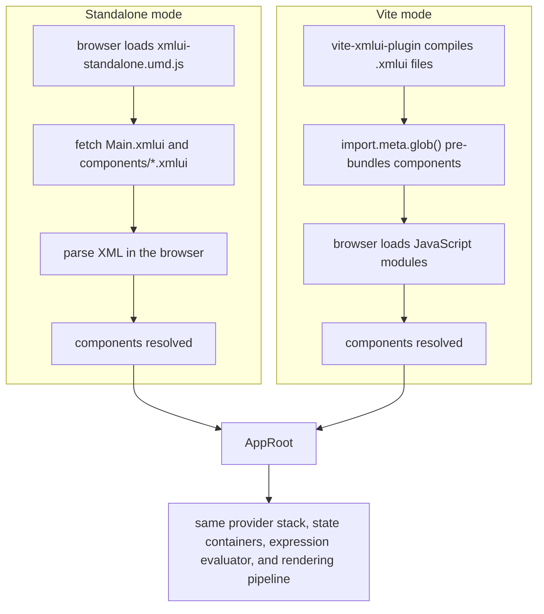
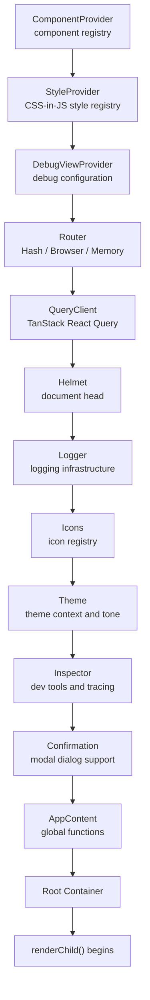
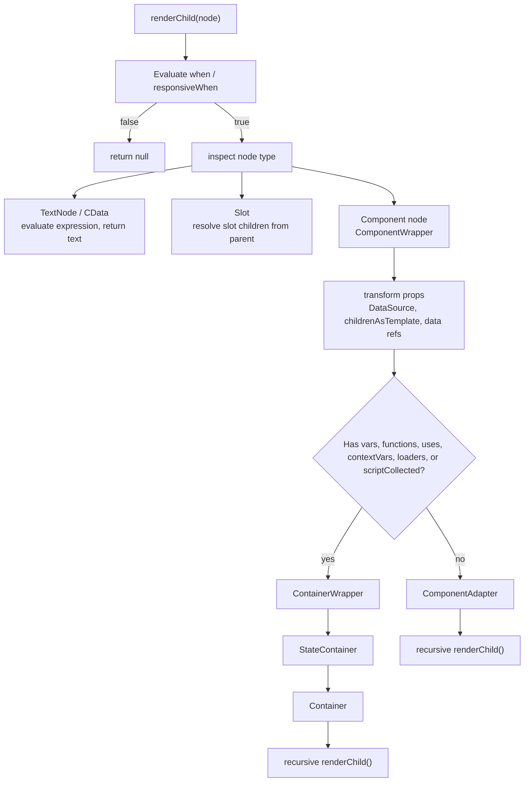
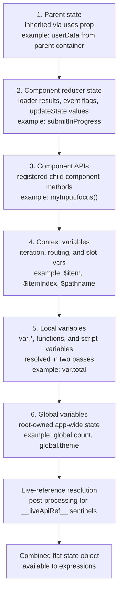
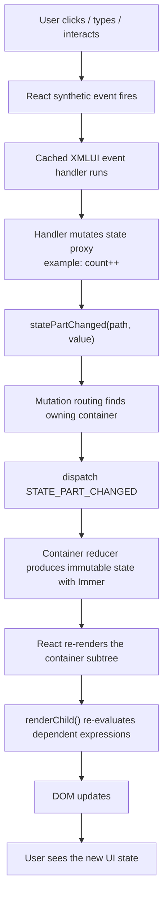

# XMLUI Framework Mental Model

Understanding XMLUI's architecture starts here. This document provides the conceptual map that connects every other subsystem. If you read only one document, make it this one.

## What Is XMLUI?

XMLUI is a **declarative-reactive frontend framework** where applications are written as XML markup instead of JavaScript or JSX. The framework parses `.xmlui` files, builds a component tree, composes state, evaluates expressions, and produces a React element tree — all automatically. Reactivity is built-in: when state changes, every expression that depends on it re-evaluates and the UI updates, like a spreadsheet.

Under the hood, XMLUI is built entirely on React. But users of the framework never interact with React directly — they write markup, and the framework handles the rest.

```xml
<App var.count="{0}">
  <Button onClick="count++">Count: {count}</Button>
</App>
```

When the user clicks the button, `count` increments, and the button label updates automatically. No manual state wiring, no `setState` calls, no effect hooks.

XMLUI uses a **Managed React** model: React remains the rendering engine, but app authors work through supervised XMLUI surfaces — metadata contracts, managed expression evaluation, data APIs, lifecycle/concurrency/error handling, styling, and Inspector diagnostics. The point is not to hide React from framework developers; it is to give application authors a safer, more predictable React-shaped environment.

## The Two Deployment Modes

XMLUI apps can run in two modes. The choice is made at project creation time, not at runtime.

**Standalone (buildless)** — The app is served as static files. The browser loads `xmlui-standalone.umd.js`, which fetches `Main.xmlui` and parses XMLUI markup at runtime. No build step needed. Deploy by copying files to any static web server.

A minimal standalone `index.html` has no island markers. On `DOMContentLoaded`, the standalone bundle starts one XMLUI app for the page:

```html
<!doctype html>
<html>
  <head>
    <meta charset="utf-8" />
    <title>XMLUI standalone app</title>
  </head>
  <body>
    <script src="https://unpkg.com/xmlui@latest/dist/standalone/xmlui-standalone.umd.js"></script>
  </body>
</html>
```

That is enough if `Main.xmlui` lives beside `index.html`. You can also host the runtime yourself and load it locally:

```html
<script src="./xmlui/xmlui-standalone.umd.js"></script>
```

Use a CDN for the lowest-friction prototype; host or pin the runtime version when you need repeatable production deployments.

The smallest standalone app is just:

```text
my-app/
  index.html
  Main.xmlui
```

Optional files and folders can sit beside `Main.xmlui`:

| Path | Optional? | Role |
|---|---|---|
| `config.json` | Yes | App-level configuration such as app name/version, default theme/tone, resources, routing/app globals, API interception, and other standalone settings. |
| `components/` | Yes | User-defined `.xmlui` components discovered by the standalone loader when your app references custom component tags. |
| `themes/` | Yes | Theme JSON files that define design tokens, tones, and theme overrides for the app. Use this only when the built-in theme is not enough. |
| `xmlui/xmlui-standalone.umd.js` | Yes | A locally hosted copy of the standalone runtime, used instead of loading it from a CDN. |

**Islands mode** is a special form of standalone mode. It lets an arbitrary host page embed one or more independent XMLUI apps. Each island is declared with a `data-xmlui-src` attribute:

```html
<!doctype html>
<html>
  <head>
    <meta charset="utf-8" />
    <title>Host website with XMLUI islands</title>
    <link rel="stylesheet" href="./site.css" />
  </head>
  <body>
    <main class="marketing-page">
      <h1>Host website content</h1>

      <section>
        <h2>Checkout</h2>
        <div data-xmlui-src="./checkout-form"></div>
      </section>

      <section>
        <h2>Newsletter</h2>
        <div data-xmlui-src="./newsletter-signup"></div>
      </section>
    </main>

    <script src="./xmlui/xmlui-standalone.umd.js"></script>
  </body>
</html>
```

The value is a relative path to a folder containing a standard XMLUI project (`Main.xmlui`, optional `config.json`, `components/`, and so on). If the standalone UMD bundle finds any `data-xmlui-src` markers, it activates islands instead of starting a single page-level app. Each marker gets its own XMLUI app mounted into an open shadow root.

That shadow-root boundary is the key distinction. Islands mode prevents the host website's CSS classes from clashing with the nested XMLUI app's styles, and prevents XMLUI styles from leaking back into the host page. If a page embeds multiple XMLUI apps, each island gets isolated styles, so the apps do not accidentally override each other either.

**Vite (built)** — The app uses Vite with the `vite-xmlui-plugin`. All `.xmlui` files are compiled to JavaScript modules at build time. The result is an optimized bundle with no runtime parsing. Used for production sites and when HMR during development is needed. Note: even in this mode, XMLUI expressions (`{...}`) and event handlers are still evaluated at runtime by the scripting engine — the build step eliminates XML parsing overhead, not expression interpretation.

Both modes converge once components are resolved. From `AppRoot` onward, the rendering pipeline is identical.



## The Full Lifecycle

Here is what happens from the moment a user opens an XMLUI app to the moment pixels appear on screen, and then what happens when they interact.

| Phase                      | What happens                                                |
| -------------------------- | ----------------------------------------------------------- |
| 1. Bootstrap               | Components are resolved; provider stack is established      |
| 2. Provider stack          | React context providers are layered around the app          |
| 3. Rendering               | `renderChild()` recursively builds the React element tree   |
| 4. State composition       | `StateContainer` composes the expression state              |
| 5. Expression evaluation   | `{expressions}` are evaluated against composed state        |
| 6. Interaction & re-render | User event → state mutation → routing → reducer → re-render |

### Phase 1: Bootstrap

The app starts in `StandaloneApp`, which:

1. **Resolves components** — In standalone mode, fetches `.xmlui` files from the server and parses them. In Vite mode, uses pre-compiled modules.
2. **Sets up API interception** — Optionally wraps the app in an `ApiInterceptorProvider` for mocked APIs.
3. **Enters AppRoot** — Wraps the entry point in a root `Container` and `Theme` node, then nests it inside the provider stack.

### Phase 2: Provider Stack

`AppRoot` and `AppWrapper` wrap the entire app in a series of React context providers. Each provider adds a capability:

The router type is chosen based on configuration: `HashRouter` (default), `BrowserRouter` (when `useHashBasedRouting: false`), or `MemoryRouter` (SSR fallback or preview mode).



### Phase 3: Rendering

Rendering is driven by `renderChild()`, the recursive function at the heart of XMLUI. It is called for every node in the component tree.

**What renderChild does for each node:**

1. **Checks visibility** — Evaluates `when` and `responsiveWhen` conditions. If false, the node is skipped. Exception: nodes with a `mount` handler, or legacy `init` alias, stay mounted invisibly so the adapter can detect a later false → true transition and fire the lifecycle handler then.
2. **Handles special node types** — `TextNode` and `TextNodeCData` are evaluated and returned as text. `Slot` nodes resolve their children from the parent component. Regular XMLUI component nodes continue through `ComponentWrapper`.
3. **Wraps in ComponentWrapper** — All other nodes pass through `ComponentWrapper`, which applies a series of transformations and then routes the node to the correct renderer.

**What ComponentWrapper does:**

1. **Transforms the node** — Converts child `<DataSource>` elements to loader arrays, moves children to props when `childrenAsTemplate` is set, and resolves data props to DataSource components.
2. **Routes to the correct renderer:**
   - If the node has state (`vars`, `functions`, `uses`, or `loaders`), it goes through `ContainerWrapper` → `StateContainer` → `Container` → recursive `renderChild()`.
   - If the node is stateless, it goes directly to `ComponentAdapter` — no container overhead.



### Phase 4: State Composition

When a node routes through `StateContainer`, the framework composes the expression state from the same six sources described in [03-container-state.md](./03-container-state.md#state-composition-the-6-layers). The layer numbers identify the source groups; avoid using them as shorthand for "higher" or "lower" state. For name collisions, the final merge order used by `StateContainer` determines which value is visible.

| Layer | What it provides | Key detail |
| ----- | ---------------- | ---------- |
| 1. Parent state | Variables inherited from the parent container | Scoped by `uses`: all, some, or none |
| 2. Component reducer state | Loader results, event handler flags, component state from `updateState` | Managed by the container reducer |
| 3. Component APIs | Methods registered by child components via `registerComponentApi` | Keyed by the child's `id` string |
| 4. Context variables | Iteration variables, routing params, and slot props | `$item`, `$itemIndex`, `$pathname`, `$routeParams`, `$queryParams` |
| 5. Local variables | Variables declared with `var.*`, functions, and script variables | Resolved in two passes to handle forward references |
| 6. Global variables | App-wide variables owned by the root container | Passed down as `parentGlobalVars`; one source of truth |

After all six sources are merged, a post-processing step resolves `__liveApiRef__` sentinels — placeholders stored when an event handler assigns a variable to a component API — into their actual current values.

The final merged state is a single flat object available to all expressions within that container's scope. For a simple local collision, a component-local `var.count` shadows an inherited parent `count` inside that component:

```xml
<App var.count="{0}">
  <Button var.count="{0}" onClick="count++">
    Local count: {count}
  </Button>
</App>
```

Inside the `Button`, `{count}` reads the local `var.count`, and `count++` updates the local count. The app-level `count` still exists in the parent container and remains visible in child containers that inherit it without defining their own `count`.

**Two-pass variable resolution** — Local variables are resolved in two passes before the final expression state is assembled. The first pass pre-resolves variables that may reference each other (forward references). The second pass finalizes all values using the pre-resolved context and a persistent memoization cache.

```xml
<App
  var.fullName="{firstName + ' ' + lastName}"
  var.firstName="John"
  var.lastName="Doe"
>
  <Text>{fullName}</Text>
</App>
```

`fullName` is declared before `firstName` and `lastName`, but it references both of them. Without two-pass resolution, `fullName` would evaluate before the others are ready, producing an undefined result. With two passes: pass 1 resolves `firstName` and `lastName` first; pass 2 uses those resolved values to evaluate `fullName` correctly as `"John Doe"`.



### Phase 5: Expression Evaluation

Every `{expression}` in the markup is evaluated against the composed state. The expression evaluator has access to:

- All values from the composed expression state
- Global functions from `AppContext` (`navigate()`, `toast()`, `formatDate()`, etc.)
- The scripting language (a JavaScript subset with destructuring support, but no classes or generators)

Expressions in props are evaluated **synchronously** during render. Event handlers are evaluated **asynchronously** when triggered.

### Phase 6: Interaction & Re-render

When the user interacts with the app:

1. A React event handler fires (e.g., the user clicks a button)
2. The handler is a cached function created by `Container`'s event handler subsystem
3. `runCodeAsync()` evaluates the handler's parsed statements against current state
4. If a statement modifies a variable (e.g., `count++`), `statePartChanged()` is called
5. **Mutation routing** determines which container owns the variable:
   - Local variable → dispatch locally
   - Global variable → bubble to root container
   - Component state → dispatch locally
   - Otherwise → bubble to parent (if `uses` boundary allows)
6. The owning container's reducer processes the `STATE_PART_CHANGED` action via immer
7. React re-renders the container subtree
8. `renderChild()` re-evaluates expressions that depend on the changed variable
9. The DOM updates



## Containers: The Unit of State

A **container** is the fundamental unit of state isolation in XMLUI. Every component that has variables, functions, or data loaders gets wrapped in a container.

Each container is implemented as two cooperating React components with distinct responsibilities:

- **`StateContainer`** — owns the _data_. It composes the expression state (parent state, context variables, globals, local variables, reducer state, component APIs, and routing params) and provides the merged state object to everything below it.
- **`Container`** — owns the _behaviour_. It receives the composed state from `StateContainer` and is responsible for creating event handlers, caching them, resolving action lookups, and calling `renderChild()` to produce the children.

In other words: `StateContainer` answers _"what is the current state?"_, and `Container` answers _"what do I render and what happens when the user acts?"_.

**Explicit containers** — Created when a node declares `vars`, `functions`, `uses`, or `loaders`. Gets its own `StateContainer` + `Container` pair with an independent reducer.

**Implicit containers** — The framework automatically wraps user-defined components in containers for instance isolation. Implicit containers delegate their `dispatch` and `registerComponentApi` to the parent.

This is why multiple instances of the same user-defined component each have independent state:

```xml
<App>
  <Counter />  <!-- has its own count -->
  <Counter />  <!-- has its own count -->
  <Counter />  <!-- has its own count -->
</App>
```

Each `<Counter>` gets its own container, so `count` in one does not affect the others.

## The Reducer

Each container has a reducer (created by `createContainerReducer()`) that processes state mutations. The reducer uses immer's `produce()` — all mutations are immutable under the hood.

The key action types are:

| Action                                          | When it fires                        | What it does                                                          |
| ----------------------------------------------- | ------------------------------------ | --------------------------------------------------------------------- |
| `LOADER_LOADED`                                 | DataSource returns data              | Updates `state[uid].value`, builds `byId` lookup, sets `loaded: true` |
| `LOADER_ERROR`                                  | DataSource fails                     | Sets `error`, marks `loaded: true`                                    |
| `STATE_PART_CHANGED`                            | Expression assigns to a variable     | Path-based update via immer `setWith()`                               |
| `COMPONENT_STATE_CHANGED`                       | Native component calls `updateState` | Merges new state into `state[uid]`                                    |
| `EVENT_HANDLER_STARTED` / `COMPLETED` / `ERROR` | Event handler lifecycle              | Tracks `${eventName}InProgress` flags                                 |

## Global Functions (AppContext)

`AppContext` provides a global object available in all expressions. Key capabilities:

- **Navigation**: `navigate(path)`, `goBack()`
- **Feedback**: `toast.success(msg)`, `toast.error(msg)`, `confirm(msg)`
- **Actions**: `Actions.callApi()`, `Actions.download()`, `Actions.upload()`
- **Date/Math**: `formatDate()`, `getDate()`, `avg()`, `sum()`, `min()`, `max()`
- **Storage**: `getLocalStorage(key)`, `setLocalStorage(key, value)`

## Essential Reference

A quick-reference table of the most important types and functions mentioned in this document.

| Name                       | Kind            | Role                                                                                                                                                 |
| -------------------------- | --------------- | ---------------------------------------------------------------------------------------------------------------------------------------------------- |
| `StandaloneApp`            | React component | App entry point — resolves components, sets up API interception, enters `AppRoot`                                                                    |
| `AppRoot`                  | React component | Wraps the app in `ComponentProvider`, `StyleProvider`, and `AppWrapper`                                                                              |
| `AppWrapper`               | React component | Adds Router, ThemeProvider, IconProvider, InspectorProvider, and `AppContent`                                                                        |
| `ComponentDef`             | TypeScript type | Parsed representation of one XML element: `type`, `props`, `events`, `children`, `vars`, `loaders`, `when`, `uses`                                   |
| `CompoundComponentDef`     | TypeScript type | A user-defined component: `name` + template tree + optional `script`                                                                                 |
| `ComponentRendererDef`     | TypeScript type | Registry entry mapping a component type name to its renderer function and metadata                                                                   |
| `RendererContext`          | TypeScript type | Passed to every renderer function: `node.props`, `state`, `extractValue`, `renderChild`, `lookupEventHandler`, `updateState`, `registerComponentApi` |
| `renderChild()`            | Function        | Recursive rendering core — evaluates `when`, handles text/slot nodes, delegates to `ComponentWrapper`                                                |
| `ComponentWrapper`         | React component | Transforms node props, then routes to `ContainerWrapper` (stateful) or `ComponentAdapter` (stateless)                                                |
| `StateContainer`           | React component | Composes the expression state and provides it to `Container`                                                                                         |
| `Container`                | React component | Creates event handlers, action lookup, and the stable `renderChild` closure; renders children and loaders                                            |
| `createContainerReducer()` | Function        | Produces the immer-based reducer for a container's state mutations                                                                                   |
| `statePartChanged()`       | Callback        | Routes a variable mutation to the owning container via `STATE_PART_CHANGED` dispatch                                                                 |
| `AppContextObject`         | TypeScript type | The global utilities object: `navigate`, `toast`, `confirm`, `Actions`, date/math/storage helpers                                                    |
| `registerComponentApi()`   | Callback        | Registers imperative methods (e.g. `focus()`, `clear()`) on a native component so markup can call them                                               |
| `updateState()`            | Callback        | Called by a native component to push its internal state (e.g. a TextBox's current value) into the container                                          |

## Key Takeaways

1. **XMLUI is React underneath** — but the abstraction layer (containers, renderers, expression evaluation) is what you work with as a framework developer.
2. **`renderChild()` is the recursive heart** — it drives the entire rendering pipeline.
3. **Containers are the unit of state** — every component with vars/loaders/functions gets one. `StateContainer` composes the expression state used by that subtree.
4. **Mutation routing is automatic** — writing to a variable routes the change to the correct container, whether local, parent, or global.
5. **The provider stack is deep but stable** — 12+ providers wrap the app. You rarely modify them but need to know they exist.
6. **Two modes, one pipeline** — Standalone and Vite modes only differ in how components are discovered and parsed. The rendering pipeline is the same.
7. **Islands are isolated standalone apps** — each `data-xmlui-src` marker mounts an independent XMLUI app in a shadow root so host CSS, XMLUI CSS, and sibling islands do not clash.
8. **Managed React is the safety frame** — XMLUI uses React, but routes app authoring through managed contracts, expression evaluation, lifecycle, data, styling, and observability surfaces.
