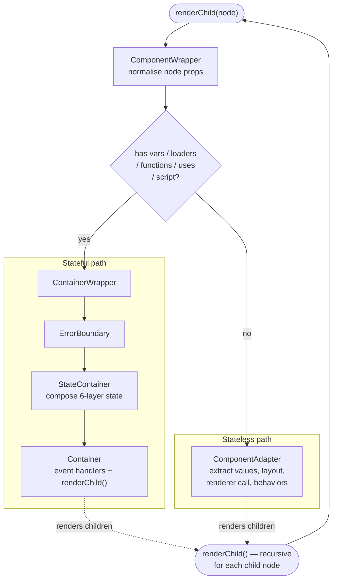
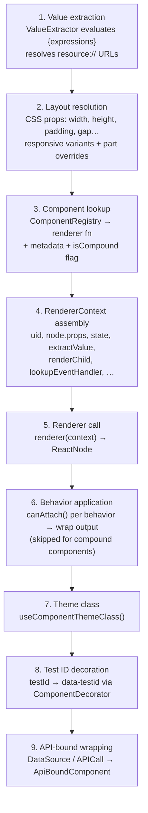

# Rendering Pipeline

The rendering pipeline is what turns a `ComponentDef` tree (the in-memory representation of parsed `.xmlui` markup) into a React element tree that React can commit to the DOM. Understanding this pipeline is essential whenever you need to trace how a component gets rendered, debug unexpected output, or add new rendering behaviour.

## The Pipeline at a Glance

Every component in the tree passes through the same sequence of steps:

```
renderChild()
  └── ComponentWrapper           transforms node props, then routes:
        ├── ContainerWrapper     node is stateful (has vars / loaders / functions / uses / script)
        │     └── ErrorBoundary
        │           └── StateContainer   composes 6-layer state
        │                 └── Container  creates event handlers, renders children
        └── ComponentAdapter     node is stateless
              └── renderer()     calls the component's renderer function
                    └── behavior wrappers applied to rendered output
```

The key fork is in `ComponentWrapper`: **stateful nodes** get a full container stack; **stateless nodes** go straight to `ComponentAdapter`. Most of the interesting work happens inside `ComponentAdapter`.

| Step | Component | Responsibility |
|------|-----------|---------------|
| 1 | `renderChild()` | Visibility check, text nodes, slot resolution, entry point |
| 2 | `ComponentWrapper` | Node normalisation (data transforms), stateful/stateless routing |
| 3a | `ContainerWrapper` → `StateContainer` → `Container` | State isolation, 6-layer state composition, event handler setup |
| 3b | `ComponentAdapter` | Value extraction, layout, renderer call, behavior application, theming |
| 4 | Behaviors | Cross-cutting wrappers (label, tooltip, formBinding, …) |
| ∞ | `renderChild()` (recursive) | Children of the container rendered by repeating from step 1 |

<!-- DIAGRAM: Flowchart of the pipeline above, with arrows and boxes for each step. Highlight the stateful vs stateless fork. -->



## Step 1: renderChild

`renderChild()` is the recursive entry point, called for every node in the component tree.

**It handles four cases:**

1. **Visibility check** — Evaluates the `when` and `responsiveWhen` conditions. In client mode, a false condition returns `null` immediately (component unmounts, state is lost). One exception: if the node has an `init` event handler, it renders once regardless, so the init handler can run and potentially change the condition.

2. **Text nodes** — `TextNodeCData` returns its value raw (no parsing). `TextNode` evaluates any `{expression}` it contains via `extractParam()`.

3. **Slot nodes** — Resolves the correct slot children from the parent component's context and renders them with the parent's render context.

4. **Everything else** — Passed to `ComponentWrapper`.

## Step 2: ComponentWrapper — Normalising the Node

Before routing to a renderer, `ComponentWrapper` applies a series of transformations to normalise the node. All transformations are memoized.

| Transform | What it does |
|-----------|-------------|
| `childrenAsTemplate` | Moves child nodes into a named prop (used by components like `Table.Column`) |
| Child `DataSource` extraction | Moves `<DataSource>` children into a `loaders` array |
| `dataSourceRef` prop | Replaces a loader reference prop with a virtual `DataSourceRef` node |
| `data` string prop | Wraps the URL value in an implicit `<DataSource>` component |
| `raw_data` prop | Converts pre-resolved data into the appropriate format |

After transformations, `ComponentWrapper` makes the routing decision:

- **Has `vars`, `loaders`, `functions`, `uses`, `contextVars`, or a parsed script?** → `ContainerWrapper` (stateful path)
- **Otherwise?** → `ComponentAdapter` (stateless path)

## Step 3a: ContainerWrapper (stateful path)

`ContainerWrapper` sets up state isolation before rendering. It does two things:

**Implicit wrapping** — If a node has `vars`, `loaders`, or `functions` but isn't already a `Container` type, `ContainerWrapper` creates a synthetic container node, moves the state properties up to it, and keeps the original node as a child. This is why you can write `var.count="{0}"` on any component and it just works.

**Explicit containers** — If the node is already typed as `Container` or has a `uses` prop, no rewrapping is needed.

The distinction between **implicit** and **explicit** matters for state inheritance: an implicit container (`uses` is undefined) inherits all parent state; an explicit container with `uses` set creates a boundary — only the listed keys are inherited.

`ContainerWrapper` then renders:

```
<ErrorBoundary node={node}>
  <StateContainer isImplicit={...} />
</ErrorBoundary>
```

`StateContainer` composes the 6-layer state (see [01-mental-model.md](01-mental-model.md)) and hands it to `Container`, which creates the event handler subsystem and calls `renderChild()` on the children.

## Step 3b: ComponentAdapter (stateless path)

`ComponentAdapter` does the actual rendering for stateless nodes. It is the most complex step in the pipeline.

**1. Value extraction** — Creates a `ValueExtractor` that evaluates `{expressions}` in the node's props against the current state. Also resolves any `resource://` URLs to physical paths via the theme system.

**2. Layout resolution** — Extracts CSS layout properties (`width`, `height`, `padding`, `gap`, etc.) from the node's props. This includes responsive variants (e.g. `padding-md` applies padding at the `md` breakpoint) and part-specific overrides (e.g. `fontSize-label` sets font size for the component's `label` part). Builds a composite `style` object.

**3. Component lookup** — Asks the `ComponentRegistry` for the renderer, metadata descriptor, and a flag indicating whether this is a compound (user-defined) component.

**4. RendererContext** — Assembles the context object passed to the renderer function: `uid`, `node.props`, `state`, `extractValue`, `renderChild`, `lookupEventHandler`, `updateState`, `registerComponentApi`, `logInteraction`, and more.

**5. Renderer call** — Calls `renderer(rendererContext)`, producing a `ReactNode`.

**6. Behavior application** — Loops over all registered behaviors and applies those whose `canAttach()` returns true. Each behavior wraps the rendered output. **Behaviors never apply to compound (user-defined) components.**

**7. Theme class** — Applies the component's theme-based CSS class via `useComponentThemeClass()`.

**8. Test ID decoration** — If the node has a `testId`, wraps the output in `ComponentDecorator` to inject a `data-testid` attribute.

**9. API-bound wrapping** — If the component's props reference a `DataSource`, `APICall`, or `FileDownload`, wraps in `ApiBoundComponent` to handle data loading and error state.

<!-- DIAGRAM: ComponentAdapter as a vertical pipeline of numbered steps, each labeled. -->



## Step 4: Behaviors

Behaviors are cross-cutting wrappers applied automatically based on a component's props and metadata. They are registered in `ComponentProvider` and applied in registration order inside `ComponentAdapter`.

**Registration order determines wrapping order.** The last-registered behavior becomes the outermost wrapper:

| Behavior | Trigger condition | What it wraps with |
|----------|------------------|--------------------|
| `label` | `label` prop + visual component | Label element above/beside the component |
| `animation` | `animation` prop | CSS animation wrapper |
| `tooltip` | `tooltip` prop | Tooltip overlay |
| `variant` | `variant` prop | Adds CSS variant class |
| `bookmark` | `bookmark` prop | URL hash management |
| `formBinding` | `bindTo` prop + component has `value`/`setValue` APIs | Two-way form value binding |
| `validation` *(outermost)* | `validationState`/`required`/`pattern` | Validation state wrapping |

**`when` and visibility** — `when` is evaluated in `renderChild()`. When false, the component returns `null` — it unmounts completely and loses all state.

## Error Boundaries

Every `ContainerWrapper` is wrapped in an `ErrorBoundary`. If any component in the subtree throws during render, the boundary catches the error and renders a fallback message in its place, preventing the error from propagating up and crashing the whole app.

The boundary auto-resets when the `node` prop changes — so if the user navigates to a different page and the component tree changes, a previously errored boundary recovers automatically.

Errors caught by a boundary are also logged to the inspector via `pushXsLog({ kind: "error:boundary", ... })`, making them visible in the debug trace.

## Component Registry

The `ComponentRegistry` (managed by `ComponentProvider`) maps component type names to renderer functions. It uses three namespaces with priority ordering:

```
CORE_NS (highest priority) → APP_NS → EXTENSIONS_NS (lowest priority)
```

This means a user-defined component named the same as a core component will be shadowed by the core one. Namespaced names like `"Charts.BarChart"` are also supported.

**User-defined components** get a `isCompoundComponent: true` flag in their registry entry. `ComponentAdapter` uses this flag to skip behavior application.

## Key Takeaways

1. **The stateful/stateless fork is central** — `ComponentWrapper` routes stateful nodes through a full `StateContainer` + `Container` stack, and stateless nodes directly to `ComponentAdapter`. Knowing which path a component takes explains most rendering behaviour.
2. **`ComponentAdapter` is where rendering actually happens** — value extraction, layout resolution, renderer call, behavior application, theme classes, and test IDs all happen here.
3. **Behaviors wrap from inside out** — registration order determines nesting. `label` is innermost, `validation` is outermost.
4. **Compound components never get behaviors** — if you're building a user-defined component, behavior props (`tooltip`, `variant`, etc.) won't work unless you explicitly handle them in the template.
5. **`when` unmounts the component** — when `when` is false the subtree is removed from the React tree and state is lost.
6. **Error boundaries are per-container** — a render error in one component subtree doesn't crash the rest of the app.
