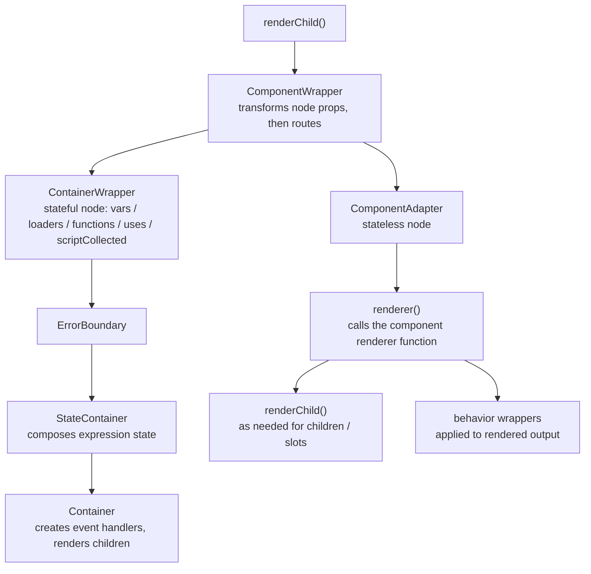
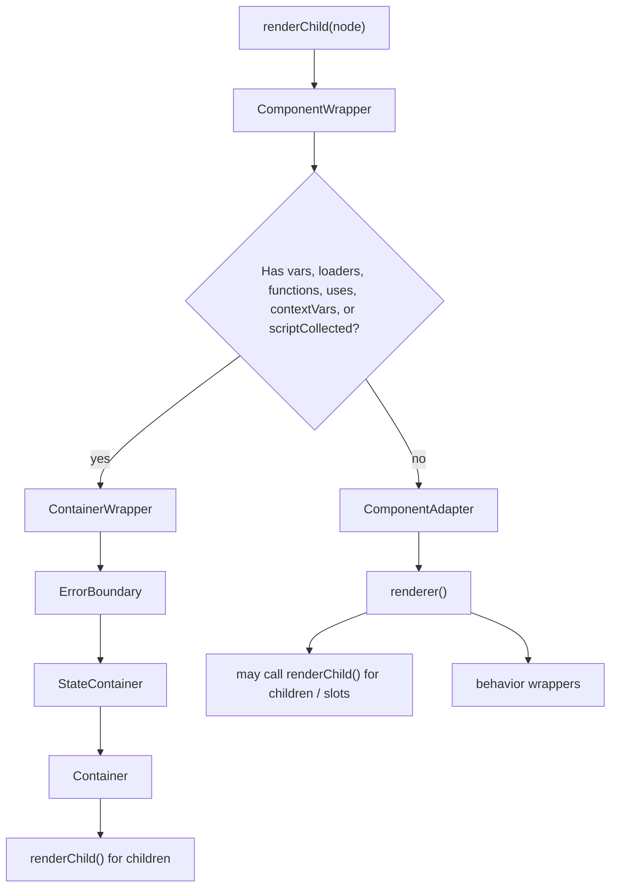
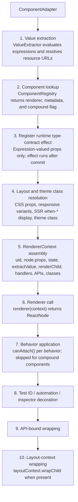

# Rendering Pipeline

The rendering pipeline is what turns a `ComponentDef` tree (the in-memory representation of parsed `.xmlui` markup) into a React element tree that React can commit to the DOM. Understanding this pipeline is essential whenever you need to trace how a component gets rendered, debug unexpected output, or add new rendering behaviour.

The recursive heart of the pipeline is `renderChild()`:

```ts
export function renderChild({
  node,
  state,
  globalVars,
  dispatch,
  appContext,
  lookupAction,
  lookupSyncCallback,
  registerComponentApi,
  renderChild,
  statePartChanged,
  layoutContext,
  parentRenderContext,
  memoedVarsRef,
  cleanup,
  uidInfoRef,
}: ChildRendererContext): ReactNode
```

`ChildRendererContext` carries the `ComponentDef` node plus the current composed state, global variables, app context, action lookups, component API registration, state-change callback, layout context, parent render context for slots, memoized variable cache, cleanup hook, and the recursive `renderChild` callback.

`renderChild()` is responsible for the first routing decision for each node:

- resolve effective visibility from `when` and `responsiveWhen`;
- keep components with `onMount` or legacy `onInit` handlers mounted invisibly long enough to observe a later false-to-true visibility transition;
- return raw CDATA text and evaluated `TextNode` text;
- resolve slot children from the parent render context, including the single-text-node special case;
- evaluate the node key from `uid`;
- hand ordinary component nodes to `ComponentWrapper`.

`when` is the component's base visibility condition. `responsiveWhen` holds breakpoint-specific visibility conditions parsed from responsive visibility attributes such as `when-md`. When responsive rules exist, `resolveResponsiveWhen()` uses the current media breakpoint to choose the nearest rule at or below that breakpoint, following XMLUI's mobile-first breakpoint model. If no responsive rule applies, the base `when` is still the fallback when it is explicitly set. If neither a matching responsive rule nor a base `when` is available, XMLUI infers the base visibility from the lowest defined responsive rule so opt-in responsive visibility stays hidden before its first matching breakpoint.

## The Pipeline at a Glance

Every component in the tree passes through the same sequence of steps:



The key fork is in `ComponentWrapper`: **stateful nodes** get a full container stack; **stateless nodes** go straight to `ComponentAdapter`. Most of the interesting work happens inside `ComponentAdapter`.

| Step | Component | Responsibility |
|------|-----------|---------------|
| 1 | `renderChild()` | Visibility check, text nodes, slot resolution, entry point |
| 2 | `ComponentWrapper` | Node normalisation (data transforms), stateful/stateless routing |
| 3a | `ContainerWrapper` → `StateContainer` → `Container` | State isolation, expression-state composition, event handler setup |
| 3b | `ComponentAdapter` | Value extraction, runtime type-contract checks, layout, renderer call, behavior application, theming |
| 4 | Behaviors | Cross-cutting wrappers (label, tooltip, formBinding, …) |
| ∞ | `renderChild()` (recursive) | Children of the container rendered by repeating from step 1 |



## Before Rendering: Static Verification

Some checks happen before this React rendering pipeline starts. The XMLUI parser
first turns markup into a `ComponentDef` tree. Tooling can then inspect that tree
without mounting React components.

Type-contract verification is one of those pre-render checks. The language
server and Vite plugin call
`components-core/type-contracts/verifier.ts#verifyComponentDef()` after parsing
and before rendering. At that point XMLUI can check literal props, required
props, event names, enum values, and deprecated props against component
metadata. It cannot evaluate expression-valued props such as
`value="{state.count}"`, because there is no component state or `ValueExtractor`
yet.

Runtime checks for those expression-valued props happen later in
`ComponentAdapter`. See [27-type-contracts.md](27-type-contracts.md) for the
full contract pipeline.

## Step 1: renderChild

`renderChild()` is the recursive entry point, called for every node in the component tree.

**It handles four cases:**

1. **Visibility check** — Resolves effective visibility from `when` and `responsiveWhen`. Think of `when` as the base rule and `responsiveWhen` as breakpoint-specific rules layered over it. In client mode, a false effective condition usually returns `null` immediately (component unmounts, state is lost). One exception: if the node has a canonical `mount` handler or legacy `init` handler, `renderChild()` still routes it to `ComponentWrapper`. `ComponentAdapter` then returns `null` while hidden but remains mounted, so it can observe a later false-to-true transition and fire the visibility lifecycle event.

2. **Text nodes** — `TextNodeCData` returns its value raw (no parsing). `TextNode` evaluates any `{expression}` it contains via `extractParam()`.

3. **Slot nodes** — Resolves the correct slot children from the parent component's context and renders them with the parent's render context.

4. **Everything else** — Passed to `ComponentWrapper`.

## Step 2: ComponentWrapper — Normalising the Node

Before routing to a renderer, `ComponentWrapper` applies a series of transformations to normalise the node. All transformations are memoized.

| Transform | What it does |
|-----------|-------------|
| `childrenAsTemplate` | Moves child nodes into a named prop (used by components like `Table.Column`) |
| Child `DataSource` extraction | Moves `<DataSource>` children into a `loaders` array |
| `dataSourceRef` prop | Replaces a loader reference prop with a virtual `DataSourceRef` node |
| `data` string prop | Wraps the URL value in an implicit `<DataSource>` component |
| `raw_data` prop | Converts pre-resolved data into the appropriate format |

After transformations, `ComponentWrapper` makes the routing decision:

- **Has `vars`, `loaders`, `functions`, `uses`, `contextVars`, or `scriptCollected`?** → `ContainerWrapper` (stateful path)
- **Otherwise?** → `ComponentAdapter` (stateless path)

## Step 3a: ContainerWrapper (stateful path)

`ContainerWrapper` sets up state isolation before rendering. It does two things:

**Implicit wrapping** — If a node has `vars`, `loaders`, or `functions` but isn't already a `Container` type, `ContainerWrapper` creates a synthetic container node, moves the state properties up to it, and keeps the original node as a child. This is why you can write `var.count="{0}"` on any component and it just works.

**Explicit containers** — If the node is already typed as `Container` or has a `uses` prop, no rewrapping is needed.

The distinction between **implicit** and **explicit** matters for state inheritance: an implicit container (`uses` is undefined) inherits all parent state; an explicit container with `uses` set creates a boundary — only the listed keys are inherited.

`ContainerWrapper` then renders:

```
<ErrorBoundary node={node}>
  <StateContainer isImplicit={...} />
</ErrorBoundary>
```

`StateContainer` composes the expression state (see [01-mental-model.md](01-mental-model.md)) and hands it to `Container`, which creates the event handler subsystem and calls `renderChild()` on the children.

## Step 3b: ComponentAdapter (stateless path)

`ComponentAdapter` does the actual rendering for stateless nodes. It is the most complex step in the pipeline.

**1. Value extraction** — Creates a `ValueExtractor` that evaluates `{expressions}` in the node's props against the current state. Also resolves any `resource://` URLs to physical paths via the theme system. The extractor is also reused by runtime type-contract checks for expression-valued props.

**2. Component lookup** — Asks the `ComponentRegistry` for the renderer, metadata descriptor, and a flag indicating whether this is a compound (user-defined) component. The descriptor is component metadata; it is used by behaviors, docs, prop extraction, and runtime type-contract checks.

**3. Runtime type-contract diagnostic effect** — After value extraction and component lookup are both available, `ComponentAdapter` registers a React effect that calls `emitRuntimeTypeContractDiagnostics()`. The effect runs after commit and checks only expression-valued props, because literal props were already covered by the static verifier. Violations are emitted as `kind: "type-contract"` inspector trace entries; in strict mode they also produce a console error and toast. These diagnostics do not stop the renderer call.

**4. Layout and theme class resolution** — Extracts CSS layout properties (`width`, `height`, `padding`, `gap`, etc.) from the node's props and obtains the component theme class from `useComponentThemeClass()`. Responsive layout variants and SSR `when-*` display rules are merged into the generated style class. The SSR `when-*` styles mirror the same responsive visibility intent used by `responsiveWhen`, but CSS is used because the server does not know the browser's current breakpoint.

**5. RendererContext** — Assembles the context object passed to the renderer function: `uid`, `node.props`, `state`, `extractValue`, `renderChild`, `lookupEventHandler`, `updateState`, `registerComponentApi`, `className`, `classes`, `logInteraction`, and more.

**6. Renderer call** — Calls `renderer(rendererContext)`, producing a `ReactNode`.

**7. Behavior application** — Loops over all registered behaviors and applies those whose `canAttach()` returns true. Each behavior wraps the rendered output. **Behaviors never apply to compound (user-defined) components.**

**8. Test ID / automation / inspector decoration** — If the node has `id`, `testId`, `automationId`, or an inspector id and the descriptor is visual and non-opaque, wraps the output in `ComponentDecorator` to inject the corresponding DOM attributes.

**9. API-bound wrapping** — If the component's props reference a `DataSource`, `APICall`, or `FileDownload`, wraps in `ApiBoundComponent` to handle data loading and error state.

**10. Layout-context wrapping** — If the current layout context provides `wrapChild`, applies it after behavior and decoration.



## Step 4: Behaviors

Behaviors are cross-cutting wrappers applied automatically based on a component's props and metadata. They are registered in `ComponentProvider` and applied in registration order inside `ComponentAdapter`.

**Registration order determines wrapping order.** The last-registered behavior becomes the outermost wrapper:

| Behavior | Trigger condition | What it wraps with |
|----------|------------------|--------------------|
| `label` | `label` prop + visual component that does not own `label`/`bindTo`; skipped when form binding will handle the label | Label element above/beside the component |
| `animation` | `animation` prop + visual component | CSS animation wrapper |
| `tooltip` | `tooltip` or `tooltipMarkdown` prop + visual component | Tooltip overlay |
| `variant` | `variant` prop + visual component | Adds CSS variant class |
| `bookmark` | `bookmark` prop + visual component | URL hash management |
| `formBinding` | `bindTo` prop + component has `value`/`setValue` APIs and is not `FormItem` | Two-way form value binding |
| `validation` *(outermost among built-ins)* | `FormItem`, or `bindTo` prop + component has `value`/`setValue` APIs | Validation state wrapping |

**`when` and visibility** — `when` is the base visibility condition; `responsiveWhen` is the parsed map of breakpoint-specific `when-*` conditions. `renderChild()` calls `resolveResponsiveWhen()` to produce one effective boolean for the current render. When that boolean is false, the component usually returns `null`, unmounts completely, and loses local component state. Components with `onMount` or legacy `onInit` are the lifecycle exception: the adapter stays mounted while hidden, returns `null`, and fires `onMount` only when visibility becomes true. `onUnmount` or legacy `onCleanup` fires once when visibility changes from true to false, or when React disposes a still-visible component.

## Error Boundaries

Every `ContainerWrapper` is wrapped in an `ErrorBoundary`. If any component in the subtree throws during render, the boundary catches the error and renders a fallback message in its place, preventing the error from propagating up and crashing the whole app.

The boundary auto-resets when the `node` prop changes — so if the user navigates to a different page and the component tree changes, a previously errored boundary recovers automatically.

Errors caught by a boundary are also logged to the inspector via `pushXsLog({ kind: "error:boundary", ... })`, making them visible in the debug trace.

## Component Registry

The `ComponentRegistry` (managed by `ComponentProvider`) maps component type names to renderer functions. It uses three namespaces with priority ordering:

```
CORE_NS (highest priority) → APP_NS → EXTENSIONS_NS (lowest priority)
```

This means a user-defined component named the same as a core component will be shadowed by the core one. Namespaced names like `"Charts.BarChart"` are also supported.

**User-defined components** get a `isCompoundComponent: true` flag in their registry entry. `ComponentAdapter` uses this flag to skip behavior application.

## Key Takeaways

1. **The stateful/stateless fork is central** — `ComponentWrapper` routes stateful nodes through a full `StateContainer` + `Container` stack, and stateless nodes directly to `ComponentAdapter`. Knowing which path a component takes explains most rendering behaviour.
2. **`ComponentAdapter` is where rendering actually happens** — value extraction, runtime expression-value type-contract checks, layout resolution, renderer call, behavior application, theme classes, and test IDs all happen here.
3. **Behaviors wrap from inside out** — registration order determines nesting. The built-in order is `label`, `animation`, `tooltip`, `variant`, `bookmark`, `formBinding`, `validation`, so `validation` is outermost among built-ins when it attaches.
4. **Compound components never get behaviors** — if you're building a user-defined component, behavior props (`tooltip`, `variant`, etc.) won't work unless you explicitly handle them in the template.
5. **`when` usually unmounts the component** — when `when` is false the subtree is removed from the React tree and state is lost, except for the visibility lifecycle adapter path used by `onMount`/`onInit`.
6. **Error boundaries are per-container** — a render error in one component subtree doesn't crash the rest of the app.
