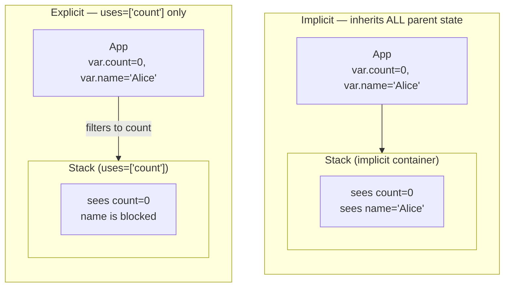
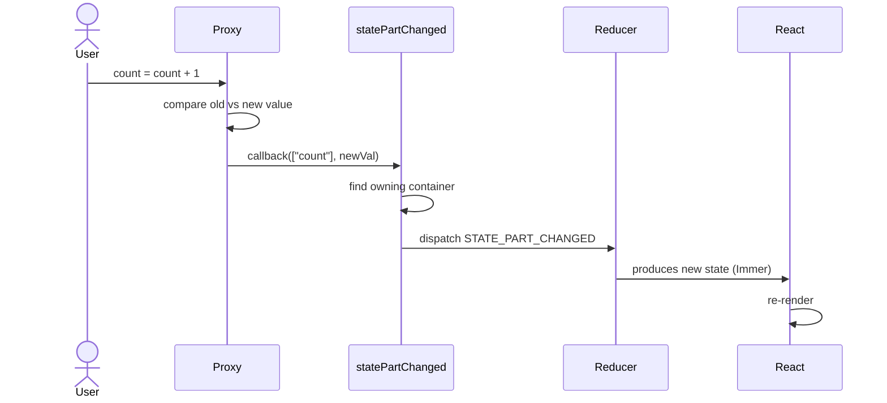
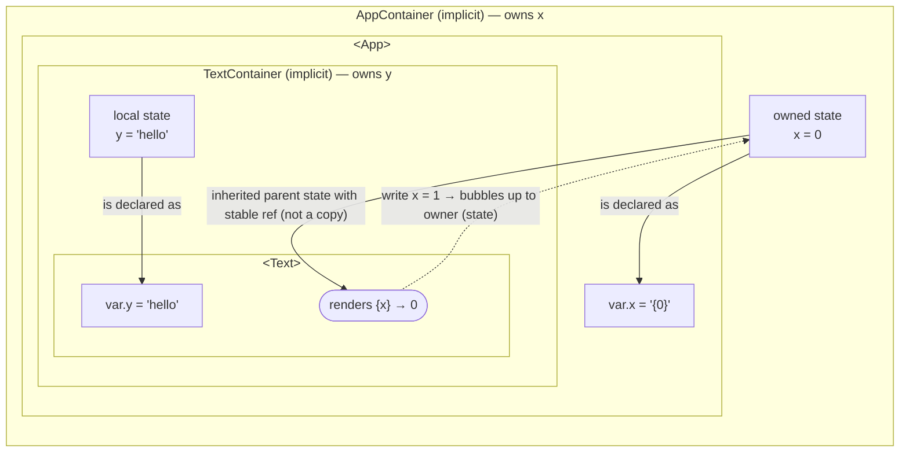
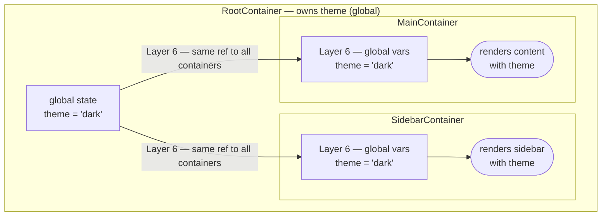
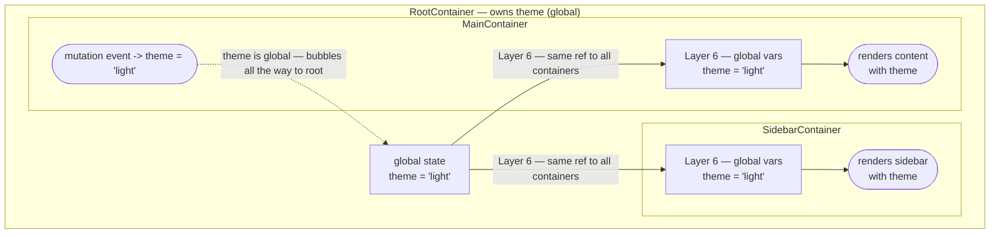
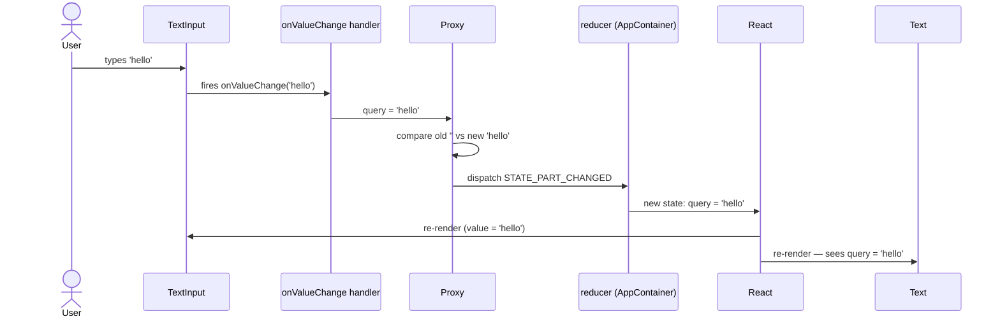
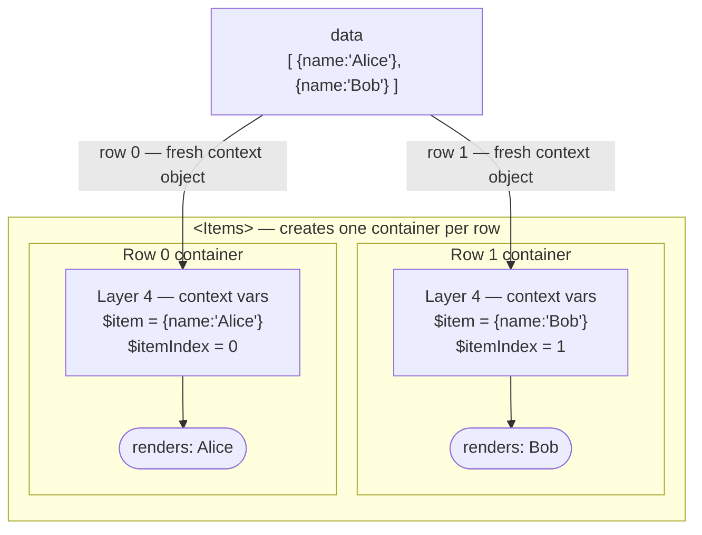
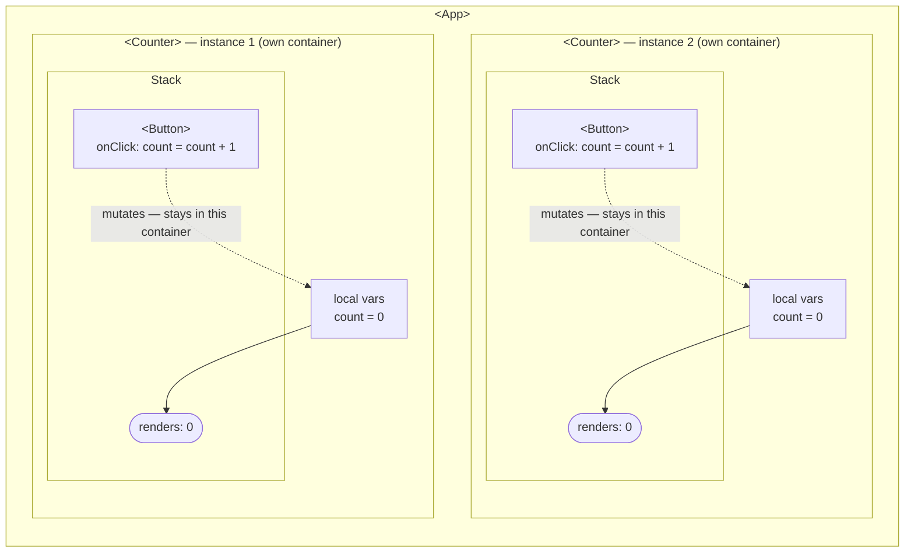
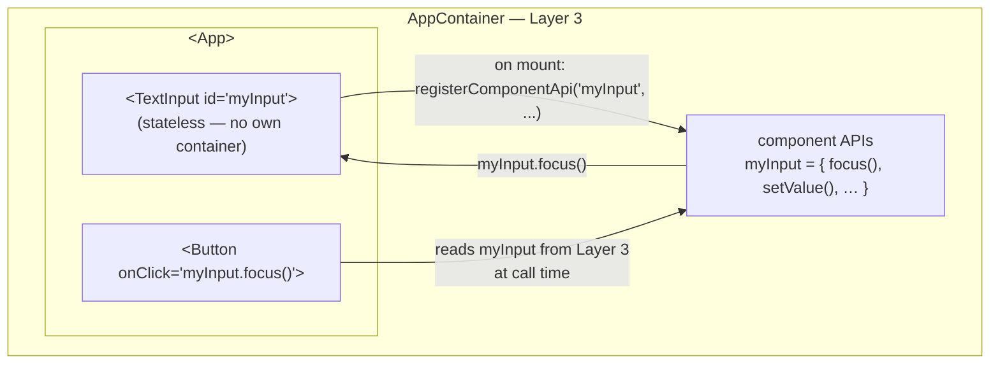

# Container & State System

Containers are the foundation of reactivity in XMLUI. Every component that has state — variables, data loaders, functions, or a script block — lives inside a container. The container owns a state object, a reducer, and a mutation-tracking proxy. Understanding how containers compose state and route mutations is essential for debugging any reactive behaviour in the framework.

## When Does a Container Get Created?

Not every component gets a container. The framework creates one only when a node has at least one of these:

- `vars` (e.g. `var.count="{0}"`)
- `loaders` (a child `<DataSource>` or `<APICall>`)
- `functions` (e.g. `function.increment="{(n) => count + n}"`)
- `uses` (explicit state boundary)
- `contextVars` (injected by parents like `Items`)
- `scriptCollected` (a `<script>` block)

An `id` attribute alone does **not** create a container. A `<Button>` with no variables, loaders, or script renders through the stateless path described in [02-rendering-pipeline.md](02-rendering-pipeline.md).

However, `id` still has meaning: when a component exposes APIs (e.g. `<TextInput id="myInput">`), it registers those methods with the nearest enclosing container via `registerComponentApi`. The parent container stores the APIs keyed by the `id` string, making `myInput.focus()`, `myInput.setValue()`, etc. accessible in any expression within the parent's scope. This applies even to a component that is itself stateless — it delegates API registration upward to its parent container.

## Implicit vs Explicit Containers

When you write `var.count="{0}"` on a `<Stack>`, the framework wraps the Stack in an **implicit container** automatically. Most of the time this is exactly what you want. You can make any component's container **explicit** by adding a `uses` prop, which lets you control precisely which parent variables the component can see.

| | Implicit | Explicit (with `uses`) |
|-|----------|------------------------|
| **How it's created** | Any component with `vars`, `loaders`, `functions`, or a script | Any component that has a `uses` prop |
| **`uses` value** | `undefined` | An array of inherited keys (may be `[]`) |
| **Parent state** | Inherits **all** parent state | Inherits **only** keys listed in `uses` |
| **Own reducer** | Shares the parent's dispatcher | Owns its own `useReducer` |
| **State boundary** | No — mutations bubble up transparently | Yes — local keys stay, inherited keys bubble |

Using `uses="[]"` (empty array) creates a full state boundary: no parent state flows through at all.

<!-- DIAGRAM: Two side-by-side trees. Left: implicit container inheriting all parent variables. Right: explicit container with uses=["count"] filtering parent state to only "count". -->

```xml
<App var.count=0, var.name='Alice'>
  <Stack>
    {count + ' ' + name}
  </Stack>

  <Stack uses="['count']">
    {count}
  </Stack>
</App>
```



## State Composition: The 6 Layers

`StateContainer` composes the final state object from six sources. Each layer can shadow keys from earlier layers.

| Layer | What it provides | Key detail |
|-------|-----------------|------------|
| 1. Parent state | Variables inherited from the parent container | Scoped by `uses`: all, some, or none |
| 2. Component reducer state | Loader results, event handler flags, component state from `updateState` | Managed by Immer-based reducer |
| 3. Component APIs | Methods registered by child components via `registerComponentApi` | Keyed by the child's `id` string |
| 4. Context variables | Iteration variables (`$item`, `$itemIndex`), routing params (`$pathname`, `$routeParams`, `$queryParams`), and slot props | Fresh per row in an `Items` loop |
| 5. Local variables | Resolved from `var.*` declarations with a two-pass strategy | Handles forward references |
| 6. Global variables | App-wide variables owned by the root container | Passed down as `parentGlobalVars`; one source of truth |

After all six layers are merged by `useCombinedState()`, a post-processing step resolves `__liveApiRef__` sentinels — placeholders stored when an event handler assigns a variable to a component API — into their actual current values.

### Layer 1: Parent State Scoping

The `extractScopedState` function controls what flows in:

```
uses === undefined  →  all parent state inherited
uses === []         →  nothing inherited (full boundary)
uses === ['count']  →  only { count } inherited
```

### Layers 2, 3, 4, 6: Straightforward composition

Layers 2–4 and 6 combine their values with no special logic: layer 2 is the output of `useReducer`, layer 3 merges child component APIs using `Symbol.description` to convert UID symbols to string keys (this is how `id="myInput"` becomes `state["myInput"]`), layer 4 injects externally-provided context objects, and layer 6 passes global variables from the root container down the tree. None of these layers require multi-pass evaluation or custom routing.

### Layer 5: Two-Pass Variable Resolution

Variables can reference each other in any order. Consider:

```xml
<Stack var.fullName="{firstName + ' ' + lastName}"
       var.firstName="{'Alice'}"
       var.lastName="{'Smith'}">
```

`fullName` is declared before `firstName` and `lastName`. A single evaluation pass would fail because those variables don't exist yet when `fullName` is evaluated.

The solution is a **two-pass strategy**:

1. **Pass 1** — Resolve all variables with a temporary memoization cache. `fullName` may evaluate to `undefined + ' ' + undefined` at this point, but `firstName` and `lastName` resolve correctly.
2. **Pass 2** — Re-resolve all variables with pass-1 results merged into the context. Now `fullName` sees the resolved `firstName` and `lastName` and evaluates to `"Alice Smith"`.

### Live Reference Resolution (post-processing)

When an event handler assigns a variable to a component API (e.g. `myVar = ds` where `ds` is a DataSource), the reducer stores a sentinel: `{ __liveApiRef__: "ds" }`. After all six layers are merged, a post-processing step resolves these sentinels to their actual current values, so `myVar` stays in sync as the DataSource updates.

## Variable Re-evaluation

`var.foo="{someExpr}"` re-evaluates `someExpr` on **every render** from scratch. When you mutate `foo` in an event handler, the new value enters the reducer state at layer 2 and **shadows** the expression result from layer 5 on subsequent renders. The expression is still evaluated, but the reducer value takes precedence.

## The Reducer

Each container's reducer is created with Immer's `produce()` for efficient immutable updates. It handles 9 action types:

| Action | When it fires | What it does |
|--------|--------------|-------------|
| `LOADER_IN_PROGRESS_CHANGED` | DataSource starts/stops fetching | Sets `inProgress` flag |
| `LOADER_IS_REFETCHING_CHANGED` | Refetch after initial load | Sets `isRefetching` flag |
| `LOADER_LOADED` | DataSource returns data | Sets `value`, creates `byId` index (for arrays), sets `loaded`, stores `pageInfo`/`responseHeaders` |
| `LOADER_ERROR` | DataSource fails | Sets `error`, clears `inProgress`, sets `loaded: true` |
| `EVENT_HANDLER_STARTED` | Handler begins executing | Sets `{eventName}InProgress: true` (e.g. `onClickInProgress`) |
| `EVENT_HANDLER_COMPLETED` | Handler finishes | Sets `{eventName}InProgress: false` |
| `EVENT_HANDLER_ERROR` | Handler throws | Sets `{eventName}InProgress: false` |
| `COMPONENT_STATE_CHANGED` | Native component calls `updateState` | Shallow-merges new state |
| `STATE_PART_CHANGED` | Proxy detects a mutation | Deep-sets value at nested path; supports delete via `unset` |

The `STATE_PART_CHANGED` action is the most complex. It receives a path array (e.g. `["users", 0, "name"]`), the new value, and the target object. It uses lodash `setWith` for deep assignment and infers whether to create objects or arrays based on the target's type.

## Proxy-Based Mutation Tracking

When an event handler mutates a variable (e.g. `count = count + 1` or `users[0].name = "Alice"`), the mutation is intercepted by a JavaScript `Proxy` created by `buildProxy()`.

The proxy wraps every object and array in the state tree:

- **`get` trap** — Returns proxied versions of nested objects/arrays. Proxies are cached so `state.users === state.users` (reference stability).
- **`set` trap** — Compares old and new values (first by reference, then by deep equality via `JSON.stringify`). If the value actually changed, fires a callback with the full path and values.
- **`deleteProperty` trap** — Fires a callback with an `"unset"` action.

The no-op optimisation is important: if you write `count = count` (same value), no callback fires and no re-render occurs.

```xml
<App var.count="{0}" var.users="{[{name: 'Alice'}]}">
  <!-- Scalar mutation: proxy compares 0 vs 1, fires callback -->
  <Button onClick="count = count + 1" label="Increment" />

  <!-- No-op: old and new value are identical, no callback fires, no re-render -->
  <Button onClick="count = count" label="No-op (same value)" />

  <!-- Nested mutation: proxy intercepts at path ["users", 0, "name"] -->
  <Button onClick="users[0].name = 'Bob'" label="Rename" />

  <Text>{count}</Text>
  <Text>{users[0].name}</Text>
</App>
```

<!-- DIAGRAM: Flow from user mutation → proxy set trap → callback → statePartChanged → dispatch → reducer → re-render -->



## Mutation Routing

When the proxy callback fires, `statePartChanged` in `StateContainer` decides where to send the mutation:

1. **Is the key a local variable?** → Dispatch `STATE_PART_CHANGED` to this container's reducer.
2. **Is the key a global variable?**
   - Root container → dispatch locally
   - Non-root → bubble to `parentStatePartChanged`
3. **Is the key in component state?** → Dispatch locally.
4. **Otherwise** → If `uses` includes the key, bubble to parent. If not, the mutation is dropped (no owner found).

This routing ensures that only the container that owns a variable processes its updates. Children receive parent state as a reference prop, not a copy — when the owning container's reducer produces a new state object, all children see the updated reference on the next render.

### Example: Variable Ownership and Reference Passing

Consider the following code snippet:

```xml
<App var.x="{0}">
  <Text var.y="{'hello'}">
    {x}
  </Text>
</App>
```

`App` owns `x`; `Text` owns `y`. `TextContainer` receives `x` via **Layer 1 (inherited parent state)** as a stable reference to the same object held by `AppContainer` — no copy is made. If an event handler inside `Text` writes `x = newVal`, the proxy intercepts the write, finds that `x` is not a local variable of `TextContainer`, and bubbles the mutation up to `AppContainer`'s reducer. `AppContainer` fires `STATE_PART_CHANGED`, Immer produces a new state object, and `TextContainer` sees the updated value on the next render. There is exactly one owner of `x` at all times.



## The Event Handler Subsystem

`Container.tsx` sets up the infrastructure for executing event handlers:

```
createEventHandlers(...)     → { runCodeAsync, runCodeSync }
createEventHandlerCache(...) → { getOrCreateEventHandlerFn, getOrCreateSyncCallbackFn }
createActionLookup(...)      → { lookupAction, lookupSyncCallback }
```

- **`lookupAction`** resolves an action string or object to an executable function. It handles arrow functions, event handler references, and method calls.
- **`lookupSyncCallback`** resolves sync callbacks (used by `wrapComponent`'s `callbacks` config).
- Handlers are **cached** per component UID in a `Map<symbol, any>`. The cache is cleared on unmount.
- Async handlers track their promises via `statementPromises`. All pending promises are resolved when the container's version changes (triggering re-render) or on unmount, preventing memory leaks.

## Loaders in Containers

Loaders (`<DataSource>`, `<APICall>`) are rendered as invisible components at the top of the container's output. They fire reducer actions as they load:

1. `LOADER_IN_PROGRESS_CHANGED` (loading starts)
2. `LOADER_LOADED` or `LOADER_ERROR` (loading completes)
3. Optionally `LOADER_IS_REFETCHING_CHANGED` (subsequent refetches)

The loaded data is accessible as context variables (`$data`, `$result`, `$error`, `$loading`) in the container's descendants.

## Function Dependency Analysis

The `collectFnVarDeps` utility resolves transitive function dependencies into direct variable dependencies:

```
Input:  { fn1: ["fn2", "var1"], fn2: ["var3"], fn3: ["var4"] }
Output: { fn1: ["var3", "var1"], fn2: ["var3"], fn3: ["var4"] }
```

This tells layer 5 which variables must be resolved before a function can be evaluated. The algorithm is cycle-safe.

## Context Variables in Iteration

In an `Items` component, each row gets its own fresh context object with `$item` and `$itemIndex`. Changing one row's context never affects another — they are separate objects. This is why you can have independent state per row without interference.

## Key Takeaways

1. **Containers are the unit of state** — every variable, loader, and function lives inside one. No container means no state.
2. **Implicit containers are invisible** — writing `var.count="{0}"` on a `<Stack>` creates a container you never see, inheriting all parent state.
3. **`uses` creates a boundary** — it's the only way to control what state flows from parent to child.
4. **Mutations route to the owner** — the proxy catches writes, `statePartChanged` finds the owning container, and only that container's reducer fires.
5. **State is composed, not inherited** — the 6-layer pipeline assembles state from parent, reducer, APIs, context vars, local vars, and globals; live refs are resolved as a post-processing step.
6. **Variables re-evaluate every render** — but reducer values shadow expression results, which is how mutations persist.
7. **Children share references, not copies** — parent state is passed by reference. When the owner updates, children see the change on re-render without any copying.

## Examples

### Example: Global Variables

Global variables (declared with `var.global.*`) are owned by the **root container** and flow to every other container via Layer 6. Any container can read them; mutations anywhere bubble all the way up to the root owner.

```xml
<App var.global.theme="{'dark'}">
  <Sidebar />
  <MainContent />
</App>
```



Let's say an event happened that sets the theme from 'dark' to 'light':



### Example: User Input Affecting State

A `sequenceDiagram` is the clearest way to show a state change triggered by a user action: it makes the temporal flow explicit and separates the before/after states without ambiguity. The static structure (what owns what) can be shown with a `graph TD` if needed, but for runtime behaviour the sequence is the right tool.

```xml
<App var.query="{''}">
  <TextInput onValueChange="(val) => query = val" />
  <Text>{query}</Text>
</App>
```

When the user types, `onValueChange` fires and writes to `query`. The proxy intercepts the write, routes it to `AppContainer`'s reducer (since `query` is App's local var), and both `TextInput` and `Text` re-render with the new value.



### Example: Context Variables in Iteration

`Items` creates one container per row and injects `$item` and `$itemIndex` as fresh **Layer 4 context variables**. Each row's context is an independent object — mutating one row never affects another.

```xml
<App>
  <Items data="{[{name: 'Alice'}, {name: 'Bob'}]}">
    <Text>{$item.name}</Text>
  </Items>
</App>
```



Each row container is **fully isolated**: `$item` in Row 0 and `$item` in Row 1 are separate objects. There is no shared reference between rows.

### Example: Multiple Instances of a User-Defined Component

Every instance of a user-defined component (UDC) gets its **own container** with independent state. Variables declared inside the UDC are not shared across instances.

```xml
<!-- Counter.xmlui -->
<Stack var.count="{0}">
  <Button onClick="count = count + 1" label="Increment" />
  <Text>{count}</Text>
</Stack>

<!-- Main.xmlui -->
<App>
  <Counter />
  <Counter />
</App>
```



Clicking the button on instance 1 dispatches `STATE_PART_CHANGED` to Counter 1's reducer only. Counter 2's `count` is untouched. There is no shared state between UDC instances unless a parent variable is passed in explicitly.

### Example: `id` Registration container (Component APIs)

When a component has an `id`, it registers its methods with the **nearest enclosing container** via `registerComponentApi`. Those methods land in Layer 3 of that container's state, making them available to any expression in the container's scope — even on sibling components.

```xml
<App>
  <TextInput id="myInput" />
  <Button onClick="myInput.focus()" label="Focus" />
</App>
```



`TextInput` itself has no container — it is stateless. It delegates `registerComponentApi` upward to `AppContainer`. When the button's `onClick` evaluates `myInput.focus()`, the framework looks up `myInput` in the combined state at Layer 3 and calls the registered method directly on the underlying DOM element.
