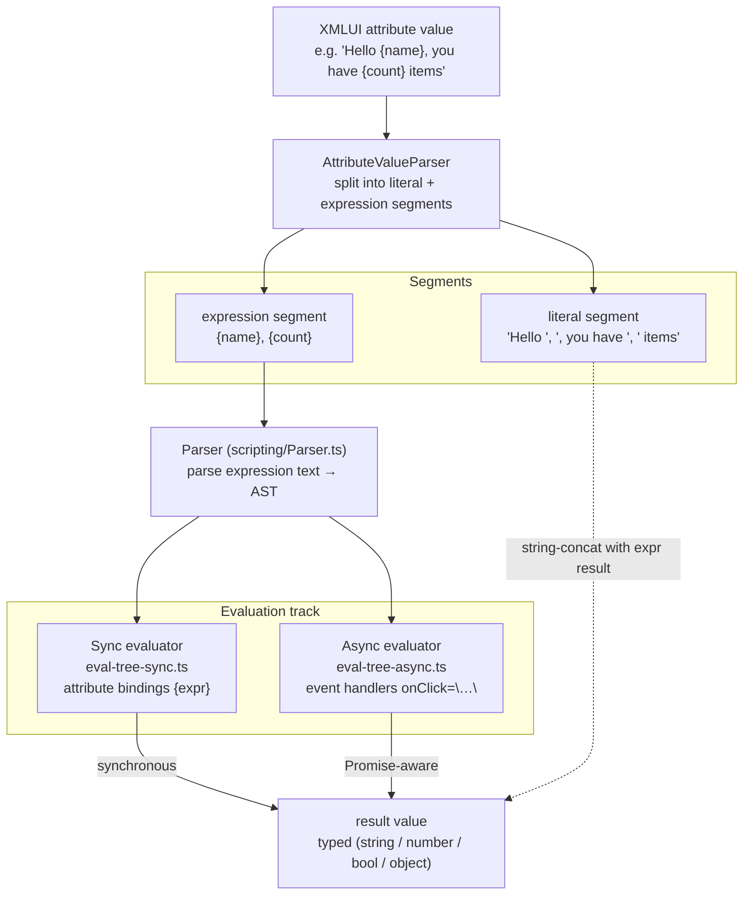
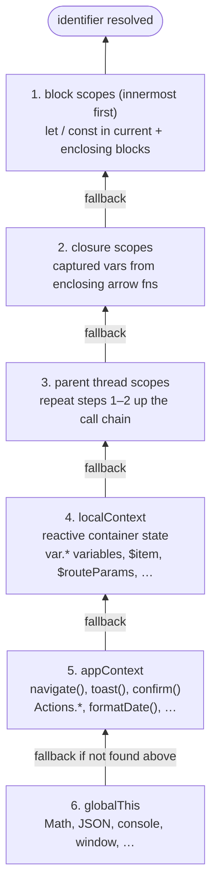

# Expression Evaluation & Scripting

XMLUI uses its own scripting engine — a restricted JavaScript subset with custom semantics. Understanding where it differs from JavaScript is essential for writing correct markup and debugging unexpected behavior. This document covers the full pipeline from XMLUI attribute parsing through evaluation, and catalogs every semantic difference from standard JavaScript.



---

## The Pipeline: From Attribute to Result

When XMLUI encounters an attribute like `value="Hello {name}, you have {count} items"`, it goes through three stages:

### Stage 1: Attribute Parsing

The `AttributeValueParser` splits the attribute string into **literal** and **expression** segments:

```
"Hello {name}, you have {count} items"
→ [
    { literal: "Hello " },
    { expr: <AST for "name"> },
    { literal: ", you have " },
    { expr: <AST for "count"> },
    { literal: " items" }
  ]
```

- Curly braces `{` and `}` delimit expressions
- `\{` escapes to a literal `{`
- A pure expression (`{expr}` with no surrounding text) returns the raw typed value
- Mixed literal + expression segments are string-concatenated

### Stage 2: Parsing to AST

Each expression segment is parsed by the `Parser` (in `parsers/scripting/Parser.ts`, ~3,500 lines) into an AST. The parser supports a JavaScript subset — see [What's Different from JavaScript](#whats-different-from-javascript) below for full details.

The AST node types include 22 statement types and 21 expression types. XMLUI adds one custom node type not in JavaScript: `T_REACTIVE_VAR_DECLARATION` for reactive variables.

### Stage 3: Evaluation

XMLUI has **two parallel evaluators** that interpret the same AST:

| Evaluator | Used for | Key behavior |
|-----------|----------|-------------|
| **Sync** (`eval-tree-sync.ts`) | Attribute bindings: `value="{expr}"`, reactive var expressions | Throws if any function returns a Promise |
| **Async** (`eval-tree-async.ts`) | Event handlers: `onClick="..."`, code-behind execution | Transparently resolves Promises; replaces array methods with async-safe proxies |

Both evaluators set **optional chaining as the default** for all member access and function calls. This is the most impactful behavioral difference from JavaScript — see below.

---

## Reactive Cycle Detection

XMLUI builds a static reactive graph for user `var` values, code-behind
functions, and DataSource/APICall loaders. The graph records "this value
depends on that value" edges from parsed expression identifiers, then runs a
strongly-connected-components pass to find cycles before they become infinite
updates.

Cycle diagnostics show up in runtime traces (`kind: "reactive-cycle"`), editor
diagnostics (`code: "reactive-cycle"` with related locations for each member),
and Vite builds (`reactiveCycles: "off" | "warn" | "strict"`). Strict runtime
mode is default-on through `App.appGlobals.strictReactiveGraph`; set it to
`false` only while migrating known cycles.

## Lexical Scoping Optimizer (`computedUses`)

Expression dependencies are also used before runtime to reduce unnecessary
container re-renders. `computeUsesForTree()` walks the component tree at
transform/boot time and stores the minimal parent-state dependency set in
`node.computedUses`. When a container renders, that list narrows the parent
state passed down to the subtree, so changing an unrelated parent value does not
re-evaluate children that never read it.

The optimizer is intentionally metadata-driven:

- Component templates must declare injected `$` variables in `metadata.contextVars`.
- Event handlers must declare event-specific injected `$` variables in
  `metadata.events[eventName].injectedVars`.
- `$event`, `$value`, `$oldValue`, and `$newValue` are universal event payload
  names and do not need explicit declarations.
- Framework globals such as `Actions`, `navigate`, `toast`, `App`, and `Log`,
  plus unambiguous host globals like `window`, `document`, and `navigator`, are
  filtered out because they are not XMLUI parent-state variables.

`validateInjectedVars()` checks the runtime injections against component
metadata. In development, undeclared injected `$` variables throw a
`[XMLUI Lexical Scoping]` error so component authors catch metadata drift before
the optimizer strips a variable from the dependency list. Production logs the
same mismatch with `console.error`.

The same pass also stores `node.computedGlobalUses` for variables read from
`Globals.xs`, allowing global variable updates to re-render only the subtrees
that actually depend on them. Explicit `uses` still wins over `computedUses`.

---

## The Two Tracks: Sync vs Async

### Sync evaluation (binding expressions)

Entry points: `evalBindingExpression(source, context)` and `evalBinding(ast, context)`.

Used for every `{expression}` in an attribute binding. These must complete synchronously because the result feeds directly into React props during rendering.

**Hard rule:** if any function call returns a Promise, the sync evaluator throws immediately:

```
"Promises (async function calls) are not allowed in binding expressions."
```

This means you cannot call `fetch()`, any async API, or any function that internally returns a Promise in an attribute binding. Use a `DataSource` component instead.

**Timeout:** 1,000ms by default. If a sync evaluation takes longer (e.g., an accidentally infinite loop), it throws:

```
"Sync evaluation timeout exceeded 1000 milliseconds"
```

The timeout is configurable via `appGlobals.syncExecutionTimeout` in the app configuration (value in milliseconds).

### Async evaluation (event handlers and scripts)

Entry points: `evalBindingAsync(ast, context)` and `executeArrowExpression(...)`.

Used for `onClick`, `onDidChange`, and other event handlers, as well as code-behind script execution. The async evaluator handles Promises transparently:

1. Function return values are awaited via `completePromise()`, which recursively resolves nested Promises in arrays and objects
2. Twelve array methods are replaced with async-safe proxies (see [Array Method Proxies](#array-method-proxies) below)

**Timeout:** configurable via `evalContext.timeout`, no default.

---

## What's Different from JavaScript

This is a comprehensive catalog of every semantic difference between XMLUI's scripting language and standard JavaScript.

### 1. Optional Chaining Is the Default

**This is the most impactful difference.** In XMLUI, all member access, computed member access, and function calls use optional chaining semantics by default:

```javascript
// In standard JavaScript:
obj.prop         // throws TypeError if obj is null/undefined
obj[key]         // throws TypeError if obj is null/undefined
fn()             // throws TypeError if fn is null/undefined

// In XMLUI (default behavior):
obj.prop         // returns undefined if obj is null/undefined
obj[key]         // returns undefined if obj is null/undefined
fn()             // returns undefined if fn is null/undefined
```

This means `null.foo.bar.baz` returns `undefined` in XMLUI instead of throwing. The behavior is controlled by `evalContext.options.defaultToOptionalMemberAccess`, which defaults to `true`.

The explicit `?.` operator still works and is recognized by the parser, but it's redundant since all access is already optional.

**Practical consequence:** You rarely need null checks in binding expressions. `{user.address.city}` works even when `user` or `address` is undefined.

### 2. Banned Global Functions

XMLUI blocks `globalThis` functions at runtime via `isBannedFunction()`, which compares the
resolved function reference against a denylist. The full list:

| Function | Why banned | Alternative |
|----------|-----------|-------------|
| `eval` | Code injection risk | — |
| `setTimeout` | Uncontrolled side effects | `delay()` global function |
| `setInterval` | Uncontrolled side effects | — |
| `setImmediate` | Uncontrolled side effects | — |
| `clearTimeout` | Paired with banned function | — |
| `clearInterval` | Paired with banned function | — |
| `clearImmediate` | Paired with banned function | — |
| `requestAnimationFrame` | Uncontrolled side effects | — |
| `cancelAnimationFrame` | Paired with banned function | — |
| `requestIdleCallback` | Uncontrolled side effects | — |
| `cancelIdleCallback` | Paired with banned function | — |
| `queueMicrotask` | Uncontrolled side effects | — |
| `Function` (constructor) | Dynamic code execution | — |
| `WebAssembly.compile` / `instantiate` / `compileStreaming` / `instantiateStreaming` | Code injection | — |
| `WebAssembly.Module` / `WebAssembly.Instance` constructors | Code injection | — |

The `debugger` statement is rejected at parse time (error W046).

### 2a. DOM API Sandbox (Property-Access Guard)

A second guard, `isBannedMember(receiver, key)` in `bannedMembers.ts`, runs on **every**
identifier read, member read, computed-member access, and assignment inside the evaluators
(`evalIdentifier`, `evalMemberAccessCore`, `evalCalculatedMemberAccessCore`,
`evalAssignmentCore` in `eval-tree-common.ts`). About 99 denylist entries in three groups:

**Globals (~47):** `window`, `document`, `navigator`, `localStorage`, `sessionStorage`,
`indexedDB`, `caches`, `cookieStore`, `fetch`, `XMLHttpRequest`, `WebSocket`, `EventSource`,
`Worker`, `SharedWorker`, `MessageChannel`, `BroadcastChannel`, `Atomics`,
`SharedArrayBuffer`, `crypto`, `console`, `MutationObserver`, `ResizeObserver`,
`IntersectionObserver`, `PerformanceObserver`, `Notification`, `PushManager`, and more.

**`document.*` (~21):** `body`, `head`, `documentElement`, `cookie`, `domain`, `title`,
`write`, `writeln`, `execCommand`, `createElement`, `querySelector`, `getElementById`,
and related DOM-query methods.

**`navigator.*` (~13):** `clipboard`, `geolocation`, `mediaDevices`, `permissions`,
`serviceWorker`, `sendBeacon`, `bluetooth`, `usb`, `serial`, `hid`, `credentials`,
`locks`, `share`.

**DOM-mutation setters on `Element`/`Node` (~18):** `innerHTML`, `outerHTML`,
`insertAdjacentHTML`, `appendChild`, `insertBefore`, `replaceChild`, `removeChild`,
`replaceWith`, `before`, `after`, `prepend`, `append`, `setAttribute`, `removeAttribute`, etc.

**Mode** (controlled by `App.appGlobals.strictDomSandbox`, default `false`):

| `strictDomSandbox` | Effect |
|--------------------|--------|
| `false` (default) | Blocked access emits a `sandbox:warn` trace entry and still executes. |
| `true` | Blocked access throws `BannedApiError` immediately. |
| `string[]` | Strict mode with exemptions. Matching API labels are allowed and produce no sandbox warning/error. Entries can be exact labels such as `"window.document"` or `"document.body"`, or wildcard prefixes such as `"document.*"` and `"navigator.*"`. |

Allow-list entries match the API label reported by the sandbox. Exact member
entries such as `"document.body"` also permit the root read needed to reach that
member (`document` / `window.document`), but they do not permit sibling members
like `document.head`. Use `"document.*"` when an app intentionally needs the
whole document surface.

**Sanctioned replacements** for the common use-cases:

| Blocked | XMLUI replacement | Trace kind |
|---------|------------------|------------|
| `console.*` | `Log.debug / .info / .warn / .error` | `log:debug` etc. |
| `crypto.getRandomValues` | `App.randomBytes(n)` | `app:randomBytes` |
| `performance.now` / `mark` / `measure` | `App.now()` / `App.mark(name)` / `App.measure(...)` | `app:mark` / `app:measure` |
| `fetch` / `XMLHttpRequest` | `App.fetch(url, init?)` — enforces `appGlobals.allowedOrigins` | `app:fetch` |
| `WebSocket` constructor | `<WebSocket>` component | `ws:*` |
| `EventSource` constructor | `<EventSource>` component | `eventsource:*` |
| `navigator.userAgent` / `platform` / etc. | `App.environment` (curated object) | — |
| `navigator.clipboard.writeText` | `Clipboard.copy(text)` | `clipboard:copy` |
| `window.open(url, "_blank")` | `navigate(to, { target: "_blank" })` | `navigate` |
| Raw global state | `AppState` (with optional `appGlobals.appStateKeys` schema) | state-change trace |

See [15-app-context.md](15-app-context.md) for the app-level sandbox configuration keys.

### 3. The `new` Operator — Safe Constructor Allow-List

XMLUI restricts `new` to a curated set of inert value/container constructors.
Constructors that execute code, open browser capabilities, start background
work, or expose unmanaged platform control are not allowed.

| Constructor | Allowed |
|-------------|---------|
| `new String(...)` | Yes |
| `new Number(...)` | Yes |
| `new Boolean(...)` | Yes |
| `new Date(...)` | Yes |
| `new RegExp(...)` | Yes |
| `new Array(...)` | Yes |
| `new Object(...)` | Yes |
| `new Map(...)` | Yes |
| `new Set(...)` | Yes |
| `new WeakMap(...)` | Yes |
| `new WeakSet(...)` | Yes |
| `new ArrayBuffer(...)` | Yes |
| `new DataView(...)` | Yes |
| `new Int8Array(...)`, `new Uint8Array(...)`, etc. | Yes |
| `new URL(...)` | Yes |
| `new URLSearchParams(...)` | Yes |
| `new TextEncoder(...)` | Yes |
| `new TextDecoder(...)` | Yes |
| `new Blob(...)` | Yes |
| `new File(...)` | Yes, when available |
| `new Error(...)` | Yes |
| `new TypeError(...)`, `new RangeError(...)`, etc. | Yes |
| `new AggregateError(...)` | Yes, when available |
| `new DOMException(...)` | Yes, when available |
| Everything else | **No** |

Attempting `new Function(...)`, `new Promise(...)`, `new WebSocket(...)`, a
custom constructor, or any other constructor outside the allow-list throws:

```
"XMLUI does not support the new operator with constructor 'Function'."
```

**Alternatives:**
- Array/Object: literals (`[1, 2, 3]`, `{ key: value }`) are still preferred for readability.
- RegExp: regex literals (`/pattern/flags`) remain the shortest option for static patterns.
- Async work: call managed async functions from the async track instead of constructing `Promise`.
- Browser capabilities: use XMLUI-managed replacements such as `App.fetch`, `Clipboard.copy`, or dedicated components.

### 4. `async`/`await` — Parsed but Rejected

The parser recognizes all `async` and `await` syntax (for forward compatibility), but the evaluator rejects them:

| Construct | Parser | Runtime |
|-----------|--------|---------|
| `async function name() {}` | Accepted | `"XMLUI does not support async function declarations."` |
| `async () => expr` | Accepted | `"XMLUI does not support async arrow functions."` |
| `async (a, b) => { ... }` | Accepted | `"XMLUI does not support async arrow functions."` |
| `await expr` | Accepted | `"XMLUI does not support the await operator."` |

**Why this works anyway:** The async evaluation track handles Promises transparently. When you call a function that returns a Promise in an event handler, XMLUI's async evaluator automatically awaits it. You don't need (and can't use) `async`/`await` syntax.

### 5. Array Method Proxies (Async Track Only)

In the **async evaluator**, 12 array methods are transparently replaced with async-aware versions. This is necessary because native Array methods like `filter()` don't support async predicates — they would see a Promise object (which is truthy) instead of awaiting it.

| Method | Async behavior |
|--------|---------------|
| `filter` | Evaluates all predicates in parallel, then filters |
| `map` | Evaluates predicates **sequentially** |
| `forEach` | Evaluates predicates **sequentially** |
| `every` | Evaluates all predicates in parallel, then checks all true |
| `some` | Evaluates all predicates in parallel, then checks any true |
| `find` | Evaluates all predicates in parallel, then finds first match |
| `findIndex` | Evaluates all predicates in parallel, then finds first index |
| `findLast` | Evaluates all predicates in parallel, then finds last match |
| `findLastIndex` | Evaluates all predicates in parallel, then finds last index |
| `flatMap` | Evaluates all predicates in parallel, then flat-maps results |
| `reduce` | Evaluates reducers **sequentially**, awaiting each accumulator before the next iteration |
| `reduceRight` | Evaluates reducers **sequentially** from right to left, awaiting each accumulator before the next iteration |

**Key detail:** `map`, `forEach`, `reduce`, and `reduceRight` use sequential execution (order-preserving), while the predicate-based methods use `Promise.all` (parallel). This matters when callbacks have side effects.

The sync evaluator does NOT apply these proxies — if a predicate returns a Promise in sync mode, it throws.

### 6. `var` — Reactive Variables (Not JavaScript `var`)

XMLUI repurposes the `var` keyword with completely different semantics:

```javascript
// Standard JavaScript:
var x = 1;    // function-scoped, hoisted, no reactivity

// XMLUI:
var x = 1;    // reactive, main-thread only, re-evaluates when dependencies change
```

**Restrictions:**
- **Main thread only:** `var` cannot appear inside functions — throws `"'var' declarations are not allowed within functions"`
- **Mandatory initialization:** `var x;` is invalid — every `var` must have `= expression`
- **`$` prefix banned:** `var $count = 0` throws error W031 (`"An identifier in a declaration cannot start with '$'"`)
- **Destructuring is expanded:** The parser transforms `var {a, b: c} = obj` into individual reactive declarations with temporary variables

`let` and `const` work as standard block-scoped declarations and are NOT reactive. Use `let`/`const` inside functions; use `var` only at component level for reactive state.

### 7. Execution Timeouts

| Context | Timeout | Configurable? |
|---------|---------|---------------|
| Sync (bindings) | 1,000ms default | Yes — `appGlobals.syncExecutionTimeout` (milliseconds) |
| Async (events) | `evalContext.timeout` | Yes |

The sync timeout prevents infinite loops in binding expressions from freezing the UI. To change the sync timeout, set `syncExecutionTimeout` in the app's `appGlobals` configuration.

### 8. Missing JavaScript Features

These JavaScript features are **not available** in XMLUI's scripting language — they are not recognized by the lexer or parser:

| Feature | Status |
|---------|--------|
| `class`, `extends`, `super` | Not supported |
| Generators (`function*`, `yield`) | Not supported |
| `void` operator | Not supported |
| `with` statement | Not supported |
| `debugger` statement | Not supported |
| Labeled statements (`label: statement`) | Not supported |
| Dynamic `import()` | Not supported |
| `for await...of` | Not supported |
| `export` | Not supported |
| Private class fields (`#field`) | Not supported |
| `Symbol` | Not constructable |

### 9. Import System Restrictions

XMLUI supports a limited import syntax for code-behind modules:

```javascript
// ✅ Supported: named imports
import { transform, format as fmt } from "./helpers.js";

// ❌ Not supported: default imports
import helpers from "./helpers.js";

// ❌ Not supported: namespace imports
import * as helpers from "./helpers.js";

// ❌ Not supported: side-effect imports
import "./setup.js";
```

Imported modules have strict content restrictions:
- Only function declarations and import statements are allowed at module level
- No variable declarations, no expressions, no control flow
- `ModuleValidator` enforces these rules

Other rules:
- Imports must appear at the top of the file (before other statements)
- Circular imports are detected and reported (error W041)
- Modules are cached per-session

---

## Identifier Resolution

When XMLUI encounters an identifier like `count` or `user`, it searches through scopes in this order:

1. **Block scopes** — `let`/`const` declarations in the current and enclosing blocks (innermost first)
2. **Closure scopes** — captured variables from enclosing arrow functions
3. **Parent threads** — repeat steps 1–2 up the thread hierarchy
4. **localContext** — the container's reactive state (variables declared with `var`, context variables like `$data`)
5. **appContext** — global functions (`navigate`, `toast`, `confirm`), `Actions` namespace, date/math utilities
6. **globalThis** — browser globals (`Math`, `JSON`, `console`, `window`, etc.)



---

## Dependency Tracking for Reactivity

XMLUI's reactivity doesn't use Proxy-based tracking at the expression level. Instead, it uses **static analysis**:

The `collectVariableDependencies()` function in `visitors.ts` walks the AST and returns a list of non-local variable names that the expression references. The container uses this list to know when to re-evaluate the expression.

How it works:
1. Walk the AST recursively
2. For each identifier, check if it's block-scoped (via simulated scope tracking)
3. If not block-scoped, add it to the dependency list
4. For member access chains like `user.address.city`, track the full chain as `"user.address.city"`
5. For computed access with literal keys like `items["name"]`, track as `"items['name']"`
6. Deduplicate results

This means XMLUI knows statically which variables an expression depends on. When any of those variables change, the expression is re-evaluated.

---

## Code-Behind Scripts

Code-behind files (`.xmlui.xs`) are companion scripts for `.xmlui` components:

```
MyComponent.xmlui      ← markup
MyComponent.xmlui.xs   ← code-behind
```

**Collection:** `collectCodeBehindFromSourceWithImports()` parses the file and extracts:
- `var` declarations → reactive variables
- `function` declarations → compiled to arrow expressions
- `import` statements → resolved and functions imported

**Restrictions:**
- Only `var`, `function`, and `import` at the top level
- No `if`, `for`, expression statements, etc.
- Invalid statements set `hasInvalidStatements: true`

**Special files:**
- **`Globals.xs`** — every declaration becomes a global visible everywhere in the app
- **`Main.xmlui.xs`** — local to the Main component (same as any other code-behind)

**Runtime integration:** collected functions and vars are merged into the container's `localContext`:
```
container.localContext = { ...codeBehind.functions, ...otherFunctions, ...codeBehind.vars, ...otherVars }
```

---

## Expression Simplification

Before evaluation, `simplify-expression.ts` performs optional constant folding:

- Arithmetic: `2 + 3` → `5`
- Identity elimination: `0 + x` → `x`, `x * 1` → `x`
- Dead code removal on constant conditions
- Applied iteratively until no more simplifications are possible

---

## Key Takeaways

1. **Optional chaining is the default.** `obj.prop` won't throw on null — it returns `undefined`. This is the single biggest behavioral difference from JavaScript and affects nearly every expression.

2. **Two evaluation tracks.** Attribute bindings use the sync evaluator (no Promises allowed). Event handlers and code-behind use the async evaluator (Promises resolved transparently, array methods proxied).

3. **`var` means reactive.** It's not JavaScript `var`. Use `let`/`const` for local variables inside functions; use `var` only at component level for reactive state.

4. **18+ functions and constructors are banned.** Most notably `setTimeout` (use `delay()`),
   `eval`, `Function`, and `WebAssembly.*`. Banned at runtime, not parse time. The `debugger`
   statement is also rejected at parse time (W046).

4a. **A property-access guard blocks the browser DOM surface.** ~99 denylist entries covering
   `window`, `document`, `navigator`, `localStorage`, `crypto`, `console`, and DOM-mutation
   setters are checked on every identifier read and member access. Use the sanctioned
   replacements (`Log.*`, `App.fetch`, `App.randomBytes`, `App.now`/`mark`/`measure`,
   `App.environment`, `Clipboard.copy`, `navigate({target:"_blank"})`,
   `<WebSocket>`, `<EventSource>`) instead. Set `appGlobals.strictDomSandbox: true` to
   throw on violations (default is warn-mode trace).

5. **`new` is restricted to 4 types.** `String`, `Date`, `Blob`, `Error`. Use literals for arrays and objects.

6. **`async`/`await` syntax is accepted but rejected at runtime.** The async evaluator handles Promises without explicit async syntax. This is by design.

7. **Imports are restricted.** Named imports only; modules can only export functions. This keeps the module system simple and predictable.

8. **Configurable sync timeout.** Default 1,000ms for binding expressions, configurable via `appGlobals.syncExecutionTimeout`. Event handlers have a separate configurable timeout.

---

*Related docs: [Expression syntax and scoping rules](../../.ai/xmlui/markup.md) | [Container & state system](03-container-state.md) | [Rendering pipeline](02-rendering-pipeline.md)*
