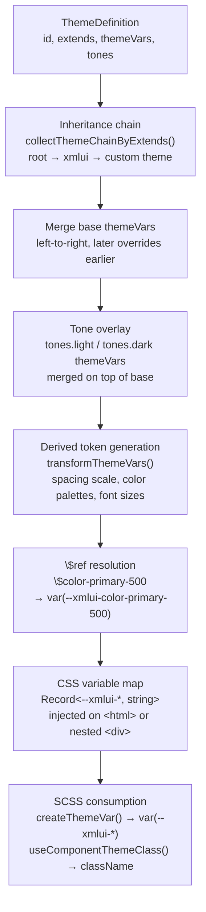

# Theming & Styling

XMLUI's theming system converts declarative theme definitions into CSS custom properties (`--xmlui-*`) that components consume via SCSS modules. Themes support inheritance, light/dark tone switching, responsive breakpoints, and part-based sub-element styling — all at runtime with no rebuild.

This document covers how themes are defined, compiled, applied, and extended.

<!-- DIAGRAM: ThemeDefinition → inheritance chain → tone overlay → derived tokens → $ref resolution → CSS variables → SCSS consumption -->



---

## How It Works at a Glance

1. A **ThemeDefinition** declares an `id`, optional `extends` parent(s), color tokens, and tone-specific overrides
2. At startup, `ThemeProvider` builds an **inheritance chain** and merges variables left-to-right
3. **Derived tokens** are generated automatically (spacing scales, color palettes, font sizes)
4. `$reference` values are resolved to `var(--xmlui-...)` CSS custom properties
5. Components declare their consumed variables in SCSS modules; `useComponentThemeClass()` injects the resolved values as a CSS class

---

## ThemeDefinition

Every theme is a `ThemeDefinition` object:

```typescript
interface ThemeDefinition {
  id: string;
  extends?: string | string[];        // parent theme(s)
  color?: string;                      // primary color hint
  resources?: Record<string, any>;     // fonts, images
  themeVars?: Record<string, string>;  // CSS variable definitions
  tones?: {
    light?: ThemeDefinitionDetails;    // { themeVars, resources }
    dark?: ThemeDefinitionDetails;
  };
}
```

The `themeVars` record maps variable names to values. Values can be:
- Raw CSS values: `"#3b82f6"`, `"16px"`, `"1rem"`
- `$references` to other variables: `"$color-primary-500"` → resolves to `var(--xmlui-color-primary-500)`

---

## Theme Inheritance

Themes form an inheritance chain via `extends`. The chain is resolved by `collectThemeChainByExtends()` in `extendThemeUtils.ts`:

```
[root] → [xmlui] → [xmlui-green]
                  → [xmlui-docs]
                  → [custom-theme]
```

- The **root** theme (in `themes/root.ts`) provides foundational design tokens: spacing, font sizes, color palettes, shadows, borders
- The **xmlui** theme extends root and sets brand-specific defaults
- All 10 built-in themes extend `xmlui`
- Custom themes can extend any theme

Variables merge left-to-right: later themes override earlier ones. Multiple inheritance (`extends: ["xmlui", "other"]`) processes parents in array order.

---

## Built-in Themes

| Theme ID | Description |
|----------|-------------|
| `xmlui` | Default (blue) |
| `xmlui-green` | Green accent |
| `xmlui-gray` | Neutral gray |
| `xmlui-orange` | Orange accent |
| `xmlui-purple` | Purple accent |
| `xmlui-cyan` | Cyan accent |
| `xmlui-red` | Red accent |
| `xmlui-blog` | Blog layout theme |
| `xmlui-web` | Marketing site theme |
| `xmlui-docs` | Documentation site theme |

All are defined in `themes/xmlui.ts` and extend the `xmlui` base theme.

---

## Theme Compilation

`ThemeProvider` uses `useCompiledTheme()` to produce the final CSS variable map. The steps:

### 1. Build the inheritance chain

`collectThemeChainByExtends(activeTheme, allThemes, componentDefaults)` walks the `extends` graph to produce a flat array from root to current theme.

### 2. Merge base themeVars

All `themeVars` in the chain are merged left-to-right. Component default theme variables (from `defaultThemeVars` in component metadata) are included in the merge.

### 3. Apply tone overrides

The active tone's variables (`tones.light.themeVars` or `tones.dark.themeVars`) are merged on top, overriding base values for tone-specific adjustments.

### 4. Generate derived tokens

The `transformThemeVars()` function auto-generates hundreds of tokens from seed values:

| Seed | Generated |
|------|-----------|
| `space-base` | 34 tokens: `space-0` through `space-96`, with fractional steps `space-0_5`, `space-1_5`, etc. (underscores replace dots) |
| `fontSize` | `const-fontSize-tiny` through `const-fontSize-9xl` (prefixed with `const-` so they don't scale further) |
| Each color family | 13 tones per family (0, 50, 100, ..., 950, 1000) as `const-color-{family}-{tone}`, plus alpha/derived variants |
| Button colors | `backgroundColor-Button-{variant}-{style}--{state}` for all combinations |
| Shorthand padding/margin | `paddingHorizontal` → `paddingLeft` + `paddingRight`, etc. |

### 5. Resolve $references

Any value starting with `$` is converted to a CSS `var()` reference:

```
$color-primary-500  →  var(--xmlui-color-primary-500)
```

The prefix is always `xmlui` (constant `THEME_VAR_PREFIX`).

### 6. Output

A flat `Record<string, string>` with `--xmlui-` prefixed keys, ready for CSS injection.

---

## Root Theme Design Tokens

The root theme (`themes/root.ts`) provides the foundation that all themes build upon:

**Spacing:** `space-base` seeds a scale from `space-0` (0) to `space-96` (24rem), with fractional steps using underscores: `space-0_5`, `space-1_5`, `space-2_5`, `space-3_5`.

**Font sizes:** A scale from `fontSize-tiny` (0.625rem) through `fontSize-9xl` (8rem), plus `const-fontSize-*` companions that don't scale.

**Colors:** 7 color families — `primary`, `secondary`, `info`, `success`, `warn`, `danger`, `surface`. Each family generates 13 tones (0, 50, 100, 200, ..., 950, 1000) as `const-color-{family}-{tone}`, plus runtime alpha and derived tone variants.

**Typography:** `fontWeight-*`, `fontFamily-*`, `lineHeight-*`, `letterSpacing-*` tokens.

**Effects:** `boxShadow-sm/md/lg/xl`, `borderRadius-*`, `outline-*` tokens.

**Layout:** `maxWidth-xs` through `maxWidth-xxl` for container sizing.

---

## Tone Management (Light/Dark)

XMLUI supports two tones: `light` and `dark`. Tones are defined per-theme in the `tones` field and applied as an overlay on top of base variables.

### Switching tones

The `ThemesContext` exposes:

```typescript
const { activeThemeTone, setActiveThemeTone, toggleThemeTone } = useThemes();
```

The `ToneSwitch` component provides a ready-made toggle with sun/moon icons.

### How tones merge

```
base themeVars → tone-specific themeVars (overrides)
```

Only the variables present in `tones[tone].themeVars` are overridden; the rest remain from the base merge.

---

## Theme Variable Naming Convention

Theme variable names follow a structured pattern:

```
property[-partNameOrScreenSize][-ComponentName][-variantName][--stateName]
```

| Segment | Case convention | Notes |
|---------|----------------|-------|
| `property` | camelCase | Required first segment: `backgroundColor`, `fontSize`, `color` |
| `partName` or `screenSize` | camelCase / lowercase | `xs`/`sm`/`md`/`lg`/`xl`/`xxl` = screen size; anything else = part name |
| `ComponentName` | PascalCase | Distinguishes component scope (starts uppercase) |
| `variantName` | camelCase | Starts lowercase; follows component name |
| `stateName` | camelCase after `--` | Follows `--` delimiter; can repeat for compound states |

### Examples

| Variable | Breakdown |
|----------|-----------|
| `backgroundColor-Button` | property + component |
| `fontSize-sm-Text` | property + screenSize + component |
| `backgroundColor-label-Button` | property + part + component |
| `backgroundColor-Button-primary` | property + component + variant |
| `borderColor-Input--focus` | property + component + state |
| `backgroundColor-Button-primary-solid--hover` | property + component + variant + style + state |

### Naming pitfalls

- Variants must be camelCase — `Primary` (PascalCase) would be parsed as a ComponentName
- `--` introduces state names only — structural segments use single `-`
- Screen size tokens (`sm`, `md`, etc.) in the part position generate responsive `@media` rules, not named parts

---

## SCSS Module Integration

Every visual component uses an SCSS module to declare which theme variables it consumes.

### SCSS boilerplate

```scss
@use "../../components-core/theming/themes" as t;

$themeVars: ();
@function createThemeVar($componentVariable) {
  $themeVars: t.appendThemeVar($themeVars, $componentVariable) !global;
  @return t.getThemeVar($themeVars, $componentVariable);
}

// Declare consumed variables
$backgroundColor-Foo: createThemeVar("backgroundColor-Foo");
$textColor-Foo: createThemeVar("textColor-Foo");

// Use them in CSS
.component {
  background-color: $backgroundColor-Foo;
  color: $textColor-Foo;
}

// CRITICAL: Export the variable map so the renderer can collect them
:export {
  themeVars: t.json-stringify($themeVars);
}
```

The `createThemeVar()` function:
1. Registers the variable name in the `$themeVars` map
2. Returns a `var(--xmlui-variableName)` CSS reference

The `:export` block serializes the map as JSON so the renderer can read it at runtime via `import styles from "./Foo.module.scss"`.

### Renderer side

```typescript
import styles from "./Foo.module.scss";
import { parseScssVar } from "../../components-core/theming/utils";

// In component metadata:
themeVars: parseScssVar(styles.themeVars),  // parse exported JSON
defaultThemeVars: {
  "backgroundColor-Foo": "transparent",     // fallback values
  "textColor-Foo": "inherit",
},
```

---

## useComponentThemeClass()

This hook is the bridge between theme definitions and rendered components. It:

1. Reads the component's declared `themeVars` and `defaultThemeVars` from metadata
2. Collects shared variables from `themeVarContributorComponents` (optional cross-component sharing)
3. Looks up resolved values from the active `themeScope.themeVars`
4. Builds a CSS variable object (`{ "--xmlui-backgroundColor-Foo": "#fff" }`)
5. Passes it to `useStyles()`, which returns a hashed className

### Usage in native components

```typescript
const themeClassName = useComponentThemeClass(descriptor);
return (
  <div className={classnames(themeClassName, styles.component)}>
    {children}
  </div>
);
```

### ThemedX wrapper pattern

Most components use a `Themed<Name>` wrapper that separates theming from rendering logic:

```typescript
const ThemedFoo = memo(
  forwardRef<HTMLDivElement, ThemedFooProps>(({ children, ...props }, ref) => {
    const themeClassName = useComponentThemeClass(descriptor);
    return (
      <NativeFoo
        ref={ref}
        className={classnames(themeClassName, styles.component)}
        {...props}
      >
        {children}
      </NativeFoo>
    );
  })
);
```

The `wrapComponent()` call receives `ThemedFoo`, not `NativeFoo`.

---

## Style Injection (useStyles)

`useStyles()` in `StyleContext.tsx` handles CSS injection:

- Style objects are hashed for **deduplication** — identical style objects share one `<style>` element
- CSS is injected via `<style data-style-hash="...">` elements
- `@layer dynamic { ... }` organizes cascade precedence
- **Reference counting** ensures cleanup on component unmount
- Supports `ShadowRoot` as an injection target (for web components)

---

## Theme Variable Injection Reduction (Nested Themes)

An XMLUI app can have multiple `<Theme>` elements nested inside each other. Without optimization, every nested theme would inject the entire compiled variable set as CSS custom properties on its wrapper div — hundreds of variables multiplied by nesting depth. The framework avoids this through a 3-layer filtering system in `ThemeNative.tsx`.

### Layer 1: The decision gate

Before injecting anything, the theme checks whether full compilation is even needed:

```typescript
const needsCompiledVars =
  tone !== undefined ||           // switching to a different tone
  id !== undefined ||             // switching to a different theme
  Object.keys(themeVars).some((key) => !parseHVar(key)?.component);  // base vars present
```

If ALL three conditions are false — meaning this is a layout-only override like `themeVars={{ "width-navPanel-App": "250px" }}` — then **zero compiled variables** are placed on the wrapper div. Only the explicit override is injected.

**Why this matters:** CSS variables cascade down the DOM. If a nested theme div sets `--xmlui-color-primary-500`, it shadows the same variable from `<html>`. When the user toggles tone (light ↔ dark), `<html>` updates correctly, but children of the nested theme inherit the stale value from the closer ancestor div. By not injecting unnecessary variables, the framework ensures tone-switching works correctly through any nesting depth.

### Layer 2: Component-based filtering

When compilation IS needed (tone or theme change), the framework doesn't inject everything. Each compiled variable is checked against the component registry:

```typescript
const rawKey = key.replace(/^--[^-]+-/, "");     // strip --xmlui- prefix
const componentName = parseHVar(rawKey)?.component;
const allowed =
  !componentName ||                                // base vars → always
  registeredComponent?.isCompoundComponent ||       // user-defined components → always
  componentName === "Input" ||                      // special built-ins → always
  componentName === "Heading" ||
  componentName === "Footer" ||
  inComponentThemeVars;                             // template-referenced → allowed
```

`parseHVar()` examines the variable name structure. If it contains a PascalCase segment (e.g., `backgroundColor-Button`), that's a component-scoped variable. Variables without a component suffix (`color-primary-500`) are base variables and always pass.

**What gets filtered out:** Component-specific variables for native built-in components that aren't in the special list (Input, Heading, Footer) and aren't referenced in any user-defined component template. For example, `backgroundColor-Button-primary-solid--hover` is filtered if no descendant compound component references Button variables.

The `componentThemeVars` set is populated automatically when compound (user-defined) components are registered — `generateUdComponentMetadata` collects all `$variable` references from templates.

### Layer 3: Explicit overrides always pass

Regardless of the filtering above, any variable explicitly provided in the `themeVars` prop is always injected:

```typescript
Object.entries(themeVars).forEach(([key, value]) => {
  filteredThemeCssVars[`--${THEME_VAR_PREFIX}-${key}`] = value;
});
```

This ensures user intent is never lost.

### Practical examples

| Markup | What gets injected |
|--------|-------------------|
| `<Theme themeVars={{ "width-navPanel-App": "250px" }}>` | Only the one explicit override — no compiled vars at all |
| `<Theme tone="dark">` | Filtered set: base vars + compound component vars + special built-ins + template-referenced vars |
| `<Theme id="xmlui-green">` | Filtered set for the new theme's compiled output |
| `<Theme themeVars={{ "color-primary": "red" }}>` | Full filtered set — the base var triggers compilation |

---

## Responsive Layout

### Breakpoints

| Name | Min width | Usage |
|------|-----------|-------|
| `xs` | 0 (base) | Mobile-first default |
| `sm` | 576px | Small tablets |
| `md` | 768px | Tablets |
| `lg` | 992px | Desktops |
| `xl` | 1200px | Large desktops |
| `xxl` | 1400px | Extra large |

### Responsive properties in markup

Append a breakpoint suffix to any layout property:

```xml
<Stack
  width="100%"
  width-sm="400px"
  width-md="600px"
  padding="$space-2"
  padding-md="$space-4"
/>
```

The base property applies from `xs` up; suffixed properties generate `@media (min-width: Npx)` overrides.

### Star sizing

A number followed by `*` creates a flex layout shorthand:

```xml
<HStack>
  <Box width="200px" />    <!-- fixed width -->
  <Box width="1*" />       <!-- flex: 1, flexShrink: 1 -->
  <Box width="2*" />       <!-- flex: 2, flexShrink: 1 -->
</HStack>
```

### Shorthand expansion

| Shorthand | Expands to |
|-----------|-----------|
| `paddingHorizontal` | `paddingLeft` + `paddingRight` |
| `paddingVertical` | `paddingTop` + `paddingBottom` |
| `marginHorizontal` | `marginLeft` + `marginRight` |
| `marginVertical` | `marginTop` + `marginBottom` |
| `borderHorizontal` | `borderLeft` + `borderRight` |
| `borderVertical` | `borderTop` + `borderBottom` |

### Layout property modes

Components declare which layout properties apply via the `layoutPropertyMode`:

| Mode | Includes |
|------|----------|
| `dims` | width, minWidth, maxWidth, height, minHeight, maxHeight |
| `spacing` | dims + gap, padding (all), margin (all) |
| `all` (default) | Everything: dims, spacing, borders, radii, typography, transforms |

---

## Part-Based Styling

Parts target sub-elements within a component (e.g., the label of an Input, the icon of a Button).

### Declaring parts

Components declare parts in metadata:

```typescript
parts: {
  label: { ... },
  input: { ... },
}
```

### Applying parts in native code

```typescript
import { partClassName, PART_LABEL } from "../../components-core/parts";

<label className={partClassName(PART_LABEL)}>...</label>
```

`partClassName()` applies a `data-part-id` attribute used for CSS targeting.

### Theme variables for parts

Part names appear in the second segment of the variable name:

```
color-label-Input         // property: color, part: label, component: Input
backgroundColor-input-Input  // property: backgroundColor, part: input, component: Input
```

### Layout properties on parts

In markup, layout properties can target specific parts:

```xml
<Input color-label="$color-primary-600" padding-input="$space-2" />
```

### Default part

Components can designate a `defaultPart` in metadata. Properties without a part qualifier are routed to this default part rather than the root element.

---

## Runtime Theme Switching

`ThemeProvider` wraps the app and provides two contexts:

### ThemeContext (`useTheme()`)

For accessing compiled CSS variables and resources:

```typescript
const { themeCssVars, getThemeVar, getResourceUrl, fontLinks } = useTheme();
```

### ThemesContext (`useThemes()`)

For switching themes and tones:

```typescript
const {
  activeThemeId,
  activeThemeTone,
  setActiveThemeId,    // switch to a different theme
  setActiveThemeTone,  // set "light" or "dark"
  toggleThemeTone,     // flip between light and dark
  themes,              // array of all registered ThemeDefinitions
} = useThemes();
```

Changing the active theme triggers recompilation — the full pipeline runs again, and all component theme classes update automatically via React context propagation.

---

## Key Implementation Details

**CSS variable prefix:** All framework variables use `--xmlui-` (constant `THEME_VAR_PREFIX = "xmlui"`).

**Component default part:** The constant `COMPONENT_PART_KEY = "-component"` distinguishes the root element from named parts when both are styled.

**No circular reference check:** `$reference` resolution doesn't detect cycles — circular references produce invalid CSS (`var(--xmlui-...)` pointing to itself).

**Style deduplication:** `useStyles()` hashes style objects; identical variable sets across component instances share a single `<style>` element.

**Layer ordering:** Injected styles use `@layer dynamic` to control cascade precedence relative to SCSS module styles.
