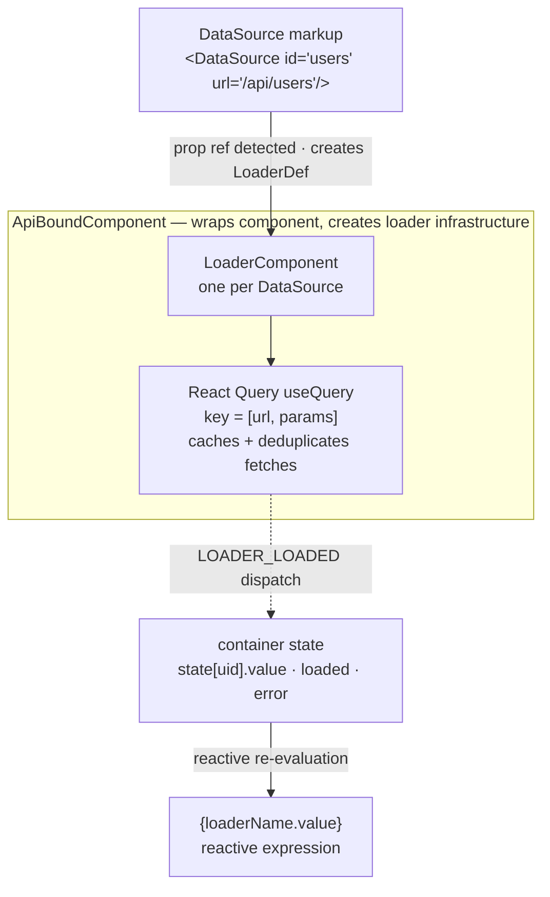

# Data Operations & Loaders

XMLUI provides a declarative data layer built on top of React Query. Components never call `fetch()` directly — instead they declare their data needs in markup, and the framework handles lifecycle, caching, error states, and cache invalidation automatically.

This document covers the internals: how `DataSource` and `APICall` work under the hood, how the loader lifecycle integrates with the container state system, and how file operations are handled.

```xml
<!-- DataSource is declared with an id on the container -->
<Stack>
  <DataSource id="users" url="/api/users" />

  <!-- ApiBoundComponent detects the {users.value} prop ref and wires the loader -->
  <List data="{users.value}">
    <Text>{$item.name}</Text>
  </List>
</Stack>
```

<!-- DIAGRAM: DataSource markup → ApiBoundComponent → LoaderComponent → React Query useQuery → LOADER_LOADED dispatch → container state → {loaderName.value} -->



---

## Background: React Query

XMLUI's data layer is built on [React Query](https://tanstack.com/query) (`@tanstack/react-query`). A brief orientation:

- **Query cache** — React Query maintains an in-memory cache of all fetched data, keyed by an array (`queryKey`). Multiple components requesting the same key share one fetch and one cached result.
- **`useQuery`** — the primary hook for fetching data. Takes a `queryKey` and a `queryFn` (async function). Returns `{ data, isLoading, error, refetch, ... }`. Re-fetches automatically when the key changes.
- **`useInfiniteQuery`** — variant for paginated data. Accumulates pages and provides `fetchNextPage()` / `fetchPreviousPage()`.
- **Cache invalidation** — `queryClient.invalidateQueries(predicate)` marks matching cache entries as stale, causing components that use them to re-fetch in the background.
- **Structural sharing** — React Query compares new response data to the previous version and preserves object references for unchanged parts, so only genuinely changed data causes React re-renders.
- **No mutations hook** — XMLUI does not use React Query's `useMutation`. Mutations go through its own `Actions.callApi()` path, which calls `invalidateQueries` after success.

XMLUI wraps these primitives so that app developers never interact with React Query directly — they use `DataSource` and `APICall` in markup instead.

---

## Two Categories of Data Components

| Category | Components | When executed | Underlying mechanism |
|----------|-----------|--------------|---------------------|
| **Queries** | `DataSource` | Automatically on mount and when dependencies change | React Query `useQuery` / `useInfiniteQuery` |
| **Mutations** | `APICall`, `FileUpload`, `FileDownload` | Manually, triggered by user events | Custom fetch via `Actions.callApi()` |

`DataSource` is designed and intended for retrieving data. While it technically supports any HTTP method (including POST) via its `method` and `body` props, using it for state-changing operations is discouraged — those belong in `APICall`. The distinction matters because `DataSource` results are cached and automatically re-fetched on dependency changes, which is the wrong behavior for mutations.

---

## The Transform Layer: ApiBoundComponent

Neither `DataSource` nor `APICall` render as visible elements. Instead, they're handled by `ApiBoundComponent` — a transform layer that sits between the XMLUI renderer and the actual native component.

When the renderer encounters a component node, it checks whether any props reference `DataSource` definitions or any events reference `APICall`/`FileUpload`/`FileDownload`. If so, it wraps the node in `ApiBoundComponent` instead of rendering it directly.

**What ApiBoundComponent does:**

For each `DataSource` prop:
1. Creates a `LoaderDef` with a unique `uid`
2. Rewrites the prop to `{ loaderUid.value }` so the component receives the loaded data

For each `APICall` event:
1. Generates a JavaScript string that calls `Actions.callApi(...)` with all the APICall's configuration baked in
2. Injects this as an event handler for the parent component

The generated event handler code is a string that's later evaluated by the scripting engine when the event fires. This is how declarative markup becomes imperative event handling without the component author ever seeing it.

---

## Loader Lifecycle

When a container mounts with a `LoaderDef`, `LoaderComponent` renders inside the container tree. Here's the full lifecycle:

```
1. Container mounts
   └── LoaderComponent mounts for each loader uid
       └── Loader.tsx calls useQuery({
             queryKey: [uid, params],
             queryFn: async (signal) => restApiProxy.fetch(url, ...),
             ...
           })

2. React Query begins fetch
   └── LoaderComponent dispatches: LOADER_IN_PROGRESS_CHANGED(uid, true)
   └── Container state: state[uid].inProgress = true

3. Fetch completes
   └── select() applies: resultSelector → transformResult
   └── LoaderComponent dispatches: LOADER_LOADED(uid, data, pageInfo, responseHeaders)
   └── Container state: state[uid].value = data, loaded = true, inProgress = false

4. On error:
   └── LoaderComponent dispatches: LOADER_ERROR(uid, error)
   └── Container state: state[uid].error = error, loaded = true, inProgress = false

5. Component accesses data via {loaderName.value}
   └── Reactive re-evaluation when state[uid] changes
```

---

## Container State for Loaders

Each loader `uid` occupies a dedicated slot in the container's state object. The container reducer handles transitions:

```typescript
// state[uid] shape:
{
  value: any,                              // Transformed response data
  byId: Record<string, any> | undefined,  // Index by $id (arrays only)
  inProgress: boolean,                     // Currently fetching
  isRefetching: boolean,                   // Background refetch in progress
  loaded: boolean,                         // True after first fetch (success or error)
  error: Error | null,
  pageInfo?: {                             // PageableLoader only
    hasPrevPage, isFetchingPrevPage,
    hasNextPage, isFetchingNextPage
  },
  responseHeaders?: Record<string, string>,
}
```

**Transition table:**

| Reducer action | Changes |
|----------------|---------|
| `LOADER_IN_PROGRESS_CHANGED` | `inProgress = payload.inProgress` |
| `LOADER_IS_REFETCHING_CHANGED` | `isRefetching = payload.isRefetching` |
| `LOADER_LOADED` | `value`, `byId` (if array + `$id`), `inProgress = false`, `loaded = true`, `pageInfo`, `responseHeaders` |
| `LOADER_ERROR` | `error`, `inProgress = false`, `loaded = true` |

Note: `loaded` becomes `true` on both success AND error. Always check `error` to distinguish outcomes.

---

## React Query Integration

XMLUI wraps React Query with specific configuration choices:

**Standard queries (`useQuery`):**
```typescript
useQuery({
  queryKey: [uid, extractParam(state, loader.props, appContext)],
  queryFn: async ({ signal }) => loaderFn(signal),
  select: (data) => applyResultSelectorAndTransform(data),
  structuralSharing: true,  // preserves unchanged object references
  enabled: initialized,
  retry: false,             // no automatic retries
})
```

**Paginated queries (`useInfiniteQuery`):**

Used when `prevPageSelector` or `nextPageSelector` is set on a `DataSource`. React Query manages the page stack; the loader flattens pages before dispatching to container state.

**Cache key structure:**

Keys are built by `DataLoaderQueryKeyGenerator`:
```
[baseUrl, queryParams?, apiUrl?, body?, rawBody?]
```

Example: `GET /api/users?page=2` with `apiUrl=https://api.example.com` → key: `["/api/users", { page: 2 }, "https://api.example.com"]`

The cache key includes all query parameters so that different parameter combinations get independent cache entries. This is also how dependent queries work.

---

## Dependent Queries

There is no explicit `dependsOn` prop. Dependency between loaders is implicit through expressions in the `url`:

```xml
<DataSource id="user" url="/api/users/{userId}" />
<DataSource id="posts" url="/api/posts?userId={user.value.id}" />
```

When `user.value.id` is `undefined` (before `user` loads), the cache key for `posts` contains `undefined`. Once `user.value.id` becomes a real value, the key changes and React Query automatically triggers a fetch. Structural sharing ensures that only the changed parts of the response tree cause re-renders.

**Caveat:** if `user.value.id` is `undefined`, `posts` will still fetch — with `userId=undefined` in the URL. Use `when="{!!user.loaded}"` on the dependent `DataSource` to prevent premature fetches.

---

## Result Processing Pipeline

Raw HTTP responses go through a two-step transformation before reaching component markup:

```
Raw response
  ↓ resultSelector  — extracts a subtree
  ↓ transformResult — applies a custom function
  ↓ structural sharing (React Query preserves unchanged refs)
  ↓ LOADER_LOADED dispatch → state[uid].value
```

### resultSelector

Extracts a nested property from the response:

```xml
<DataSource id="products" url="/api/products" resultSelector="data.items" />
<!-- Response: { data: { items: [...] }, meta: {...} }
     products.value = [...] -->
```

The string `"data.items"` is converted to `{$response.data.items}` internally. An explicit expression form also works: `resultSelector="{$response.data.items}"`.

### transformResult

Applies an arbitrary function to the (post-selector) data:

```xml
<DataSource
  id="products"
  url="/api/products"
  transformResult="(items) => items.filter(i => i.active).sort((a,b) => a.name.localeCompare(b.name))"
/>
```

`transformResult` is async-capable — it may return a Promise.

---

## Polling

`DataSource` implements polling via `setInterval` (not React Query's built-in `refetchInterval`):

```xml
<DataSource id="status" url="/api/status" pollIntervalInSeconds="5" />
```

The interval calls `refetch()` every N seconds. The interval is cleared on unmount. Polling and manual `refetch()` calls are independent — calling `statusLoader.refetch()` in markup doesn't reset the poll interval.

---

## APICall: Mutation Execution

`APICall` is not a visible component and doesn't render anything. It's a declarative description of an HTTP mutation. Execution happens when `.execute()` is called on its id, or when it appears inline in an event:

```xml
<APICall id="createUser" url="/api/users" method="POST" body="{formData}" />
<Button onClick="createUser.execute()">Create</Button>
```

### Event chain

Events fire in sequence during an APICall execution:

| Event | When | Context variables |
|-------|------|------------------|
| `beforeRequest` | Before the request is sent | `$param`, `$params`; return `false` to cancel |
| `success` | After successful response | `$result` (response data) |
| `error` | After failure | `$error` (error object) |
| `progress` | During long operations | `$progress` (0–100), `$statusData` |

### Cache invalidation

The `invalidates` prop causes React Query to re-fetch matching cached queries after a successful mutation:

```xml
<APICall url="/api/users" method="POST" invalidates="/api/users" />
```

Invalidation uses a URL prefix predicate — `invalidates="/api/users"` also invalidates `/api/users?page=2`. Omitting `invalidates` entirely invalidates ALL cached queries, which triggers a full re-fetch of every `DataSource` in the app.

### Optimistic updates

For snappy UIs, `updates` + `optimisticValue` pre-populate the cache before the server responds:

```xml
<APICall
  id="addItem"
  url="/api/items"
  method="POST"
  body="{newItem}"
  updates="/api/items"
  optimisticValue="{ id: Date.now(), ...newItem, _optimistic: true }"
/>
```

XMLUI immediately applies the optimistic value to all matching cached queries. On success, it triggers a refetch to replace the optimistic entry with the real server response. On error, it rolls back to the pre-mutation snapshot.

### Confirmation dialogs

`confirmTitle` + `confirmMessage` display a built-in confirmation dialog before executing. The user must confirm or the execution is cancelled:

```xml
<APICall
  url="/api/items/{item.id}"
  method="DELETE"
  confirmTitle="Delete item?"
  confirmMessage="This cannot be undone."
  confirmButtonLabel="Delete"
  cancelButtonLabel="Cancel"
/>
```

### Built-in notifications

Progress/completion/error notifications can be shown as toasts automatically:

```xml
<APICall
  url="/api/export"
  method="POST"
  inProgressNotificationMessage="Generating export..."
  completedNotificationMessage="Export complete!"
  errorNotificationMessage="Export failed."
/>
```

---

## Deferred (Long-Running) Operations

Some backends accept a request and return a job ID, then process asynchronously. APICall supports this pattern via deferred polling:

```xml
<APICall
  id="processJob"
  url="/api/jobs"
  method="POST"
  body="{jobConfig}"
  pollUrl="/api/jobs/{$result.jobId}/status"
  pollIntervalMs="2000"
  maxPollAttemptsBeforeFail="30"
  completionCondition="$statusData.status === 'done'"
  progressExtractor="$statusData.percentComplete"
/>
```

The initial request fires, then XMLUI polls `pollUrl` every `pollIntervalMs` milliseconds until `completionCondition` evaluates to true (or max attempts are reached). The `progress` event fires with `$progress` after each poll.

---

## File Operations

File operations are triggered as event actions and never render visible output.

### FileUpload

```xml
<FileUploadDropZone>
  <event name="uploaded">
    <FileUpload
      url="/api/upload"
      file="{$param}"
      fieldName="attachment"
      chunkSizeInBytes="1048576"
      invalidates="/api/files"
    />
  </event>
</FileUploadDropZone>
```

`$param` in the `uploaded` event is the `File` object. The upload uses `FormData` by default (`asForm: true`). For large files, `chunkSizeInBytes` splits the file into sequential chunk requests; progress is reported via the `progress` event after each chunk.

### FileDownload

```xml
<Button>
  Export
  <event name="click">
    <FileDownload url="/api/export" fileName="report.csv" />
  </event>
</Button>
```

XMLUI chooses between two strategies based on the request:

| Condition | Strategy | Reason |
|-----------|----------|--------|
| Simple GET, no custom headers | Iframe injection | Browser handles download natively, shows OS progress |
| POST, custom headers, or mocked | `fetch()` → `URL.createObjectURL` → anchor click | Required for authenticated or non-GET downloads |

---

## Loader Type Selection

XMLUI selects the appropriate loader implementation based on DataSource configuration:

| Condition | Loader used |
|-----------|------------|
| `prevPageSelector` or `nextPageSelector` set | `PageableLoader` (useInfiniteQuery) |
| `mock` prop set | `MockLoaderRenderer` |
| POST method with body | `ExternalDataLoader` |
| Default | `DataLoader` (useQuery) |

---

## Key Takeaways

1. **`DataSource` is React Query `useQuery` with a container integration layer** — all the caching, deduplication, and background refetch behaviors of React Query apply.

2. **`loaded = true` does not mean success** — it means the first fetch attempt completed. Check `error` to distinguish success from failure.

3. **Dependency is implicit via URL expressions** — there's no `dependsOn` prop. A DataSource whose URL references another loader's value will automatically refetch when that value becomes available.

4. **`invalidates` without a URL is a global reset** — this is sometimes intentional but usually a mistake; always specify the URL pattern you want to invalidate.

5. **`ApiBoundComponent` is invisible infrastructure** — you never reference it directly, but every component that has a DataSource prop or APICall event is wrapped by it at render time.
