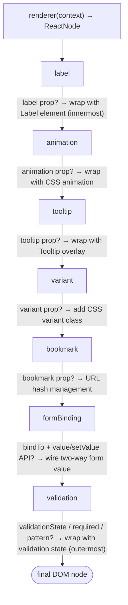

# Behaviors System

Every component in XMLUI can gain additional capabilities automatically — without the component author writing a single line of extra code. This capability is delivered by **behaviors**: small, focused objects that wrap a rendered component with new functionality when specific props are present.

This document explains how the behavior system works internally, covers all eight framework behaviors, and shows how extension packages can contribute their own.

<!-- DIAGRAM: renderer() → renderedNode → [label? → wrap] → [animation? → wrap] → [tooltip? → wrap] → [variant? → wrap] → [bookmark? → wrap] → [formBinding? → wrap] → [validation? → wrap] → final DOM node -->



---

## What Is a Behavior?

A behavior is an object that implements the `Behavior` interface:

```typescript
interface Behavior {
  metadata: BehaviorMetadata;
  canAttach: (context: RendererContext<any>, node: ComponentDef, metadata: ComponentMetadata) => boolean;
  attach:    (context: RendererContext<any>, node: ReactNode, metadata?: ComponentMetadata) => ReactNode;
}
```

The contract is simple:

1. **`canAttach()`** — inspects the component's runtime definition and metadata and returns `true` if this behavior should apply.
2. **`attach()`** — receives the current `ReactNode` and returns a new one. Typically this wraps the node in another React component, but it can also clone the node with `React.cloneElement()` to inject CSS classes or event handlers without adding a DOM wrapper element.

The `metadata` object describes the behavior's name, the props that trigger it, and the full set of props it consumes. This metadata is used by documentation generation tooling.

### Why behaviors exist

Without behaviors, cross-cutting features like "show a label above this input" or "animate this component on entry" would require every component to handle those concerns individually. Instead, behaviors let each component focus entirely on its own purpose — `TextBox` renders a text input, `Card` renders a card — and the behavior system adds the rest declaratively.

---

## How Behaviors Apply

After the component's renderer function produces its initial `ReactNode`, `ComponentAdapter` applies behaviors in sequence:

```
renderer() → node₀
  labelBehavior.canAttach()?     → yes → node₁ = label.attach(node₀)
  animationBehavior.canAttach()? → yes → node₂ = animation.attach(node₁)
  tooltipBehavior.canAttach()?   → no  → node₂ (unchanged)
  ...
  validationBehavior.canAttach()? → yes → node_final = validation.attach(...)
```

The result is a tree of nested wrappers. Registration order is innermost → outermost: `label` registers first and wraps closest to the real component; `validation` registers last and is the outermost wrapper in the DOM.

### Two absolute skip conditions

Behaviors never attach to:

- **Compound components** — user-defined components written as `.xmlui` files. These are already composed from multiple XMLUI elements, and wrapping their rendered output would produce incorrect nesting.
- **Non-visual components** — components with `nonVisual: true` in their metadata (e.g., `DataSource`, `APICall`). These produce no DOM output, so wrapping them makes no sense.

---

## The Seven Framework Behaviors

The framework registers seven behaviors in `ComponentProvider.tsx`, in this exact order:

| Order | Name | Trigger | What it does |
|-------|------|---------|--------------|
| 1 | `label` | `label` prop on instance (with metadata rule — see below) | Wraps in `<ItemWithLabel>` with positioning, width, and required indicator |
| 2 | `animation` | `animation` prop | Wraps in `<Animation>` for CSS entry/exit animations |
| 3 | `tooltip` | `tooltip` or `tooltipMarkdown` | Wraps in tooltip overlay displayed on hover |
| 4 | `variant` | `variant` prop (non-built-in values only) | Injects variant-specific CSS variables via a class wrapper |
| 5 | `bookmark` | `bookmark` prop | Adds scroll-to-anchor navigation |
| 6 | `formBinding` | `bindTo` prop + value/setValue APIs | Connects the component to the enclosing `<Form>`, handles label rendering |
| 7 | `validation` | `bindTo` + value/setValue, or `FormItem` type | Adds validation rules and displays inline feedback |

> **Note on PubSub:** `PubSubBehavior.tsx` exists in `components-core/behaviors/` but is not currently registered. It is not active in the framework.

---

### 1. Label Behavior

Labels are the most subtle behavior because the rule for attachment is two-sided:

```
attach if: instance has a `label` prop
       AND component metadata does NOT declare `label` in its props
```

The second condition is the key: components that render their own label (Checkbox, Radio, Toggle) declare `label` in their metadata as a signal — "I handle this myself." The behavior sees the declaration and steps aside. Components that delegate labeling (TextBox, Select, NumberBox) simply don't declare `label` in metadata, so the behavior attaches.

**Compact inline mode.** The label can appear at any of six positions: `start`, `end`, `top`, `bottom`, `before`, `after`. The `"before"` and `"after"` values are writing-direction-aware. Components like Checkbox and Switch that benefit from a snug label opt in with `compactInlineLabel: true` in their metadata — this causes the container to shrink to `fit-content` instead of stretching to fill the row.

**Label and form binding.** When `formBindingBehavior` also attaches to the same component (because it has `bindTo`), `formBindingBehavior` takes over label rendering entirely. `labelBehavior` explicitly checks for this and skips, preventing double-wrapping.

---

### 2. Animation Behavior

Wraps the component in an `<Animation>` component that applies a CSS animation class on mount (and optionally on unmount).

```xmlui
<Card animation="fade-in" animationOptions="duration: 500; delay: 200" />
```

`animationOptions` is a semicolon-separated string of key-value pairs: `duration`, `delay`, `iterations`, `direction`.

**ModalDialog special case.** ModalDialog has its own internal animation support. When the animation behavior detects a `ModalDialog`, instead of wrapping it, it clones the node and injects `externalAnimation={true}`. This tells the dialog to defer to external animation control rather than run its own.

---

### 3. Tooltip Behavior

Wraps the component in a tooltip overlay triggered on hover.

```xmlui
<Button label="Save" tooltip="Saves all changes immediately" tooltipOptions="right; delayDuration: 800" />
<Button label="Help" tooltipMarkdown="**Bold** description with a [link](https://example.com)" />
```

The `tooltipOptions` string controls side (`top`, `right`, `bottom`, `left`), alignment, and delay. `tooltipMarkdown` renders markdown content inside the tooltip.

---

### 4. Variant Behavior

Allows themes to define custom component variants beyond the built-in set. When a component has a `variant` prop whose value isn't one of the component's pre-defined variants, the behavior generates a CSS class with variant-specific variable references.

For example, `variant="premium"` on a Button produces:

```css
.variant-class {
  color:            var(--xmlui-color-Button-premium,           var(--xmlui-color-Button));
  background-color: var(--xmlui-backgroundColor-Button-premium, var(--xmlui-backgroundColor-Button));
}
```

Each variable falls back to the component's base variable if no variant-specific value is defined in the theme. The theme then only needs to define `--xmlui-backgroundColor-Button-premium` to make `variant="premium"` visually distinct.

**Skip logic:** For `Button`, built-in variants (`solid`, `outlined`, `ghost`) bypass this behavior — they're handled by the component itself. For `Badge`, built-in badge variants are similarly excluded.

---

### 5. Bookmark Behavior

Adds scroll-to-anchor support. Components with a `bookmark` prop can be targeted by URL hash navigation:

```xmlui
<Heading level="2" bookmark="section-intro">Introduction</Heading>
```

Navigating to `#section-intro` smoothly scrolls the page to that component.

---

### 6. Form Binding Behavior

Connects an input component directly to an enclosing `<Form>` using the `bindTo` prop, without needing a `<FormItem>` wrapper. To attach, the component must both declare `bindTo` in its markup and expose `value`/`setValue` in its API.

```xmlui
<Form>
  <TextBox bindTo="email" label="Email" required="true" />
</Form>
```

The behavior wraps the component in `<FormBindingWrapper>`, which:
- Reads the field value from form state and passes it to the component
- Writes the component's value changes back to form state
- Handles label rendering (taking over from `labelBehavior`) if label props are present

---

### 7. Validation Behavior

Adds validation rules and inline error feedback. Attaches to the same components as `formBinding` (those with `bindTo` + value/setValue APIs) and also to `FormItem` components.

Validation props supported: `required`, `minLength`, `maxLength`, `minValue`, `maxValue`, `pattern`, `regex`, plus `*InvalidMessage` and `*Severity` variants for each rule.

---

## Registration Architecture

All behaviors are registered centrally in `ComponentRegistry`, which lives in `ComponentProvider`. The registry stores them in a plain array; `getBehaviors()` returns the array in order.

```typescript
// ComponentProvider.tsx — ComponentRegistry constructor
this.registerBehavior(labelBehavior);
this.registerBehavior(animationBehavior);
this.registerBehavior(tooltipBehavior);
this.registerBehavior(variantBehavior);
this.registerBehavior(bookmarkBehavior);
this.registerBehavior(formBindingBehavior);
this.registerBehavior(validationBehavior); // outermost wrapper

// External behaviors appended after all framework behaviors
contributes.behaviors?.forEach((behavior) => {
  this.registerBehavior(behavior);
});
```

### Positioned Registration

For cases where an external behavior must be inserted at a specific point in the sequence, `registerBehavior` supports `location` and `position` parameters:

```typescript
registerBehavior(myBehavior, "before", "animation");  // Insert before animation
registerBehavior(myBehavior, "after",  "tooltip");    // Insert after tooltip
```

`position` is matched against `behavior.metadata.name`. If not found, the behavior appends at the end.

---

## Contributing a Custom Behavior

Any extension package can add behaviors via the `ContributesDefinition`:

```typescript
// packages/my-package/src/index.tsx
import { myBehavior } from "./behaviors/MyBehavior";

export default {
  namespace: "MyPackage",
  components: [myComponentRenderer],
  behaviors: [myBehavior],
};
```

A minimal behavior implementation:

```typescript
import type { Behavior } from "xmlui/src/components-core/behaviors/Behavior";

export const myBehavior: Behavior = {
  metadata: {
    name: "myBehavior",
    friendlyName: "My Behavior",
    description: "Adds custom enhancement when myProp is present.",
    triggerProps: ["myProp"],
    props: {
      myProp: {
        valueType: "string",
        description: "Activates the custom behavior.",
      },
    },
  },

  canAttach: (context, node) => {
    const val = context.extractValue(node.props?.myProp, true);
    return !!val;
  },

  attach: (context, node) => {
    const val = context.extractValue(context.node.props?.myProp, true);
    return <MyWrapper config={val}>{node}</MyWrapper>;
  },
};
```

**Key points:**
- `canAttach` receives the `ComponentDef` (the parsed XML node with props as-declared in markup) — not resolved values. Use `context.extractValue(prop, true)` to evaluate expressions.
- `attach` should read its configuration from `context.node.props` (the component definition), not from the `node` ReactNode argument — that's the rendered output, which has no props to read.
- Return a valid `ReactNode`. If you don't need to wrap, return `node` unchanged.

### Condition Tree Types

`BehaviorMetadata.condition` lets you declaratively express when a behavior attaches. Internally, the framework resolves these into `canAttach` logic. When writing custom behaviors you can use these condition tree types instead of (or in addition to) a manual `canAttach`:

| Type | Meaning | Example |
|------|---------|---------|
| `hasProp` | Instance declares the named prop | `{ type: "hasProp", prop: "myProp" }` |
| `hasApi` | Metadata exposes the named API method | `{ type: "hasApi", api: "setValue" }` |
| `hasEvent` | Metadata exposes the named event | `{ type: "hasEvent", event: "onChange" }` |
| `visual` | Component is visual (`nonVisual` is falsy) | `{ type: "visual" }` |
| `and` | All children must be true | `{ type: "and", children: [...] }` |
| `or` | At least one child must be true | `{ type: "or", children: [...] }` |
| `not` | Negates the child condition | `{ type: "not", child: { ... } }` |

Composite example — attach when the instance has `bindTo` AND the component exposes both `value` and `setValue` APIs:

```typescript
condition: {
  type: "and",
  children: [
    { type: "hasProp", prop: "bindTo" },
    { type: "hasApi", api: "value" },
    { type: "hasApi", api: "setValue" },
  ],
}
```

### PubSub Behavior (Dormant)

`PubSubBehavior.tsx` exists in `components-core/behaviors/` but is **not registered**. It is documented here because the implementation is complete and may be activated in a future release.

**Trigger props:** `subscribeToTopic`, `onTopicReceived`.

**How it works:** wraps the component in `<PubSubWrapper>`, which subscribes to one or more topics via `PubSubService` (a Map-based service created in AppContent and exposed through `AppContext.pubSubService`). When a topic is published, the `onTopicReceived` callback fires with `(topic, data?)`.

**Publishing:** Any event handler or action can call `publishTopic(topic, data?)` via `AppContext.publishTopic`.

**Limitations:** Topics are scoped to a single app instance (not shared across tabs). Publish is fire-and-forget — no acknowledgment from subscribers. No message history — subscribers only receive publications made after subscription.

---

## Key Takeaways

- **Behaviors are transparent to components.** A component simply renders; behaviors wrap it without any coupling.
- **Registration order is application order.** Earlier = more inner; later = more outer. `validation` is always the outermost framework wrapper.
- **The label metadata rule is critical for component authors.** Declare `label` in your metadata if your component renders its own label — otherwise the behavior will wrap it with a second label.
- **External behaviors register after framework behaviors.** Use positioned registration to insert earlier in the sequence if needed.
- **`PubSubBehavior.tsx` is not active.** The file exists but the behavior is not registered.
