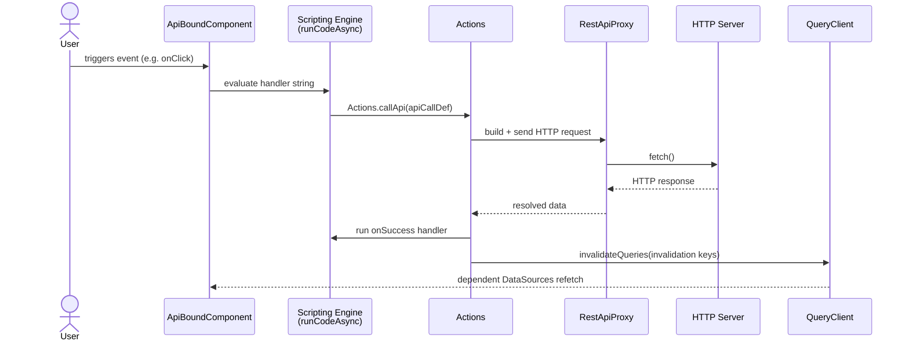

# Action Execution Model

XMLUI is a declarative framework — application developers describe _what_ the UI should look like, and the framework handles _how_ things render and update. But applications also need to **do things**: send data to a server, navigate to another page, show a confirmation dialog, upload a file. These are **side effects** — operations that reach beyond the component tree and change external state.

In a typical React application, a developer would write a JavaScript `onClick` handler that calls `fetch()`, updates local state, and invalidates a cache — all manually wired. XMLUI doesn't give application developers direct access to React or JavaScript event handlers. Instead, side effects flow through two layers:

1. **Event handlers** — the scripting engine's async execution model that turns markup expressions into executable code.
2. **Actions** — named, registered functions (`callApi`, `upload`, `navigate`, etc.) that event handlers invoke to perform the actual work.

If actions didn't exist, every component would need to know how to make HTTP requests, manage the React Query cache, handle optimistic updates, show toast notifications, and invalidate stale data. Actions centralize these concerns into reusable, named operations with a uniform interface. A `Button` doesn't need to know anything about HTTP — it fires an event, and the action system handles the rest.

This document covers both layers: how event handlers execute (and the consequences of their async nature), and how actions are defined, registered, and invoked.

<!-- DIAGRAM: XMLUI markup (APICall child) → ApiBoundComponent generates event handler string → scripting engine evaluates → Actions.callApi() → RestApiProxy → HTTP → onSuccess → invalidateQueries -->



---

## Event Handlers: The Async Execution Model

Before understanding actions, you need to understand how XMLUI event handlers work — because actions are always invoked from within event handlers.

### How markup becomes executable code

When a component declares an event in markup:

```xmlui
<Button onClick="navigate('/')">Go Home</Button>
```

The string `"navigate('/')"` goes through this pipeline:

1. **Lookup** — `ComponentAdapter` calls `memoedLookupEventHandler("click")`, which reads the handler string from `safeNode.events.click`.
2. **Cache check** — The event handler cache (`event-handler-cache.ts`) checks whether a compiled function already exists for this handler+event combination.
3. **Parse** — If not cached, the string is parsed into an AST by `parseHandlerCode()`. This is XMLUI's own parser — **not** `eval()` or `new Function()`. The framework has a proper AST interpreter.
4. **Wrap** — The parsed AST is wrapped in an async function that calls `runCodeAsync()`.
5. **Cache** — The resulting function is stored in the cache, keyed by `eventName + source`.

The function returned by `lookupEventHandler` is always `async`: it returns a `Promise<any>`. This is true even for simple one-liners like `navigate('/')`.

### Mouse events: synchronous lockdown, then async fire-and-forget

When the user clicks a button, the React `onClick` fires. XMLUI's `useMouseEventHandlers` hook intercepts it:

```typescript
// event-handlers.ts — useEventHandler (simplified)
const eventHandler = useCallback(
  (event) => {
    if (onEvent) {
      // 1. SYNCHRONOUS: lock down the event immediately
      if (!bubble || !bubble.includes(eventName)) {
        event.stopPropagation();
        event.preventDefault();
      }
      // 2. ASYNC: fire the handler — return value is DROPPED
      onEvent(event);
    }
  },
  [onEvent, eventName],
);
```

This design has profound consequences:

**`stopPropagation()` and `preventDefault()` happen before user code runs.** The DOM event is locked down the instant the handler fires. By the time your `onClick` expression starts executing, the event has already been prevented and stopped from bubbling. There is no way for user code to conditionally allow propagation based on logic — the decision is made before the handler runs.

**The handler's return value is discarded.** `onEvent(event)` is called without `await`. The returned `Promise` is dropped on the floor. Mouse event handlers are fire-and-forget — the framework does not observe their completion, success, or failure.

**Errors in async handlers are uncaught at the event level.** Because the `Promise` is never awaited, a thrown error inside an `onClick` handler becomes an unhandled promise rejection, not a caught exception.

### The `bubbleEvents` escape hatch

The default behavior — stop propagation and prevent default for every handled event — is correct for most components but problematic for nested interactive elements. The experimental `bubbleEvents` prop allows selective bypass:

```xmlui
<Card bubbleEvents={["click"]} onClick="handleCardClick()">
  <Button onClick="handleButtonClick()">Nested</Button>
</Card>
```

When `bubbleEvents` includes the event name, the framework skips both `stopPropagation()` and `preventDefault()` for that event, allowing the DOM event to bubble normally.

### Statement-by-statement execution with async state synchronization

The scripting engine doesn't execute handler code as a single synchronous block. Instead, it processes statements one at a time with an async checkpoint after each:

```
Statement 1: x = 5
  → state change detected → dispatch to container reducer
  → await React transition to commit the new state
  → re-read fresh state snapshot
Statement 2: y = x + 1
  → reads the updated x value (5, not the old value)
  → state change detected → dispatch → await → re-read
Statement 3: Actions.callApi(...)
  → await the entire API call
  → re-read state
```

After each statement completes, the `onStatementCompleted` callback runs:

1. If the statement changed any state variables (tracked via a `Proxy`), those changes are dispatched to the container reducer.
2. The engine `await`s a `Promise` that resolves when React has committed the state update (using `startTransition` for lower priority).
3. A fresh state snapshot is cloned for the next statement.

This means that **state changes from one statement are visible to the next statement within the same handler**. Unlike raw React (where `setState` batches and only applies on the next render), XMLUI's scripting engine gives the illusion of synchronous, sequential state mutation — each statement sees the effects of the previous one.

However, this async-between-statements design also means:
- **Long handlers yield to the main thread.** After 100 statements with no state changes, the engine inserts `await delay(0)` to prevent blocking.
- **Unmounting during execution loses remaining state changes.** If the component unmounts while a handler is mid-execution, the `mountedRef` check causes the state update `await` to skip, and remaining statements run against a stale snapshot.

### Event lifecycle signals

The container dispatches lifecycle actions around handler execution:

```typescript
dispatch({ type: ContainerActionKind.EVENT_HANDLER_STARTED, payload: { uid, eventName } });
// ... handler executes ...
dispatch({ type: ContainerActionKind.EVENT_HANDLER_COMPLETED, payload: { uid, eventName } });
```

These signals drive the inspector UI and can be used to track whether an event is in progress (e.g., showing a loading state on a button during an async operation).

### Init and cleanup handlers: a special case

`init` and `cleanup` events fire from `useEffect` in `ComponentAdapter`:

```typescript
useEffect(() => {
  const initHandler = memoedLookupEventHandler("init");
  if (shouldCallInit && initHandler) {
    initHandler();  // NOT awaited
  }
  // ...
}, [currentWhenValue, memoedLookupEventHandler]);
```

Like mouse events, `init` and `cleanup` handlers are fire-and-forget. The `useEffect` completes immediately while the async handler is still running. If the component unmounts before the handler finishes, remaining state changes may be lost.

### Form handlers: the exception

Form events (`onSubmit`, `onWillSubmit`, `onSuccess`) are the notable exception — they **are** awaited, and their return values are observed:

```typescript
// FormNative.tsx — doSubmit (simplified)
const willSubmitResult = await onWillSubmit?.(filteredSubject, fullSubject);
if (willSubmitResult === false) return; // Cancel submission

const result = await onSubmit?.(dataToSubmit, { passAsDefaultBody: true });
await onSuccess?.(result);
```

`onWillSubmit` returning `false` cancels the entire submission. `onWillSubmit` returning an object replaces the data to submit. This is the only place in the framework where the handler's return value controls the execution flow.

### Summary: event handler behavior by category

| Category | Examples | `preventDefault` | `stopPropagation` | Awaited? | Return value observed? |
|----------|---------|-------------------|-------------------|----------|----------------------|
| Mouse events | `onClick`, `onDoubleClick`, `onContextMenu` | Yes, synchronously before handler | Yes, synchronously before handler | No (fire-and-forget) | No |
| Mouse hover | `onMouseEnter`, `onMouseLeave` | Yes | Yes | No | No |
| Init/cleanup | `onInit`, `onCleanup` | N/A | N/A | No | No |
| Form events | `onSubmit`, `onWillSubmit`, `onSuccess` | Yes (by Form component) | Yes (by Form component) | **Yes** | **Yes** |
| Keyboard (component-internal) | Arrow keys in Select, Table | Component calls synchronously | Component calls synchronously | Varies | Varies |

---

## What Is an Action?

An action is a named, async function registered in the `ComponentRegistry`. Every action has the same signature:

```typescript
type ActionFunction = (executionContext: ActionExecutionContext, ...args: any[]) => any;
```

Actions are registered as `ActionRendererDef` objects:

```typescript
interface ActionRendererDef {
  actionName: string;   // The name used to call it: "callApi", "upload", "navigate", ...
  actionFn: ActionFunction;
}
```

The `createAction()` factory is the canonical way to create one:

```typescript
export const apiAction = createAction("callApi", callApi);
```

### The Execution Context

Every action receives an `ActionExecutionContext` as its first argument:

```typescript
interface ActionExecutionContext {
  uid: symbol;                        // The container executing this action
  state: ContainerState;              // State snapshot at call time
  getCurrentState: () => ContainerState; // Live state getter — use inside async continuations
  appContext: AppContextObject;       // Everything global: queryClient, navigate, toast, etc.
  apiInstance?: IApiInterceptor;      // Optional HTTP interceptor override
  lookupAction: LookupAsyncFnInner;   // Resolve nested action handlers by name
  navigate: any;                      // react-router navigate
  location: any;                      // react-router location
}
```

The distinction between `state` and `getCurrentState()` matters for async actions: `state` is captured at the moment the action is called; `getCurrentState()` returns the live container state, which may have changed by the time an `await` resolves.

---

## The Five Built-In Actions

The framework registers five actions in `ComponentProvider`:

| Name | Trigger | What it does |
|------|---------|--------------|
| `callApi` | `APICall` component | HTTP mutation with confirmation, optimistic updates, and cache invalidation |
| `upload` | `FileUpload` component | Chunked file upload via FormData |
| `download` | `FileDownload` component | File download via iframe (GET) or fetch+anchor (other methods) |
| `navigate` | `Navigate` component or `navigate()` | Programmatic routing with relative path resolution |
| `delay` | `TimedAction` component | `setTimeout`-based callback delay |

They're available in scripting via the `Actions` namespace: `Actions.callApi(...)`, `Actions.upload(...)`, etc.

---

## ApiBoundComponent: The Code Generation Bridge

The most important piece of the action execution model is `ApiBoundComponent`. It's the mechanism by which declarative markup like:

```xmlui
<Button onClick>
  <APICall url="/api/users/{id}" method="DELETE" invalidates="/api/users" onSuccess="navigate('/')" />
</Button>
```

...becomes an actual JavaScript event handler that runs when the user clicks the button.

### Detection

`ComponentAdapter` detects API-bound events during rendering:

```typescript
const apiBoundEvents = getApiBoundItems(safeNode.events, "APICall", "FileDownload", "FileUpload");
```

If any events are bound, the component is rendered inside `ApiBoundComponent` instead of directly.

### Code Generation

For each `APICall`, `FileUpload`, or `FileDownload` child, `ApiBoundComponent` calls `generateEventHandler()`, which produces a JavaScript string. For an `APICall`, the output looks like:

```javascript
(eventArgs, options) => {
  return Actions.callApi({
    uid: "...",
    url: "/api/users/{id}",
    method: "DELETE",
    body: undefined || (options?.passAsDefaultBody ? eventArgs : undefined),
    onSuccess: "navigate('/')",
    invalidates: "/api/users",
    params: { '$param': eventArgs },
  }, { resolveBindingExpressions: true });
}
```

All the configuration from the markup is serialized as JSON literals directly into the generated string. Nested handlers (`success`, `error`, `progress`, `beforeRequest`, `mockExecute`) are embedded recursively.

This string is injected as the component's event handler source code. When the event fires, the scripting engine evaluates it — the `Actions` namespace in scope provides the registered action functions.

**Why strings?** The scripting engine has its own variable scoping and expression evaluation. Generating a string that the scripting engine evaluates means the handler participates in the same reactive expression system as all other markup — `{id}` in the URL, `{$result.name}` in `onSuccess`, etc., are all evaluated against the component's state context.

---

## callApi — The Full Lifecycle

`callApi` is the most complex action. Here is the complete execution sequence:

### 1. Guard checks

```
when="{condition}" → if falsy, return immediately (no HTTP request)
```

### 2. Confirmation dialog (optional)

If `confirmTitle` or `confirmMessage` is set, displays a modal. User cancelling aborts the action.

### 3. Resolve invalidation targets

`extractParam(state, invalidates, appContext)` resolves the `invalidates` prop value against current state. Expressions like `invalidates="/api/users/{$result.id}"` are evaluated here.

### 4. onBeforeRequest (optional)

If `onBeforeRequest` is set, the handler runs. Returning `false` explicitly aborts the action.

### 5. Optimistic update (optional)

If `updates` is set (cache keys to immediately update) along with `optimisticValue` or `getOptimisticValue`:

1. Cancels in-flight queries for the matched keys (prevents stale overwrites)
2. Writes an optimistic entry into the query cache via immer draft mutation
3. Tags the entry with a `clientTxId` UUID to identify it later

The optimistic value appears immediately in the UI. If the request fails, the cache is invalidated to restore the real data.

### 6. HTTP request

`RestApiProxy.execute()` performs the actual fetch. If `onMockExecute` is set, the mock handler runs instead (useful for testing and development).

### 7. onSuccess

The resolved `onSuccess` handler receives `(result, $param)`. If it returns `false` explicitly, cache invalidation is skipped — this is the escape hatch for navigating away after success, where the component will unmount before a re-fetch would complete.

### 8. Update optimistic entries with real result

If `updates` was specified, the optimistic placeholder in the cache is replaced with the server's actual response.

### 9. Cache invalidation (deferred)

```typescript
setTimeout(() => {
  void invalidateQueries(resolvedInvalidates, appContext, state);
}, 0);
```

Invalidation is deferred to a macrotask. This ensures that any synchronous `navigate()` call in `onSuccess` has time to complete — React commits the navigation and unmounts DataSources before the invalidation fires, preventing wasted re-fetches from unmounted components.

If `invalidates` is omitted entirely (and `updates` is also absent), **all queries are invalidated** — equivalent to a full cache reset. This is occasionally intentional but is usually a bug. Always specify an `invalidates` URL pattern.

### Error path

On any error:
1. The query cache is fully invalidated if optimistic updates were applied (to restore real data)
2. The `onError` handler runs. Returning `false` suppresses error re-throw.
3. `toast.error` displays if `errorNotificationMessage` is set

---

## Event Handler Resolution

When a component fires a native React event, `ComponentAdapter`'s `memoedLookupEventHandler` is called:

```typescript
const memoedLookupEventHandler = useCallback(
  (eventName, actionOptions) => {
    const action = safeNode.events?.[eventName] || actionOptions?.defaultHandler;
    return lookupAction(action, uid, {
      eventName,
      componentType: ctx.componentType,
      componentLabel: ctx.componentLabel,
      componentId: ctx.componentId,
      sourceFileId: ctx.sourceFileId,
      sourceRange: ctx.sourceRange,
      ...actionOptions,
    });
  },
  [lookupAction, safeNode.events, uid],
);
```

`lookupAction` evaluates the handler string through the scripting engine (or resolves it from the action registry if it's a plain function name). The result is an `AsyncFunction` that can be called with event arguments.

### LookupActionOptions

Key options for controlling handler resolution and execution:

| Option | Effect |
|--------|--------|
| `signError` | Default `true` — surface errors in the UI error indicator |
| `eventName` | Names the event for inspector logging |
| `ephemeral` | `true` → skip the resolved function cache (for one-off calls like `Actions.*`) |
| `defaultHandler` | Fallback handler code if the event isn't defined on the component |
| `context` | Extra state injected into the execution context |

---

## Inspector Integration

When `appGlobals.xsVerbose === true`, `callApi` emits structured trace events:

```typescript
traceApiCall(appContext, "api:start",    url, method, { transactionId, body });
traceApiCall(appContext, "api:complete", url, method, { transactionId, result, status, _traceId });
traceApiCall(appContext, "api:error",    url, method, { transactionId, error });
```

The `traceId` is captured synchronously before the `await` — this ensures the `api:complete` event carries the same trace context as `api:start`, even if the call stack has changed by the time the promise resolves.

The `componentType`, `componentLabel`, `componentId`, `sourceFileId`, and `sourceRange` fields in `LookupActionOptions` are passed from the component's inspector context (tracked in a ref in `ComponentAdapter`) and appear in the inspector panel for every action invocation.

---

## Contributing Custom Actions

Extension packages can register custom actions via `ContributesDefinition`:

```typescript
import { createAction } from "xmlui/src/components-core/action/actions";

async function myAction(context: ActionExecutionContext, config: MyConfig) {
  const result = await doSomething(config);
  await invalidateQueries(config.invalidates, context.appContext, context.state);
  return result;
}

export default {
  namespace: "MyPackage",
  actions: [createAction("myAction", myAction)],
};
```

Once registered, it's callable from markup:

```xmlui
<Button onClick>
  <APICall ... />
</Button>
```

Or directly in script expressions:

```xmlui
<Button onClick="{() => Actions.myAction({ ... })}" />
```

---

## Key Takeaways

### Event handlers

- **XMLUI event handlers are always async.** Every handler — even a one-liner like `navigate('/')` — executes as an async function through the scripting engine's AST interpreter. There is no synchronous event handler path.
- **`preventDefault()` and `stopPropagation()` happen before user code runs.** For mouse events, the framework locks down the DOM event synchronously, then fires the async handler. User code cannot conditionally allow propagation — it's already stopped by the time the handler starts.
- **Mouse event handlers are fire-and-forget.** The `Promise` returned by the handler is never awaited. Errors become unhandled promise rejections. Return values are discarded.
- **State changes are visible between statements.** The scripting engine dispatches state mutations and awaits React's commit after each statement. The next statement sees the updated state — unlike raw React where `setState` batches.
- **Form handlers are the exception** — `onWillSubmit`, `onSubmit`, and `onSuccess` are awaited, and their return values control the submission flow. `onWillSubmit` returning `false` cancels; returning an object replaces the submitted data.
- **`bubbleEvents` is the escape hatch for nested interactive elements.** Use it when a parent and child both need to handle the same event type, and the default `stopPropagation` would block the parent.

### Actions

- **`ApiBoundComponent` is pure code generation** — it never runs any HTTP requests itself. It only generates JavaScript strings that the scripting engine evaluates later when events fire.
- **All config is serialized at render time** — when `ApiBoundComponent` generates a handler string, it serializes all props (`url`, `method`, `body`, etc.) as JSON literals into the string. The scripting engine then evaluates expressions within that string (e.g., `{id}` in a URL) at event time.
- **`callApi`'s invalidation is a macrotask** — always deferred via `setTimeout(0)`. Code that depends on the cache being updated synchronously after `callApi` returns will not work correctly.
- **`onSuccess` returning `false` skips invalidation** — the documented way to opt out of automatic re-fetch. Use when you are navigating away and don't want the unmounted DataSource to attempt a re-fetch.
- **Omitting `invalidates` invalidates everything** — this is a footgun. Unless `updates` is specified, omitting `invalidates` triggers `queryClient.invalidateQueries()` with no predicate, resetting the entire cache.
- **`state` vs `getCurrentState()` in async actions** — `state` is a snapshot; values read from it after an `await` may be stale. Use `getCurrentState()` in closures that execute after async operations.
- **Inspector fields are read from a ref** — `componentType`, `componentLabel`, etc., in `LookupActionOptions` come from `inspectorContextRef.current`, not from the closure. This prevents identity changes in `memoedLookupEventHandler` when those values update.
