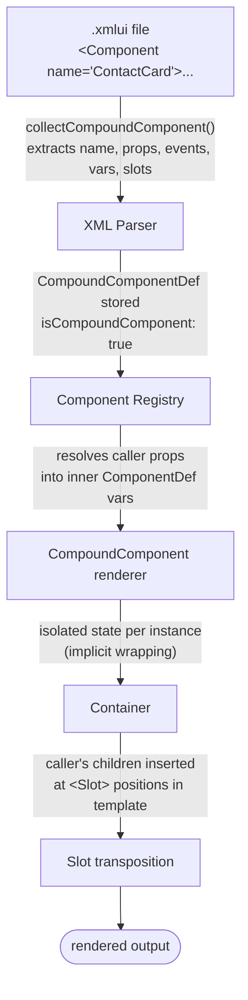

# User-Defined Components

User-defined components (UDCs) let application developers create reusable components in `.xmlui` files — no TypeScript required. Under the hood they are **compound components**: they have a public interface (properties, events, slots) and an internal implementation (XMLUI markup). The framework gives them the same state management, reactivity, and rendering treatment as built-in components, but routes them through a distinct pipeline branch that handles property resolution, scope isolation, and slot-based template composition.

Understanding UDCs matters for framework developers because the compound rendering path touches ComponentAdapter (behavior skip), CompoundComponent (the runtime bridge), the parser (definition extraction), and the slot transposition system. Changes to any of these areas must account for the UDC pipeline.

```xml
<!-- ContactCard.xmlui — definition: declares props, exposes a default Slot -->
<Component name="ContactCard">
  <Card>
    <H3>{$props.name}</H3>
    <Text>{$props.email}</Text>
    <!-- Slot marks where the caller's children are inserted -->
    <Slot />
  </Card>
</Component>

<!-- Main.xmlui — usage: caller's children flow into the Slot -->
<ContactCard name="Alice" email="alice@example.com">
  <Badge label="Admin" />
</ContactCard>
```

<!-- DIAGRAM: UDC lifecycle — .xmlui file → parse → register → CompoundComponent → Container → Slot transposition -->



---

## The Lifecycle: From Markup to Pixels

A user-defined component goes through three distinct phases before it renders:

### Phase 1: Parsing

When the framework encounters a `.xmlui` file containing a `<Component>` tag, the XML parser's `collectCompoundComponent()` function (in `parsers/xmlui-parser/transform.ts`) extracts:

- **`name` attribute** → the component type name (must start with uppercase, PascalCase)
- **`method:*` attributes** → imperative API methods, stored in `CompoundComponentDef.api`
- **`var:*` attributes** and `<variable>` children → initial variables, merged into the component's inner `ComponentDef.vars`
- **`on*` attributes** → event handlers (the `on` prefix is stripped and first char lowercased: `onValueChanged` → `"valueChanged"`)
- **`codeBehind` attribute** → path to a `.xmlui.xs` code-behind script file
- **Single root element** (or multiple children auto-wrapped in Fragment) → the internal implementation `ComponentDef`

The result is a `CompoundComponentDef`:

```typescript
{
  name: "ContactCard",           // Component type name
  component: ComponentDef,       // Internal implementation tree
  api?: Record<string, any>,     // method:* declarations
  codeBehind?: string,           // Path to .xmlui.xs file
}
```

**Important:** The component name must match the filename for standalone (buildless) mode. `ActionBar.xmlui` must contain `<Component name="ActionBar">`. Built mode is more relaxed about this.

### Phase 2: Registration

`createUserDefinedComponentRenderer()` (in `components-core/renderers.ts`) merges optional code-behind into the definition, then returns a `CompoundComponentRendererInfo`. The code-behind merge is straightforward — code-behind variables and functions **override** inline definitions:

```typescript
component.vars = { ...component.vars, ...codeBehind.vars };
component.functions = { ...component.functions, ...codeBehind.functions };
```

`ComponentProvider.registerCompoundComponentRenderer()` then:

1. **Auto-generates metadata** via `generateUdComponentMetadata()` — walks the entire component tree collecting `$props.<member>` references to discover props and theme variable references for theming
2. Merges auto-generated metadata with any explicitly provided metadata
3. Creates a renderer function that returns `<CompoundComponent ...>`
4. Registers with **`isCompoundComponent: true`** — this flag controls the rendering pipeline branch

### Phase 3: Rendering

When a parent component uses `<ContactCard name="Mary" value="123">`, the rendering pipeline reaches `ComponentAdapter`, which queries the registry. Finding `isCompoundComponent === true`, it:

- **Skips behavior application** — behaviors (Tooltip, Variant, Label, etc.) are NOT applied to the compound wrapper. They apply only to built-in components inside the UDC's implementation.
- **Calls the renderer**, which creates a `CompoundComponent` instance.

---

## CompoundComponent: The Runtime Bridge

`CompoundComponent` (in `components-core/CompoundComponent.tsx`) is a React `forwardRef` component that bridges the parent's usage with the UDC's internal implementation. It handles five responsibilities:

### 1. Property Resolution

All properties the parent passes are evaluated in **the parent's scope**:

```xml
<ContactCard name="{userName}" value="{phone}" />
```

Here `userName` and `phone` are resolved using the parent's `extractValue`. Arrow function props are resolved via `lookupSyncCallback`. The resolved values are shallow-memoized to prevent unnecessary re-renders.

### 2. Container Assembly

The internal implementation is wrapped in a Container that provides state management:

```typescript
{
  type: "Container",
  vars: { /* component variables */ },
  loaders: [ /* DataSource definitions */ ],
  functions: { /* method implementations */ },
  api: { /* imperative method mappings */ },
  scriptCollected: { /* code-behind declarations */ },
  children: [ componentDef ]
}
```

### 3. Implicit Variable Injection

CompoundComponent injects four implicit variables into the component's scope, available without declaration:

| Variable | Type | Purpose |
|----------|------|---------|
| `$props` | Object | All resolved property values from parent |
| `emitEvent` | Function | Fire custom events to parent: `emitEvent('valueChanged', data)` |
| `hasEventHandler` | Function | Check if parent registered a handler: `hasEventHandler('valueChanged')` |
| `updateState` | Function | Programmatically update component state |

### 4. Parent Render Context

When the parent provides children or template properties, CompoundComponent assembles a `ParentRenderContext`:

```typescript
{
  renderChild: parentRenderChild,   // Parent's render function (preserves parent scope)
  props: node.props,                // All props including template properties
  children: node.children,          // Direct children for default slot
}
```

This context is passed down through `renderChild` and becomes available to `slotRenderer()` when a `<Slot>` is encountered. It is **only created when needed** — if no templates or children are passed, it's `undefined`.

### 5. Rendering

CompoundComponent calls `renderChild(containerNode, layoutContext, parentRenderContext)`, which routes through ComponentWrapper → ContainerWrapper → ComponentAdapter, rendering the internal markup.

---

## Slot Transposition

Slots are the template composition mechanism. They mark where parent-provided content should appear within the component's layout.

### Default Slots

A `<Slot />` (no name) receives all direct children the parent passes:

```xml
<!-- Definition -->
<Component name="Panel">
  <Card>
    <Slot />
  </Card>
</Component>

<!-- Usage — Button goes into the default slot -->
<Panel>
  <Button label="Click me" />
</Panel>
```

### Named Slots

A `<Slot name="headerTemplate" />` receives a specific template fragment. The name **must end with `Template`** — this is enforced at runtime and renders an `InvalidComponent` error if violated.

```xml
<!-- Definition -->
<Component name="Dialog">
  <Card>
    <Slot name="headerTemplate">
      <H3>Default Header</H3>
    </Slot>
    <Slot />
    <Slot name="actionsTemplate" />
  </Card>
</Component>

<!-- Usage -->
<Dialog>
  <property name="headerTemplate">
    <H2>Custom Header</H2>
  </property>
  <Text>Body content goes in default slot</Text>
  <property name="actionsTemplate">
    <Button label="Cancel" />
    <Button label="OK" />
  </property>
</Dialog>
```

### How slotRenderer() Resolves Content

`slotRenderer()` in `ComponentAdapter.tsx` follows this decision tree:

1. **Named slot + parent provides matching template** → render parent's template
2. **Named slot + no parent template** → render slot's default children (fallback content)
3. **Default slot + parent provides children** → render parent's children
4. **Default slot + no parent children** → render slot's default children
5. **No content available** → render nothing

### Slot Properties: Data Flowing from Component to Parent

Slot properties enable the component to push data into the parent's template content. Any attribute on `<Slot>` other than `name` becomes a slot property:

```xml
<!-- Component pushes item data to parent via slot props -->
<Component name="ItemList">
  <Items data="{items}">
    <Slot name="itemTemplate" item="{$item}" index="{$index}" />
  </Items>
</Component>

<!-- Parent receives slot props as $ context variables -->
<ItemList>
  <property name="itemTemplate">
    <Text>#{$index}: {$item}</Text>
  </property>
</ItemList>
```

**The transformation pipeline:**

1. `slotRenderer()` evaluates all slot properties in the **component's scope** (where `$item` and `$index` are available)
2. Arrow function slot props (detected via `_ARROW_EXPR_` marker) are resolved through `lookupAction()`
3. Properties are passed to `SlotItem`
4. `SlotItem` prefixes each key with `$` and creates a Container with `contextVars`:
   ```
   { item: "Apple", index: 0 } → { $item: "Apple", $index: 0 }
   ```
5. The parent's template content is rendered inside this Container, using `parentRenderContext.renderChild` to preserve parent scope

### The Three-Scope Model

Slot transposition involves three overlapping scopes:

| Scope | What's accessible | When active |
|-------|------------------|-------------|
| **Parent scope** | Parent's variables, IDs, event handlers | Rendering slot content (via `parentRenderContext.renderChild`) |
| **Component scope** | `$props`, component vars, methods, `emitEvent` | Evaluating slot property expressions, rendering non-slot content |
| **Slot content scope** | Parent scope + slot-provided `$` context variables | Inside the transposed slot content |

This design ensures that `{userName}` in a parent's template resolves in the parent's scope (where `userName` exists), even though the template physically renders inside the component's layout. Slot properties like `$item` bridge data from the component scope into the slot content scope.

---

## Code-Behind Scripts

For components with complex logic, a `.xmlui.xs` code-behind file provides a separate script module:

```xml
<Component name="SearchBox" codeBehind="SearchBox.xmlui.xs">
  <TextBox value="{query}" onValueChanged="query = $event; search()" />
  <Items data="{results}">
    <Slot name="resultTemplate" result="{$item}" />
  </Items>
</Component>
```

```javascript
// SearchBox.xmlui.xs
var query = "";
var results = [];

function search() {
  results = fetchResults(query);
  emitEvent('searchCompleted', { query, results });
}
```

The code-behind is parsed by `collectCodeBehindFromSource()` into a `CollectedDeclarations` object with `vars` and `functions`. During registration, code-behind declarations are merged into the component definition — **code-behind wins** over inline definitions on name conflicts.

---

## Event Emission

Components communicate with parents through custom events:

```xml
<Component name="Counter">
  <variable name="count" value="{0}" />
  <Button
    label="Count: {count}"
    onClick="count++; emitEvent('valueChanged', count)" />
</Component>

<!-- Parent -->
<Counter onValueChanged="total = total + $eventData" />
```

**How it works internally:**

1. `emitEvent('valueChanged', count)` calls `lookupEventHandler('valueChanged')`
2. The parent's `onValueChanged` was parsed as event `"valueChanged"` (stripped `on`, lowercased first char)
3. The handler function is invoked with the provided arguments

The `hasEventHandler(eventName)` function lets components check whether a parent registered a handler before performing expensive work:

```xml
<Button
  when="{hasEventHandler('delete')}"
  label="Delete"
  onClick="emitEvent('delete', id)" />
```

---

## Component API (Imperative Methods)

UDCs can expose imperative methods via the `method:` attribute prefix:

```xml
<Component name="MyGrid"
  method:getSelectedRows="rows.filter(r => r.selected)"
  method:clearSelection="rows.forEach(r => r.selected = false)">
  <!-- ... -->
</Component>
```

During Container initialization, each method declaration is looked up as an action and registered via `registerComponentApi()`. The parent accesses methods by component ID:

```xml
<MyGrid id="grid" />
<Button label="Log Selection" onClick="console.log(grid.getSelectedRows())" />
```

Internally, methods are stored using Symbol keys with string descriptions, merged into component state via `mergeComponentApis()` in `state-layers.ts`.

---

## Auto-Generated Metadata

`generateUdComponentMetadata()` in `ud-metadata.ts` introspects the component tree at registration time:

- **Props discovery** — walks all nodes, collects every `$props.<member>` reference → extracts property names
- **Theme vars discovery** — collects theme variable references from layout property values
- **Result** — `ComponentMetadata { status: "stable", description, props, themeVars }`

This means UDC authors don't need to write explicit metadata. The framework discovers the component's public API by analyzing how `$props` is used. Explicit metadata (if provided) is merged on top, winning on any overlap.

---

## Performance Considerations

The UDC pipeline includes several optimizations:

- **`useShallowCompareMemoize`** on resolved props — prevents re-renders when parent recreates prop objects with identical values
- **`React.memo`** on `SlotItem` — avoids re-rendering slot content when component re-renders but slot data is stable
- **Parent render context memoization** — only created when templates or children are present; memoized to avoid recreation on each render
- **`hasTemplateProps` heuristic** — efficiently detects template properties by checking name suffix and value shape, avoiding full prop scan

---

## Key Takeaways

- UDCs are **compound components** — two parts: public interface (parent-facing) and internal implementation (XMLUI markup)
- The XML parser extracts everything from the `<Component>` tag: name, methods, variables, events, code-behind path, and the single-root implementation
- `CompoundComponent` is the runtime bridge — resolves props in parent scope, wraps implementation in a Container, injects `$props`/`emitEvent`/`hasEventHandler`/`updateState`
- **Behaviors skip UDCs** — they apply only to built-in components inside the UDC's markup
- **Slots** enable template composition with three types of content: direct children (default slot), named templates (named slots), and fallback content
- **Slot properties** bridge data from component scope to parent's template via `$`-prefixed context variables
- **Scope isolation** is maintained through `parentRenderContext.renderChild` — slot content resolves variables in the parent's scope, not the component's
- Named slots **must** end with `Template` suffix
- Code-behind scripts override inline declarations on name conflicts
- Metadata is auto-generated from `$props` usage analysis — no manual API declaration needed
