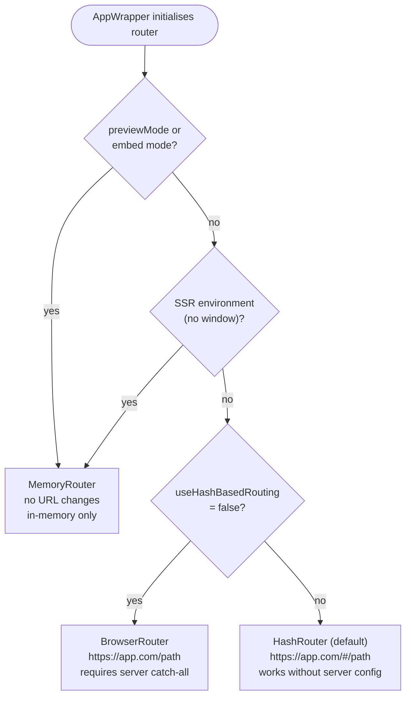

# 13. Routing

## Why This Matters

Single-page applications need to navigate between views without full page reloads. XMLUI handles
this through a thin, declarative layer over **react-router-dom v6** — you declare your pages with
XML tags and the framework wires up the router. You never write `createBrowserRouter`,
`useNavigate`, or `useParams` directly. You just write `<Page url="/users/:id">` and access
`$routeParams.id` in your expressions.

Understanding the routing system is essential for:
- Building multi-page apps with proper deep-linking
- Accessing dynamic URL segments in component expressions
- Guarding navigation (preventing unsaved-data loss)
- Integrating navigation panels that reflect the current route
- Choosing the right router type for deployment

---

## The Router Stack

When an XMLUI application starts, `AppWrapper` wraps the entire app in a react-router context.
The choice of router depends on configuration and environment:

<!-- DIAGRAM: Decision tree for router selection: previewMode → MemoryRouter; SSR (no window) → MemoryRouter; useHashBasedRouting=true (default) → HashRouter; useHashBasedRouting=false → BrowserRouter -->



| Condition | Router | URL Style |
|---|---|---|
| Preview/embed mode | `MemoryRouter` | No URL changes |
| SSR (no `window`) | `MemoryRouter` | In-memory fallback |
| Default | `HashRouter` | `https://myapp.com/#/users/123` |
| `useHashBasedRouting: false` | `BrowserRouter` | `https://myapp.com/users/123` |

**HashRouter** is the default because it works without any server configuration — the `#` fragment
is handled entirely by the browser. **BrowserRouter** produces cleaner URLs but requires your web
server to serve `index.html` for every path (otherwise a direct URL like `/users/123` returns a 404).

The `useHashBasedRouting` flag is set at runtime via global configuration passed to the framework
bootstrap — typically in `config.json` or the `index.html` initialization code.

---

## Pages: The Routing Coordinator

The `Pages` component is the routing hub in your app. Place it inside your `App` layout and
populate it with `Page` children. `Pages` renders a `<Routes>` container and maps each `Page`
to a `<Route>`.

```xml
<App>
  <AppHeader>
    <Text>My App</Text>
  </AppHeader>
  <Pages fallbackPath="/dashboard">
    <Page url="/dashboard">
      <DashboardContent />
    </Page>
    <Page url="/users">
      <UserList />
    </Page>
    <Page url="/users/:id">
      <UserDetail />
    </Page>
    <Page url="/settings/*">
      <SettingsLayout />
    </Page>
  </Pages>
</App>
```

### Pages Props

| Prop | Type | Default | Description |
|---|---|---|---|
| `fallbackPath` | `string` | `"/"` | Where to redirect when no Page URL matches |
| `defaultScrollRestoration` | `boolean` | `false` | Restore scroll on back/forward navigation |

### How Pages Works Internally

`Pages` iterates its XML children and separates `Page` elements from everything else. Page elements
are rendered as `<Route>` elements inside `<Routes>`. Any non-Page children (rare, but possible)
are rendered below the route switcher — they appear on every page regardless of the active route.

A catch-all route `<Route path="*">` is automatically added when `fallbackPath` is set, redirecting
any unmatched URL to the fallback destination. This prevents blank screens on invalid deep-links.

---

## Page: The Route Endpoint

Each `Page` defines one URL route. The `url` prop accepts any react-router v6 path pattern:

```xml
<!-- Static path -->
<Page url="/about">
  <AboutContent />
</Page>

<!-- Dynamic segment -->
<Page url="/users/:id">
  <Text>User: {$routeParams.id}</Text>
</Page>

<!-- Multiple dynamic segments -->
<Page url="/repos/:owner/:repo">
  <RepoDetails />
</Page>

<!-- Wildcard (nested route handler) -->
<Page url="/docs/*">
  <DocsLayout />
</Page>

<!-- Optional segment -->
<Page url="/blog/:slug?">
  <BlogPost />
</Page>
```

### Page Props

| Prop | Type | Default | Description |
|---|---|---|---|
| `url` | `string` | — | React Router v6 path pattern. Required. |
| `navLabel` | `string` | — | Navigation display label (used internally by NavPanel). |

### RouteWrapper: Injecting Route Context

When a Page renders, its children are wrapped in a `RouteWrapper` component. This wrapper calls
`useParams()` from react-router and makes the results available as an implicit state container. The
container's variables feed directly into the routing state layer, so `$routeParams` becomes
available in any expression inside that Page.

The `key` on `RouteWrapper` is the page's URL pattern string. If you dynamically change a Page's
`url` prop, the entire page content remounts — a clean teardown and re-initialization.

Each Page also wraps its content in a `TableOfContentsProvider` for on-page heading navigation
(described in [On-Page Anchor Navigation](#on-page-anchor-navigation) below).

---

## Routing State Variables

The routing system injects four reactive variables into every component's expression context.
These are part of Layer 6 in XMLUI's state composition pipeline and automatically re-evaluate
when the URL changes.

| Variable | Type | Example Value | Description |
|---|---|---|---|
| `$pathname` | `string` | `"/users/123"` | Current URL pathname |
| `$routeParams` | `object` | `{ id: "123" }` | Dynamic URL segment values |
| `$queryParams` | `object` | `{ page: "2", sort: "name" }` | Query string parameters |
| `$linkInfo` | `NavHierarchyNode` | `{ label: "Users", to: "/users", ... }` | Navigation metadata for active page |

### Accessing Route Parameters

Dynamic segments defined with `:paramName` in the `url` prop are captured and available as
`$routeParams.paramName`:

```xml
<Page url="/articles/:category/:slug">
  <VStack>
    <Text variant="title">{$routeParams.slug}</Text>
    <Text variant="subtitle">In: {$routeParams.category}</Text>
    <DataSource url="/api/articles/{$routeParams.category}/{$routeParams.slug}" />
  </VStack>
</Page>
```

### Accessing Query Parameters

Query string parameters (`?key=value`) are available through `$queryParams`. Unlike route params,
query params can be set or changed without defining them in the URL pattern:

```xml
<Page url="/search">
  <TextBox value="{$queryParams.q ?? ''}" />
  <DataSource url="/api/search?q={$queryParams.q}&page={$queryParams.page ?? 1}" />
</Page>
```

### Using $pathname for Conditional UI

```xml
<HStack visible="{$pathname.startsWith('/admin')}">
  <Text>Admin Mode</Text>
</HStack>
```

---

## Programmatic Navigation

Use the `navigate()` global function to change routes from event handlers and scripts:

```xml
<!-- Navigate to absolute path -->
<Button onClick="navigate('/users')">Go to Users</Button>

<!-- Navigate with dynamic path -->
<Button onClick="navigate('/users/' + selectedUserId)">View User</Button>

<!-- Navigate back -->
<Button onClick="navigate(-1)">Back</Button>

<!-- Navigate forward -->
<Button onClick="navigate(1)">Forward</Button>

<!-- Navigate with query params -->
<Button onClick="navigate('/search', { queryParams: { q: searchText, page: 1 } })">Search</Button>

<!-- Replace instead of push (no back button entry) -->
<Button onClick="navigate('/login', { replace: true })">Go to Login</Button>
```

### navigate() Signature

```ts
navigate(to: string | number, options?: {
  queryParams?: Record<string, any>;  // Appended as ?key=value
  replace?: boolean;                  // Replace current history entry
})
```

Passing a number navigates in history: `-1` goes back, `1` goes forward, `-2` goes back two steps.

---

## Navigation Events

The `App` component exposes two events that hook into navigation lifecycle:

### willNavigate

Fires **before** `navigate()` is called. Return `false` to cancel the navigation:

```xml
<App willNavigate="(to) => {
  if (formIsDirty) {
    return confirm('Leave page? Unsaved changes will be lost.') ? undefined : false;
  }
}">
```

**Limitation:** `willNavigate` only fires for programmatic navigation via `navigate()`. It does NOT
fire for `<Link>` component clicks or browser back/forward buttons. If you need to guard all
navigation, use `navigate()` instead of `<Link>`.

### didNavigate

Fires **after** any navigation completes — including `<Link>` clicks, `navigate()` calls, and
browser back/forward buttons:

```xml
<App didNavigate="(to) => {
  analytics.trackPageView(to);
}">
```

---

## NavPanel Integration

The navigation panel components (`NavPanel`, `NavGroup`, `NavLink`) build a navigation hierarchy
that reflects your app's page structure. They're independent of the `Pages`/`Page` routing — you
compose them separately in your `AppHeader` or side panel.

```xml
<App>
  <AppHeader>
    <NavPanel>
      <NavLink to="/dashboard" label="Dashboard" icon="home" />
      <NavGroup label="Users" icon="users">
        <NavLink to="/users" label="All Users" />
        <NavLink to="/users/new" label="New User" />
      </NavGroup>
      <NavGroup label="Settings">
        <NavLink to="/settings/profile" label="Profile" />
        <NavLink to="/settings/billing" label="Billing" />
      </NavGroup>
    </NavPanel>
  </AppHeader>
  <Pages>
    <!-- Pages match the NavLink "to" values -->
    <Page url="/dashboard">...</Page>
    <Page url="/users">...</Page>
    <Page url="/users/:id">...</Page>
    <Page url="/settings/profile">...</Page>
    <Page url="/settings/billing">...</Page>
  </Pages>
</App>
```

### NavGroup and NavLink Props

| Component | Prop | Required | Description |
|---|---|---|---|
| `NavLink` | `to` | Yes | URL to navigate to |
| `NavLink` | `label` | Yes | Display text |
| `NavLink` | `icon` | No | Icon name |
| `NavLink` | `exact` | No | Match exact URL only (default: prefix match) |
| `NavGroup` | `label` | Yes | Display text for the group |
| `NavGroup` | `to` | No | Optional URL if group header is also a link |
| `NavGroup` | `icon` | No | Icon name |

### Active Link Detection

By default, a `NavLink` is highlighted as active when the current URL starts with its `to` value.
Set `exact={true}` when you need precise matching — for example, a "Home" link that should only be
active on `/` and not on every page.

---

## The $linkInfo Variable

The `LinkInfoContext` builds a map from URL pathnames to navigation hierarchy nodes
(`NavHierarchyNode`). This is populated by the `NavPanel`'s `NavGroup`/`NavLink` tree. The
`$linkInfo` variable gives you the nav node for the **currently active page**.

A `NavHierarchyNode` carries:

| Field | Description |
|---|---|
| `label` | Display text for this page |
| `to` | URL path |
| `icon` | Optional icon name |
| `parent` | Parent nav node (for breadcrumbs) |
| `pathSegments` | Array of ancestors from root (for breadcrumb trail) |
| `prevLink` | Previous sibling NavLink in nav order |
| `nextLink` | Next sibling NavLink in nav order |
| `firstLink` | Whether this is the first link in its group |
| `lastLink` | Whether this is the last link in its group |

### Practical Uses of $linkInfo

**Breadcrumb trail:**
```xml
<HStack>
  <For each="{$linkInfo.pathSegments ?? []}">
    <Link to="{$item.to}">{$item.label}</Link>
    <Text>/</Text>
  </For>
  <Text>{$linkInfo.label}</Text>
</HStack>
```

**Previous/Next page navigation (documentation-style):**
```xml
<HStack justifyContent="space-between">
  <Link to="{$linkInfo.prevLink?.to}" visible="{!!$linkInfo.prevLink}">
    ← {$linkInfo.prevLink?.label}
  </Link>
  <Link to="{$linkInfo.nextLink?.to}" visible="{!!$linkInfo.nextLink}">
    {$linkInfo.nextLink?.label} →
  </Link>
</HStack>
```

`$linkInfo` is only populated when the active URL exactly matches a registered NavLink `to` value.
Pages that have no corresponding NavLink entry will see `$linkInfo` as an empty object.

---

## On-Page Anchor Navigation

The `TableOfContentsContext` is a completely separate system from URL routing. It exists to support
in-page heading anchors — the kind of "jump to section" links found in documentation pages.

- Each `Page` automatically wraps its content in a `TableOfContentsProvider`.
- Heading components can register themselves with the TOC.
- The TOC tracks which heading is currently visible via `IntersectionObserver`.
- A TOC sidebar component can render the list and scroll to headings.

This is **not** related to react-router. It does not change the URL or trigger navigation.

---

## Scroll Restoration

When a user navigates to a page, scrolls down, navigates away, then uses the browser back button,
`defaultScrollRestoration` restores their previous scroll position:

```xml
<Pages defaultScrollRestoration={true}>
  ...
</Pages>
```

Internally:
1. Sets `window.history.scrollRestoration = "manual"` to take control.
2. Throttled scroll handler saves position to `sessionStorage` on every scroll.
3. On POP navigation (back/forward), retrieves the saved position and restores it instantly.

This does not affect forward navigation (clicking a link always starts at the top).

---

## Nested Routing

`Pages` can be nested inside a `Page`'s children. This is useful for layouts that have their own
sub-navigation:

```xml
<App>
  <Pages fallbackPath="/home">
    <Page url="/home">
      <HomePage />
    </Page>
    <Page url="/admin/*">
      <!-- Admin sub-app with its own routing -->
      <AdminLayout>
        <Pages fallbackPath="/admin/dashboard">
          <Page url="/admin/dashboard">
            <AdminDashboard />
          </Page>
          <Page url="/admin/users">
            <AdminUsers />
          </Page>
          <Page url="/admin/users/:id">
            <AdminUserDetail />
          </Page>
        </Pages>
      </AdminLayout>
    </Page>
  </Pages>
</App>
```

The outer `Page url="/admin/*"` uses a wildcard to match all `/admin/...` paths. The inner `Pages`
then matches within that sub-tree. Route params from both levels are visible in child expressions.

---

## Deployment Considerations

### HashRouter (Default)

Works with any static file host — GitHub Pages, S3, Netlify static, a simple `python -m http.server`.
The `#` fragment is not sent to the server, so the server always serves `index.html`.

```
https://myapp.com/#/users/123
                 ^
                 Everything after # is client-only
```

### BrowserRouter (Clean URLs)

Set `useHashBasedRouting: false` in your runtime config. Then configure your server:

- **Nginx:** Add `try_files $uri $uri/ /index.html;`
- **Apache:** Add `FallbackResource /index.html` in `.htaccess`
- **Vite dev server:** Add `historyApiFallback: true` in `vite.config.ts`

Also set `basename` if the app is not served from the root:

```ts
// In app initialization (index.ts for vite mode)
startXmlui({
  useHashBasedRouting: false,
  routerBaseName: "/my-app",  // if deployed to https://myhost.com/my-app/
});
```

---

## Key Files

| File | Purpose |
|---|---|
| [xmlui/src/components/Pages/Pages.tsx](../../xmlui/src/components/Pages/Pages.tsx) | `Pages` + `Page` metadata and renderers |
| [xmlui/src/components/Pages/PagesNative.tsx](../../xmlui/src/components/Pages/PagesNative.tsx) | `Pages` render logic; `RouteWrapper` |
| [xmlui/src/components-core/rendering/AppWrapper.tsx](../../xmlui/src/components-core/rendering/AppWrapper.tsx) | Router type selection |
| [xmlui/src/components-core/rendering/AppContent.tsx](../../xmlui/src/components-core/rendering/AppContent.tsx) | `navigate()` and navigation event wiring |
| [xmlui/src/components-core/state/routing-state.ts](../../xmlui/src/components-core/state/routing-state.ts) | `useRoutingParams()` — injects `$pathname`, `$routeParams`, etc. |
| [xmlui/src/components/App/App.tsx](../../xmlui/src/components/App/App.tsx) | `willNavigate` / `didNavigate` event definitions |
| [xmlui/src/components/NavPanel/NavPanelNative.tsx](../../xmlui/src/components/NavPanel/NavPanelNative.tsx) | `buildNavHierarchy()`, `NavHierarchyNode` type |
| [xmlui/src/components/App/LinkInfoContext.ts](../../xmlui/src/components/App/LinkInfoContext.ts) | Link metadata map, `$linkInfo` source |
| [xmlui/src/components-core/TableOfContentsContext.tsx](../../xmlui/src/components-core/TableOfContentsContext.tsx) | In-page heading anchor navigation |

---

## Common Mistakes

**Using window.location for navigation:**
The browser's native navigation APIs trigger a full page reload. Always use `navigate()` or `<Link>`.

**Trying to guard `<Link>` clicks with `willNavigate`:**
`willNavigate` only fires for `navigate()` calls. If you need to confirm navigation before leaving
a page, replace `<Link>` with a `<Button onClick="navigate(...)">` that runs your guard logic first.

**Using BrowserRouter without server configuration:**
When a user bookmarks `/users/123` and opens it directly, the server gets a request for that path.
Without a fallback rule, it returns 404. HashRouter avoids this entirely.

**Reading query params with JavaScript's URLSearchParams:**
`new URLSearchParams(window.location.search)` is not reactive — it captures a snapshot and doesn't
update when the URL changes. Use `$queryParams` instead.

**Confusing TableOfContentsContext with routing:**
`TableOfContentsProvider` manages headings within a page; it doesn't affect URL-based navigation.
These two systems are completely independent.

**Forgetting the wildcard on a parent Page for nested routing:**
If your outer Page is `url="/admin"` and you have nested Pages, the nested routes won't match
because `"/admin"` is an exact path. Use `url="/admin/*"` to allow sub-routes.

---

## Key Takeaways

- XMLUI routing wraps **react-router-dom v6** — `Pages` maps to `<Routes>`, `Page` maps to `<Route>`.
- **HashRouter is the default** and works on any static host. Switch to BrowserRouter for clean URLs, but configure your server accordingly.
- **`$routeParams`**, **`$queryParams`**, and **`$pathname`** are reactive state variables injected into every expression automatically — no manual hook wiring needed.
- **`navigate()`** is the programmatic navigation function. Use `navigate(-1)` for back, `navigate(path, { replace: true })` to avoid history entries, and `navigate(path, { queryParams: {...} })` for query strings.
- The **`willNavigate`** event can cancel navigation, but only fires for `navigate()` calls — not `<Link>` clicks or browser buttons.
- **`$linkInfo`** from `LinkInfoContext` gives the active page's nav hierarchy node — use it for breadcrumbs, prev/next links, and page titles.
- **`TableOfContentsContext`** is for in-page heading anchors, not URL routing. The two systems are completely separate.
- Nest `Pages` inside a `Page url="/prefix/*"` to build sub-apps with their own navigation structure.
