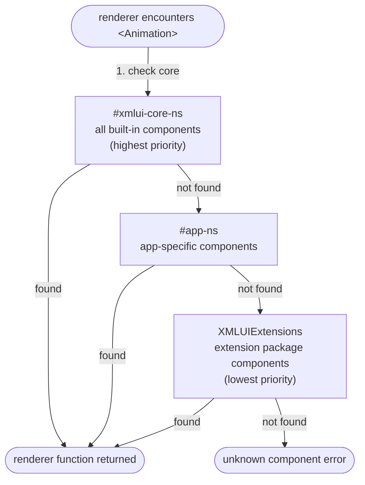
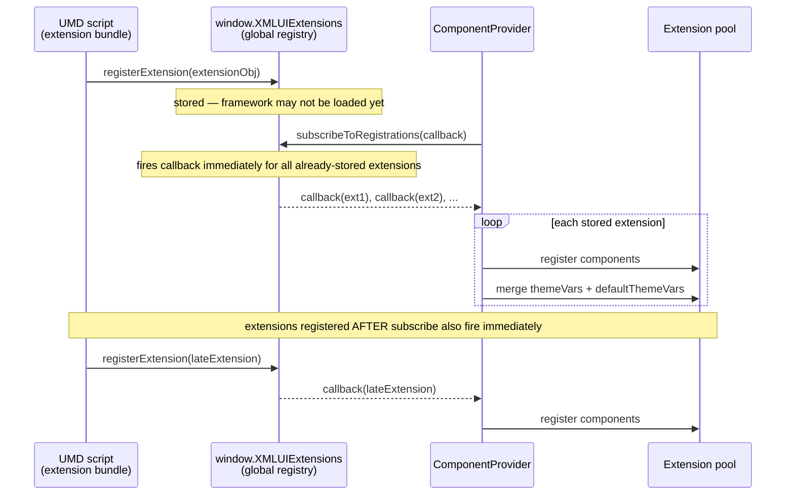

# 14. Extension Packages

## Why This Matters

XMLUI ships with ~100 built-in components, but real applications often need specialised UI — charts,
rich text editors, PDF viewers, animation systems. The extension package system lets you package any
React component into a self-contained npm module that any XMLUI app can consume. Once registered,
extension components appear in markup exactly like built-in ones: `<EChart>`, `<Animation>`,
`<PdfViewer>`. This is also how the XMLUI ecosystem itself grows — all the packages in the
`packages/` directory of this repository are extensions.

---

## The Extension Interface

Every extension package exports a single `Extension` object as its default export:

```ts
export interface Extension {
  namespace?: string;        // Which name pool to register into. Default: "XMLUIExtensions"
  components?: ComponentExtension[];  // Component renderer defs
  themes?: ThemeDefinition[];         // Custom theme files
  functions?: Record<string, (...args: any[]) => any>; // Global utility functions
}
```

A minimal extension has just a `components` array:

```ts
// src/index.tsx
import { myWidgetRenderer } from "./MyWidget";

export default {
  namespace: "XMLUIExtensions",
  components: [myWidgetRenderer],
};
```

That's the complete public surface. The rest of the system is scaffolding that gets the extension
loaded and its components registered in the framework's component pool.

---

## How Component Registration Works

The `ComponentProvider` in the framework core maintains three **namespace pools**:

<!-- DIAGRAM: Three pools labeled #xmlui-core-ns (built-in framework components), #app-ns (app-specific components), XMLUIExtensions (extension packages). Lookup order arrows show: unnamespaced component lookup tries core → app → extensions. -->



| Pool | Internal Name | Contents |
|---|---|---|
| Core | `#xmlui-core-ns` | All built-in XMLUI components |
| App | `#app-ns` | App-specific component contributions |
| Extensions | `"XMLUIExtensions"` | Extension package components |

When the renderer encounters `<Animation>` in markup, it looks for the type in the pools in order:
core first, then app, then extensions. This means **extension components cannot shadow core
component names** — core always wins.

If you use a custom namespace (e.g., `namespace: "MyLibrary"`), components must be referenced
with the namespace qualifier: `<MyLibrary.MyComp>`. The `"XMLUIExtensions"` default namespace
allows unqualified names.

### What Happens During Registration

Each component renderer def (the object produced by `wrapComponent`) carries its `type` string and
optional `metadata`. When registered, the framework:

1. Stores the renderer in the pool under `${namespace}.${type}`.
2. Merges any `themeVars` from metadata into the global theme variable set.
3. Merges `defaultThemeVars` into the default theme values map.

This means extension components get full theme variable support without any extra wiring.

---

## Building an Extension Component

Extension components follow exactly the same two-file pattern as built-in XMLUI components.

### Step 1: Create the Native Component (MyWidgetNative.tsx)

```tsx
// MyWidgetNative.tsx
import { forwardRef, memo } from "react";

export const defaultProps = {
  count: 0,
};

type Props = {
  label?: string;
  count?: number;
  onClick?: () => void;
  style?: React.CSSProperties;
};

export const MyWidget = memo(forwardRef<HTMLDivElement, Props>(function MyWidget(
  { label, count = defaultProps.count, onClick, style },
  ref
) {
  return (
    <div ref={ref} style={style} onClick={onClick}>
      <span>{label}</span>
      <span>{count}</span>
    </div>
  );
}));
```

### Step 2: Create Metadata and Renderer (MyWidget.tsx)

```tsx
// MyWidget.tsx
import { wrapComponent, createMetadata } from "xmlui";
import { MyWidget, defaultProps } from "./MyWidgetNative";

const COMP = "MyWidget";

export const MyWidgetMd = createMetadata({
  description: "A custom widget component.",
  props: {
    label: { description: "Display label for the widget." },
    count: {
      description: "Current count value.",
      defaultValue: defaultProps.count,
    },
  },
  events: {
    clicked: { description: "Fires when the widget is clicked." },
  },
});

export const myWidgetRenderer = wrapComponent(COMP, MyWidget, MyWidgetMd, {
  events: { clicked: "onClick" },
  numbers: ["count"],
});
```

### Step 3: Create the Extension Object (index.tsx)

```tsx
// src/index.tsx
import { myWidgetRenderer } from "./MyWidget";

export default {
  namespace: "XMLUIExtensions",
  components: [myWidgetRenderer],
};
```

### Usage in Markup

```xml
<MyWidget label="Hello" count="{42}" clicked="handleClick()" />
```

---

## Registering Extensions: Two Modes

How an extension gets loaded depends on which deployment mode the app uses.

### Vite Mode (Built Apps)

In Vite-built apps, extensions are imported directly in the app's `extensions.ts` file:

```ts
// website/extensions.ts
import search from "xmlui-search";
import animations from "xmlui-animations";
import charts from "xmlui-recharts";

export default [search, animations, charts];
```

The array is imported by the app entry point and passed into the framework at build time. No
runtime manager is involved — everything is tree-shaken and bundled together. This is the
preferred approach for production apps.

### Standalone Mode (Buildless Apps)

In standalone mode, extensions are loaded as UMD script tags in `index.html`:

```html
<!-- Load extension UMDs before the XMLUI runtime -->
<script src="./xmlui/xmlui-animations.js"></script>
<script src="./xmlui/xmlui-recharts.js"></script>
<!-- Then load the runtime -->
<script src="./xmlui/xmlui-runtime.js"></script>
```

Each UMD file contains an auto-injected footer that calls `registerExtension()` on the XMLUI
standalone runtime:

```js
// Injected automatically by xmlui build-lib
if (typeof window.xmlui !== "undefined") {
  window.xmlui.standalone.registerExtension(window['xmlui-animations'].default);
}
```

This is why extension UMDs **must be loaded before the runtime** — the runtime must exist when
the footer runs.

---

## StandaloneExtensionManager

The `StandaloneExtensionManager` is the pub/sub hub for standalone-mode extension registration:

```ts
class StandaloneExtensionManager {
  registerExtension(ext: Extension | Extension[]): void
  subscribeToRegistrations(cb: (ext: Extension) => void): void
  unSubscribeFromRegistrations(cb: (ext: Extension) => void): void
  registeredExtensions: Extension[]  // All currently registered
}
```

The critical design is in `subscribeToRegistrations()`: it fires the callback immediately for
all **already registered** extensions before waiting for new ones. This makes registration
order-independent — the framework can subscribe after extensions have loaded and still process
everything correctly.

<!-- DIAGRAM: Sequence diagram showing: 1) UMD script loads → calls registerExtension() → stored in array, 2) Runtime loads → ComponentProvider subscribes → fires callback for each stored extension → components registered -->



---

## Adding Global Functions

Extensions can expose utility functions available in every XMLUI expression:

```ts
// src/index.tsx
export default {
  namespace: "XMLUIExtensions",
  components: [myChartRenderer],
  functions: {
    formatCurrency: (value: number, currency = "USD") =>
      new Intl.NumberFormat("en-US", { style: "currency", currency }).format(value),
    clamp: (value: number, min: number, max: number) =>
      Math.min(Math.max(value, min), max),
  },
};
```

After registration, markup can call these directly:

```xml
<Text>{formatCurrency(price)}</Text>
<Slider value="{clamp($value, 0, 100)}" />
```

**Important:** Function names are merged with first-write-wins semantics. If your function name
collides with a built-in global or another extension's function, yours will be silently ignored.
Use distinctive names to avoid conflicts.

---

## Adding Custom Themes

Extensions can ship theme definitions that apps can apply:

```ts
import myDarkTheme from "./themes/my-dark.json";
import myLightTheme from "./themes/my-light.json";

export default {
  namespace: "XMLUIExtensions",
  components: [...],
  themes: [myDarkTheme, myLightTheme],
};
```

Theme definitions follow the same `ThemeDefinition` structure used by the core framework. The
extension's theme variables and defaults are merged into the app's theme system at registration
time.

---

## Package Structure

All extension packages in this repository follow a consistent layout:

```
xmlui-myextension/
├── src/
│   ├── index.tsx           ← exports default Extension object
│   ├── MyComponent.tsx     ← metadata + wrapComponent
│   ├── MyComponentNative.tsx  ← React implementation
│   └── MyComponent.spec.ts    ← unit tests (optional)
├── demo/                   ← demo XMLUI markup (optional)
├── dist/                   ← built outputs (gitignored)
├── package.json
└── index.ts                ← demo entry point
```

### package.json

```json
{
  "name": "xmlui-myextension",
  "type": "module",
  "main": "./dist/xmlui-myextension.js",
  "module": "./dist/xmlui-myextension.mjs",
  "exports": {
    ".": {
      "import": "./dist/xmlui-myextension.mjs",
      "require": "./dist/xmlui-myextension.js"
    },
    "./*.css": {
      "import": "./dist/*.css"
    }
  },
  "scripts": {
    "build:extension": "xmlui build-lib",
    "build-watch":     "xmlui build-lib --watch",
    "build:meta":      "xmlui build-lib --mode=metadata",
    "start":           "xmlui start",
    "build:demo":      "xmlui build"
  },
  "devDependencies": {
    "xmlui": "*"
  }
}
```

Key points:
- `"type": "module"` — the source uses ESM.
- `xmlui` is a `devDependency` only — it is an external in the build and must be provided by the consuming app.
- Third-party dependencies your components need are `dependencies` (bundled into the extension).
- Peer dependencies (react, react-dom) are never bundled.

---

## Building the Extension

Run `xmlui build-lib` from the extension package directory:

```bash
cd packages/xmlui-myextension
npm run build:extension
```

### Build Outputs

| File | Format | When Used |
|---|---|---|
| `dist/xmlui-myextension.js` | UMD | Standalone mode script tag loading |
| `dist/xmlui-myextension.mjs` | ES module | Vite apps, tree-shaking |

The UMD build automatically gets the self-registration footer injected. You don't write it.

### Metadata Build

```bash
npm run build:meta
```

Produces `dist/xmlui-myextension-metadata.js` — used by the language server to provide
IDE autocompletion and hover docs for your extension's components.

### Watch Mode

```bash
npm run build-watch
```

Rebuilds in ES-only mode on file changes (UMD skipped for speed).

---

## The App-Level Alternative: ContributesDefinition

For contributions that stay within the app (not published as packages), you can use
`ContributesDefinition` instead of the extension system. This is passed directly into
`ComponentProvider` in the app's entry point:

```ts
// index.ts (Vite app entry)
import { startApp } from "xmlui";
import myCustomComponent from "./src/MyCustomComponent";

startApp({
  contributes: {
    components: [myCustomComponent],
    behaviors: [myCustomBehavior],  // ← behaviors only available here
  },
});
```

`ContributesDefinition` supports custom **behaviors** — something `Extension` does not. Use
`ContributesDefinition` when you need to register behaviors or when the components are internal
to a specific application.

---

## Key Files

| File | Purpose |
|---|---|
| [xmlui/src/abstractions/ExtensionDefs.ts](../../xmlui/src/abstractions/ExtensionDefs.ts) | `Extension` interface |
| [xmlui/src/components-core/StandaloneExtensionManager.ts](../../xmlui/src/components-core/StandaloneExtensionManager.ts) | Runtime pub/sub for standalone registration |
| [xmlui/src/components/ComponentProvider.tsx](../../xmlui/src/components/ComponentProvider.tsx) | Registry assembly, namespace pools, `extensionRegistered` callback |
| [xmlui/src/components-core/StandaloneApp.tsx](../../xmlui/src/components-core/StandaloneApp.tsx) | Global function merging; bootstrap |
| [xmlui/src/nodejs/bin/build-lib.ts](../../xmlui/src/nodejs/bin/build-lib.ts) | `xmlui build-lib` command implementation |
| [packages/xmlui-animations/src/index.tsx](../../packages/xmlui-animations/src/index.tsx) | Example: multi-component extension |
| [packages/xmlui-pdf/src/index.tsx](../../packages/xmlui-pdf/src/index.tsx) | Example: minimal single-component extension |
| [website/extensions.ts](../../website/extensions.ts) | Example: Vite-mode extension registration |

---

## Common Mistakes

**Bundling react into the extension:**
Setting `react` or `react-dom` as a regular dependency and not listing them as externals causes
two React instances in the app. Hooks like `useState` fail silently with cryptic errors.
`xmlui build-lib` handles this correctly — never override its externals configuration.

**Using a non-standard namespace without documenting it:**
If your namespace is `"MyLib"` instead of `"XMLUIExtensions"`, all your components require
qualification: `<MyLib.Button>`. This is surprising to users. Use `"XMLUIExtensions"` for drop-in
components; use a custom namespace only for libraries that need their own branding.

**Shadowing a core component name:**
If you register a component named `Button`, the framework's lookup order finds the core `Button`
first and your extension version is never reached. Use distinct, prefixed names.

**Registering behaviors via Extension:**
The `Extension` interface has no `behaviors` field. Any behaviors you add to an Extension object
are silently ignored. Use `ContributesDefinition` in the app's entry point instead.

**Loading UMD extensions after the runtime in standalone mode:**
The UMD footer calls `window.xmlui.standalone.registerExtension()`. If the runtime hasn't loaded
yet, `window.xmlui` is undefined and the call silently fails. Always load extension scripts
before the XMLUI runtime script.

**Not exporting as default:**
The UMD footer uses `.default || module_name`. If you use only named exports, the auto-registration
footer cannot find the Extension object. Always use `export default { ... }`.

---

## Key Takeaways

- An extension is an npm package that exports a default `Extension` object with `namespace`, `components`, `themes`, and `functions`.
- In **Vite mode**, extensions are imported in `extensions.ts` and bundled at compile time — no runtime manager needed.
- In **standalone mode**, extensions are loaded as UMD script tags that self-register via an auto-injected footer calling `window.xmlui.standalone.registerExtension()`.
- `StandaloneExtensionManager` is order-independent: late subscribers immediately receive all previously registered extensions.
- Components are stored in namespace pools. The default `"XMLUIExtensions"` namespace allows unqualified names in markup. Core components always take precedence.
- Theme variables from extension components are merged automatically during registration.
- `functions` in an Extension become callable in any XMLUI expression. Use unique names — first registration wins.
- **Behaviors** can only be contributed through `ContributesDefinition`, not through `Extension`.
- Build with `xmlui build-lib` to produce UMD + ESM outputs and the auto-registration footer.
