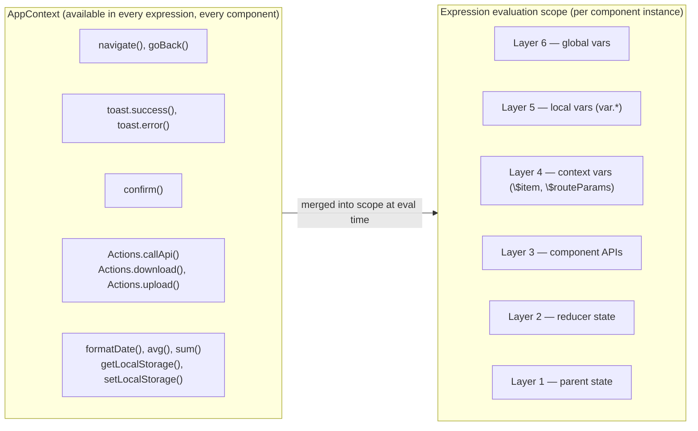

# 15. Global Context & Utilities (AppContext)

## Why This Matters

Every XMLUI expression — whether it's a button's `onClick` handler or a text binding like
`{formatDate(user.createdAt)}` — has access to a rich set of global utilities without any
imports. This isn't magic; it's the `AppContextObject`, assembled once at the top of the React
tree and injected into every expression evaluation context. Understanding what's available and
how it works saves time, prevents re-implementing utilities that already exist, and clarifies
when to reach for a framework function versus plain JavaScript.

---

## What is AppContext?

`AppContextObject` is a flat object containing every global utility available to XMLUI markup.
It is assembled in `AppContent.tsx` using `useMemo()` and stored in a React context. The
`StateContainer` that wraps each component reads this context and merges it into the expression
evaluation scope alongside the component's own state.

From markup's perspective, AppContext functions are just "global functions you can always call":

```xml
<!-- Date formatting -->
<Text>{formatDate(user.createdAt)}</Text>

<!-- Numeric aggregation -->
<Text>Average: {avg(scores, 1)}</Text>

<!-- Storage -->
<Button onClick="writeLocalStorage('theme', 'dark')">Use Dark</Button>

<!-- Navigation -->
<Button onClick="navigate('/dashboard')">Dashboard</Button>

<!-- Confirmation dialog -->
<Button onClick="async () => { if (await confirm('Delete?')) deleteItem() }">Delete</Button>
```

<!-- DIAGRAM: Layered diagram showing AppContext (outer layer) wrapping all expression evaluation contexts in every component. State layers (parent state, vars, loaders, etc.) and AppContext are combined to form the complete expression scope. -->



---

## How AppContext is Assembled

The full `AppContextObject` is built in `AppContent.tsx`:

```ts
const appContextValue = useMemo(() => ({
  version,
  Actions,
  appGlobals,
  ...dateFunctions,   // from appContext/date-functions.ts
  ...mathFunctions,   // from appContext/math-function.ts
  ...localStorageFunctions, // from appContext/local-storage-functions.ts
  ...miscellaneousUtils,    // from appContext/misc-utils.ts
  navigate,
  pathname,
  confirm,
  toast: tracedToast,
  activeThemeId, setTheme, toggleThemeTone, // ... theme management
  loggedInUser, setLoggedInUser,
  mediaSize,
  AppState,
  pubSubService, publishTopic,
  apiInterceptorContext,
  // ...
}), [/* reactive dependencies */]);
```

Each "category" of functions lives in its own module under `xmlui/src/components-core/appContext/`.
This keeps the implementation organized while the external API stays flat — you always call
`formatDate()`, not `appContext.dates.formatDate()`.

---

## Navigation

Four navigation-related values are always available:

| Name | What it is |
|---|---|
| `navigate(path, options?)` | Navigate to a path (wraps react-router `useNavigate`) |
| `pathname` | Current URL pathname (e.g. `"/users/123"`) |
| `routerBaseName` | Router base path (usually `""`) |
| `setNavigationHandlers` | Internal — used by App component to register `willNavigate`/`didNavigate` |

`navigate()` supports history deltas (`navigate(-1)` = back), query params
(`navigate("/search", { queryParams: { q: "hello" } })`), and replace mode
(`navigate("/login", { replace: true })`).

Note: `$pathname`, `$routeParams`, and `$queryParams` (the `$`-prefixed variables) come from
the routing state layer (Layer 6), not from AppContext. They are reactive in the same way but
are a distinct injection path.

---

## Date Utilities

All date functions wrap **date-fns** and respect the system locale. You never need to import
date-fns directly in component code or markup.

### Formatting Functions

```xml
<!-- Basic date/time formatting -->
<Text>{formatDate(order.createdAt)}</Text>           <!-- "4/16/2026" -->
<Text>{formatDateTime(order.createdAt)}</Text>        <!-- "4/16/2026, 2:30 PM" -->
<Text>{formatTime(meeting.startsAt)}</Text>           <!-- "2:30:00 PM" -->
<Text>{formatTimeWithoutSeconds(meeting.startsAt)}</Text> <!-- "2:30 PM" -->
<Text>{formatDateWithoutYear(event.date)}</Text>      <!-- "Apr 16" -->
```

### Smart Formatting

`smartFormatDate()` makes dates human-friendly:

```xml
<Text>{smartFormatDate(post.createdAt)}</Text>
<!-- "Today", "Yesterday", "Apr 15", "4/16/2025" depending on how recent -->
```

### Elapsed Time

```xml
<Text>{formatHumanElapsedTime(comment.createdAt)}</Text>
<!-- "now", "12 seconds ago", "3 hours ago", "yesterday", "3 weeks ago" -->
```

### ISO Conversion

```xml
<!-- Convert date string to ISO 8601 for API calls -->
<DataSource url="/api/events?from={isoDateString(startDate)}" />
```

### Comparison Functions

```xml
<Badge visible="{isToday(event.date)}" label="Today" />
<Text visible="{!isThisYear(doc.createdAt)}">{formatDate(doc.createdAt)}</Text>
<Text>{differenceInMinutes(endTime, startTime)} min</Text>
```

---

## Math Utilities

Only two math functions are in AppContext:

```xml
<!-- Average with 1 decimal place -->
<Text>Avg score: {avg(scores, 1)}</Text>

<!-- Sum -->
<Text>Total: {sum(prices)}</Text>
```

For `min` and `max`, use plain JavaScript: `Math.min(...values)` or `Math.max(...values)`.

---

## Notification & Dialog Functions

### toast

Powered by **react-hot-toast**. `toast()` returns a toast ID you can use to dismiss it:

```xml
<!-- Simple messages -->
<Button onClick="toast('Changes saved')">Save</Button>
<Button onClick="toast.success('Saved!')">Save</Button>
<Button onClick="toast.error('Something went wrong')">Save</Button>

<!-- Loading state that resolves -->
<Button onClick="
  async () => {
    const id = toast.loading('Saving...');
    await saveData();
    toast.dismiss(id);
    toast.success('Saved!');
  }
">Save</Button>

<!-- Promise shorthand -->
<Button onClick="toast.promise(saveData(), {
  loading: 'Saving...',
  success: 'Saved!',
  error: 'Failed to save'
})">Save</Button>
```

### confirm

Opens a modal confirmation dialog. Returns a `Promise<boolean>`:

```xml
<Button onClick="
  async () => {
    if (await confirm('Delete record?', 'This cannot be undone.', 'Delete', 'Cancel')) {
      deleteRecord(item.id);
    }
  }
">Delete</Button>
```

Can also be called with an options object: `confirm({ title: 'Delete?', message: '...', actionLabel: 'Yes' })`.

---

## LocalStorage

XMLUI wraps `localStorage` with dot-path semantics and reactive timestamp tracking. All values
are JSON-serialized automatically.

### Dot-Path Keys

The key `"prefs.theme.tone"` reads `localStorage.getItem("prefs")`, JSON-parses the result,
then accesses `value.theme.tone` using lodash's `get`. Write operations deep-merge:

```xml
<!-- Read/write a nested preference -->
<Button onClick="writeLocalStorage('prefs.theme.tone', 'dark')">Dark Mode</Button>
<Text>{readLocalStorage('prefs.theme.tone', 'light')}</Text>
```

### Simple Values

```xml
<!-- Simple key (no dot) → stored as a raw JSON value -->
<Button onClick="writeLocalStorage('sidebarCollapsed', true)">Collapse</Button>
```

### Reactivity with storageTimestamp

`storageTimestamp` increments after every write/delete/clear call. Use `ChangeListener` to
react to any storage change:

```xml
<ChangeListener listenTo="{storageTimestamp}" onChange="reloadUserPreferences()" />
```

### All Storage Functions

| Function | Description |
|---|---|
| `readLocalStorage(key, fallback?)` | Read; returns `fallback` on missing/error |
| `writeLocalStorage(key, value)` | Write with deep-merge for dot-path keys |
| `deleteLocalStorage(key)` | Delete by dot-path |
| `clearLocalStorage(prefix?)` | Clear all or by root-key prefix |
| `resetLocalStorage(prefix?)` | Alias for `clearLocalStorage` |
| `getAllLocalStorage()` | Snapshot of all entries as a plain object |

---

## Theme Management

The active theme and tone are readable and writable from any expression:

```xml
<!-- Display current theme info -->
<Text>Theme: {activeThemeId}</Text>
<Text>Tone: {activeThemeTone}</Text>

<!-- Theme switching -->
<Button onClick="setTheme('solarized')">Use Solarized</Button>
<Button onClick="toggleThemeTone()">Toggle Dark/Light</Button>
<Button onClick="setThemeTone('dark')">Force Dark</Button>

<!-- Available themes in a dropdown -->
<Select items="{availableThemeIds}" onValueChange="setTheme($item)" />
```

`getThemeVar("color-primary-App")` reads a live CSS variable value — useful when passing theme
colors into non-XMLUI contexts (e.g., canvas drawing, chart colors).

---

## User Management

A simple user context is built in:

```xml
<!-- Access current user info -->
<Text>Hello, {loggedInUser?.name}</Text>
<HStack visible="{loggedInUser?.permissions.admin === 'true'}">
  <AdminPanel />
</HStack>
```

`setLoggedInUser(user)` stores the user object and triggers reactivity. Call it after a
successful authentication API response. Use `null` to mark the user as logged out.

The `LoggedInUserDto` type has `id`, `email`, `name`, `imageRelativeUrl`, and `permissions`.
However, `setLoggedInUser` accepts any object — the `LoggedInUserDto` type is guidance, not
enforcement.

---

## Responsive Layout

`mediaSize` gives you real-time breakpoint information:

```xml
<!-- Show different content at different breakpoints -->
<HStack visible="{mediaSize.desktop}">
  <FullSidebar />
</HStack>
<HStack visible="{mediaSize.smallScreen}">
  <CompactNav />
</HStack>

<!-- Conditional text -->
<Text>{mediaSize.phone ? 'Mobile' : 'Desktop'}</Text>

<!-- sizeIndex for comparisons -->
<List columns="{mediaSize.sizeIndex >= 3 ? 3 : 1}" />
```

| `size` | Semantic name | `sizeIndex` |
|---|---|---|
| `xs` | phone | 0 |
| `sm` | landscapePhone | 1 |
| `md` | tablet | 2 |
| `lg` | desktop | 3 |
| `xl` | largeDesktop | 4 |
| `xxl` | xlDesktop | 5 |

---

## Miscellaneous Utilities

| Function | Example |
|---|---|
| `capitalize("hello")` | `"Hello"` |
| `pluralize(3, "item", "items")` | `"items"` |
| `defaultTo(null, "fallback")` | `"fallback"` |
| `delay(1000)` | Pause for 1 second (in async handler) |
| `debounce(300, fn, arg)` | Debounce a function call |
| `toHashObject(users, "id", "name")` | `{ "1": "Alice", "2": "Bob" }` |
| `findByField(users, "id", 42)` | First user where `id === 42` |
| `distinct([1, 2, 2, 3])` | `[1, 2, 3]` |

---

## PubSub Messaging

`publishTopic` sends a message to all components that subscribe via `subscribeToTopic`:

```xml
<!-- Publisher -->
<Button onClick="publishTopic('refresh-list', { filter: 'active' })">Refresh</Button>

<!-- Subscriber (in another component) -->
<UserList subscribeToTopic="refresh-list" onTopicReceived="(data) => reload(data.filter)" />
```

---

## appGlobals: App-Level Configuration

`appGlobals` holds values loaded from `config.json` or passed as props to the `App` component.
It's meant for static configuration (API base URLs, feature flags, tenant settings) not for
calling functions:

```xml
<!-- config.json: { "apiBase": "https://api.myapp.com", "featureFlags": { "newDashboard": true } } -->
<DataSource url="{appGlobals.apiBase}/users" />
<NewDashboard visible="{appGlobals.featureFlags.newDashboard}" />
```

Don't confuse `appGlobals` with extension functions. Extension functions (added via
`Extension.functions`) become callable directly — `myExtFunction(x)` — not via `appGlobals`.

---

## Actions Namespace

`Actions` is a proxy to all registered action functions from the ComponentRegistry:

```xml
<!-- Invoke a named action programmatically -->
<Button onClick="Actions.submitForm()">Submit</Button>
```

Actions run through the full action execution pipeline — async, with success/error handling,
cache invalidation, and inspector tracing. This is different from calling a plain JavaScript
function or a navigation function.

---

## API Interceptor Context

`apiInterceptorContext` exposes the MSW (Mock Service Worker) configuration for API mocking:

```ts
// In development tooling or test setup
if (apiInterceptorContext.isMocked("/api/users")) {
  console.log("Users API is mocked");
}
```

This is primarily used by internal framework tooling and test infrastructure. Application
markup rarely accesses this directly.

---

## Adding a New Global Utility

When a utility doesn't exist in AppContext and you need to add it for framework users:

1. **Create the module** in `xmlui/src/components-core/appContext/`:

```ts
// my-utils.ts
export const myUtils = {
  truncate: (text: string, maxLength: number): string =>
    text.length <= maxLength ? text : `${text.slice(0, maxLength - 1)}…`,
};
```

2. **Import and spread** in `AppContent.tsx`:

```ts
import { myUtils } from "../appContext/my-utils";
// inside useMemo:
const appContextValue = useMemo(() => ({
  ...myUtils,
  // ...
}), [...]);
```

3. **Add the type** to `AppContextObject` in `AppContextDefs.ts`:

```ts
truncate: (text: string, maxLength: number) => string;
```

After this, `truncate("Hello World", 8)` works in any XMLUI expression.

---

## Key Files

| File | Purpose |
|---|---|
| [xmlui/src/abstractions/AppContextDefs.ts](../../xmlui/src/abstractions/AppContextDefs.ts) | `AppContextObject` type — the complete API surface |
| [xmlui/src/components-core/rendering/AppContent.tsx](../../xmlui/src/components-core/rendering/AppContent.tsx) | Context assembly and provider |
| [xmlui/src/components-core/appContext/date-functions.ts](../../xmlui/src/components-core/appContext/date-functions.ts) | Date utility module |
| [xmlui/src/components-core/appContext/math-function.ts](../../xmlui/src/components-core/appContext/math-function.ts) | Math utility module |
| [xmlui/src/components-core/appContext/local-storage-functions.ts](../../xmlui/src/components-core/appContext/local-storage-functions.ts) | localStorage module |
| [xmlui/src/components-core/appContext/misc-utils.ts](../../xmlui/src/components-core/appContext/misc-utils.ts) | Miscellaneous utilities |
| [xmlui/src/components-core/utils/date-utils.ts](../../xmlui/src/components-core/utils/date-utils.ts) | Underlying date-fns wrappers |
| [xmlui/src/components-core/StandaloneApp.tsx](../../xmlui/src/components-core/StandaloneApp.tsx) | Extension function merging into globalVars |

---

## Key Takeaways

- `AppContextObject` is a flat bag of ~60 utilities assembled in `AppContent.tsx` and injected into every expression scope — no imports needed in markup.
- AppContext is NOT a state composition layer; it is a separate evaluation context merged alongside the 6 state layers.
- **Date functions** wrap date-fns with locale-aware formatting. `smartFormatDate` and `formatHumanElapsedTime` produce user-friendly strings. Never import date-fns directly.
- **localStorage functions** use dot-path semantics: `"prefs.theme"` reads `localStorage["prefs"].theme`. Use `storageTimestamp` with `ChangeListener` for reactivity.
- `toast()` (react-hot-toast), `confirm()` (modal dialog), and `signError()` are the three UI notification primitives. `toast.promise()` is the cleanest way to handle async feedback.
- `mediaSize` gives real-time breakpoint flags (`mediaSize.desktop`, `mediaSize.size`). Use these instead of CSS-only responsive design when conditional rendering logic is needed.
- `loggedInUser` / `setLoggedInUser` is a lightweight user context — no auth library, just reactive state. `null` means no user logged in.
- **Only `avg` and `sum` exist** as math utilities. Use `Math.min()`, `Math.max()`, `Math.round()` etc. for everything else.
- To add a new global utility: create a module in `appContext/`, spread into `appContextValue`, add the type to `AppContextDefs.ts`.
- Extension `functions` do NOT land in AppContext — they are merged into `globalVars` separately in `StandaloneApp` initialization.
