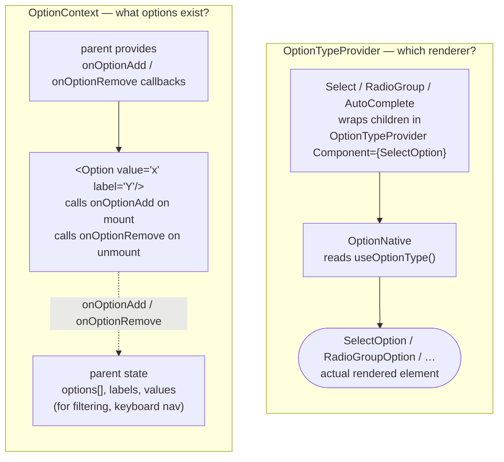

# 16. Option-Based Components

## Why This Matters

Four XMLUI components — `Select`, `AutoComplete`, `RadioGroup`, and `Pagination` — share a
common design for presenting a fixed set of selectable choices. Understanding this shared
architecture is important for two reasons: (1) it explains several behaviors that seem
surprising at first (like why options disappear in searchable Selects), and (2) it gives you
a clear template for building new components that need to offer choices.

The core insight is that **presenting options and collecting option data are two separate
concerns**, solved by two separate React contexts. Once that separation clicks, the whole
system makes sense.

---

## What Is an "Option"?

An `Option` is a non-visual data structure describing a single selectable choice. In markup, it
looks like this:

```xml
<Select>
  <Option value="1" label="First Choice" />
  <Option value="2" label="Second Choice" />
  <Option value="3" label="Third Choice" enabled="false" />
</Select>
```

The `Option` component itself renders nothing directly. Instead, it delegates to whatever
renderer the parent component has specified — a dropdown item for Select, a radio button for
RadioGroup, or a hidden span just to register the data. The same `<Option>` markup adapts to
its context.

The `Option` type has these fields:

| Field | Default | Purpose |
|---|---|---|
| `value` | required | The underlying value committed to form state |
| `label` | → `value` | Display text; defaults to `value` if absent |
| `enabled` | `true` | When `false`: visible, but not selectable or keyboard-navigable |
| `keywords` | none | Extra search terms (e.g., `"USA"` for value `"us"`) |
| `children` | none | Rich React content that replaces the plain label |
| `optionRenderer` | none | Per-option custom render function |

**Value validation:** Only `string`, `number`, `boolean`, and `null` are valid option values.
Objects, arrays, and `NaN` are all normalized to `""` automatically.

---

## The Two-Context Architecture

Two React contexts work together to make the pattern work:

<!-- DIAGRAM: Two-column diagram showing OptionContext (left: data flow, onOptionAdd/onOptionRemove arrows from Option up to parent state) and OptionTypeProvider (right: renderer dispatch, parent picks component type, OptionNative reads and delegates) -->



### OptionTypeProvider: "Which renderer should I use?"

Every parent component wraps its children in `OptionTypeProvider` with a specific React
component as the value:

```tsx
// In Select's render method
<OptionTypeProvider Component={SelectOption}>
  {children}  {/* child <Option> elements are here */}
</OptionTypeProvider>
```

When `OptionNative` (the actual React component behind each `<Option>`) renders, it reads from
this context and delegates:

```tsx
export const OptionNative = memo((props: Option) => {
  const OptionType = useOptionType();  // ← reads from OptionTypeProvider
  if (!OptionType) return null;
  return <OptionType {...props} />;   // ← renders as SelectOption, RadioGroupOption, etc.
});
```

This is how the same `<Option value="x" label="Y" />` markup becomes a Radix dropdown item
inside Select and a radio button inside RadioGroup — same markup, different parent, different
renderer injected.

### OptionContext: "What options exist?"

For components that need to know what options are present (for filtering, keyboard navigation,
etc.), a second context is used for **data registration**:

```tsx
// Parent provides callbacks
<OptionContext.Provider value={{ onOptionAdd, onOptionRemove }}>
  {children}
</OptionContext.Provider>
```

The `HiddenOption` renderer (assigned via `OptionTypeProvider`) registers itself when mounted
and unregisters when unmounted:

```tsx
useEffect(() => {
  onOptionAdd(option);
  return () => onOptionRemove(option);
}, [option]);
```

The parent collects all options in a `Set<Option>` which it uses for filtering and rendering.

The beauty of `Set` here: if you use `{items.map(item => <Option value="{item.id}" />)}` in
markup, options are dynamically added and removed as the `items` array changes, and the parent
always has an up-to-date set.

---

## Select: Two Rendering Modes

Select is the most complex option-based component because it has two distinct rendering modes.

### When Simple Mode Is Used

Simple mode activates when `searchable` is `false` (default) AND `multiSelect` is `false`
(default). It uses the Radix UI Select primitive directly:

```xml
<!-- Simple mode: no searchable, no multiSelect -->
<Select>
  <Option value="a" label="Alpha" />
  <Option value="b" label="Beta" />
</Select>
```

In simple mode:
- Options render as Radix `Select.Item` components — the browser handles the dropdown.
- `OptionTypeProvider` is set to `SelectOption`.
- `OptionContext` is NOT used — Radix manages option state internally.
- Performance is best, accessibility is native browser behavior.

### When Advanced Mode Is Used

Either `searchable` or `multiSelect` triggers advanced mode. This is where the two-context
pattern becomes essential:

```xml
<!-- Advanced mode: searchable -->
<Select searchable="true">
  <Option value="fr" label="France" keywords="{['French', 'Française']}" />
  <Option value="de" label="Germany" />
</Select>
```

In advanced mode, options must be:
1. **Collected** as data (for filtering + keyboard navigation)
2. **Rendered** in a Popover (so XMLUI controls the list UI, not the browser)

This requires a split strategy. `OptionTypeProvider` is set to `HiddenOption`, so all child
`<Option>` elements render as invisible `<span>` elements and register their data via
`OptionContext`. The actual visible items are rendered separately from the collected option set:

```tsx
// What happens inside Select in advanced mode:
<OptionTypeProvider Component={HiddenOption}>  ← options register silently
  <OptionContext.Provider value={{ onOptionAdd, onOptionRemove }}>
    {children}                                  ← <Option> elements render as hidden spans
  </OptionContext.Provider>
</OptionTypeProvider>

<Popover>
  <PopoverContent>
    {filteredOptions.map((option) => (          ← visible items from collected set
      <MultiSelectOption key={option.value} {...option} />
    ))}
  </PopoverContent>
</Popover>
```

This explains a behavior that might seem odd at first: **in searchable/multi-select mode,
the `<Option>` children in your markup are invisible.** They exist purely to populate the
option set. The visible dropdown items are generated by the Select component itself.

### Filtering

Select's filter searches across three fields simultaneously:

```
{option.value} {option.label} {option.keywords.join(" ")}
```

This means you can provide search synonyms via `keywords`:

```xml
<!-- User can find this by typing "US", "USA", "America", or "united" -->
<Option value="us" label="United States" keywords="{['US', 'USA', 'America']}" />
```

Case-insensitive substring match. No debouncing — happens on every keystroke.

### Grouping with groupBy

Select supports visual grouping via the `groupBy` prop. `groupBy` names an extra field on your
`Option` objects:

```xml
<Select groupBy="department">
  <Option value="eng1" label="Alice" department="Engineering" />
  <Option value="eng2" label="Bob" department="Engineering" />
  <Option value="des1" label="Carol" department="Design" />
</Select>
```

Options without the named field are collected into an "Ungrouped" group, which appears first.
Named groups are sorted alphabetically.

---

## AutoComplete

AutoComplete shares the same `HiddenOption`/`OptionContext` data collection as Select's
advanced mode. Key differences:

- **No simple mode** — always uses the Popover + hidden-option pattern.
- **Input-driven filtering** — the text input itself is the search box. `inputValue`
  (what you see in the input) and `searchTerm` (what drives filtering) are tracked separately
  so the input can show a selected label while the filter is cleared.
- **Creatable options** — when `creatable="true"`, a "Create X" item appears at the top of the
  dropdown when the search term doesn't match any existing option. Selecting it adds the item
  to the option set and fires `onItemCreated`.

```xml
<AutoComplete creatable="true" placeholder="Type a tag or create one">
  <Option value="react" label="React" />
  <Option value="vue" label="Vue" />
  <Option value="angular" label="Angular" />
</AutoComplete>
```

The creatable item only appears when:
1. `creatable` is `true`
2. `searchTerm` is non-empty
3. No existing option has a matching `value` or `label`
4. The current `value` doesn't already match the search term
5. `filteredOptions` is empty

---

## RadioGroup: The Exception

RadioGroup is the odd one out. It does NOT use `OptionContext` or `OptionTypeProvider`. Instead
it uses a simpler `RadioGroupStatusContext`:

```ts
const RadioGroupStatusContext = createContext({
  value: undefined,
  setValue: undefined,
  status: "none",   // ValidationStatus
  enabled: true,
});
```

Why the difference? Because RadioGroup has no need for dynamic option collection:

- All options are always rendered visibly — there's no dropdown, no hidden phase.
- There's no search or filtering.
- Radix UI's `RadioGroup` primitive handles keyboard navigation.

`RadioGroupOption` directly reads `RadioGroupStatusContext` for the current value (to know
which radio to show as checked), the validation status (for error styling), and the group's
`enabled` state.

Custom rendering for RadioGroup options receives `{ $checked, $setChecked }` in the context:

```xml
<RadioGroup value="{selectedPlan}">
  <Option value="free">
    <VStack>
      <Text weight="bold">{$checked ? "✓ " : ""}Free</Text>
      <Text size="sm">Up to 3 users</Text>
    </VStack>
  </Option>
  <Option value="pro">
    <VStack>
      <Text weight="bold">Pro</Text>
      <Text size="sm">Unlimited users</Text>
    </VStack>
  </Option>
</RadioGroup>
```

---

## Pagination

Pagination is the simplest option-based component. It uses Select internally and generates its
options **programmatically** using `OptionNative` directly rather than `<Option>` markup:

```tsx
{pageSizeOptions.map((option) => (
  <OptionNative key={option} value={`${option}`} label={`${option} / page`} />
))}
```

From an architecture perspective, Pagination is just a wrapper. All option logic is inherited
from Select. Application developers typically don't use `<Option>` with Pagination at all —
the `pageSizeOptions` prop drives the choices.

---

## Custom Option Content

There are three levels of customization:

### Level 1: Rich children (most common)

```xml
<Option value="jdoe">
  <HStack gap="sm">
    <Avatar src="{user.avatar}" size="sm" />
    <VStack gap="none">
      <Text weight="semibold">{user.name}</Text>
      <Text size="xs" color="muted">{user.email}</Text>
    </VStack>
  </HStack>
</Option>
```

The child content is passed as `children` on the `Option` object. When rendered, if `children`
is present, it shows instead of the plain `label`.

### Level 2: Per-option renderer function

When child content is complex XMLUI markup (not a single string), the renderer is automatically
compiled into an `optionRenderer` function that receives context variables. For RadioGroup,
the context includes `$checked` and `$setChecked`.

### Level 3: Component-level optionRenderer (Select only)

```xml
<Select optionRenderer="(opt, selected, inTrigger) => opt.label + (selected === opt.value ? ' ✓' : '')">
  <Option value="a" label="Alpha" />
</Select>
```

A function applied to ALL options as the default renderer. Only used when the individual
option has no children or per-option renderer.

**Rendering priority:** children → per-option optionRenderer → component-level optionRenderer → label string.

---

## Adding a New Option-Based Component

If you're building a new component that shows a fixed set of choices:

**You need `OptionContext` + `HiddenOption` if:**
- Options need to be filtered (search, substring match)
- Options need keyboard navigation from a collected set
- The dropdown/list UI is rendered separately from the option declarations

**You can use direct rendering (RadioGroup style) if:**
- All options are always visible
- No filtering or search needed
- The parent controls rendering order directly

For the first case, the minimal setup is:

```tsx
// 1. State for collected options
const [options, setOptions] = useState(new Set<Option>());
const onOptionAdd = useCallback((opt) => setOptions((p) => new Set(p).add(opt)), []);
const onOptionRemove = useCallback((opt) => {
  setOptions((p) => { const s = new Set(p); s.delete(opt); return s; });
}, []);

// 2. Provide OptionContext + OptionTypeProvider (HiddenOption for silent collection)
<OptionTypeProvider Component={HiddenOption}>
  <OptionContext.Provider value={{ onOptionAdd, onOptionRemove }}>
    {children}
  </OptionContext.Provider>
</OptionTypeProvider>

// 3. Render from the collected option set
{Array.from(options).map((opt) => (
  <MyCustomItem key={opt.value} {...opt} onSelect={() => onChange(opt.value)} />
))}
```

---

## Form Integration

All option-based components integrate with XMLUI's Form system through the `FormBinding`
behavior (automatically attached when a component is inside a `<Form>` or has a `bindTo` prop):

```xml
<Form onSubmit="submitUser">
  <FormItem label="Role">
    <Select bindTo="role" initialValue="viewer">
      <Option value="viewer" label="Viewer" />
      <Option value="editor" label="Editor" />
      <Option value="admin" label="Admin" />
    </Select>
  </FormItem>
</Form>
```

The component's current `value` is bound to the named form field. Validation (required, pattern,
custom) and form reset all work the same as for text input components.

---

## Key Files

| File | Purpose |
|---|---|
| [xmlui/src/components/abstractions.ts](../../xmlui/src/components/abstractions.ts) | `Option` type definition |
| [xmlui/src/components/Option/OptionNative.tsx](../../xmlui/src/components/Option/OptionNative.tsx) | `OptionNative` adapter + `convertOptionValue` |
| [xmlui/src/components/Option/OptionTypeProvider.tsx](../../xmlui/src/components/Option/OptionTypeProvider.tsx) | `OptionTypeProvider` + `useOptionType` |
| [xmlui/src/components/Option/Option.tsx](../../xmlui/src/components/Option/Option.tsx) | Component renderer for `<Option>` markup |
| [xmlui/src/components/Select/OptionContext.ts](../../xmlui/src/components/Select/OptionContext.ts) | `OptionContext` + `useOption` |
| [xmlui/src/components/Select/SelectNative.tsx](../../xmlui/src/components/Select/SelectNative.tsx) | Select — main logic, modes, filtering, groupBy |
| [xmlui/src/components/Select/HiddenOption.tsx](../../xmlui/src/components/Select/HiddenOption.tsx) | Data-only renderer for option collection |
| [xmlui/src/components/AutoComplete/AutoCompleteNative.tsx](../../xmlui/src/components/AutoComplete/AutoCompleteNative.tsx) | AutoComplete + creatable options |
| [xmlui/src/components/RadioGroup/RadioGroupNative.tsx](../../xmlui/src/components/RadioGroup/RadioGroupNative.tsx) | RadioGroup + `RadioGroupStatusContext` |
| [xmlui/src/components/Pagination/PaginationNative.tsx](../../xmlui/src/components/Pagination/PaginationNative.tsx) | Pagination (uses Select internally) |
| [xmlui/dev-docs/components-with-options.md](../components-with-options.md) | Existing architecture reference (more detail) |

---

## Key Takeaways

- The option pattern solves two concerns with two contexts: `OptionTypeProvider` tells `Option` *how to render*, `OptionContext` lets the parent *collect what options exist*.
- `OptionNative` has zero rendering logic of its own — it's purely a delegate to whatever the `OptionTypeProvider` has specified.
- In Select's advanced mode (searchable or multi-select), `<Option>` elements are intentionally invisible. They render as `HiddenOption` to populate a `Set<Option>` state; visible items are generated separately from that set.
- RadioGroup is the exception: it skips both contexts and uses `RadioGroupStatusContext` directly. This is correct because all options are always visible and no collection phase is needed.
- `HiddenOption` is the bridge enabling dynamic, filtered, and searchable option lists. Any new filterable selection component should use the same `HiddenOption` + `OptionContext` pattern.
- Custom option content has three levels: rich child markup, per-option `optionRenderer`, and component-level `optionRenderer` prop. Children take priority; plain label is the fallback.
- `keywords` extends search coverage beyond value and label at no extra cost — add synonyms to options for better UX in searchable selects.
