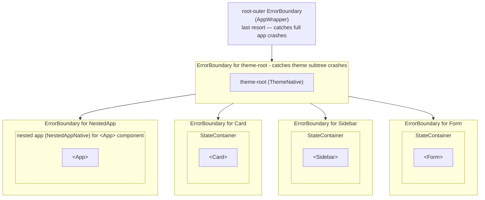
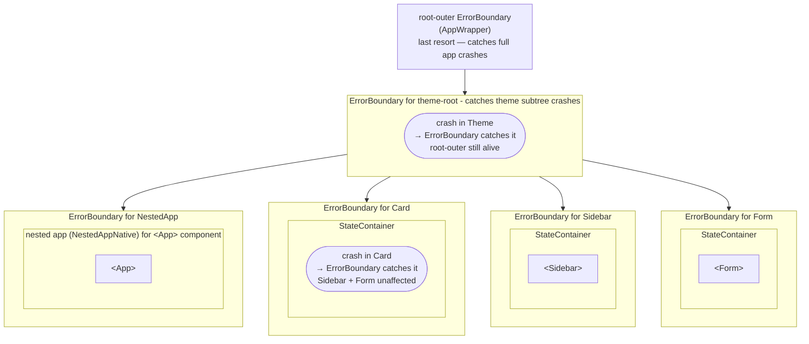

# 17. Error Handling Strategy

## Why This Matters

In a framework where user code (markup expressions, event handlers, data bindings) runs
everywhere, errors are inevitable. XMLUI's error handling strategy has one core goal: **a
failure in one component should never take down the whole application**. Understanding how
errors are caught, surfaced, and recovered from matters both when you're debugging a production
issue and when you're building new components that need to handle failures gracefully.

---

## The Five Error Domains

XMLUI handles errors differently depending on where they originate:

| Domain | Origin | Catch Mechanism | User Sees |
|---|---|---|---|
| Render errors | React component throws during render | `ErrorBoundary` class component | Inline red overlay |
| Handler errors | `onClick`, `onSubmit`, etc. throw | `try/catch` in event handler runner | Red toast notification |
| Loader errors | `DataSource` / `APICall` fetch fails | `LOADER_ERROR` reducer action | Toast or custom message |
| Parse errors | Invalid `.xmlui` markup or script | `errReport*` fallback components | Full-page error UI |
| Bootstrap errors | Module loading failure on startup | Console + null render | Console output |

Each domain has its own containment strategy. A loader failure in one component doesn't trigger
an error boundary. A render crash doesn't affect sibling components. A parse error in one
`.xmlui` file doesn't prevent other components from loading.

---

## Render Errors: ErrorBoundary

React's error boundary mechanism requires a class component. XMLUI's `ErrorBoundary` is
defined in `xmlui/src/components-core/rendering/ErrorBoundary.tsx`:

```tsx
export class ErrorBoundary extends React.Component<Props, State> {
  state = { hasError: false, error: null };

  static getDerivedStateFromError(error: Error) {
    return { hasError: true, error };
  }

  componentDidCatch(error: Error, errorInfo: ErrorInfo) {
    console.error("Uncaught error:", error, errorInfo, this.props.location);
    pushXsLog({ kind: "error:boundary", error: { message: error.message }, ... });
  }

  componentDidUpdate(prevProps: Props) {
    // Auto-reset when the wrapped component definition changes
    if (prevProps.node !== this.props.node) {
      this.setState({ hasError: false });
    }
  }

  render() {
    return this.state.hasError ? (
      <div data-error-boundary>
        <div>There was an error!</div>
        <div>{this.state.error?.message}</div>
      </div>
    ) : this.props.children;
  }
}
```

### Placement: Every Component Gets a Boundary

The key placement is in `StateContainer.tsx`:

```tsx
return (
  <ErrorBoundary node={node} location={"container"}>
    <Container ...>{children}</Container>
  </ErrorBoundary>
);
```

Since `StateContainer` wraps **every XMLUI component** (it's how state is provided), every
component in the tree has its own error boundary automatically. A rendering crash in a `Card`
component shows a red box where the `Card` was; everything else on the page continues working.

Additional boundaries exist at:
- `AppWrapper` (`location: "root-outer"`) — the outermost safety net
- `ThemeNative` (`location: "theme-root"`) — theme component subtree
- `NestedAppNative` — each nested `<App>` component

<!-- DIAGRAM: Tree showing the nesting of ErrorBoundaries: root-outer (AppWrapper) → theme-root (ThemeNative) → container (StateContainer per component). Show how a crash at any level is caught by the nearest ancestor boundary without affecting siblings. -->



Crashes and errors are caught in their respective ErrorBoundaries:



### Auto-Recovery on Navigation

When the user navigates to a new page, the `node` prop on the relevant boundaries changes
(because a new `ComponentDef` is returned from the route). The boundary's `componentDidUpdate`
detects this and resets `hasError` to `false`. This means navigating away from a broken page
and back clears the error display automatically.

### What the Fallback Looks Like

The fallback renders a `<div data-error-boundary>` with:
- A title: "There was an error!"
- The error's `.message` string

The `data-error-boundary` attribute is specifically designed for E2E test selection, so tests
can assert whether an error boundary was triggered.

---

## Event Handler Errors

Every event handler (from `onClick` to `onSubmit`) runs through a central handler execution
path in `event-handlers.ts`. This path wraps all evaluation in `try/catch`:

```ts
try {
  // Evaluate all statements in the handler
  // await async operations
} catch (e) {
  // 1. Log to handler trace
  handlerLogger.logHandlerError({ uid, eventName, error: e });

  // 2. Show toast notification (unless suppressed)
  if (options?.signError !== false) {
    appContext.signError(e as Error);
  }

  // 3. Update container state
  dispatch({ type: ContainerActionKind.EVENT_HANDLER_ERROR, payload: { uid, eventName, error: e } });

  // 4. Re-throw (so the caller knows the handler failed)
  throw e;
} finally {
  handlerLogger.cleanupTrace(traceId);
}
```

The important consequence: **every event handler error shows a toast by default**. If you
want to suppress the toast (because you're handling the error yourself in the markup), use
`signError: false` in handler options — but this is an internal framework option, not
something markup authors typically set.

### ThrowStatementError

When markup code explicitly uses `throw`:

```xml
<Button onClick="
  () => {
    if (!isValid) throw 'Validation failed';
    submitData();
  }
">Submit</Button>
```

This throws a `ThrowStatementError` which bubbles up through the handler catch block. If
`signError` is not suppressed, the user sees a toast with the thrown message.

---

## signError(): The Error Notification Primitive

`signError()` is available as a global function in markup and is the canonical way to surface
an error to the user:

```ts
function signError(error: Error | AppError | string | unknown) {
  const appError = AppError.from(error);              // normalize via plan #07
  const message = appError.message;
  toast.error(message);                               // Red toast
  console.error("[xmlui]", message);                  // Console (Playwright captures this)
  pushXsLog({
    kind: "error:runtime",
    error: {
      message,
      stack: appError.cause instanceof Error ? appError.cause.stack : undefined,
    },
  });
}
```

> **Wave 1 update (plan #07).** `signError` now accepts any thrown value (`Error | AppError | string | unknown`) and normalizes it through [`AppError.from()`](#apperror--structured-exception-type-plan-07-wave-01). `ErrorBoundary.componentDidCatch` does the same and includes the resulting `category` field in the `kind:"error:boundary"` trace entry.

You can call it directly in event handlers:

```xml
<Button onClick="
  async () => {
    try {
      await submitForm();
    } catch (e) {
      signError('Submission failed: ' + e.message);
    }
  }
">Submit</Button>
```

The `[xmlui]` console prefix is deliberate — Playwright E2E tests use `page.on('console')`
to capture errors, and the prefix makes filtering reliable.

---

## Loader and DataSource Errors

When a `DataSource` fetch fails, the error flows through a structured path:

**1. Fetch failure → `LOADER_ERROR` reducer action**

```ts
// reducer.ts
case ContainerActionKind.LOADER_ERROR: {
  state[uid] = { ...state[uid], error, inProgress: false, loaded: true };
  break;
}
```

**2. `$error` context variable becomes available**

The `$error` variable has this shape:

```ts
{
  statusCode: number;  // HTTP status, or 500 for non-HTTP errors
  message: string;     // Error message
  details: any;        // Extra structured detail from the server
  response: any;       // Raw response body (if available)
}
```

**3. User notification depends on DataSource configuration**

```xml
<!-- Default: signError() → toast with raw message -->
<DataSource url="/api/users" />

<!-- Custom message using $error: -->
<DataSource
  url="/api/users"
  errorNotificationMessage="Failed to load users: {$error.message}"
/>

<!-- Custom handler: -->
<DataSource
  url="/api/users"
  onError="
    (err) => {
      if (err.statusCode === 403) {
        navigate('/forbidden');
        return false;  // Suppress default toast
      }
    }
  "
/>
```

Returning `false` from `onError` suppresses the automatic toast notification.

---

## Action Execution Errors

For `APICall`, `FileUpload`, and `FileDownload` actions, the error handling is declarative
in the markup:

```xml
<Button>
  <APICall url="/api/save" method="POST" body="{formData}">
    <success>
      <Navigate target="/done" />
    </success>
    <error>
      <!-- $error is available here -->
      <Fragment onMount="signError('Save failed: ' + $error.message)" />
    </error>
  </APICall>
</Button>
```

If no `<error>` action is defined, `signError()` is called automatically with the error
message from the failed request.

---

## Parse-Time Errors: Full-Page Error UIs

When a `.xmlui` file can't be parsed, the XMLUI parser doesn't crash — it substitutes the
broken component with a fallback error display component. The rest of the application
continues rendering normally.

Three error display factories exist:

**XML markup errors** — e.g., malformed XML or unknown attribute:
```
3 errors while processing XMLUI markup
 Line 12, Col 5: Unexpected token '<'
 Line 15, Col 1: Unknown attribute 'onClcik' (did you mean 'onClick'?)
```

**Code-behind script errors** — e.g., syntax error in `<script>` block:
```
An error found while processing XMLUI code-behind script
  File: components/UserCard.xmlui
  Line 8, Col 12: Unexpected token ':'
```

**Module import errors** — e.g., circular dependency or unresolved import:
```
Module errors in: components/UserCard.xmlui
  Circular dependency detected: UserCard → helpers → UserCard
```

These error UIs have precise file/line/column information and syntax-highlighted context.
They appear inline where the broken component would have rendered, not as a global error
overlay.

---

## Custom Error Types

XMLUI defines a hierarchy of error types in `xmlui/src/components-core/utils/EngineError.ts`:

```
EngineError (abstract)
├── GenericBackendError      — HTTP/API failures (parses RFC 7807, Google, Microsoft formats)
├── ScriptParseError         — Parser failure with source position
├── StatementExecutionError  — Runtime expression evaluation failure
├── ThrowStatementError      — User throw statement; carries errorObject
└── NotAComponentDefError    — Type mismatch (ComponentDef expected)

Error (standard)
├── CodeBehindParseError     — Multiple script parse errors from one file
└── ParseVarError            — Variable resolution failure during container init
```

`GenericBackendError` is the most important for application code. It auto-parses multiple
server error formats so you can always access `.statusCode`, `.message`, and `.details`
regardless of which error convention the API uses.

---

## Trace Integration

All error domains write to the trace system via `pushXsLog()`:

| Event | `kind` | Contents |
|---|---|---|
| React render crash | `"error:boundary"` | message, stack, component stack, boundary location, `category` (from `AppError.from`) |
| `signError()` call | `"error:runtime"` | message, stack |
| Handler failure | `"error:handler"` | uid, eventName, error details |
| Structured error pipeline | `"errors"` | `code: ErrorDiagnosticCode`, `source`, `severity`, `message`, optional `componentUid`, `correlationId` (plan #07) |

`pushXsLog()` is a complete noop when `window._xsVerbose` is not set (the default). There is
no performance cost for trace calls in production.

To enable verbose tracing in a browser:
```js
window._xsVerbose = true;
// Then reproduce the error — logs appear in window._xsLogs
```

---

## AppError — Structured Exception Type (plan #07, Wave 0/1)

`AppError` is the canonical structured exception class introduced by plan #07. It lives at [xmlui/src/components-core/errors/](../../src/components-core/errors/index.ts) and replaces bare `Error` / string throws at every XMLUI error boundary site (`ErrorBoundary`, `event-handlers`, `LOADER_ERROR`).

### Construction

```ts
import { AppError, type ErrorCategory, type AppErrorInit } from "@xmlui/.../errors";

throw new AppError({
  code: "ORDER_LOCKED",
  category: "conflict",          // governs default retryability
  message: "This order is locked by another user",
  correlationId: response.headers.get(appGlobals.errorCorrelationIdHeader) ?? undefined,
  data: { orderId: "42" },
  cause: originalError,
});
```

### Categories

`ErrorCategory` is one of:

| Category | Default `retryable` | Typical source |
|---|---|---|
| `network` | `true` | DNS, TCP, timeout |
| `validation` | `false` | 400, 422 |
| `authorization` | `false` | 401, 403 |
| `not-found` | `false` | 404 |
| `conflict` | `true` | 409 |
| `rate-limit` | `true` | 429 |
| `server` | `true` | 5xx |
| `internal` | `false` | framework / coding bug |
| `user-cancelled` | `false` | explicit cancellation |

Override per-instance via `AppErrorInit.retryable`.

### Normalization

`AppError.from(unknown)` is the canonical normalizer:

- An existing `AppError` is returned unchanged (no double-wrapping).
- A plain `Error` is wrapped with `category: "internal"`, `code: "unknown"`, and the original error attached as `cause`.
- A string becomes the `message`; anything else is `String()`-ified.

`signError()` (in [AppContent.tsx](../../src/components-core/rendering/AppContent.tsx)) and `ErrorBoundary.componentDidCatch` (in [ErrorBoundary.tsx](../../src/components-core/rendering/ErrorBoundary.tsx)) both call `AppError.from(...)` on the incoming value.

### Serialization

`appError.toJSON()` returns a JSON-safe object with `name`, `code`, `category`, `retryable`, `message`, optional `correlationId`, optional `data`, and a recursive `cause` walk. Use it for trace entries and server-side logs.

### Other exports from `components-core/errors`

| Symbol | Purpose |
|---|---|
| `RetryPolicySpec` | Spec for retry behaviour (max attempts, backoff). Stub today; consumed by `executeWithPolicy` in later phases. |
| `CircuitBreakerSpec` | Spec for circuit-breaker behaviour. Stub today. |
| `executeWithPolicy(...)` | Stub helper that will execute a callable under a `RetryPolicySpec` / `CircuitBreakerSpec` once Phase 2 lands. |
| `ErrorDiagnostic` | Runtime diagnostic shape consumed by the `kind:"errors"` Inspector trace. |
| `ErrorDiagnosticCode` | Code union for the runtime diagnostic. |
| `ErrorSource` | Source classifier (`boundary`, `handler`, `loader`, `script`, …). |

### App globals

Two `App.appGlobals` entries govern the rollout (see [15-app-context.md](15-app-context.md)):

- `strictErrors: boolean` (default `false`) — when `true`, throwing a plain `Error` from script logs a `kind:"errors"` warn diagnostic with a migration hint to use `AppError`. Flips to `true` in the next major release.
- `errorCorrelationIdHeader: string` (default `"X-Correlation-Id"`) — the HTTP response header from which `AppError.correlationId` is read on fetch failures.

### When to throw `AppError` from your code

- **Always** at the boundary between an HTTP response and your application logic (translate status codes into categories there).
- **Always** when you intentionally throw from script — it produces a structured trace entry that doesn't trip the `strictErrors` migration warning.
- **Don't** wrap exceptions you don't understand — let `AppError.from()` do the normalization at the boundary site.

---

## Key Files

| File | Purpose |
|---|---|
| [xmlui/src/components-core/rendering/ErrorBoundary.tsx](../../xmlui/src/components-core/rendering/ErrorBoundary.tsx) | React class boundary — catch, fallback render, auto-reset |
| [xmlui/src/components-core/rendering/StateContainer.tsx](../../xmlui/src/components-core/rendering/StateContainer.tsx) | Places boundary around every component container |
| [xmlui/src/components-core/rendering/AppWrapper.tsx](../../xmlui/src/components-core/rendering/AppWrapper.tsx) | Root-outer boundary |
| [xmlui/src/components-core/rendering/AppContent.tsx](../../xmlui/src/components-core/rendering/AppContent.tsx) | `signError()` implementation |
| [xmlui/src/components-core/rendering/event-handlers.ts](../../xmlui/src/components-core/rendering/event-handlers.ts) | Handler try/catch + signError + EVENT_HANDLER_ERROR |
| [xmlui/src/components-core/rendering/reducer.ts](../../xmlui/src/components-core/rendering/reducer.ts) | `LOADER_ERROR` reducer case |
| [xmlui/src/components-core/loader/DataLoader.tsx](../../xmlui/src/components-core/loader/DataLoader.tsx) | Loader error path, `$error` creation, toast handling |
| [xmlui/src/components-core/utils/EngineError.ts](../../xmlui/src/components-core/utils/EngineError.ts) | Custom error type hierarchy |
| [xmlui/src/components-core/errors/](../../xmlui/src/components-core/errors/) | `AppError`, retry/circuit-breaker types, `ErrorDiagnostic` (plan #07) |
| [xmlui/src/components-core/xmlui-parser.ts](../../xmlui/src/components-core/xmlui-parser.ts) | `errReport*` fallback component factories |
| [xmlui/src/components-core/inspector/inspectorUtils.ts](../../xmlui/src/components-core/inspector/inspectorUtils.ts) | `pushXsLog()` |

---

## Key Takeaways

- **Every component has its own error boundary** — `StateContainer` wraps each component in an `ErrorBoundary`, so render crashes are always isolated. A broken component shows a red error overlay in its own space; the rest of the app works normally.
- **Error boundaries auto-reset on navigation** — when the `node` prop changes (which happens on page navigation), the boundary resets. No manual recovery needed.
- **Event handler errors always surface via `signError()`** — unless explicitly suppressed with `signError: false`, any exception in an event handler produces a red toast. The `[xmlui]` console prefix enables Playwright to capture these.
- **Loader errors provide `$error` in scope** — after a failed `DataSource` fetch, `$error` is available in `onError` handlers and `errorNotificationMessage` expressions with `statusCode`, `message`, `details`, and `response`.
- **Parse errors replace the broken component, not the whole app** — the parser substitutes failed components with full-page error UIs that show precise file/line/column information. The rest of the app continues rendering.
- **`GenericBackendError` handles multiple API error formats automatically** — RFC 7807, Google-style, and Microsoft-style error responses all map to the same `.statusCode`/`.message`/`.details` properties.
- **`pushXsLog()` is a noop in production** — trace integration has zero cost unless `window._xsVerbose = true` is set. All error events write trace entries; none of them are expensive.
