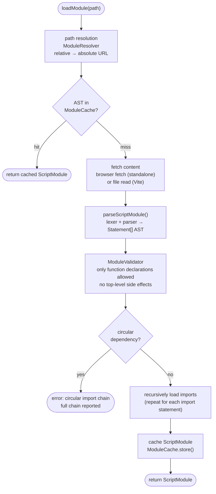
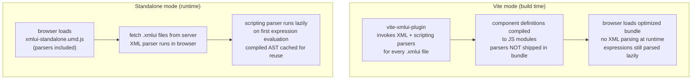

# 18 — Parsers

## Why This Matters

You will rarely need to modify the XMLUI parsers directly. They sit at the lowest level of the framework: everything that appears in a `.xmlui` file — every component tag, every `{expression}`, every `2px solid red` property, every `CmdOrCtrl+S` shortcut — passes through one of these parsers before reaching React.

Understanding the parsers matters in three situations:
1. **Debugging cryptic errors** — a `U007: tag name mismatch` or `S003: expected unit` points to a specific parser stage. Knowing which stage it came from narrows the search immediately.
2. **Working on the language server** — the VS Code extension for XMLUI relies on the XML parser's `findTokenAtOffset()` and the diagnostic infrastructure.
3. **Extending the framework** — adding new expression syntax, new CSS value types, or new key modifier support all require touching the appropriate parser.

---

## Four Languages, Four Parsers

XMLUI is effectively a **multi-language system**. A single `.xmlui` file contains four interlaced languages:

```xml
<Button
  onClick="handleClick()"         <!-- JavaScript expression -->
  padding="12px"                  <!-- CSS value -->
  variant="primary"               <!-- Plain string -->
  hotkey="CmdOrCtrl+S"            <!-- Keyboard accelerator -->
>
  {label}                         <!-- JavaScript expression -->
</Button>
```

Each of these languages has its own parser:

| Language | Parser Location | Entry Point |
|----------|----------------|-------------|
| XML markup | `parsers/xmlui-parser/` | `parseXmlUiMarkup()` |
| JS expressions/scripts | `parsers/scripting/` | `Parser.parseExpr()` / `ModuleLoader.loadModule()` |
| CSS property values | `parsers/style-parser/` | `StyleParser.parseSize()`, `.parseBorder()`, etc. |
| Keyboard accelerators | `parsers/keybinding-parser/` | `parseKeyBinding()` |

All four share a common character stream infrastructure in `parsers/common/`.

---

## The XML Parser

### Structure

The XML parser is a classic **scanner → recursive descent parser → transformer** pipeline:

```
.xmlui source text
  │
  ▼  Scanner (scanner.ts)
  │  Converts raw text to a stream of tokens.
  │  Token types: angle brackets, identifiers, string literals,
  │  XML entities, CDATA sections, script blocks, and trivia
  │  (comments, whitespace, newlines).
  │
  ▼  ParseStack (parser.ts)
  │  Recursive descent parser walks the token stream.
  │  Builds a typed AST of Node objects.
  │  Performs error recovery — continues after malformed markup
  │  to collect as many errors as possible in one pass.
  │
  ▼  Raw Node Tree
  │  Each node carries three positions:
  │  - start: including trivia (comments, whitespace before it)
  │  - pos: excluding trivia (where actual content starts)
  │  - end: where content ends
  │  This split lets the language server accurately highlight
  │  errors while the formatter preserves spacing.
  │
  ▼  nodeToComponentDef() (transform.ts)
  │  Semantic transformation: converts the generic syntax tree
  │  to ComponentDef objects that the rendering pipeline consumes.
  │  Validates namespace declarations, resolves xmlns aliases,
  │  extracts helper sub-trees (property/, template/, event/),
  │  and collects code-behind <script> blocks.
  │
  ▼  lintApp() (lint.ts)
     Post-parse validation pass.
     Checks that attribute names are recognized by the
     corresponding component. Severity is configurable
     per component: Warning, Error, Strict, or Skip.
```

### Error Recovery Strategy

The XML parser is designed to **keep going after errors**. When it encounters unexpected input — a missing closing tag, an uppercase attribute name, a duplicate xmlns — it records a `ParserDiag` diagnostic and attempts to resynchronize. This means a broken file returns both a partial AST _and_ a list of errors, rather than throwing immediately.

`ParserDiag` objects include `contextPos` and `contextEnd` in addition to the error position. The language server uses these extra bounds to draw error squiggles under the right token rather than just the character where parsing failed.

### What Gets Produced

After the transform stage, a `.xmlui` file becomes either:
- A **`ComponentDef`** — a simple component with props, children, and optional code-behind
- A **`CompoundComponentDef`** — a component with named slots, templates, and multiple script sections

These data structures are what the rendering pipeline takes as input. The component registry maps component names to their React implementations; the `ComponentDef` describes the runtime wiring.

### Expressions Are Opaque

One important design choice: the XML parser treats attribute expressions like `{count + 1}` as plain string values. It does not attempt to parse JavaScript inside XML. The braces are just characters. The scripting parser handles them later, lazily, when the value is first evaluated. This keeps the two parsers cleanly separated and means the XML parser has no dependency on JavaScript syntax.

---

## The Scripting Parser

### Two Modes

The scripting parser operates in two modes depending on what it is parsing:

**1. Single expression** — for attribute values like `{count + 1}`, `{item.name}`, `{isVisible ? "show" : "hide"}`:
```
Lexer.tokenize() → Parser.parseExpr() → Expression AST
```

**2. Script module** — for inline `<script>` blocks and `.xmlui.xs` code-behind files:
```
Lexer.tokenize() → Parser.parseStatements() → Statement[] AST
→ ModuleValidator (if imported) → ModuleLoader (if script has import statements)
→ ScriptModule { functions, variables, imports }
```

### Lookahead and Precedence

The scripting Lexer maintains a **16-token lookahead buffer**. This allows the parser to make decisions without backtracking. Operator precedence is encoded in `TokenTrait.ts` alongside associativity information, so the precedence-climbing algorithm in the parser can be kept small and correct.

### Module Loading

External script logic can be shared across components in two ways: via `import` statements inside a `<script>` block (e.g. `import { fn } from "./helpers.xs"`), or via a convention-based code-behind file (`ComponentName.xmlui.xs`) that the framework auto-discovers alongside the `.xmlui` file. In both cases the `.xs` file is loaded as a **module**. The `ModuleLoader` orchestrates the full lifecycle:

<!-- DIAGRAM: Module loading flow: resolve path → check cache → fetch content → parse → validate → recursively load imports → cache result -->



1. **Path resolution** — converts relative `.xs` paths to absolute using `ModuleResolver` (e.g. `"./helpers.xs"` → `"/components/helpers.xs"`). Handles both URL-style paths (in standalone mode) and file-system paths (in Vite mode).
2. **Cache check** — `ModuleCache` has two tiers: raw content and parsed AST. If the parsed AST is already cached, loading short-circuits here.
3. **Fetch** — retrieves the file content via an injected fetcher function (browser `fetch` in standalone mode, file system read in Vite mode). The fetcher is injected rather than hardcoded so the same parser works in both environments.
4. **Parse** — `parseScriptModule()` runs the lexer and parser to produce a `Statement[]` AST.
5. **Validate** — `ModuleValidator` enforces that imported modules export **only function declarations**. No top-level variable mutations, no side-effect code. This restriction keeps modules predictable and safe to cache.
6. **Circular dependency detection** — `CircularDependencyDetector` maintains a static import stack. If A imports B and B imports A, the detector recognizes the cycle and returns the full chain for error reporting. The error message shows exactly which modules are involved.
7. **Recursive load** — any imports within the loaded module are resolved and loaded the same way.
8. **Cache store** — the resulting `ScriptModule` is cached for future reuse.

### Error Handling Style

The scripting parser uses a **`Result<T, E>` pattern** rather than exceptions. `ModuleLoader.loadModule()` returns `Result<ScriptModule, ModuleErrors>` where `ModuleErrors` maps module paths to arrays of error messages. This makes it easy for callers to accumulate errors from multiple modules and report them together.

### The `reactive` Keyword

Variable declarations in scripts can include an XMLUI-specific `reactive` modifier:
```js
reactive var counter = 0;
```
The scripting parser recognizes this and sets `isReactive: true` on the `VarDeclaration` AST node. The rendering engine uses this flag to wire the variable into the reactive state container.

### Code-Behind Functions

The `code-behind-collect.ts` module walks the parsed AST of a code-behind script and extracts all function declarations. These become the component's **public API surface** — the functions that can be called from attribute expressions and event handlers. Only function declarations are exposed; helper variables inside functions remain private.

---

## The Style Parser

### Why a Custom CSS Parser?

The XMLUI style parser is not a full CSS parser. It handles only **CSS property values** — not selectors, not rules, not stylesheets. The scope is narrow: when a component prop like `padding` or `border` is set to a string value, the style parser validates and normalizes it.

The parser also needs to recognize **theme variables**. In XMLUI markup, theme variables are written with a `$` prefix (e.g. `$borderColor`, `$spacingMd`). A general-purpose CSS parser would not understand these as special tokens. The style lexer detects the `$` prefix and emits a `ThemeId` token; `toCssVar()` then converts it to a CSS custom property at the right moment (e.g. `$borderColor` → `var(--xmlui-borderColor)`).

### Parse Methods

The `StyleParser` class exposes one method per value type:

| Method | Example Input | Output Type |
|--------|--------------|-------------|
| `parseSize()` | `"12px"`, `"1rem"`, `"auto"` | `SizeNode` |
| `parseColor()` | `"red"`, `"#FF0000"`, `"rgb(255,0,0)"` | `ColorNode` |
| `parseBorder()` | `"2px solid #000"` | `BorderNode` |
| `parseBorderStyle()` | `"dashed"` | `BorderStyleNode` |

### Theme Variable Support

`BorderNode` can hold up to three `ThemeIdDescriptor` objects alongside (or instead of) literal values. This allows a border like:

```xml
<Box border="$borderWidth solid $borderColor" />
```

to be parsed into a structured node that retains both the theme variable names and any fallback defaults. The theming engine resolves these to `var(--xmlui-borderWidth)` and `var(--xmlui-borderColor)` at runtime.

### Error Handling

Unlike the XML parser, the style parser **throws immediately** on invalid syntax. There is no error recovery: if a value like `"3px solid bleh"` contains an unrecognized color, a `StyleParserError` is thrown with one of the S001–S016 error codes. The calling code is expected to catch this and report it as a component prop validation error.

---

## The Keybinding Parser

The keybinding parser handles Electron-style **keyboard accelerator strings** — the format used by the `Keyboard` component and any component that supports a `hotkey` prop.

```
"CmdOrCtrl+S"    →  { key: "s", ctrl: true, meta: true, shift: false, alt: false }
"Shift+Delete"   →  { key: "Delete", shift: true, ... }
"Alt+ArrowDown"  →  { key: "ArrowDown", alt: true, ... }
```

The parser is **platform-aware**: `CmdOrCtrl` expands to `ctrl: true` on Windows/Linux and `meta: true` on macOS. The `Super` modifier maps to `Command` on macOS and the Windows key elsewhere.

The resulting `ParsedKeyBinding` object is matched against DOM `KeyboardEvent` properties during event dispatch.

---

## Common Infrastructure

All four parsers share a character stream abstraction in `parsers/common/`:

- **`InputStream`** — provides `peek()`, `consume()`, and position tracking (character offset, line, column). Both the XML scanner and the style lexer build on this.
- **`GenericToken`** — a standard token shape with text, type, and start/end positions including line and column information.

---

## Two Deployment Contexts

The parsers are designed to work in both XMLUI deployment modes without modification:

**Vite mode (build time)**  
The `vite-xmlui-plugin` invokes the XML parser and scripting parser for every `.xmlui` file during the build. Parsed component definitions and compiled expressions become JavaScript modules in the output bundle. The parsers are not shipped in the final bundle.

**Standalone mode (runtime)**  
The same parsers are bundled inside `xmlui-standalone.umd.js`. When the browser loads an XMLUI app, the framework fetches `.xmlui` files and parses them live. The scripting parser also runs live for every expression that is evaluated for the first time.

In both modes, the **scripting parser is lazy for expressions**. An attribute value like `{count + 1}` is not compiled when the XML file is parsed; it is compiled the first time that attribute is evaluated. The compiled result is then cached.

<!-- DIAGRAM: Timeline comparing Vite mode (parse at build → bundle → run) vs Standalone mode (fetch file → parse → run, all in browser) -->



---

## Debugging Parser Errors

### XML Parse Errors

Error codes starting with `U` are XML structural errors; codes starting with `W` are warnings.

| Symptom | Likely Code | Location |
|---------|-------------|----------|
| "expected tag open" in a blank-looking file | U003 | An entity or encoding problem before the first `<` |
| "tag name mismatch" | U007 | Opening and closing tags spell the component name differently |
| "duplicate attribute" | U012 | Same attribute appears twice on one element |
| "uppercase attribute" | U013 | Attribute names must be camelCase; XML parser rejects `Padding` |
| "must have single root element" | U035 | The file has more than one top-level component |

### Scripting Errors

Look for `ScriptParseError` or `CodeBehindParseError` types in the error output. The module path and line number tell you exactly which script block is broken. Circular import errors include the full chain: `helpers.js → utils.js → helpers.js`.

### Style Errors

`StyleParserError` with codes S001–S016 appears in the browser console or build output alongside the component name and prop name. The message usually names the specific token that was unexpected.

---

## Key Takeaways

- XMLUI uses four separate parsers for XML markup, JavaScript expressions/scripts, CSS values, and keyboard shortcuts. Each is independent and composable.
- The XML parser is error-recovering: it collects multiple diagnostics and continues. The style parser is not: it throws on the first error.
- Expressions in attribute values are stored as raw strings by the XML parser and compiled lazily by the scripting parser when first evaluated.
- The scripting module loader enforces a strict contract: imported modules may only export function declarations. This enables safe caching and predictable behavior.
- Circular imports are detected before they cause infinite loops. The error message shows the full import chain.
- Theme variable names (`xmlui-*`) are recognized as special tokens by the style lexer, allowing them to flow through the style parser and into the theming engine rather than being treated as errors.
- In Vite mode the XML and scripting parsers run at build time; in standalone mode they run in the browser. The same parser code handles both.
