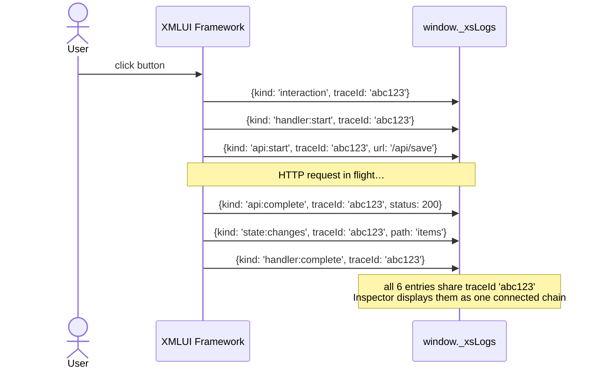

# 19 — Inspector & Debugging

## Why This Matters

When an XMLUI app behaves unexpectedly — a button click does nothing, an API call fires twice, a state variable holds the wrong value — the usual browser DevTools tell you very little. You can see the network tab and the console, but you cannot see which XMLUI event handler ran, which state mutation it triggered, or how the effects of one interaction cascaded into the next.

The XMLUI Inspector & Debugging subsystem is the answer to this. It is a built-in trace system that records a complete timeline of everything the framework does: every user interaction, every event handler start and finish, every state change, every API call, and every navigation event. It is designed with one hard constraint: **zero overhead when disabled**. A production app with tracing off compiles as if the tracing code does not exist.

Understanding this system matters for two reasons. First, it makes debugging significantly faster — you know exactly what happened and in what order. Second, any new framework code you write should hook into it so future developers have the same visibility into your subsystem.

---

## How the Trace System Works

The trace system writes to a circular buffer on `window._xsLogs`. Every significant event in the framework lifecycle produces an `XsLogEntry` object that is pushed into this array. Entries share a **trace ID** that groups all events belonging to the same user interaction — so when a button click triggers a handler that calls an API that triggers a navigation, all five events share the same trace ID and can be displayed as one connected chain.

<!-- DIAGRAM: Timeline of one interaction: user click (interaction) → handler:start → api:start → api:complete → state:changes → handler:complete, all linked by traceId -->



The buffer is capped (default 200 entries). When it fills, old entries are trimmed, but entries of significant kinds — interactions, API calls, navigations, and modal events — are never discarded. The most important events are always present even in a long-running session.

### Enabling Tracing

Tracing is opt-in. Add to your `config.json`:

```json
{
  "globals": {
    "xsVerbose": true,
    "xsVerboseLogMax": 500
  }
}
```

With this set, `window._xsLogs` is initialized to an empty array and the framework begins recording. Without it, the array is never created and every check in the codebase short-circuits immediately.

---

## The Trace Entry Structure

Every log entry is an `XsLogEntry` object. The most important fields:

| Field | Type | Meaning |
|-------|------|---------|
| `ts` | `number` | `Date.now()` when the entry was created |
| `perfTs` | `number` | `performance.now()` — for measuring durations |
| `traceId` | `string` | Groups all events from one user interaction |
| `kind` | `string` | What happened (see below) |
| `eventName` | `string` | The XMLUI event name: `"click"`, `"change"`, `"submit"` |
| `componentType` | `string` | Which XMLUI component produced this entry |
| `uid` | `string` | The component instance ID |
| `text` | `string` | Stringified detail data |
| `diffPretty` | `string` | Human-readable state change description |
| `diffJson` | `DiffEntry[]` | Structured state diff for programmatic use |
| `error` | `object` | Present on error kinds: `{ message, stack }` |

The `kind` field is the key to understanding what an entry represents.

---

## Event Kinds

| Kind | When It Fires |
|------|---------------|
| `"interaction"` | A trusted user event — click, double-click, context menu, keypress — captured on the document |
| `"navigate"` | `navigate()` action executed |
| `"api:start"` | An HTTP fetch begins (DataSource or APICall action) |
| `"api:complete"` | The fetch succeeded |
| `"api:error"` | The fetch failed |
| `"handler:start"` | An `on*` event handler begins executing |
| `"handler:complete"` | The handler finished, including duration |
| `"handler:error"` | The handler threw an exception |
| `"state:changes"` | One or more container state properties changed |
| `"error:boundary"` | A React ErrorBoundary caught a render error |
| `"toast"` | A toast notification was shown |
| `"modal:show"` | A confirmation dialog was opened |
| `"modal:confirm"` | The user clicked the confirm button |
| `"modal:cancel"` | The user clicked cancel |
| `"method:call"` | A component API method was called programmatically |
| `"value:change"` | A user-declared variable changed value |

When you see `"handler:start"` followed by `"api:start"` followed by `"api:complete"` followed by `"state:changes"` followed by `"handler:complete"`, all with the same `traceId`, you are looking at one complete user interaction.

---

## Trace IDs

Trace IDs are the connective tissue of the system. Here is how they flow:

1. When the app starts, a **startup trace** is created (`"startup-${timestamp}"`). All API calls that fire during startup use this trace.
2. When the first user interaction occurs, the startup trace is retired.
3. For each subsequent user interaction, `pushTrace()` is called to create a new trace ID and push it onto an in-memory stack.
4. All events triggered within that interaction — nested API calls, navigations, state changes — inherit the current trace ID from the stack.
5. When the interaction completes, `popTrace()` restores any parent trace.
6. Confirmation dialogs are special: the pending trace ID is saved to `window._xsPendingConfirmTrace` while waiting for the user's response, then restored when the dialog resolves.

This scheme means that even fully async operations (a handler that awaits an API call) share a trace with the interaction that started them.

---

## The Three Logging Modules

The trace system is divided into three focused logging modules, each injected into a specific part of the framework.

### Handler Logging

`handler-logging.ts` is used by the event handler executor (`event-handlers.ts`) to wrap every `on*` event handler. It produces the `handler:start`, `handler:complete`, `handler:error`, and `state:changes` events. It also captures:
- The handler's source code (for display in the inspector)
- The duration from start to complete
- A before/after diff of container state

Every `on*` handler in every component automatically goes through this without any per-component wiring.

### State Logging

`state-logging.ts` tracks state mutations that happen outside event handlers — primarily from data loaders responding to API results and from external state updates. It produces `state:changes` events associated with the correct trace ID for the load that triggered them.

### Variable Logging

`variable-logging.ts` watches user-declared variables (those created with `<Var>` or in `<script>` blocks) and logs changes as `value:change` events. It filters out internal framework variables (`$props`, `$item`, `emitEvent`, etc.) so the noise level stays low.

---

## The Inspector Component

The `Inspector` component provides a visual UI for the trace data. Place it anywhere in your app's markup:

```xml
<App>
  <Inspector />
  <!-- rest of app -->
</App>
```

It renders as a small search-code icon button in the corner of your UI. Clicking it opens a full-screen overlay modal containing an iframe that loads the XMLUI Inspector viewer (`xs-diff.html`). The viewer reads `window._xsLogs` via postMessage and displays:
- A timeline of all trace entries
- Grouped view by trace ID (one interaction per group)
- State diff visualization for `state:changes` entries
- Full detail expansion per entry

**Component props:**

| Prop | Default | Description |
|------|---------|-------------|
| `src` | `"xmlui/xs-diff.html"` | Inspector viewer URL |
| `tooltip` | `"Inspector"` | Icon hover text |
| `dialogTitle` | `"XMLUI Inspector"` | Modal header |
| `dialogWidth` | `"95vw"` | Modal width |
| `dialogHeight` | `"95vh"` | Modal height |

The Inspector also exposes `open()` and `close()` API methods if you want to open it programmatically (e.g., from a keyboard shortcut).

---

## The Debug View (State Visualizer)

Separate from the trace system, XMLUI includes a **state visualizer** accessible via the keyboard shortcut **Alt + Ctrl + Shift + S**. When active, it draws bounding boxes around each component and can optionally highlight which components are changing state.

This is controlled by the `DebugViewProvider` context, which exposes:
- `setDisplayStateView(true/false)` — toggle the overlay
- `startCollectingStateTransitions()` — begin recording which components have changed state
- `stopCollectingStateTransitions()` — stop collection

The state visualizer is useful when you can see the UI flickering or updating unexpectedly and want to know which components are involved.

---

## Accessing Trace Data Without the Inspector

All trace data is available directly in the browser DevTools console when tracing is enabled:

```javascript
// See all logged events
window._xsLogs

// Export for offline analysis
copy(JSON.stringify(window._xsLogs))

// See what interaction is currently active
window._xsCurrentTrace

// Look up a component by its testid
window._xsTestIdMap.get("my-button")

// See the last user interaction details
window._xsLastInteraction
```

This is particularly useful in automated testing: Playwright tests can read `window._xsLogs` to assert that a specific kind of event fired, or to confirm that an API call completed before making further assertions.

---

## Adding Trace Entries to New Code

When you add a new subsystem or a complex operation to the framework, hook it into the trace system so future developers have visibility. The pattern is always the same:

**1. Gate on `xsVerbose`:**
```typescript
const xsVerbose = appContext.appGlobals?.xsVerbose === true;
if (!xsVerbose) return;  // No tracing overhead if disabled
```

**2. Use `createLogEntry` for the entry:**
```typescript
import { createLogEntry, pushXsLog } from "../inspector/inspectorUtils";

pushXsLog(createLogEntry("mysubsystem:event", {
  uid: componentId,
  eventName: "myAction",
  text: JSON.stringify(relevantData),
}));
```

`createLogEntry` pre-fills `ts`, `perfTs`, and `traceId` for you. Pass only the fields that are specific to your event.

**3. For multi-step operations, manage the trace stack:**
```typescript
import { pushTrace, popTrace } from "../inspector/inspectorUtils";

const traceId = pushTrace();
try {
  pushXsLog(createLogEntry("myop:start", { traceId }));
  await doWork();
  pushXsLog(createLogEntry("myop:complete", { traceId }));
} catch (e) {
  pushXsLog(createLogEntry("myop:error", { traceId, error: { message: e.message, stack: e.stack } }));
  throw e;
} finally {
  popTrace();
}
```

Always call `popTrace()` in a `finally` block. A missed pop corrupts the trace stack for everything that follows.

---

## What Gets Captured Automatically

You do not need to add any tracing code for standard component behavior. The following is captured automatically for any XMLUI component:

- **Every user interaction** — AppContent captures trusted DOM events at the document level via event capture, so every click, keypress, and context menu in every component is traced without any per-component code.
- **Every event handler execution** — `event-handlers.ts` wraps all `on*` handlers universally.
- **Every API call** — DataLoader and APICall both integrate with the trace system.
- **Every state mutation** — the container reducer logs state changes.
- **Every render error** — ErrorBoundary pushes an `error:boundary` entry.
- **Every navigation** — NavigateAction logs before routing.

The subsystems you do need to add tracing for are new operations that exist outside these categories — custom action types, new global functions, new provider logic.

---

## Debugging Common Problems

### "My handler ran but nothing changed"

Look for `handler:start` and `handler:complete` with the same `traceId`. Between them, check for `state:changes` entries. If there are none, the handler executed but did not trigger any state mutations. Check whether the handler is writing to a variable that is not in the component's reactive scope.

### "The API call fired twice"

Look for two `api:start` entries with different `traceId` values. If the trace IDs differ, two separate interactions triggered the same DataSource. Check whether the DataSource has `invalidates` pointing to a key that is being invalidated by the first response.

### "The component shows an error overlay"

Look for an `error:boundary` entry. It contains the full `error.stack` from the render error. The `componentType` field identifies which component crashed.

### "A confirmation dialog's effect is attributed to the wrong interaction"

This is expected behavior when `_xsPendingConfirmTrace` is not handled correctly. The confirmation dialog saves the pending trace and restores it on confirm. If the trace chain looks broken at the modal, check that the dialog is being shown via `confirm()` from AppContext (which handles the trace handoff) rather than through a manual state variable.

---

## Key Takeaways

- The trace system is zero-overhead when `xsVerbose` is not `true`. All guard checks short-circuit; no arrays are created; no objects are built.
- Every log entry has a `traceId` that groups all events from one user interaction — click, handler, API call, state change, navigation — into a single traceable chain.
- Three focused logging modules exist: `handler-logging` (event handlers), `state-logging` (external mutations), and `variable-logging` (user-declared vars). You rarely need to modify them; they are wired into the framework universally.
- The `Inspector` component is a UI viewer that reads `window._xsLogs` via an iframe. It is optional — the trace data exists in the window object whether or not the Inspector component is in the app.
- `pushTrace()` / `popTrace()` must always be paired. Use a `finally` block. A stack corruption is invisible until an unrelated event gets a wrong trace ID.
- When writing new framework subsystems, gate on `appContext.appGlobals?.xsVerbose === true`, use `createLogEntry` to build entries, and call `pushXsLog` to submit them.
