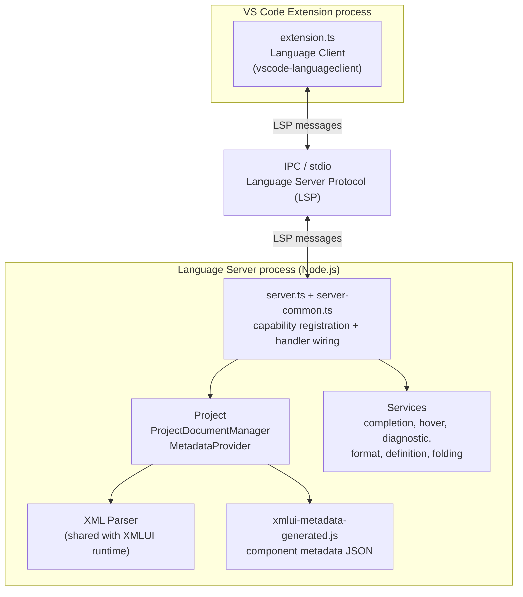
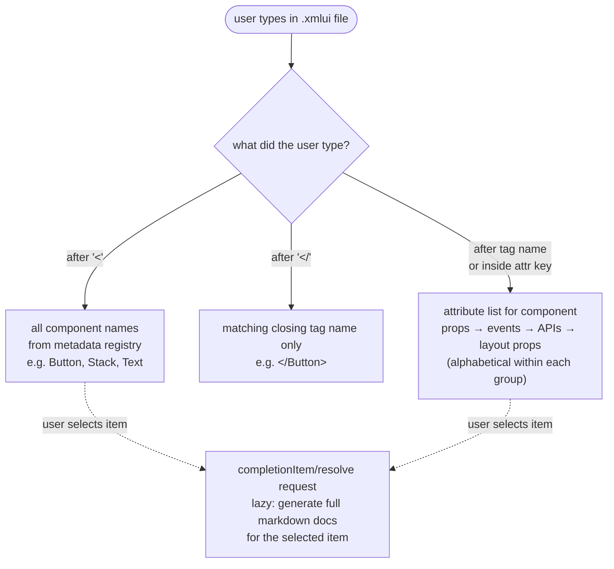

# 20 — Language Server (LSP)

## Why This Matters

Writing XMLUI markup without IDE support is error-prone: component names are misspelled, required props are missed, event handler names drift from the spec. The XMLUI Language Server solves this by providing completions, hover documentation, diagnostics, and formatting directly in VS Code — the same experience developers expect from TypeScript or Python.

Understanding the language server matters when you are adding a new component (its props and events should appear in completions), changing the metadata schema (new fields must flow through to the LSP), or implementing a new IDE feature like prop value validation or code actions. The system is carefully separated from the runtime framework so it can run in a pure Node.js environment without React.

---

## How the Language Server Fits In

The XMLUI VS Code extension (`tools/vscode/`) launches a separate Node.js process — the language server — via IPC. VS Code's Language Client (in the extension process) and the Language Server communicate using the [Language Server Protocol](https://microsoft.github.io/language-server-protocol/). This separation keeps the extension's UI thread fast and lets the language server do expensive parsing in its own process.

<!-- DIAGRAM: VS Code extension process ↔ (IPC) ↔ Language Server process; server uses: parser (shared with runtime), metadata from generated JSON, document store -->



The language server reuses the XMLUI XML parser directly. This means the same parser that runs in the browser also runs in the IDE, guaranteeing that errors shown in VS Code match errors that would occur at runtime.

---

## Architecture Overview

```
tools/vscode/src/extension.ts
  ↓  spawns via IPC
xmlui/src/language-server/server.ts  (Node.js entry)
  ↓  delegates to
xmlui/src/language-server/server-common.ts  (capability registration + handler wiring)
  ├─  Project (documents + metadata)
  │     ├─  ProjectDocumentManager  ← file discovery + open doc tracking
  │     └─  MetadataProvider        ← loaded from xmlui-metadata-generated.js
  └─  Services
        ├─  completion.ts
        ├─  hover.ts
        ├─  diagnostic.ts
        ├─  format.ts
        ├─  definition.ts
        └─  folding.ts
```

All services receive the same `Project` instance and use it to retrieve documents and metadata. No service holds state of its own.

---

## Component Metadata in the Language Server

The language server needs to know, for every component, what props it accepts, what types those props have, what events it exposes, and what context variables it creates. This data comes from the same `ComponentMetadata` objects that power the runtime — but the language server cannot import the runtime directly (it has no React, no browser APIs).

The solution is a **generated metadata file**.

### Generating the Metadata

```bash
npm run gen:langserver-metadata
```

This script (`xmlui/scripts/get-langserver-metadata.js`) reads the built framework's metadata output (`dist/metadata/xmlui-metadata.js`) and strips it down to the fields the LSP needs: `description`, `status`, `props`, `events`, `apis`, `contextVars`, `shortDescription`, `nonVisual`, and `allowArbitraryProps`. The result is written to `xmlui-metadata-generated.js` inside the language server directory.

**This file must be regenerated every time component metadata changes.** If you add a new prop to a component and do not regenerate, the LSP will not offer it in completions or display it in hover.

### The MetadataProvider

At server startup, the generated file is imported and passed to a `MetadataProvider`:

```typescript
import collectedComponentMetadata from "./xmlui-metadata-generated.js";
const metadataProvider = new MetadataProvider(collectedComponentMetadata);
```

`MetadataProvider` wraps each component's data in a `ComponentMetadataProvider` that offers typed lookup methods:

- `componentNames()` — all registered component names (for tag name completions)
- `getComponent(name)` — returns a `ComponentMetadataProvider` for one component
- `.getAllAttributes()` — props + events + apis + layout props + implicit props in a single list

Three **implicit props** are always available on every component regardless of its metadata: `when` (conditional rendering), `data` (data source binding), and `inspect` (component inspection). These are injected by `ComponentMetadataProvider` rather than coming from the generated file.

---

## Document Management

### Two Tiers

The `ProjectDocumentManager` maintains two tiers of document access:

1. **Open documents** — files currently open in the editor. These receive incremental changes (character-level diffs) from VS Code and always reflect the user's current unsaved content.
2. **Disk cache** — all other `.xmlui` files in the workspace, discovered via a glob scan on startup. Loaded lazily from disk on first access; invalidated when the file system reports a change.

This means Go-to-Definition works for components defined in files that are not currently open.

### Parse Caching

Each document wraps its parse result in a lazy cache. Calling `document.parse()` either returns the cached `ParseResult` or runs the XML parser and stores the result. The cache is invalidated whenever the document content changes — which for open files happens on every keystroke, and for disk files happens on save.

This caching is what keeps completions and hover fast. The parser is invoked at most once per change, and the resulting AST is reused by every service that handles a request for the same document.

---

## Capabilities in Detail

### Completions

Completions fire when the user types `<` or `/`, or when they are explicitly requested inside an element.

<!-- DIAGRAM: Completion scopes: "<" → component names list; "<Component " → attribute list; inside attr key → attribute list; "</" → closing tag name -->



| What the user types | What is offered |
|---------------------|-----------------|
| `<` | All component names from the metadata |
| `</` | Only the matching closing tag name |
| `<Button ` | All attributes: props, events, APIs, layout props, implicit props |
| Inside attribute key | Same attribute list |

Completions are **sorted** with props first, events second, APIs third (each group alphabetical). This ordering reflects what developers use most.

Documentation for completions is loaded **lazily**. The initial completion list is fast because it only includes labels and sort keys. When the user selects an item, a `completionItem/resolve` request fires, which generates the full markdown documentation for that specific attribute and attaches it to the item.

### Hover

Hovering over a component name shows the component's description and a summary of its props, events, and APIs.

Hovering over an attribute key shows the attribute's description, type, default value, and available enum values (if any). This documentation is generated from the same metadata that drives the runtime.

### Diagnostics

Diagnostics are generated by running the full XML parser (including the transform stage) on the document. Parser errors — unclosed tags, mismatched tag names, duplicate attributes, invalid namespace declarations — appear as red squiggles in the editor.

The diagnostics update as you type (incremental sync). The parser is error-recovering, so a file with one error still produces diagnostics for all subsequent errors rather than stopping at the first.

**One notable gap:** The lint pass (`lint.ts`), which checks for unrecognized prop names against component metadata, is not yet wired into the LSP diagnostics pipeline. Unrecognized prop names do not currently produce squiggles. This is a known improvement area.

### Formatting

The `XmluiFormatter` reformats an entire document by traversing the AST and generating properly indented XML. It respects the editor's `tabSize` and `insertSpaces` settings, collapses excessive blank lines (max 2 consecutive), and normalizes self-closing tag syntax. Error nodes (AST fragments that could not be parsed) are preserved verbatim — the formatter does not guess at their intended form.

Formatting is triggered by the standard VS Code "Format Document" command (Shift+Alt+F).

### Go-to-Definition

Hovering over a component name and pressing F12 (or Ctrl+Click) navigates to the file where that component is defined. Currently this is implemented by filename matching: `Button` navigates to `Button.xmlui` in the workspace. This works well for user-defined components but less well for built-in components, which are defined in TypeScript files rather than `.xmlui` files.

### Code Folding

Opening and closing tags that span multiple lines produce collapsible fold regions in the gutter. Multi-line comments and script blocks also fold. The fold regions are computed from the AST, so they are always syntactically correct — they never fold half of a tag.

---

## Extending the Language Server

### When You Add a New Component

1. Add the component's metadata (props, events, APIs) in its `.tsx` file using `createMetadata`.
2. Run `npm run gen:langserver-metadata` to regenerate `xmlui-metadata-generated.js`.
3. The new component and its attributes automatically appear in completions and hover — no LSP code changes needed.

### When You Add a New Diagnostic Rule

Diagnostic rules live in the parser, not the language server. To add a new error:

1. Detect the condition in the XML parser or transform stage.
2. Push a `ParserDiag` to `parseResult.errors` with a unique error code, message, and position range.
3. The LSP's diagnostic service passes all parser errors through to VS Code automatically.

No changes to the language server code are needed.

### When You Add a New Completion Type

If you want completions that the current completion provider does not offer (e.g., enum values for specific props), extend `handleCompletion()` in `completion.ts`:

1. Identify the `SyntaxKind` of the AST node at the cursor position.
2. Add a case to the context switch in `handleCompletion()`.
3. Return an array of `XmluiCompletionItem` objects.
4. If the items need documentation on selection, populate the `data.metadataAccessInfo` field so `handleCompletionResolve()` can generate it.

### When You Add a New LSP Feature

1. Create `services/newfeature.ts` with a handler function `handleNewFeature(project, uri, ...)`.
2. Register the handler in `server-common.ts` using the appropriate `connection.on*` method.
3. Add the capability to the `InitializeResult` in `onInitialize` so VS Code knows to send the requests.

---

## The Metadata Generation Pipeline

```
createMetadata() calls in *.tsx components
  ↓  at build time (npm run build)
dist/metadata/xmlui-metadata.js
  ↓  npm run gen:langserver-metadata
xmlui/scripts/get-langserver-metadata.js
  (imports dist, strips to LSP-relevant fields, writes JSON)
  ↓
xmlui-metadata-generated.js  (committed to repo)
  ↓  at server startup
MetadataProvider
  ↓  drives
Completions + Hover + Definition
```

The generated file is committed to the repository. This means:
- Developers who just pull the repo get working LSP immediately without running a build.
- After any metadata change, the file must be regenerated and the new version committed.

---

## Performance Characteristics

The language server is designed to stay responsive during editing:

- **Parse caching** ensures each document is parsed at most once per change, not once per service call.
- **Lazy completion docs** means the completion list appears immediately; documentation loads only when the user pauses on an item.
- **Workspace scan** runs once at startup; subsequent file changes are handled incrementally via file system watchers.
- **Metadata** is loaded once at startup from the generated JSON; it never changes while the server is running.

---

## Key Takeaways

- The language server is a separate Node.js process; it reuses the XMLUI XML parser but has no React dependency.
- Component metadata is served from a generated file (`xmlui-metadata-generated.js`) that must be regenerated after any `createMetadata()` change.
- `MetadataProvider` → `ComponentMetadataProvider` is the single access point for component data in all LSP services. Do not access the generated JSON directly.
- Diagnostics are fed directly from the XML parser's error list. Adding a new error in the parser automatically surfaces it as a VS Code squiggle with no language server changes.
- The lint pass (unrecognized prop names) is not yet wired into LSP diagnostics. Implementing this would be a valuable improvement but requires performance testing — lint runs a second AST pass and must not cause typing lag.
- Go-to-Definition works by filename matching; it is a known approximation that works for user-defined components.
- Formatting is document-level, AST-driven, and error-safe (broken markup is preserved verbatim).
