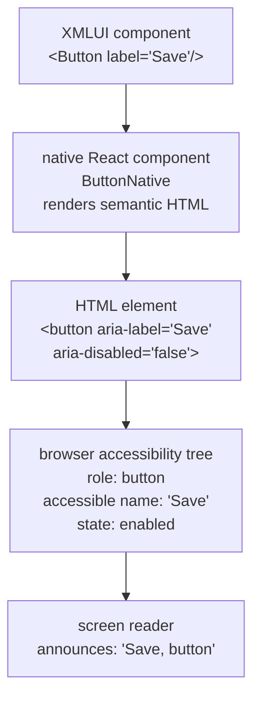

# 24. Accessibility

## Why This Matters

Accessibility (a11y) ensures that XMLUI applications can be used by people who rely on keyboards, screen readers, or other assistive technologies. The framework uses a mix of semantic HTML and ARIA attributes; as you add new components or fix existing ones, following these patterns consistently is what makes apps genuinely usable — not just technically compliant.

---

## Foundations

### Semantic HTML before ARIA

Use proper HTML elements whenever one exists for the job. Native elements come with roles, keyboard behavior, and focus management for free. Only reach for ARIA when no semantic element fits.

```html
<!-- Prefer this -->
<button>Save</button>
<nav>...</nav>
<header>...</header>
<main>...</main>

<!-- Over this -->
<div role="button" tabindex="0">Save</div>
<div role="navigation">...</div>
```

> WCAG data shows sites with custom ARIA roles have 34% more accessibility errors than those without them.

### ARIA attributes serve two purposes

1. **Role** — what kind of widget this is (`role="dialog"`, `role="tab"`)
2. **State** — current condition of the widget (`aria-expanded`, `aria-checked`, `aria-disabled`)

Both must be present and accurate. A `role="button"` element that does not respond to `Enter`/`Space` breaks the contract that ARIA implies.

---

## Keyboard Navigation

Every interactive element in an XMLUI application must be reachable and operable from a keyboard alone.

| Component type | Tab enters | Arrow keys | Enter / Space | Escape |
|---------------|-----------|-----------|---------------|--------|
| Button | ✓ | — | Activate | — |
| Link | ✓ | — | Follow | — |
| Text input | ✓ | — | — | — |
| Select / Combobox | ✓ | Navigate options | Open / select | Close |
| RadioGroup | ✓ (to group) | Navigate within | — | — |
| Tabs | ✓ (to selected) | Navigate tabs | — | — |
| ExpandableItem | ✓ | — | Toggle | — |
| Modal / Dialog | focus trapped | — | — | Close |
| Menu / Dropdown | ✓ | Navigate items | Activate | Close |

### Focus indicators

Every focusable element must have a visible focus indicator. Do not remove `:focus` outlines without providing an alternative (e.g., a custom outline or box-shadow). The current XMLUI theme does not yet have focus indicators on all components — this is a known gap.

### Focus management for overlays

When a modal, dialog, or toast appears:

1. Move focus into the overlay on open.
2. Trap focus inside while it is open.
3. Return focus to the triggering element on close.

---

## ARIA Patterns Used in XMLUI

### Expandable / Collapsible (ExpandableItem)

```html
<!-- Trigger -->
<div role="button"
     id="summary-abc"
     aria-expanded="false"
     aria-controls="content-abc"
     aria-disabled="false"
     tabindex="0">
  Section title
</div>

<!-- Content region -->
<div role="region"
     id="content-abc"
     aria-labelledby="summary-abc">
  ...
</div>
```

Key: `aria-expanded` must reflect current state and update on every toggle.

### Form inputs

```html
<label for="email">Email address</label>
<input id="email"
       type="email"
       aria-describedby="email-hint"
       aria-invalid="false" />
<span id="email-hint">Enter your work email</span>
```

- `aria-describedby` links hint/error text to the input by ID
- `aria-invalid="true"` when the field fails validation
- `aria-disabled="true"` on fields that are visually disabled but technically readonly

Multiple related fields belong in a `<fieldset>` with a `<legend>`:

```html
<fieldset>
  <legend>Shipping address</legend>
  <!-- Street, city, zip inputs -->
</fieldset>
```

### Toggle / Switch

```html
<button role="switch"
        aria-checked="true"
        aria-label="Enable dark mode">
```

`role="switch"` is semantically correct for on/off toggles (distinct from `role="checkbox"`).

### Tabs

```html
<div role="tablist">
  <button role="tab"
          id="tab-1"
          aria-selected="true"
          aria-controls="panel-1">
    Tab 1
  </button>
</div>
<div role="tabpanel"
     id="panel-1"
     aria-labelledby="tab-1">
  Panel content
</div>
```

### Navigation

XMLUI renders multiple `<nav>` elements (main nav, breadcrumbs, etc.). Each one needs a distinct `aria-label` so screen readers can distinguish them:

```html
<nav aria-label="Main navigation">...</nav>
<nav aria-label="Breadcrumb">...</nav>
```

### Icons

| Context | Treatment |
|---------|-----------|
| Decorative (accompanies visible label text) | `aria-hidden="true"` |
| Standalone (no visible label) | `aria-hidden="true"` on `<svg>` + `<title>` inside SVG, or parent gets `aria-label` |
| Meaningful image | `alt` text on `` or `role="img"` + `aria-label` on SVG |

### Live regions

For dynamic content updates (status messages, loading states, validation errors):

```html
<!-- Non-disruptive status -->
<div role="status" aria-live="polite">Saved successfully</div>

<!-- Disruptive alerts (errors) -->
<div role="alert" aria-live="assertive">Error: connection failed</div>
```

---

## Color and Visual Design

- **Text contrast**: 4.5:1 minimum against background (WCAG AA)
- **Large text** (18pt+ or 14pt bold): 3:1 minimum
- **UI components** (borders, focus rings, icons): 3:1 minimum
- **Don't use color alone** to convey information — always pair with a text label, icon, or pattern
- **Support reduced motion**: respect `prefers-reduced-motion` media query for animations

The XMLUI theme has not yet been fully audited for contrast ratios. This is a known area needing work.

---

## Per-Component Status

### Components that are accessibility-compliant

| Component | Key ARIA features |
|-----------|-------------------|
| Heading | Native `<h1>`–`<h6>` elements |
| Text | Correct semantic elements; variant semantics are user's responsibility |
| Footer | `role="contentinfo"` |
| ExpandableItem | `aria-expanded`, `aria-controls`, `role="region"`, `aria-labelledby` |
| Tabs | `role="tablist"`, `role="tab"`, `aria-selected`, `aria-controls`, `aria-label` |
| AutoComplete | `role="combobox"`, `role="listbox"`, `role="option"` |
| Toggle | `role="switch"`, `aria-checked`, `aria-label` |
| RatingInput | `role="button"`, `aria-label` per star |
| DropdownMenu | `role="menuitem"`, `role="separator"` |

### Known issues

#### Link

- Not keyboard-focusable (cannot Tab to it)
- Does not respond to Enter or Space
- Appears as "Static Text" in the accessibility tree instead of as a link
- An icon inside a Link creates an empty "image" node in the tree

#### TextBox

- Label element is not programmatically associated with the `<input>` (missing `for`/`id` linkage)
- Hint text does not use `aria-describedby`
- Insufficient contrast between default, focus, and disabled visual states
- Interactive click area is slightly below 44px minimum

#### FormItem

- Hint text elements are missing `id="hint-{input-id}"` attributes
- Input controls are missing matching `aria-describedby="hint-{input-id}"`

#### Button (icon-only)

- No `aria-label` is automatically provided when a Button contains only an icon
- The icon must be `aria-hidden="true"` and the button must carry the label

#### App layout

- XMLUI apps do not automatically emit landmark elements (`<header>`, `<main>`, `<footer>`)
- No skip-navigation link is provided
- Screen reader users cannot jump between page sections

#### Select

- Built on Radix UI, which provides strong keyboard and ARIA support internally
- XMLUI does not pass label props through to the Radix element, creating some label association issues

---

## Parts Pattern and Accessibility

XMLUI's parts system exposes named DOM sub-elements via CSS custom properties (e.g., `--Button-root`). For accessibility, parts also serve as reliable test targets:

```typescript
// Prefer role-based locators over test IDs
const trigger = page.getByRole("button", { name: "Open menu" });
const tab = page.getByRole("tab", { name: "Settings" });
const listbox = page.getByRole("listbox");
```

When adding a new component, ensure that the primary interactive sub-element is reachable via `getByRole()` — this doubles as both accessibility validation and a clean test locator.

---

## Testing Accessibility

Playwright supports ARIA-based assertions directly. Place accessibility tests in a dedicated `test.describe("Accessibility")` block at the bottom of each spec file.

### Attribute assertions

```typescript
test.describe("Accessibility", () => {
  test("has correct ARIA attributes", async ({ initTestBed, page }) => {
    await initTestBed(`<MyComponent label="Test">Content</MyComponent>`);
    const el = page.getByRole("button", { name: "Test" });
    
    await expect(el).toHaveRole("button");
    await expect(el).toHaveAttribute("aria-expanded", "false");
    await expect(el).toHaveAttribute("aria-disabled", "false");
    await expect(el).toHaveAttribute("tabindex", "0");
    await expect(el).toHaveAttribute("aria-controls");   // presence only
  });
});
```

### State update assertions

```typescript
  test("aria-expanded updates on interaction", async ({ initTestBed, page }) => {
    await initTestBed(`<MyComponent label="Test">Content</MyComponent>`);
    const trigger = page.getByRole("button", { name: "Test" });

    await expect(trigger).toHaveAttribute("aria-expanded", "false");
    await trigger.click();
    await expect(trigger).toHaveAttribute("aria-expanded", "true");
  });
```

### Keyboard operability

```typescript
  test("can be operated with keyboard", async ({ initTestBed, page }) => {
    await initTestBed(`<MyComponent label="Test">Content</MyComponent>`);
    const trigger = page.getByRole("button", { name: "Test" });

    await trigger.focus();
    await expect(trigger).toBeFocused();
    await page.keyboard.press("Enter");
    await expect(trigger).toHaveAttribute("aria-expanded", "true");

    await page.keyboard.press("Escape");
    await expect(trigger).toHaveAttribute("aria-expanded", "false");
  });
```

---

## Checklist for New Interactive Components

Before marking a component as complete, verify:

- [ ] Uses semantic HTML element where possible
- [ ] `tabindex="0"` on any non-natively-focusable interactive element
- [ ] Visible focus ring (`:focus-visible` selector or equivalent)
- [ ] Keyboard activation: `Enter` and/or `Space` trigger the primary action
- [ ] Correct ARIA `role` when no semantic element is sufficient
- [ ] ARIA state attributes wired and updating: `aria-expanded`, `aria-selected`, `aria-checked`, `aria-disabled`
- [ ] `aria-label` or `aria-labelledby` for elements without visible text
- [ ] `aria-describedby` wired to hint/error text IDs
- [ ] Decorative icons carry `aria-hidden="true"`
- [ ] Touch target ≥ 44×44px
- [ ] Color contrast ≥ 4.5:1 for all text states
- [ ] `test.describe("Accessibility")` block in `ComponentName.spec.ts`

---

## Auditing Tools

| Tool | When to use |
|------|-------------|
| Chrome DevTools → Accessibility panel | Inspect the live accessibility tree; Ctrl+Shift+P → "Enable full page accessibility" |
| [Accessibility Insights for Web](https://accessibilityinsights.io/docs/web/overview/) | Automated axe-core audit; finds contrast and ARIA issues automatically |
| [Accessible color matrix](https://toolness.github.io/accessible-color-matrix/) | Verify theme palette contrast ratios before committing |
| VoiceOver (macOS), NVDA / JAWS (Windows) | Manual end-to-end verification of role announcements and focus flow |

---

## Accessibility Linter (plan #05, Wave 1)

XMLUI ships a build-time accessibility linter at [xmlui/src/components-core/accessibility/](../../src/components-core/accessibility/index.ts). It is the runtime/CLI surface for the long-running accessibility plan (plan #05). Phase 1 implements seven rules; runtime ARIA injection and full enforcement land in later waves.

### Public API

The barrel exports the linter entry point and diagnostic types:

```ts
import {
  lintComponentDef,
  type A11yDiagnostic,
  type A11yCode,
  type LintOptions,
} from "@xmlui/.../accessibility";

const diagnostics: A11yDiagnostic[] = lintComponentDef(componentDef, options);
```

Each `A11yDiagnostic` carries `code`, `severity` (`"error" | "warn"`), `componentName`, optional source `range` and `uri`, a human-readable `message`, and an optional `fix` quick-fix hint.

### Phase 1 rules

| Code | Default severity | Detects |
|---|---|---|
| `missing-accessible-name` | warn | Interactive element with no accessible name |
| `icon-only-button-no-label` | warn | `<Button icon="...">` without `label` or `aria-label` |
| `modal-no-title` | warn | `<Modal>` without a `title` prop or `<ModalTitle>` slot |
| `form-input-no-label` | warn | Form input outside `<FormItem>` and without a `<Label>` |
| `duplicate-landmark` | warn | More than one component with the same landmark role on a page |
| `redundant-aria-role` | info | Explicit ARIA role duplicates the element's implicit role |
| `missing-skip-link` | info (stub) | App/Page with NavPanel but no SkipLink sibling |

The remaining `A11yCode` values (`color-contrast-low`, `interactive-not-keyboard-reachable`, `live-region-missing`) are reserved for later phases.

### Strict mode toggle

The linter is gated by `App.appGlobals.strictAccessibility: boolean` (default `false`):

- **`false` (default)**: findings are reported as `warn` only; the build does not fail.
- **`true`**: warn-level findings escalate to `error`, causing the Vite build to fail. The flag flips to `true` in the next major release.

When `strictAccessibility` is truthy at runtime, findings also emit `kind:"a11y"` entries into the Inspector trace (see [19-inspector-debugging.md](19-inspector-debugging.md)).

### Component `a11y` metadata block

The linter relies on a new optional `a11y` block on `ComponentMetadata` (see `xmlui/src/abstractions/ComponentDefs.ts`):

```ts
a11y?: {
  role?: "button" | "link" | "switch" | "checkbox" | "menuitem" | "tab"
       | "option" | "dialog" | "form-input" | "landmark" | "heading"
       | "list" | "image" | "decorative";
  accessibleNameProps?: readonly string[];   // e.g. ["label", "aria-label", "title"]
  requiresAccessibleName?: boolean;          // defaults true for interactive roles
  landmark?: "main" | "navigation" | "banner"
           | "contentinfo" | "complementary" | "search";
};
```

This block is purely advisory at runtime — it changes no behaviour. When authoring a new component or extending an existing one, populate it so:

- `role` lets the linter know whether the component needs an accessible name.
- `accessibleNameProps` tells the linter which prop names satisfy the requirement.
- `requiresAccessibleName: false` opts a non-interactive use out of the check.
- `landmark` enables the `duplicate-landmark` rule.

### How to extend the linter

1. Add a new `A11yCode` to `xmlui/src/components-core/accessibility/diagnostics.ts`.
2. Implement the rule in `linter.ts` next to the Phase 1 rules.
3. Decide its default severity. If it should escalate under `strictAccessibility`, add it to the strict-mode escalation list.
4. Add tests in `xmlui/tests/components-core/accessibility/`.

---

<!-- DIAGRAM: Accessibility tree showing XMLUI component → ARIA role → screen reader announcement path -->



---

## Key Takeaways

- Semantic HTML is cheaper and more reliable than ARIA — use it first
- Every interactive element must work with keyboard alone; `Tab`, `Enter`/`Space`, arrow keys, `Escape` are the minimum set
- `aria-expanded`, `aria-selected`, `aria-checked`, `aria-disabled` must stay in sync with visual state — a stale ARIA attribute is worse than no attribute
- The Link component has critical accessibility failures (no focus, no keyboard activation); treat it as a known debt item when building navigation
- Add a `test.describe("Accessibility")` block to every new component spec that tests both attribute presence and state transitions
- Parts system and role-based Playwright locators serve double duty: they test ARIA correctness while also providing robust test selectors
