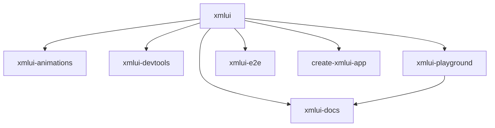

# XMLUI Project Build System

This document explains how the XMLUI monorepo is built using Turborepo, covering the build pipeline, task orchestration, and development workflows.

## Build System Overview

XMLUI uses **Turborepo** to orchestrate builds across the entire monorepo containing 12+ buildable packages. Turborepo provides:

- **Parallel execution** of build tasks across workspaces
- **Intelligent caching** to avoid rebuilding unchanged packages
- **Task dependency management** ensuring correct build order
- **Incremental builds** for faster development cycles

## Turborepo Configuration

### Core Configuration (`turbo.json`)

The build pipeline is defined in the root `turbo.json` file:

```json
{
  "pipeline": {
    "build": {
      "dependsOn": ["^build"],
      "outputs": ["dist/**", "build/**"]
    },
    "build:xmlui": {
      "dependsOn": ["^build:xmlui"],
      "outputs": ["dist/**"]
    },
    "test": {
      "dependsOn": ["build"],
      "outputs": []
    },
    "lint": {
      "outputs": []
    }
  }
}
```

### Key Pipeline Tasks

- **`build`**: Generic build task for all packages
- **`build:xmlui`**: Specific build for XMLUI framework and extensions
- **`test`**: Run tests (depends on build completion)
- **`lint`**: Code quality checks

## Workspace Build Scripts

### Root Package Scripts

The root `package.json` defines orchestration scripts:

```json
{
  "scripts": {
    "build-xmlui": "turbo run build:xmlui-all",
    "build-vscode-extension": "turbo run xmlui-vscode#build:vsix",
    "test-xmlui": "turbo run build:xmlui-all test:xmlui-all",
    "test-xmlui-smoke": "turbo run build:xmlui-all test:xmlui-smoke",
    "build-extensions": "turbo run build:extension",
    "build-docs": "turbo run build:xmlui-all build:docs",
    "publish-packages": "turbo run build:xmlui-all test:xmlui-all && npm run changeset:publish"
  }
}
```

## Build Targets by Workspace

### 1. Core Framework (`xmlui/`)

**Build Scripts:**
```json
{
  "scripts": {
    "build:xmlui": "vite build --mode lib",
    "build:xmlui-standalone": "vite build --mode standalone", 
    "build:xmlui-metadata": "vite build --mode metadata",
    "build:bin": "tsc -p tsconfig.bin.json"
  }
}
```

**Build Outputs:**
- `dist/` - Library bundle for npm distribution
- `bin/` - CLI executables
- Metadata files for tooling support

### 2. Extension Packages (`packages/*/`)

**Common Build Scripts:**
```json
{
  "scripts": {
    "build:extension": "xmlui build-lib",
    "build:demo": "xmlui build",
    "build:meta": "xmlui build-lib --mode=metadata",
    "build-watch": "xmlui build-lib --watch"
  }
}
```

**Build Outputs:**
- `dist/` - Extension library bundle
- Demo applications (when applicable)
- Component metadata

### 3. Documentation Website (`docs/`)

**Build Scripts:**
```json
{
  "scripts": {
    "build:docs": "xmlui build --buildMode=INLINE_ALL --withMock && xmlui zip-dist --target=dist/ui.zip"
  }
}
```

**Build Outputs:**
- Static website with inlined dependencies
- Zipped distribution package
- Mock service worker integration

### 4. Development Tools (`tools/`)

**CLI Tool (`tools/create-app/`):**
```json
{
  "scripts": {
    "build": "ncc build ./index.ts -o dist/ --minify"
  }
}
```

**VS Code Extension (`tools/vscode/`):**
```json
{
  "scripts": {
    "build:vsix": "vsce package"
  }
}
```

## Build Execution Flows

### Development Build

```bash
# Build everything for development
npm run build-xmlui

# This executes:
# 1. Core framework build
# 2. All extension packages (in parallel)
# 3. CLI tools compilation
```

### Production Build

```bash
# Full production build with tests
npm run publish-packages

# This executes:
# 1. Build all packages
# 2. Run complete test suite
# 3. Publish to npm (if tests pass)
```

### Incremental Development

```bash
# Watch mode for specific package
cd packages/xmlui-animations
npm run build-watch

# Or build only changed packages
turbo run build --filter=...@main
```

## Build Dependencies

### Inter-Package Dependencies



### Build Order

1. **Core Framework** (`xmlui`) - Must build first
2. **Extension Packages** - Can build in parallel after core
3. **Applications** - Documentation and test bed
4. **Tools** - CLI and VS Code extension

## Caching Strategy

### Turborepo Cache

Turborepo automatically caches build outputs based on:
- **Input files** - Source code, configuration files
- **Dependencies** - package.json, lock files  
- **Environment** - Node version, environment variables

### Cache Locations

- **Local cache**: `.turbo/cache/`
- **Remote cache**: Configured via `TURBO_TOKEN` (optional)

### Cache Invalidation

Cache is invalidated when:
- Source files change
- Dependencies are updated
- Build configuration changes
- Environment variables change

## Development Workflows

### First-Time Setup

```bash
# 1. Install dependencies
npm install

# 2. Build documentation (includes framework)
npm run build-docs

# 3. Build complete framework
npm run build-xmlui

# 4. Run tests
npm run test-xmlui-smoke
```

### Daily Development

```bash
# Build only changed packages
turbo run build --filter=...@HEAD~1

# Start development server
cd docs && npm start

# Build specific package
turbo run build --filter=xmlui-animations
```

### Pre-Release

```bash
# Complete build and test
npm run test-xmlui

# Build documentation
npm run build-docs

# Package VS Code extension
npm run build-vscode-extension
```

## Performance Optimization

### Parallel Execution

Turborepo runs tasks in parallel when dependencies allow:

```bash
# These run in parallel:
- xmlui-animations build
- xmlui-devtools build  
- xmlui-pdf build
# (after xmlui core completes)
```

### Build Filtering

Target specific packages or changes:

```bash
# Build only animation package and its dependencies
turbo run build --filter=xmlui-animations

# Build packages changed since main branch
turbo run build --filter=...@main

# Build specific scope
turbo run build --filter=./packages/*
```

### Watch Mode

For active development:

```bash
# Watch core framework
cd xmlui && npm run build:xmlui-watch

# Watch specific extension
cd packages/xmlui-playground && npm run build-watch
```

This build system ensures efficient, reliable builds across the entire XMLUI ecosystem while supporting both development and production workflows.
