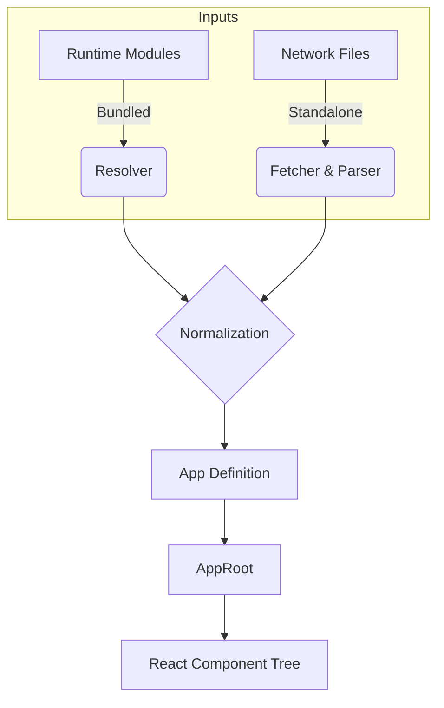

# Standalone Application Architecture

The `StandaloneApp` component is the root orchestrator for XMLUI applications. It bridges the gap between XMLUI source artifacts (markup, code-behind, themes) and the React rendering engine. Its primary responsibility is to resolve, compile (if necessary), and assemble the application definition before handing it off to `AppRoot`.

## Operating Modes

`StandaloneApp` supports two fundamentally different deployment strategies, abstracting the complexity away from the renderer.

### 1. Bundled Mode (Production / Dev)

**Why:** Performance and standard tooling integration.
**How:**

- **Build Time:** Vite plugins transform `.xmlui` and `.xs` files into JavaScript modules.
- **Runtime:** The `runtime` prop receives a map of these modules.
- **Resolution:** `resolveRuntime()` iterates through the modules, matching markup with code-behind files based on naming conventions, and assembling the app structure synchronously.

### 2. Standalone Mode (Playground / Preview)

**Why:** Instant feedback without a build step; enables dynamic loading of apps from a CDN or file server.
**How:**

- **Runtime:** The browser fetches raw source files (`.xmlui`, `.xmlui.xs`, `.json`) via HTTP.
- **Compilation:** `useStandalone()` orchestrates the fetching and utilizes in-browser parsers (`parseComponentMarkupResponse`, `parseCodeBehindResponse`) to turn text into component definitions.
- **Resolution:** Assembles the application definition asynchronously.

## Architecture & Data Flow

The architecture focuses on normalizing disparate inputs into a unified `StandaloneAppDescription` which the rendering engine consumes.

### Key Components

#### `StandaloneApp`

The React boundary. It initializes the environment, sets up global providers (`ApiInterceptorProvider`), and conditionally renders `AppRoot` only after the application definition is fully resolved.

#### `useStandalone` (Hook)

The "brain" of the operation.

1.  **Initialization**: Determines the mode based on environment variables (`VITE_STANDALONE`, `VITE_BUILD_MODE`).
2.  **Loading**: Triggers `resolveRuntime` (bundled) or `fetchWithoutCache` sequences (standalone).
3.  **Compilation**: In standalone mode, it compiles markup and executes code-behind modules to extract exports.
4.  **Error Handling**: Catches parsing or network errors and constructs synthetic `ErrorComponent` definitions so the UI can render the error in-place.

#### `resolveRuntime` (Linker)

Acts as a linker for the bundled modules. It scans the flat `runtime` map to:

- Identify the Entry Point (`App` or `Main`).
- Pair Components with their Code-Behind (`MyComp.xmlui` + `MyComp.xmlui.xs`).
- Collect Themes and API Interceptors.
- Merge functions and variables from Code-Behind into the Component Definition.

### Code-Behind Merging strategy

Whether bundled or fetched, the system treats markup and logic as separate entities until the last moment.

- **Markup**: Defines the structure and visual properties.
- **Code-Behind**: Exports `vars` (state) and `functions` (logic).

`StandaloneApp` merges these by injecting the code-behind exports directly into the component definition's `vars` and `functions` slots. This ensures that when the renderer instantiates a component, it has immediate access to its logic without needing to know about the file split.
