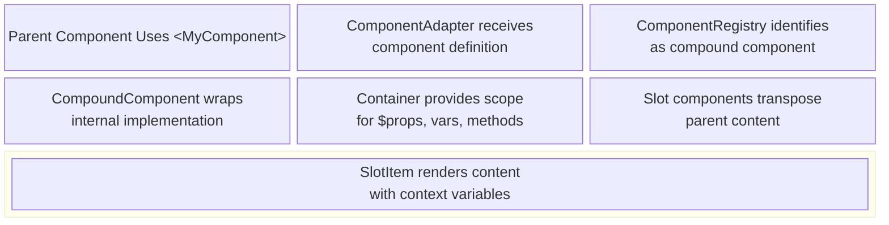

# User-Defined Component Architecture

This document explains XMLUI's user-defined component infrastructure - the rendering mechanisms that enable developers to create reusable components in `.xmlui` files with template composition through slots and children transposition. It covers the architectural foundations, the slot transposition mechanism, the role of ComponentAdapter and supporting components, and implementation details for framework developers working on the XMLUI core.

## What Are User-Defined Components?

**User-defined components** are reusable component definitions created by application developers using XMLUI markup in `.xmlui` files. They encapsulate visual structure, behavior, and state management patterns into named components that can be used throughout an application just like framework-provided components.

A user-defined component is declared with the `<Component>` tag and must have a unique name starting with an uppercase letter. The component name must match the filename (e.g., `ActionBar.xmlui` contains `<Component name="ActionBar">`). Components support properties, events, methods, variables, and slots for template composition.

**Key Characteristics:**

- **Declarative Definition** - Components defined entirely in XMLUI markup without requiring JavaScript/TypeScript code
- **Property Passing** - Parent components pass data through properties accessed via `$props` context variable
- **Event Emission** - Components notify parents of state changes through custom events using `emitEvent()`
- **Template Composition** - Slots enable parent components to inject custom markup into predefined component regions
- **Encapsulation** - Components maintain their own state, methods, and internal structure
- **Reusability** - Once defined, components can be used throughout the application like any framework component

## Architectural Overview

### Component Rendering Flow

User-defined components follow a distinct rendering path compared to framework-provided components. The key architectural difference is that user-defined components are **compound components** - they have both a component definition (what the parent sees) and an internal implementation (what renders).

**High-Level Flow:**



This architecture enables template composition - parent components provide markup fragments that render within the compound component's layout, with access to data pushed from the compound component through slot properties.

### The Compound Component Pattern

User-defined components are implemented as **compound components** - they consist of two interconnected parts:

1. **Component Interface** - The properties, events, and children the parent component provides
2. **Component Implementation** - The internal markup, state, and logic defined in the `.xmlui` file

**Example Component Definition:**

```xmlui
<Component name="ActionBar">
  <variable name="isExpanded" value="{false}" />
  
  <Card>
    <HStack>
      <H3>{$props.header}</H3>
      <Button 
        label="{isExpanded ? 'Collapse' : 'Expand'}"
        onClick="isExpanded = !isExpanded" />
    </HStack>
    <If condition="{isExpanded}">
      <VStack>
        <Slot />
      </VStack>
    </If>
  </Card>
</Component>
```

**Parent Usage:**

```xmlui
<ActionBar header="Actions Menu">
  <Button label="Create" onClick="handleCreate()" />
  <Button label="Edit" onClick="handleEdit()" />
  <Button label="Delete" onClick="handleDelete()" />
</ActionBar>
```

The component interface receives `header` property and button children from the parent. The component implementation defines internal state (`isExpanded`), accesses the property via `$props.header`, and uses `<Slot />` to transpose the children into its layout.

### Slot-Based Template Composition

Slots are placeholder components within user-defined components that mark where parent-provided content should render. XMLUI supports two types of slots:

**Default (Unnamed) Slots** receive all children passed to the component:

```xmlui
<Component name="Panel">
  <Card>
    <Slot />
  </Card>
</Component>

<!-- Usage -->
<Panel>
  <Text>This content goes into the default slot</Text>
</Panel>
```

**Named Slots** receive specific template fragments from the parent using the `<property>` syntax:

```xmlui
<Component name="Dialog">
  <Card>
    <Slot name="headerTemplate">
      <H3>Default Header</H3>
    </Slot>
    <Slot />
    <Slot name="actionsTemplate">
      <Button label="OK" />
    </Slot>
  </Card>
</Component>

<!-- Usage -->
<Dialog>
  <property name="headerTemplate">
    <H2>Custom Header</H2>
  </property>
  <Text>Main dialog content</Text>
  <property name="actionsTemplate">
    <Button label="Cancel" />
    <Button label="Confirm" />
  </property>
</Dialog>
```

Named slots must end with `"Template"` suffix - this is a framework requirement enforced in `slotRenderer()` and `renderChild()`.

### Slot Properties: Data Flow from Component to Parent

Slots enable bidirectional data flow - not only can parents inject content into components, but components can push data back to the parent's slot content through **slot properties**.

**How Slot Properties Work:**

1. The compound component declares properties on the `<Slot>` element
2. These properties are evaluated in the component's scope with access to component state
3. The properties are transformed into context variables prefixed with `$` in the slot content
4. The parent's slot content can access these context variables

**Example - List Component Passing Item Data:**

```xmlui
<Component name="ItemList">
  <variable name="items" value="{['Apple', 'Banana', 'Cherry']}" />
  
  <VStack>
    <For items="{items}">
      <Slot 
        name="itemTemplate" 
        item="{$item}" 
        index="{$index}"
        isLast="{$index === items.length - 1}">
        <!-- Default template if parent doesn't provide one -->
        <Text>{$item}</Text>
      </Slot>
    </For>
  </VStack>
</Component>

<!-- Parent Usage -->
<ItemList>
  <property name="itemTemplate">
    <Card padding="sm">
      <Text variant="strong">#{$index + 1}: {$item}</Text>
      <If condition="{!$isLast}">
        <Divider />
      </If>
    </Card>
  </property>
</ItemList>
```

In this example:
- The `ItemList` component iterates over `items` array
- For each item, it renders a `<Slot>` with properties: `item`, `index`, and `isLast`
- These properties become context variables `$item`, `$index`, and `$isLast` in the parent's template
- The parent's `itemTemplate` can use these variables to render custom markup for each item

**Scope Behavior:**

Slot properties create a unique scoping pattern:
- Slot properties are evaluated in the **component's scope** (with access to component variables and state)
- The extracted values are passed as context variables to the slot content
- The slot content renders in the **parent's scope** (with access to parent variables and IDs)
- Context variables from slot properties are available only within that specific slot content

This pattern enables powerful composition scenarios like data tables with custom cell renderers, lists with custom item templates, and dialogs with custom header/footer templates.

## Implementation Details

### ComponentAdapter: The Routing Layer

`ComponentAdapter` is the central component in XMLUI's rendering pipeline that transforms component definitions into React elements. For user-defined components, ComponentAdapter handles special routing and slot transposition.

**Key Responsibilities:**

1. **Component Registry Lookup** - Queries `ComponentRegistry` to determine if a component is compound (user-defined) vs primitive (framework)
2. **Slot Detection and Routing** - Detects `type === "Slot"` and routes to `slotRenderer()` function
3. **Renderer Context Assembly** - Prepares full renderer context with state, value extraction, event handlers, and layout information
4. **Behavior Application** - Applies component behaviors (tooltip, animation, label) but skips them for compound components
5. **Test Decoration** - Adds test IDs and inspection attributes for development tooling

**Compound Component Detection:**

```typescript
const { renderer, descriptor, isCompoundComponent } =
  componentRegistry.lookupComponentRenderer(safeNode.type) || {};
```

The `lookupComponentRenderer()` method returns:
- `renderer` - The rendering function (for compound components, this is `CompoundComponentHolder`)
- `descriptor` - Metadata about the component (props, events, visual/nonvisual, etc.)
- `isCompoundComponent` - Boolean flag indicating whether this is a user-defined component

**Critical Behavioral Difference:**

ComponentAdapter skips behavior application for compound components:

```typescript
const behaviors = componentRegistry.getBehaviors();
if (!isCompoundComponent) {
  for (const behavior of behaviors) {
    if (behavior.canAttach(rendererContext.node, descriptor)) {
      renderedNode = behavior.attach(rendererContext, renderedNode, descriptor);
    }
  }
}
```

This prevents behaviors (tooltip, animation, label) from wrapping the compound component's internal structure. Behaviors should only attach to the outermost visual element, which the compound component's internal implementation controls.

### slotRenderer(): The Transposition Function

The `slotRenderer()` function is a specialized renderer within ComponentAdapter that handles all Slot component rendering logic. It implements the core transposition mechanism - taking content from the parent component and rendering it in the compound component's location.

**Function Signature:**

```typescript
function slotRenderer(
  { node, extractValue, renderChild, lookupAction, layoutContext }: RendererContext<any>,
  parentRenderContext?: ParentRenderContext,
): ReactNode
```

**Parameters:**

- `node` - The Slot component definition containing the slot name and properties
- `extractValue` - Function to evaluate property expressions (for slot properties)
- `renderChild` - Function to render child components (for default slot content)
- `lookupAction` - Function to resolve action expressions (for arrow function slot props)
- `layoutContext` - Current layout context (horizontal/vertical stack, etc.)
- `parentRenderContext` - Context from the parent component containing children and templates

**Processing Logic:**

```typescript
// 1. Extract slot name (if named slot)
const templateName = extractValue.asOptionalString(node.props.name);

// 2. Validate slot name ends with "Template"
if (templateName && !templateName.endsWith("Template")) {
  return <InvalidComponent errors={[...]} />;
}

// 3. Extract slot properties (all props except "name")
let slotProps: any = null;
if (!isEmpty(node.props)) {
  slotProps = {};
  Object.keys(node.props).forEach((key) => {
    if (key !== "name") {
      let extractedValue = extractValue(node.props[key], true);
      // Handle arrow function properties
      if (extractedValue?._ARROW_EXPR_) {
        extractedValue = lookupAction(extractedValue);
      }
      slotProps[key] = extractedValue;
    }
  });
}

// 4. Determine content source based on slot type and parent context
if (parentRenderContext) {
  if (templateName === undefined) {
    // Default slot - use parent's children
    if (!slotProps) {
      return parentRenderContext.renderChild(parentRenderContext.children, layoutContext);
    } else {
      return <SlotItem 
        node={parentRenderContext.children}
        renderChild={parentRenderContext.renderChild}
        slotProps={slotProps}
        layoutContext={layoutContext}
      />;
    }
  } else {
    // Named slot - use parent's template property
    if (parentRenderContext.props[templateName]) {
      return <SlotItem 
        node={parentRenderContext.props[templateName]}
        renderChild={parentRenderContext.renderChild}
        slotProps={slotProps}
        layoutContext={layoutContext}
      />;
    }
  }
}

// 5. No parent content - render default slot children
if (node.children && node.children.length > 0) {
  return <SlotItem 
    node={node.children}
    renderChild={renderChild}
    slotProps={slotProps ?? EMPTY_OBJECT}
    layoutContext={layoutContext}
  />;
}

return undefined;
```

**Decision Tree:**

The function follows this logic to determine what to render:

1. **Named Slot with Parent Template** → Render parent's template property with slot props
2. **Named Slot without Parent Template** → Render default slot children with slot props
3. **Default Slot with Parent Children** → Render parent's children (with or without slot props)
4. **Default Slot without Parent Children** → Render default slot children
5. **No Content Available** → Return undefined (renders nothing)

**Slot Properties Handling:**

All properties on the Slot element (except `name`) become slot properties:

```xmlui
<Slot name="itemTemplate" item="{$item}" index="{$index}" color="red" />
```

Results in `slotProps`:

```javascript
{
  item: extractValue($item),      // Evaluates to current item value
  index: extractValue($index),    // Evaluates to current index value
  color: "red"                    // Static string value
}
```

These props are passed to `SlotItem` which transforms them into context variables (`$item`, `$index`, `$color`) available in the slot content.

**Arrow Function Properties:**

Slot properties can be arrow functions that execute in the component's scope:

```xmlui
<Slot 
  name="itemTemplate" 
  item="{$item}"
  displayName="() => $item.toUpperCase()" />
```

The `slotRenderer` detects arrow function expressions via the `_ARROW_EXPR_` marker and resolves them using `lookupAction()` before passing to `SlotItem`.

### SlotItem: The Context Variable Wrapper

`SlotItem` is a React component that wraps slot content in a Container with context variables derived from slot properties. It implements the transformation that makes slot properties accessible as context variables in the parent's template markup.

**Component Signature:**

```typescript
type SlotItemProps = {
  node: ComponentDef | Array<ComponentDef>;
  slotProps?: any;
  renderChild: RenderChildFn;
  layoutContext?: LayoutContext;
};

export const SlotItem = memo(({ node, renderChild, layoutContext, slotProps = EMPTY_OBJECT }: SlotItemProps) => {
  // ... implementation
});
```

**Transformation Process:**

```typescript
// 1. Memoize slot props to prevent unnecessary re-renders
const shallowMemoedSlotProps = useShallowCompareMemoize(slotProps);

// 2. Transform slot properties into context variables
const nodeWithItem = useMemo(() => {
  const templateProps = {};
  Object.entries(shallowMemoedSlotProps).forEach(([key, value]) => {
    templateProps["$" + key] = value;  // Prefix with $
  });

  // 3. Create Container with context variables
  return {
    type: "Container",
    contextVars: templateProps,
    children: Array.isArray(node) ? node : [node],
  } as ContainerWrapperDef;
}, [node, shallowMemoedSlotProps]);

// 4. Render containerized slot content
return <>{renderChild(nodeWithItem, layoutContext)}</>;
```

**Key Operations:**

1. **Property Prefixing** - Each slot prop key is prefixed with `$` to create a context variable
   - `item` → `$item`
   - `index` → `$index`
   - `isSelected` → `$isSelected`

2. **Container Creation** - Wraps slot content in a Container component definition with `contextVars`
   - The Container creates a new state scope
   - Context variables are available to all components within the slot content
   - State isolation prevents slot content from interfering with component or parent state

3. **Rendering Delegation** - Calls `renderChild()` with the containerized node
   - Routes through ComponentWrapper → ContainerWrapper → ComponentAdapter
   - ContainerWrapper provides the context variable scope
   - Slot content components can access `$item`, `$index`, etc. through the value extractor

**Memoization Strategy:**

SlotItem uses two levels of memoization to optimize performance:

- `React.memo` - Prevents re-rendering when props haven't changed
- `useShallowCompareMemoize` - Creates stable references for slot props using shallow equality
- `useMemo` - Recomputes containerized node only when slot props or content changes

This prevents unnecessary re-renders when compound components re-render but slot properties haven't changed.

**Example Data Flow:**

```xmlui
<!-- Compound Component -->
<Slot name="itemTemplate" item="{currentItem}" index="{i}" />

<!-- SlotItem receives -->
{
  node: [/* parent's template definition */],
  slotProps: { item: "Apple", index: 0 },
  renderChild: parentRenderChild,
  layoutContext: { ... }
}

<!-- SlotItem transforms to -->
{
  type: "Container",
  contextVars: { $item: "Apple", $index: 0 },
  children: [/* parent's template definition */]
}

<!-- Parent template can access -->
<Text>{$item}</Text>  <!-- Renders "Apple" -->
<Text>#{$index}</Text> <!-- Renders "#0" -->
```

### CompoundComponent: The Implementation Bridge

`CompoundComponent` is the React component that bridges user-defined component definitions with their internal implementations. It manages property resolution, event emission, state updates, and parent render context assembly for slot transposition.

**Component Signature:**

```typescript
type CompoundComponentProps = {
  compound: ComponentDef;           // Internal component implementation
  api?: Record<string, string>;     // Component API method mappings
  scriptCollected?: CollectedDeclarations;  // Collected script declarations
} & RendererContext;                // Full renderer context
```

**Responsibilities:**

1. **Property Resolution** - Extracts and evaluates all properties passed to the component
2. **Container Assembly** - Wraps internal implementation in Container with vars, loaders, methods
3. **Event Emission** - Provides `emitEvent()` function for component-to-parent communication
4. **Parent Context Creation** - Assembles parent render context for slot transposition
5. **Scope Isolation** - Ensures component implementation has access to `$props`, vars, and methods

**Property Resolution:**

```typescript
const resolvedPropsInner = useMemo(() => {
  const resolvedProps: any = {};
  if (node.props) {
    Object.entries(node.props).forEach(([key, value]) => {
      const extractedProp = extractValue(value, true);
      if (extractedProp?._ARROW_EXPR_) {
        // Arrow functions are called synchronously
        resolvedProps[key] = lookupSyncCallback(extractedProp);
      } else {
        resolvedProps[key] = extractedProp;
      }
    });
  }
  return resolvedProps;
}, [extractValue, lookupSyncCallback, node.props]);

const resolvedProps = useShallowCompareMemoize(resolvedPropsInner);
```

Properties are evaluated using the parent's value extractor, which means expressions like `<MyComponent count={parentVar + 1} />` are evaluated in the parent's scope. The resolved values become available in the component implementation via `$props.count`.

**Container Assembly:**

```typescript
const containerNode: ContainerWrapperDef = useMemo(() => {
  const { loaders, vars, functions, scriptError, ...rest } = compound;
  return {
    type: "Container",
    uses: EMPTY_ARRAY,
    api,
    scriptCollected,
    loaders: loaders,
    vars,
    functions: functions,
    scriptError: scriptError,
    containerUid: uid,
    props: {
      debug: (compound.props as any)?.debug,
    },
    children: [rest],
  };
}, [api, compound, scriptCollected, uid]);
```

The internal component implementation is wrapped in a Container that provides:
- `loaders` - DataSource and other loader components defined at component level
- `vars` - Variables declared with `<variable>` tags
- `functions` - Methods declared with `<method>` tags
- `scriptCollected` - Collected script declarations from `.xmlui.xs` code-behind files
- `api` - Component API method mappings for external access

**Implicit Variables Injection:**

```typescript
const vars = useMemo(() => {
  return {
    $props: resolvedProps,
    ...containerNode.vars,
    emitEvent,
    hasEventHandler,
    updateState,
  };
}, [containerNode.vars, emitEvent, hasEventHandler, resolvedProps, updateState]);
```

CompoundComponent injects several implicit variables into the component's scope:
- `$props` - Object containing all resolved property values
- `emitEvent` - Function to fire custom events to parent
- `hasEventHandler` - Function to check if parent registered an event handler
- `updateState` - Function to programmatically update component state

These variables are available throughout the component implementation without explicit declaration.

**Event Emission:**

```typescript
const emitEvent = useEvent((eventName, ...args) => {
  const handler = lookupEventHandler(eventName);
  if (handler) {
    return handler(...args);
  }
});
```

The `emitEvent()` function allows component implementations to notify parents of state changes:

```xmlui
<Component name="Counter">
  <variable name="count" value="{0}" />
  <Button 
    label="Increment: {count}" 
    onClick="count++; emitEvent('valueChanged', count)" />
</Component>

<!-- Parent usage -->
<Counter onValueChanged="(newValue) => console.log('Count is now', newValue)" />
```

When the button is clicked, `emitEvent('valueChanged', count)` looks up the parent's `onValueChanged` handler and calls it with the current count value.

**Parent Render Context Assembly:**

```typescript
const hasTemplateProps = useMemo(() => {
  return Object.entries(node.props).some(([key, value]) => {
    return (
      key.endsWith("Template") ||
      (isObject(value) && (value as any).type !== undefined) ||
      (isArray(value) && (value as any)[0]?.type !== undefined)
    );
  });
}, [node.props]);

const memoedParentRenderContext = useMemo(() => {
  if (!hasTemplateProps && (!node.children || node.children.length === 0)) {
    return undefined;
  }
  return {
    renderChild,
    props: node.props,
    children: node.children,
  };
}, [hasTemplateProps, node.children, node.props, renderChild]);
```

CompoundComponent analyzes the parent's usage to determine if it needs to create a parent render context:

**Parent render context is created when:**
- The parent provides template properties (properties ending with "Template")
- The parent provides children (for default slot transposition)

**Parent render context is undefined when:**
- No template properties are passed
- No children are provided

The parent render context is passed down through `renderChild()` and becomes available in `slotRenderer()` for slot transposition.

**Detection Logic:**

The `hasTemplateProps` check uses a heuristic to identify template properties:
- Property name ends with "Template" (named slot convention)
- Property value is an object with a `type` field (component definition)
- Property value is an array with a first element that has a `type` field (array of component definitions)

This detection enables CompoundComponent to optimize - if no templates or children are passed, it skips parent render context creation entirely.

**Rendering Delegation:**

```typescript
const ret = renderChild(nodeWithPropsAndEvents, safeLayoutContext, memoedParentRenderContext);
```

CompoundComponent delegates to `renderChild()` with:
- `nodeWithPropsAndEvents` - The containerized component implementation with injected vars
- `safeLayoutContext` - Layout context with `wrapChild` removed (wrapping already happened)
- `memoedParentRenderContext` - Parent context for slot transposition (or undefined)

This delegation routes through ComponentWrapper → ContainerWrapper → ComponentAdapter, which renders the component's internal markup and handles any Slot components via `slotRenderer()`.

### Parent Render Context Structure

The parent render context is a critical data structure that enables slot transposition by carrying information from the parent component to the compound component's internal Slot elements.

**Type Definition:**

```typescript
export type ParentRenderContext = {
  renderChild: RenderChildFn;
  props: Record<string, any>;
  children?: Array<ComponentDef>;
};
```

**Properties:**

- **renderChild** - The parent component's render function
  - Used to render slot content in the parent's scope
  - Ensures parent variables, IDs, and context are accessible in slot content
  - Preserves correct event handler bindings to parent actions

- **props** - All properties passed to the compound component
  - Includes template properties (e.g., `headerTemplate`, `itemTemplate`)
  - Includes regular properties (accessed via `$props` in component implementation)
  - Template properties contain component definitions to render in named slots

- **children** - Array of child component definitions
  - Represents the default children passed between component tags
  - Used for default (unnamed) slot transposition
  - Optional - undefined if no children provided

**Flow Through Rendering Pipeline:**

```
Parent Component
  <MyComponent header="Title">
    <property name="headerTemplate">
      <H2>{$processedHeader}</H2>
    </property>
    <Button label="Click me" />
  </MyComponent>
    ↓
CompoundComponent assembles parent render context:
  {
    renderChild: parentRenderChild,
    props: {
      header: "Title",
      headerTemplate: [{ type: "H2", children: [...] }]
    },
    children: [{ type: "Button", props: { label: "Click me" } }]
  }
    ↓
Passed to renderChild as third parameter
    ↓
Flows through ComponentWrapper → ComponentAdapter
    ↓
Available in slotRenderer when Slot is encountered
    ↓
slotRenderer uses:
  - parentRenderContext.props[templateName] for named slots
  - parentRenderContext.children for default slot
  - parentRenderContext.renderChild to render content
```

**Scope Preservation:**

The parent render context preserves the parent's rendering scope, which is critical for correct slot behavior:

```xmlui
<!-- Parent Component -->
<App var.userName="Alice">
  <MyDialog>
    <property name="headerTemplate">
      <Text>Welcome, {userName}!</Text>
    </property>
  </MyDialog>
</App>

<!-- MyDialog Component -->
<Component name="MyDialog">
  <Card>
    <Slot name="headerTemplate" />
  </Card>
</Component>
```

When the headerTemplate renders:
- `parentRenderContext.renderChild` is the App's renderChild function
- The expression `{userName}` evaluates in App's scope (where `userName` variable exists)
- The Text component renders "Welcome, Alice!" even though it's physically inside MyDialog's markup

Without parent render context preservation, the template would render in MyDialog's scope and `{userName}` would be undefined.

### Rendering Pipeline for User-Defined Components

**Complete Flow:**

```
1. Parent Component References User-Defined Component
   <ActionBar header="Menu">
     <Button label="Save" />
     <Button label="Cancel" />
   </ActionBar>
       ↓
2. ComponentWrapper receives component definition
       ↓
3. ComponentWrapper routes to ComponentAdapter
       ↓
4. ComponentAdapter queries ComponentRegistry
   - Receives: renderer, descriptor, isCompoundComponent=true
   - Renderer is CompoundComponentHolder
       ↓
5. ComponentAdapter prepares RendererContext
   - Assembles state, extractValue, lookupEventHandler, etc.
   - Skips behavior application (isCompoundComponent=true)
       ↓
6. ComponentAdapter calls CompoundComponentHolder(rendererContext)
       ↓
7. CompoundComponentHolder wraps in CompoundComponent
       ↓
8. CompoundComponent resolves properties
   - Extracts "Menu" from header property
   - Creates resolvedProps: { header: "Menu" }
       ↓
9. CompoundComponent assembles Container for implementation
   - Injects $props, emitEvent, hasEventHandler, vars, methods
       ↓
10. CompoundComponent creates parent render context
    - props: { header: "Menu" }
    - children: [Button, Button]
    - renderChild: parent's renderChild function
       ↓
11. CompoundComponent calls renderChild(containerNode, layoutContext, parentRenderContext)
       ↓
12. renderChild routes through ComponentWrapper → ContainerWrapper → ComponentAdapter
       ↓
13. ComponentAdapter renders component's internal Card, HStack, H3, Slot
       ↓
14. ComponentAdapter encounters Slot component (type === "Slot")
       ↓
15. ComponentAdapter calls slotRenderer(rendererContext, parentRenderContext)
       ↓
16. slotRenderer determines slot type (default, unnamed)
       ↓
17. slotRenderer extracts slot properties (if any)
       ↓
18. slotRenderer retrieves content from parentRenderContext.children
       ↓
19. slotRenderer delegates to SlotItem
       ↓
20. SlotItem transforms slot props to context variables
    - Creates Container with contextVars
       ↓
21. SlotItem calls parentRenderContext.renderChild(containerizedNode)
       ↓
22. Parent's renderChild renders Button components in parent's scope
       ↓
23. Buttons render with access to parent's variables, IDs, event handlers
       ↓
24. Full component tree assembled and returned to parent
```

**Key Transition Points:**

- **Steps 1-5**: Standard component rendering setup
- **Steps 6-11**: CompoundComponent-specific processing (property resolution, parent context assembly)
- **Steps 12-13**: Rendering component's internal implementation
- **Steps 14-19**: Slot transposition triggered
- **Steps 20-23**: SlotItem scope transformation and parent content rendering

**Scope Transitions:**

The rendering pipeline involves three distinct scopes:

1. **Parent Scope** (Steps 1-5, 22-24)
   - Parent's variables, IDs, state accessible
   - Parent's renderChild function active
   - Parent's event handlers bound

2. **Component Scope** (Steps 6-13)
   - Component's variables, methods, state accessible
   - `$props` contains resolved parent properties
   - Component's renderChild function active
   - Internal implementation rendering

3. **Slot Content Scope** (Steps 19-23)
   - Parent's scope restored via parentRenderContext.renderChild
   - Slot properties available as `$` context variables
   - Hybrid scope: parent variables + slot-provided context variables

This scope management ensures that:
- Component implementations can access their own state and `$props`
- Slot content can access parent variables and IDs
- Slot properties from component flow into parent's template as context variables

## Advanced Patterns

### Conditional Slots

Slots can be conditionally rendered based on component state or properties:

```xmlui
<Component name="CollapsiblePanel">
  <variable name="isExpanded" value="{$props.defaultExpanded ?? false}" />
  
  <Card>
    <HStack>
      <Slot name="headerTemplate">
        <H3>{$props.title}</H3>
      </Slot>
      <Button 
        label="{isExpanded ? '−' : '+'}"
        onClick="isExpanded = !isExpanded" />
    </HStack>
    
    <If condition="{isExpanded}">
      <Slot />
    </If>
  </Card>
</Component>
```

The default slot only renders when `isExpanded` is true. The `<If>` component controls slot rendering based on component state.

### Nested Slots

Slots can contain other slots, enabling multi-level template composition:

```xmlui
<Component name="MasterDetail">
  <FlowLayout>
    <VStack width="30%">
      <Slot name="masterTemplate">
        <Text>Master list goes here</Text>
      </Slot>
    </VStack>
    <VStack width="70%">
      <Slot name="detailTemplate">
        <Card>
          <Slot name="detailHeaderTemplate">
            <H3>Detail Header</H3>
          </Slot>
          <Slot name="detailContentTemplate">
            <Text>Detail content goes here</Text>
          </Slot>
        </Card>
      </Slot>
    </VStack>
  </FlowLayout>
</Component>
```

Parent components can provide templates at each level:

```xmlui
<MasterDetail>
  <property name="masterTemplate">
    <ItemList items="{users}" />
  </property>
  <property name="detailTemplate">
    <UserDetail user="{selectedUser}">
      <property name="detailHeaderTemplate">
        <HStack>
          <Avatar src="{selectedUser.avatar}" />
          <H2>{selectedUser.name}</H2>
        </HStack>
      </property>
      <property name="detailContentTemplate">
        <UserProfile user="{selectedUser}" />
      </property>
    </UserDetail>
  </property>
</MasterDetail>
```

Each nested component can define its own slots, creating hierarchical template composition.

### Slot Properties with Arrow Functions

Slot properties can be arrow functions that execute in the component's scope:

```xmlui
<Component name="DataTable">
  <variable name="sortedData" value="{sortData($props.data, $props.sortBy)}" />
  
  <For items="{sortedData}">
    <Slot 
      name="rowTemplate"
      row="{$item}"
      index="{$index}"
      isEven="{$index % 2 === 0}"
      formatCurrency="(value) => '$' + value.toFixed(2)"
      formatDate="(dateStr) => new Date(dateStr).toLocaleDateString()">
      <Text>{$row.name}</Text>
    </Slot>
  </For>
</Component>

<!-- Parent Usage -->
<DataTable data="{salesData}" sortBy="date">
  <property name="rowTemplate">
    <Card backgroundColor="{$isEven ? 'gray.50' : 'white'}">
      <Text>{$index + 1}. {$row.product}</Text>
      <Text>Amount: {$formatCurrency($row.amount)}</Text>
      <Text>Date: {$formatDate($row.date)}</Text>
    </Card>
  </property>
</DataTable>
```

Arrow function slot properties provide utility functions that execute in the component's scope but are callable from the parent's template. This pattern enables components to provide formatting, validation, or data transformation functions to parent templates.

### Default Content with Slot Properties

Slots can provide both default content and slot properties:

```xmlui
<Component name="StatusBadge">
  <variable name="statusColor" value="{getColorForStatus($props.status)}" />
  <variable name="statusIcon" value="{getIconForStatus($props.status)}" />
  
  <Slot 
    color="{statusColor}"
    icon="{statusIcon}"
    status="{$props.status}">
    <!-- Default rendering if parent doesn't provide template -->
    <HStack>
      <Icon name="{statusIcon}" color="{statusColor}" />
      <Text color="{statusColor}">{$props.status}</Text>
    </HStack>
  </Slot>
</Component>

<!-- Simple usage - uses default rendering -->
<StatusBadge status="active" />

<!-- Custom rendering - uses slot properties -->
<StatusBadge status="active">
  <Badge variant="solid" colorScheme="{$color}">
    <Icon name="{$icon}" />
    <Text>{$status.toUpperCase()}</Text>
  </Badge>
</StatusBadge>
```

This pattern allows components to provide sensible defaults while enabling parent customization when needed.

## Common Patterns and Best Practices

### Component Naming Conventions

**Component Names:**
- Must start with uppercase letter (e.g., `MyComponent`, not `myComponent`)
- Use PascalCase for multi-word names (e.g., `ActionBar`, `UserProfile`)
- Match filename exactly (e.g., `ActionBar.xmlui` contains `<Component name="ActionBar">`)

**Slot Names:**
- Must end with `Template` suffix for named slots (e.g., `headerTemplate`, `itemTemplate`)
- Use camelCase for consistency (e.g., `headerTemplate`, not `HeaderTemplate`)
- Be descriptive of content purpose (e.g., `emptyStateTemplate`, not `template1`)

**Property Names:**
- Use camelCase (e.g., `userName`, `isVisible`, `onItemSelected`)
- Prefix event properties with `on` (e.g., `onValueChanged`, `onSubmit`)
- Keep names concise but descriptive

### Property Validation

Use default values and type checking in component implementation:

```xmlui
<Component name="Avatar">
  <variable name="validSize" value="{['sm', 'md', 'lg'].includes($props.size) ? $props.size : 'md'}" />
  <variable name="initials" value="{$props.name ? $props.name.substring(0, 2).toUpperCase() : '??'}" />
  
  <If condition="{$props.src}">
    <Image src="{$props.src}" width="{validSize}" height="{validSize}" />
  </If>
  <If condition="{!$props.src}">
    <Card width="{validSize}" height="{validSize}">
      <Text>{initials}</Text>
    </Card>
  </If>
</Component>
```

This pattern provides fallbacks for missing or invalid properties.

### State Management

Keep component state internal and communicate changes through events:

```xmlui
<Component name="SearchBox">
  <variable name="query" value="{$props.initialQuery ?? ''}" />
  <variable name="results" value="{[]}" />
  
  <VStack>
    <TextBox 
      value="{query}"
      onValueChanged="query = $event; search()" />
    
    <method name="search">
      const newResults = await searchAPI(query);
      results = newResults;
      emitEvent('searchCompleted', { query, results: newResults });
    </method>
    
    <For items="{results}">
      <Slot name="resultTemplate" result="{$item}" index="{$index}">
        <Text>{$result.title}</Text>
      </Slot>
    </For>
  </VStack>
</Component>
```

The component manages internal state (`query`, `results`) and notifies parent of changes via `emitEvent()`.

### Slot Default Content

Always provide meaningful default content for slots:

```xmlui
<Component name="Card">
  <Card>
    <Slot name="headerTemplate">
      <H3>{$props.title ?? 'Untitled'}</H3>
    </Slot>
    
    <Slot>
      <Text color="gray.500">No content provided</Text>
    </Slot>
    
    <Slot name="actionsTemplate">
      <Button label="Close" onClick="$this.close()" />
    </Slot>
  </Card>
</Component>
```

Default content provides fallback rendering when parents don't provide custom templates, making components more robust and self-documenting.

### Composition Over Inheritance

Use slot composition to build specialized components from generic ones:

```xmlui
<!-- Generic Dialog Component -->
<Component name="Dialog">
  <ModalDialog>
    <Slot name="headerTemplate" />
    <Slot />
    <Slot name="actionsTemplate" />
  </ModalDialog>
</Component>

<!-- Specialized Confirmation Dialog -->
<Component name="ConfirmDialog">
  <Dialog>
    <property name="headerTemplate">
      <HStack>
        <Icon name="alert-triangle" color="warn" />
        <H3>{$props.title}</H3>
      </HStack>
    </property>
    
    <Text>{$props.message}</Text>
    
    <property name="actionsTemplate">
      <Button label="Cancel" onClick="emitEvent('cancel')" />
      <Button label="Confirm" onClick="emitEvent('confirm')" variant="primary" />
    </property>
  </Dialog>
</Component>
```

This pattern creates component hierarchies through composition rather than requiring inheritance mechanisms.

## Implementation Notes for Framework Developers

### Performance Considerations

**Memoization Strategy:**

- CompoundComponent uses `useShallowCompareMemoize` for resolved props to prevent re-renders when prop objects are recreated but values haven't changed
- SlotItem uses `React.memo` and shallow comparison for slot props to avoid re-rendering when compound component re-renders but slot data is stable
- Parent render context is memoized to prevent recreation on every render

**Rendering Optimization:**

- Parent render context is only created when templates or children are present
- `hasTemplateProps` check uses heuristics to detect template properties efficiently
- Slot renderer short-circuits when no parent context and no default content

**State Isolation:**

- Each compound component instance gets unique `uid` for state isolation
- Container wrapping ensures component state doesn't pollute parent or global state
- Slot content renders in isolated Container scope with context variables

### Error Handling

**Slot Name Validation:**

Named slots must end with "Template" suffix. The `slotRenderer` function validates this and renders an `InvalidComponent` with error message if violated:

```typescript
if (templateName && !templateName.endsWith("Template")) {
  return (
    <InvalidComponent
      node={node}
      errors={[
        `Slot name '${templateName}' is not valid. ` +
          "A named slot should use a name ending with 'Template'.",
      ]}
    />
  );
}
```

This validation prevents common mistakes and provides clear error messages during development.

**Component Registry Failures:**

When ComponentAdapter can't find a renderer for a component type, it renders `UnknownComponent`:

```typescript
if (!renderer) {
  console.error(
    `Component '${safeNode.type}' is not available. Did you forget to register it?`,
  );
  return <UnknownComponent message={`${safeNode.type}`} />;
}
```

This provides graceful degradation and clear feedback when components are referenced but not defined.

**Rendering Exceptions:**

ComponentAdapter wraps rendering in try-catch and renders `InvalidComponent` with error details when exceptions occur:

```typescript
try {
  renderedNode = renderer(rendererContext);
  // ... behavior application, decoration ...
} catch (e) {
  renderingError = (e as Error)?.message || "Internal error";
  console.error(e);
}

if (renderingError) {
  return (
    <InvalidComponent errors={[renderingError]} node={safeNode}>
      {renderedNode}
    </InvalidComponent>
  );
}
```

This ensures rendering errors don't crash the entire application.

### Extensibility Points

**Custom Component Registration:**

External packages can register user-defined components through the `ContributesDefinition` mechanism:

```typescript
export default {
  namespace: "MyPackage",
  components: [
    {
      name: "MyComponent",
      component: compoundDefinition,
      metadata: componentMetadata,
    }
  ],
};
```

**Slot Renderer Extension:**

The `slotRenderer` function is internal to ComponentAdapter but could be extended to support additional slot features:
- Conditional slots based on media queries
- Slot content caching for performance
- Slot content validation against schemas

**Parent Render Context Extension:**

The parent render context structure could be extended to include additional information:
- Parent component metadata
- Parent state snapshots
- Parent event handler registry

### Testing Strategies

**Component Testing:**

Test user-defined components by providing test implementations:

```typescript
await initTestBed(`<MyComponent testProp="value" />`, {
  components: [
    `
    <Component name="MyComponent">
      <Text>{$props.testProp}</Text>
    </Component>
    `,
  ],
});
```

**Slot Testing:**

Test slot transposition by providing parent children and templates:

```typescript
await initTestBed(
  `
  <MyComponent>
    <property name="headerTemplate">
      <Text>Custom Header</Text>
    </property>
    <Text>Default content</Text>
  </MyComponent>
  `,
  {
    components: [`<Component name="MyComponent">...</Component>`],
  }
);
```

**Slot Properties Testing:**

Test slot properties by verifying context variables are available:

```typescript
await initTestBed(
  `
  <MyComponent>
    <property name="itemTemplate">
      <Text>{$item} at {$index}</Text>
    </property>
  </MyComponent>
  `,
  {
    components: [
      `
      <Component name="MyComponent">
        <Slot name="itemTemplate" item="Apple" index="{0}" />
      </Component>
      `,
    ],
  }
);
```

## Summary

User-defined components in XMLUI provide a powerful declarative component model built on slot-based template composition. The architecture centers on three key mechanisms:

1. **CompoundComponent** manages the bridge between component interface and implementation, resolving properties, providing event emission, and assembling parent render context.

2. **slotRenderer** implements the core transposition logic, determining what content to render in each slot based on parent-provided templates, children, and default content.

3. **SlotItem** transforms slot properties into context variables, enabling bidirectional data flow between compound components and parent templates.

ComponentAdapter orchestrates the rendering pipeline, routing compound components through CompoundComponent, detecting Slot components, and delegating to slotRenderer for transposition. The parent render context structure preserves scope boundaries, ensuring slot content renders in the parent's scope with access to both parent variables and component-provided context variables.

This architecture enables composition patterns like nested slots, conditional slots, slot properties with arrow functions, and default content with slot properties. The memoization strategy optimizes performance by preventing unnecessary re-renders, while error handling provides graceful degradation and clear feedback during development.

For framework developers working on XMLUI core, understanding the slot transposition mechanism, parent render context flow, and scope management is essential for maintaining and extending the user-defined component infrastructure.
